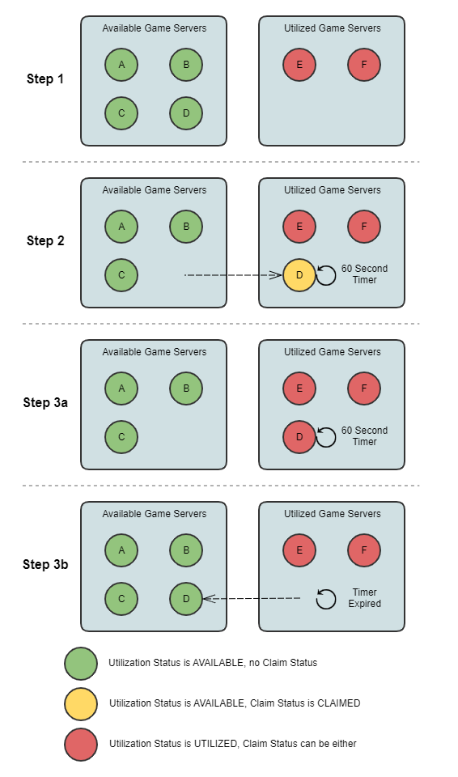

# Life of a game server

With Amazon GameLift Servers FleetIQ, game servers go through the following life cycle, including
provisioning and status updates. A game server is expected to be a short-lived resource.
As a best practice, game servers should be de-registered after the end of a game session
rather than being re-used for another game session. This approach helps ensure that
available game servers are always running on the lowest-cost resources that are viable
for game hosting.

- A game server resource is created when the game server process, running on an
  instance in a Amazon GameLift Servers FleetIQ-linked Amazon EC2 Auto Scaling group, calls the Amazon GameLift Servers API
  `RegisterGameServer()` to notify Amazon GameLift Servers FleetIQ that it is ready to
  host players and gameplay. A game server has two statuses to track its current
  availability:
  - Utilization status tracks whether the game server is currently
    supporting gameplay. This status is initially set to AVAILABLE,
    indicating that it is ready to accept new gameplay. Once the game server
    is occupied with gameplay, this status is set to UTILIZED.
  - Claim status tracks whether the game server is claimed for imminent
    gameplay. A game server in CLAIMED status indicates that it has been
    temporarily reserved by a game client (or a game service such as a
    matchmaker). This status prevents Amazon GameLift Servers FleetIQ from providing the same game
    server to multiple requesters. A game server with a blank claim status
    is available to be claimed.

- The following diagram illustrates how a game server's utilization status and
  claim status change over its life span.

    + **Step 1.** A game server group has six
     registered game servers. Four have a utilization status AVAILABLE (A, B,
     C, and D), and two are currently UTILIZED (E and F).
    + **Step 2.** A game client or matchmaking
     system calls the Amazon GameLift Servers API `ClaimGameServer()` to request a
     new game server. This request prompts Amazon GameLift Servers FleetIQ to search for an
     available game server (D) and set its claim status to CLAIMED for 60
     seconds. Amazon GameLift Servers FleetIQ responds to its request with connection information
     for the game server (IP address and port), as well as other optional
     game-specific data. Since gameplay has not yet begun on the game server,
     its utilization status remains AVAILABLE, but it cannot be claimed with
     another request.
    + **Step 3a.** Using the connection
     information provided, game clients can connect to the game server and
     initiate gameplay. The game server (D) must be triggered within 60
     seconds to change its utilization status to UTILIZED by calling the
     Amazon GameLift Servers API `UpdateGameServer()`.
    + **Step 3b.** If the game server's
     utilization status is not updated within 60 seconds, the claim timer
     expires and the claim status is reset to blank. The game server (D) is
     returned to the pool of available and unclaimed game servers.

- A game server resource is removed after gameplay on the game server is
  complete and players have disconnected. Before shutting down, the game server
  process calls the Amazon GameLift Servers API `DeregisterGameServer()` to notify
  Amazon GameLift Servers FleetIQ of its departure from the game server group's pool of game
  servers.
