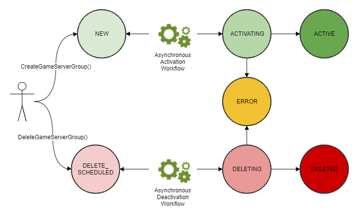

# Life of a game server

group

Game server groups go through the following life cycle, including provisioning and
status updates. A game server group is expected to be a long-lived resource.

- You create a game server group by calling the Amazon GameLift Servers API
  `CreateGameServerGroup()` and passing in an EC2 launch template
  and configuration settings. In response to the call, a new game server group is
  created and placed in status NEW.
- Amazon GameLift Servers FleetIQ activates an asynchronous activation workflow, transitioning the game
  server group status to ACTIVATING. The workflow initiates the creation of
  underlying resources, including an Amazon EC2 Auto Scaling group and an EC2 instance with the
  provided AMI.
  - If provisioning fails for any reason, the game server group is placed
    into status ERROR. To get additional error information to help debug the
    failure cause, call `DescribeGameServerGroup()` on a game
    server group in an error state.
  - If provisioning succeeds, the game server group is transitioned to
    status ACTIVE. At this point, instances are launched with game servers
    that register with Amazon GameLift Servers FleetIQ. The group's instance types are periodically
    evaluated for game hosting viability and balanced as needed. Amazon GameLift Servers FleetIQ
    also tracks the status of active game servers in the group and responds
    to requests for game servers.

- You remove a game server group by calling `DeleteGameServerGroup()`
  with the group identifier. This action puts the game server group into status
  DELETE_SCHEDULED. Only game server groups in ACTIVE or ERROR state can be
  scheduled for deletion.
- Amazon GameLift Servers FleetIQ activates an asynchronous deactivation workflow in response to the
  DELETE_SCHEDULED status, transitioning the game server group status to DELETING.
  You have the option of deleting just the game server group or delete both the
  game server group and the linked Auto Scaling group.
  - If deactivation fails for any reason, the game server group is placed
    into status ERROR. To get additional error information to help debug the
    failure cause, call `DescribeGameServerGroup()` on a game
    server group in an error state.
  - If deactivation succeeds, the game server group is transitioned to
    status DELETED.
