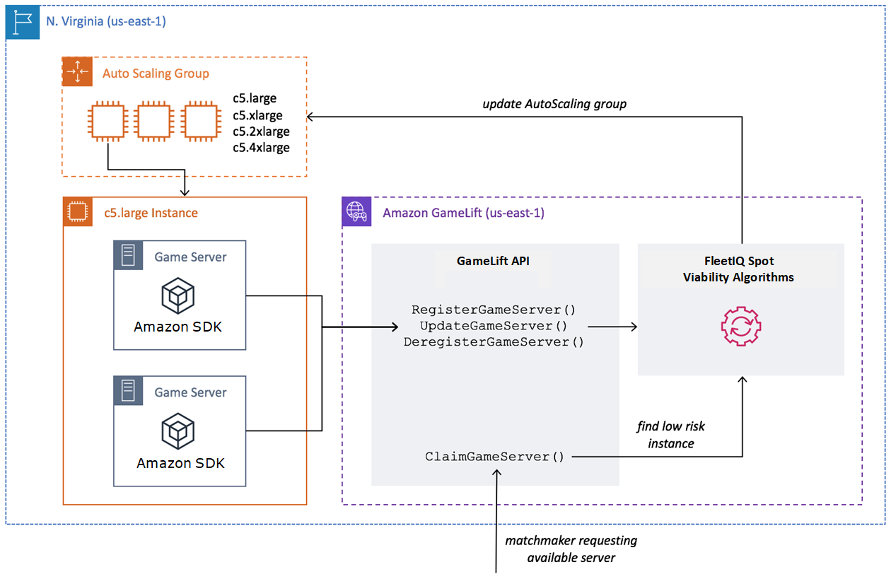

# Amazon GameLift Servers FleetIQ logic

The following diagram illustrates the role of Amazon GameLift Servers FleetIQ when it is working with Amazon EC2
for game hosting. Its primary goal is to locate the _best_ possible
game server to host a game session and give players an optimal gameplay experience.
Amazon GameLift Servers FleetIQ defines the _best_ resources as those that deliver the
highest game hosting viability for the lowest cost. Amazon GameLift Servers FleetIQ approaches this goal in two
key ways: first by allowing only viable instance types in the Amazon EC2 Auto Scaling group, and second by
placing new game sessions effectively across the group's available resources.

## Fill Auto Scaling group with

optimal instance types

The job of the Amazon EC2 Auto Scaling group is to launch new instances and retire old instances,
maintaining a collection of hosting resources and scaling it to meet your player
demand. To do this, the Amazon EC2 Auto Scaling group relies on a list of your desired instance types.
The job of Amazon GameLift Servers FleetIQ is to continually check the viability of these desired instance
types and update the list for the Amazon EC2 Auto Scaling group. This process is called instance
balancing. It ensures that instances in the Amazon EC2 Auto Scaling group are continually refreshed so
that only currently viable instance types are used at all times.

Amazon GameLift Servers FleetIQ affects how the Amazon EC2 Auto Scaling group selects optimal instance types in the
following ways:

- **It determines usage of Spot and/or On-Demand
  Instances.** An Amazon GameLift Servers FleetIQ game server group is configured with a
  balancing strategy, which influences how the Amazon EC2 Auto Scaling group uses Spot and/or
  On-Demand Instances. Spot Instances have lower costs due to fluctuating
  availability and potential [interruptions](../../../AWSEC2/latest/UserGuide/spot-interruptions.md "../../../AWSEC2/latest/UserGuide/spot-interruptions.md"),
  limitations that Amazon GameLift Servers FleetIQ minimizes for game server hosting. On-Demand
  instances are more expensive but offer more reliable availability when you
  need it.
- **It limits new instances to launch on viable instance
  types only.** A Amazon GameLift Servers FleetIQ game server group maintains a master
  list of your desired instance types, The instance balancing process
  continually evaluates each desired instance type on the list for game
  hosting viability, using a prediction algorithm that looks at the instance
  type's recent availability and interruption rate. As a result of this
  evaluation, Amazon GameLift Servers FleetIQ continually updates the Amazon EC2 Auto Scaling group's list of desired
  instance types to include only currently viable instances types.
- **It flags existing instances that are non-viable
  instance types.** Amazon GameLift Servers FleetIQ identifies existing instances in an
  Amazon EC2 Auto Scaling group that are currently non-viable instance types. These instances are
  flagged as _draining_, which means they are
  terminated and replaced with new instances. For instances that have game
  server protection turned on, termination is postponed until any active game
  sessions end normally.

As the Amazon EC2 Auto Scaling group launches and retires instances, it maintains a collection that
is optimized for game hosting even as the availability of low-cost Spot Instance
types fluctuates. Balancing activity takes place on game server groups with active
instances only. Learn more about how this process works in [Spot balancing process](gsg-lifecycle-rebalance.md "gsg-lifecycle-rebalance.md").

## Place game sessions

effectively

Amazon GameLift Servers FleetIQ tracks all active game servers in the game server group and uses this
information to determine the best placement for new game sessions and
players.

To enable Amazon GameLift Servers FleetIQ to track game servers, your game server software must report
its status. Your custom AMI controls how new game servers processes are started and
stopped on each instance. When a new game server is started, it registers with
Amazon GameLift Servers FleetIQ, indicating that it is ready to host a game session. After registering, the
game server periodically reports its health and whether it is currently hosting a
game session. When the game server shuts down, it de-registers with Amazon GameLift Servers FleetIQ.

To start a new game session, your game client (or matchmaker or other client
service) sends a request for a game server to Amazon GameLift Servers FleetIQ. Amazon GameLift Servers FleetIQ locates an
available game server, claims it for the new game session, and responds with the
game server ID and connection info. Your game then prompts the game server to update
its status and start a new game session for incoming players.

When selecting a game server to host a new game session, Amazon GameLift Servers FleetIQ uses the
following decision-making process to optimize placement with viable low-cost Spot
Instances:

1. Where possible, Amazon GameLift Servers FleetIQ places new game sessions on instances that are
   already hosting other game sessions. By packing (but not overloading) some
   instances and keeping others idle, the Amazon EC2 Auto Scaling group is able to quickly scale
   down idle instances when they're not needed, which lowers hosting costs.
2. Amazon GameLift Servers FleetIQ ignores instances that are flagged as _draining_, that is, not viable for game hosting. These
   instances are kept running only to support existing game sessions. They
   can't be used for new game sessions unless no other game servers are
   available.
3. Amazon GameLift Servers FleetIQ identifies all available game servers that are running on viable
   instances.

You can turn on game session protection for a game server group to prevent the
Amazon EC2 Auto Scaling group from terminating instances with actively running game sessions.
