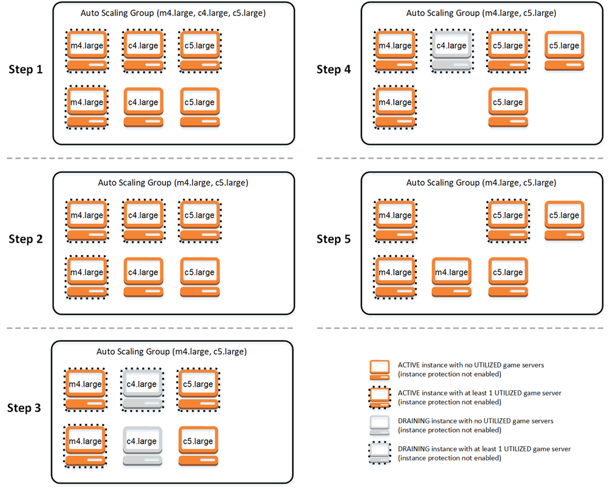

# Spot balancing process

Amazon GameLift Servers FleetIQ periodically balances the instances in an Amazon EC2 Auto Scaling group that has Spot Instances.
This process is not active with game server groups that use the ON_DEMAND_ONLY balancing
strategy or do not have any active instances.

Spot balancing has two key goals:

- To constantly refresh the group by only using Spot Instance types that are
  viable for game hosting.
- To use multiple viable instance types (where possible) in order to reduce the
  impact of unexpected game server interruptions.
  Amazon GameLift Servers FleetIQ balances by evaluating the group's instance types and removing instances
  that are more likely to result in game server interruptions. To avoid terminating
  instances with active gameplay during balancing, best practice is to turn on game server
  protection for a game server group that's in production.

The following example illustrates how instances in an Auto Scaling group are
affected by Spot balancing.

- **Step 1.** Through a game server group, the
  linked Amazon EC2 Auto Scaling group is set up to launch instances of types m4.large, c4.large,
  and c5.large with game server protection enabled. The Amazon EC2 Auto Scaling group has
  launched a balanced collection consisting of two Spot Instances of each
  type. Four instances have at least one game server in UTILIZED status (shown
  with a dashed border), while two instances are not currently supporting
  gameplay.
- **Step 2.** Amazon GameLift Servers FleetIQ evaluates the current
  game hosting viability of all three instance types. The evaluation
  determines that the c4.large instance type has an unacceptable potential for
  game server interruption. Amazon GameLift Servers FleetIQ immediately updates the Amazon EC2 Auto Scaling group
  configuration to temporarily remove c4.large from the list of instance
  types, preventing additional c4.large instances from being launched.
- **Step 3.** Amazon GameLift Servers FleetIQ identifies existing
  instances of type c4.large and takes actions to remove them from the group.
  As a first step, all game servers that are running on c4.large instances are
  flagged as _draining_. Game servers on draining instances
  can be claimed only as a last resort if no other game servers are available.
  In addition, an Amazon EC2 Auto Scaling group with draining instances is triggered to launch
  new instances to replace them.
- **Step 4.** As new viable instances come
  online, the Amazon EC2 Auto Scaling group terminates draining instances. This replacement
  ensures that the group's desired capacity is maintained. The first instance
  to be terminated is the c4.large instance with no utilized game servers and
  game server protection turned off. It is replaced with a new c5.large
  instance.
- **Step 5.** Draining instances with game
  server protection continue to run while their game servers are supporting
  gameplay. When gameplay ends, the remaining c4.large instance is terminated
  when a new m4.large instance has launched to take its place.
  As a result of this process, the Auto Scaling group maintains its desired capacity
  while the group balances from using three instance types to two. Amazon GameLift Servers FleetIQ continues
  to evaluate the original list of instance types for game hosting viability. When
  c4.large is again considered a viable instance type, the Amazon EC2 Auto Scaling group is updated to
  include all three instance types. The group naturally balances over time.
