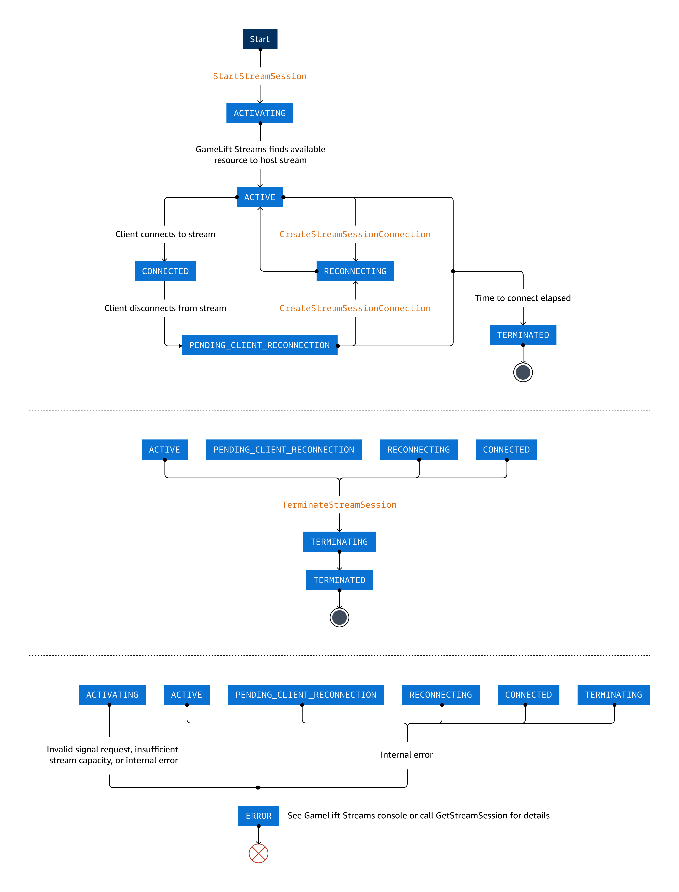

# Start stream sessions with Amazon GameLift Streams

This section covers stream sessions, the actual instance of a stream where an end user or player can interact with your application or play
your game. You'll learn about how to test your own stream session and understand the stream session lifecycle.

For launching stream sessions to end users, you must integrate Amazon GameLift Streams into your own service. For more information, refer to [Amazon GameLift Streams backend service and web client](sdk.md "sdk.md").

## About stream sessions

The prerequisites to start a stream session are an application in **Ready** status, a stream group that has available
capacity in the location where you want to stream, and the application replicated to the location where you want to stream. A stream
session runs on one of the compute resources that a stream group has allocated. When you start a stream, you must
specify a stream group and an application to stream using their ARN or ID values.

When you successfully start a stream session, you receive a unique identifier for that stream session. Then, you use that ID to connect
the stream session to an end user. For more information, refer to [StartStreamSession](../apireference/API_StartStreamSession.md "../apireference/API_StartStreamSession.md") in the _Amazon GameLift Streams API Reference_.

## Testing a stream in the console

The most direct way for you to test how your application streams is through the Amazon GameLift Streams console. When you start a stream, Amazon GameLift Streams uses one
of the compute resources that your stream group allocates. So, you must have available capacity in your stream group.

###### To test your stream in the Amazon GameLift Streams console

1. Sign in to the AWS Management Console and open the [Amazon GameLift Streams console](https://console.aws.amazon.com/gameliftstreams/ "https://console.aws.amazon.com/gameliftstreams/").
2. You can test a stream in several ways. Start from the **Stream groups** page or **Test stream** page and
   follow these steps:
   1. Select a stream group that you want to use to stream.
   2. If you're starting from the **Stream groups** page, choose **Test stream**.
      If you're starting from the **Test stream** page, select **Choose**.
      This opens the **Test stream** configuration page for the selected stream group.
   3. In **Linked applications**, select an application.
   4. In **Location**, choose a location with available capacity.
   5. (Optional) In **Program configurations**, enter command-line arguments or environment variables to pass to the application as it launches.
   6. Confirm your selection, and choose **Test stream**.

3. After your stream loads, you can do the following actions in your stream:
   1. To connect input, such as your mouse, keyboard, and gamepad (except microphones, which are not supported in **Test stream**), choose **Attach
      input**. You automatically attach your mouse when you move the cursor into the stream window.
   2. To have files that were created during the streaming session exported to an Amazon S3 bucket at the end of the session, choose **Export files** and specify the bucket details.
      Exported files can be found on the **Sessions** page.
   3. To view the stream in fullscreen, choose **Fullscreen**. Press **Escape** to reverse this action.

4. To end the stream, choose **Terminate session**. When the stream disconnects, the stream capacity becomes available to start another stream.

###### Note

The **Test stream** feature in the Amazon GameLift Streams console does not support microphones.

## Stream session lifecycle

When working with stream sessions in Amazon GameLift Streams, this diagram can help you understand the different states that a stream session
transitions to throughout its lifecycle.

- [StartStreamSession](../apireference/API_StartStreamSession.md "../apireference/API_StartStreamSession.md") creates a new stream
  session, which begins in `ACTIVATING` state. When Amazon GameLift Streams finds available resources to host the stream, the stream
  session transitions to `ACTIVE`. When a client connects to the active stream, the stream session transitions to
  `CONNECTED`.
- When a client disconnects from a stream, the stream session transitions to `PENDING_CLIENT_RECONNECTION` state.
  [CreateStreamSessionConnection](../apireference/API_CreateStreamSessionConnection.md "../apireference/API_CreateStreamSessionConnection.md")
  transitions the stream session to `RECONNECTING`, and will either initiate the client to reconnect to the stream or
  create a new stream session. When a stream session is ready for the client to reconnect, it transitions to `ACTIVE`.
  When the client reconnects, it transitions back to `CONNECTED`. If a client is disconnected for longer than
  `ConnectionTimeoutSeconds`, the stream session ends.
- When a client doesn't connect to a stream session in `ACTIVE` or `PENDING_CLIENT_RECONNECTION` state
  within the period of time specified by `ConnectionTimeoutSeconds`, then it transitions to `TERMINATED`.
- [TerminateStreamSession](../apireference/API_TerminateStreamSession.md "../apireference/API_TerminateStreamSession.md") initiates
  termination of the stream, and the stream session transitions to `TERMINATING` state. When the stream session
  terminates successfully, it transitions to `TERMINATED`.
- A stream session in any state, except `TERMINATED`, can transition to `ERROR`. When an API call returns
  `ERROR` as a Status value, check the value of StatusReason for a short description of the cause of the error. You
  can also call [GetStreamSession](../apireference/API_GetStreamSession.md "../apireference/API_GetStreamSession.md") to check these
  values.

## Timeout values affecting stream sessions

Stream sessions are governed by several timeout values that control different aspects of the session lifecycle. In roughly
chronological order of when you might typically encounter them during the stream session lifecycle, they include the following:

**Placement timeout**

Time limit for Amazon GameLift Streams to find compute resources to host a stream session using available capacity. Placement timeout
varies based on the capacity type used to fulfill your stream request:

- Always-on capacity: 75 seconds
- On-demand capacity:
  - Linux/Proton runtimes: 90 seconds
  - Windows runtime: 10 minutes

- Behavior: If Amazon GameLift Streams cannot identify available resources within this time, the stream session
  `Status` changes to `ERROR` with a `StatusReason` of
  `placementTimeout`.

**Connection timeout**

Length of time Amazon GameLift Streams waits for a client to connect or reconnect to a stream session.

- Parameter: `ConnectionTimeoutSeconds` in [StartStreamSession](../apireference/API_StartStreamSession.md "../apireference/API_StartStreamSession.md")
- Range: 1 - 3600 seconds (1 hour)
- Default: 120 seconds (2 minutes)
- Behavior: Timer starts when the stream session reaches `ACTIVE` or
  `PENDING_CLIENT_RECONNECTION` status. If no client connects before the timeout, the session
  `Status` transitions to `TERMINATED`.

**Session length timeout**

Maximum duration Amazon GameLift Streams keeps a stream session open.

- Parameter: `SessionLengthSeconds` in [StartStreamSession](../apireference/API_StartStreamSession.md "../apireference/API_StartStreamSession.md")
- Range: 1 - 86400 seconds (24 hours)
- Default: 43200 seconds (12 hours)
- Behavior: Terminates the stream session regardless of any existing client connection when the time limit is
  reached.

## Terminating a stream session

If you need to force a stream session to terminate, you have the following options:

- **Use the TerminateStreamSession API:** To use [TerminateStreamSession](../apireference/API_TerminateStreamSession.md "../apireference/API_TerminateStreamSession.md"), you will need the stream group ID and
  the stream session ID. You can use [ListStreamSessions](../apireference/API_ListStreamSessions.md "../apireference/API_ListStreamSessions.md") or [ListStreamSessionsByAccount](../apireference/API_ListStreamSessionsByAccount.md "../apireference/API_ListStreamSessionsByAccount.md") with the `--status CONNECTED` parameter to get a list of stream sessions that
  have a client connected.
- **Remove the session's location from its stream group:** Removing the location from the stream
  group where the session is streaming will terminate all active stream sessions in that location. You can remove a location in a
  stream group from the console or by using the [RemoveStreamGroupLocations](../apireference/API_RemoveStreamGroupLocations.md "../apireference/API_RemoveStreamGroupLocations.md") API.
- **Delete the session's stream group:** Deleting a stream group will terminate all active stream sessions in
  all locations of the stream group. You can delete a stream group from the console or by using the [DeleteStreamGroup](../apireference/API_DeleteStreamGroup.md "../apireference/API_DeleteStreamGroup.md") API. Use with caution since you will be abruptly
  ending client connections.

## Reconnecting to a stream session

If a client gets disconnected from a stream session without ending the session, it can reconnect to the session within the time
specified by `ConnectionTimeoutSeconds` when the stream session was started. To reconnect to a session, you need the stream
session's ID. For details, see [CreateStreamSessionConnection](../apireference/API_CreateStreamSessionConnection.md "../apireference/API_CreateStreamSessionConnection.md") in the _Amazon GameLift Streams API Reference_. You can see an example of reconnecting to a stream
session in the [React Starter Sample](https://github.com/aws-samples/sample-amazon-gamelift-streams-react-app "https://github.com/aws-samples/sample-amazon-gamelift-streams-react-app").
