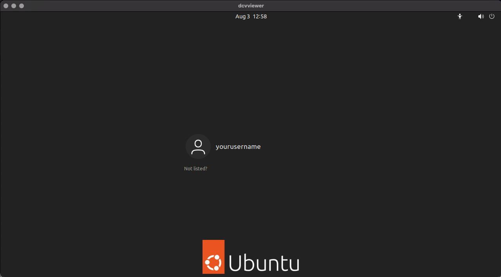

# Set up a remote Amazon EC2 machine to troubleshoot Proton

If you don't have a local Ubuntu machine, follow these instructions to set up a remote machine instead.

In this step, you will set up your remote Ubuntu machine using Amazon Elastic Compute Cloud (Amazon EC2), which you will use to troubleshoot your application's
compatibility with Proton for Amazon GameLift Streams. This topic describes how to set up an Amazon EC2 instance with Ubuntu 22.04 LTS, necessary GPU
drivers, and the Amazon DCV Server for a visual remote desktop.

## Launch an Amazon EC2 Instance with Ubuntu 22.04 LTS AMI

1. Navigate to Amazon EC2 in the AWS Management Console.
2. Select **Launch Instances**.
3. Enter "Amazon GameLift Streams Testing" for **Name**.
4. Select **Ubuntu Server 22.04 LTS (HVM)** for **Application and OS Images
   (Amazon Machine Image)**.
5. Select **g4dn.2xlarge** for **Instance Type**.
6. For **Key pair (login)**, choose a key pair if you want to use SSH to access the instance. We
   recommend using an instance profile with the `AmazonSSMManagedInstanceCore` policy to connect to your instances using
   AWS Systems Manager Session Manager. For more details, follow [Adding Session Manager permissions to an existing IAM role](../../../systems-manager/latest/userguide/getting-started-add-permissions-to-existing-profile.md "../../../systems-manager/latest/userguide/getting-started-add-permissions-to-existing-profile.md").
7. For **Network settings**, create a new security group:
8. For **Security Group Name**, enter **DCV.**
9. Add **Inbound Security Group Rules** with **Type**
   `Custom TCP`, **Port Range**
   `8443`, and **Source Type**
   `Anywhere` to allow access using Amazon DCV.
10. Increase storage to at least **256GB** and choose **gp3** as the
    storage type.
11. Choose **Launch Instance**.

Your instance should now be launched.

Follow the instructions in [Connect to your
Linux instance](../../../AWSEC2/latest/UserGuide/AccessingInstances.md "../../../AWSEC2/latest/UserGuide/AccessingInstances.md") to connect to the instance using SSH or AWS Systems Manager Session Manager.

## Install GPU drivers

### G4dn - NVIDIA GPU

Install additional modules and Linux firmware by running the following commands:

```
sudo apt install linux-modules-extra-aws linux-firmware

# Install the AWS CLI required for NVIDIA driver installation
curl "https://awscli.amazonaws.com/awscli-exe-linux-x86_64.zip" -o "awscliv2.zip"
sudo apt install unzip
unzip awscliv2.zip
sudo ./aws/install
```

Follow the instructions on the NVIDIA GRID drivers for Ubuntu and Debian in [Install NVIDIA drivers on Linux](../../../AWSEC2/latest/UserGuide/install-nvidia-driver.md "../../../AWSEC2/latest/UserGuide/install-nvidia-driver.md").

## Set up user environment

Set up your user environment so it can use the GPU by running the following commands. This does the following things:

- Add you to the `video` groups to give you access to a video device, and the `render` group to give you
  access to a rendering device.
- Install the AWS CLI, which is required for NVIDIA drivers and for downloading your applications or games from Amazon S3.

```
sudo adduser `user`

# Add the current user to the video and render group
sudo usermod -a -G video `user`
sudo usermod -a -G render `user`
sudo adduser `user` sudo

# Install the AWS CLI
curl "https://awscli.amazonaws.com/awscli-exe-linux-x86_64.zip" -o "awscliv2.zip"
sudo apt install unzip
unzip awscliv2.zip
sudo ./aws/install

sudo reboot
```

## Installation and configuration of Amazon DCV

Reconnect to the instance using SSH or AWS Systems Manager Session Manager and follow the instructions from [Installing the Amazon DCV Server on Linux for
Ubuntu](../../../dcv/latest/adminguide/setting-up-installing-linux.md "../../../dcv/latest/adminguide/setting-up-installing-linux.md").

- Verify that the server is correctly configured as described in the documentation.
- Follow the steps in [Install and
  configure NVIDIA drivers](../../../dcv/latest/adminguide/setting-up-installing-linux-prereq.md#linux-prereq-gpu "../../../dcv/latest/adminguide/setting-up-installing-linux-prereq.md#linux-prereq-gpu") for NVIDIA GPU.
- Add the Amazon DCV user to video group, as explained in [step 7 of the Installing the
  Server guide](../../../dcv/latest/adminguide/setting-up-installing-linux-server.md "../../../dcv/latest/adminguide/setting-up-installing-linux-server.md") (navigate to the Ubuntu tab).

There is no need to install any optional parts of the Amazon DCV Server.

When you're done, run the following command to start the Amazon DCV Server:

```
sudo systemctl start dcvserver
sudo systemctl enable dcvserver
```

## Connecting to the Ubuntu Server using the Amazon DCV client

Reconnect to your Ubuntu instance and create a session for a user by running:

```
sudo dcv create-session --owner `user` --user `user` my-session --type console
```

You can now use the Amazon DCV Client to access your Ubuntu instance using its public IP address. When you launch a Amazon DCV client, a window
appears, allowing you to access your Ubuntu instance through a visual display.



## Verify GPU drivers

Verify that GPU drivers are installed and working correctly. One way
to verify this is by running the
[vkcube](https://github.com/krh/vkcube "https://github.com/krh/vkcube")
application in a terminal.

1. Install the `vulkan-tools` apt package using the following command.

```
sudo apt install -y vulkan-tools
```

2. Run `vkcube`.
3. Review the output.
   - If your system is properly using the correct GPU, you will
     see output similar to the following, with the name of your
     GPU: `Selected GPU 0: AMD Radeon Pro V520 (RADV NAVI12), type: 2`
   - If your application isn&t able to use the GPU
     correctly, you might see different output similar to the
     following: `Selected GPU 0: llvmpipe (LLVM 15.0.7, 256 bits), type: 4`

   In this case, check the GPU drivers and re-install if needed.

## Set up Podman (Proton only)

If you're using a Proton runtime, you must install [Podman](https://wiki.debian.org/Podman "https://wiki.debian.org/Podman"), a container that's used by
Proton's build process. Complete the following steps in a terminal.

1. Install Podman, a container that Proton's build process uses.

```
sudo apt install podman
```

2. In the files `/etc/subgid` and `/etc/subgid`
   1. Verify that the files list your Linux machine user name and ID. You can either open the files or use the
      `cat` command to see what's in the files. Format example: `test:165536:65536`, where
      `test` corresponds to your user name.
   2. If they're not listed, add them in. Format example: `test:165536:65536`, where `test` corresponds
      to your user name.

```
$ cat /etc/subuid
              ceadmin:100000:65536
              test:165536:65536

              $ cat /etc/subgid
              ceadmin:100000:65536
              test:165536:65536
```

For more information, refer to [Basic Setup and Use of Podman in a Rootless environment](https://github.com/containers/podman/blob/main/docs/tutorials/rootless_tutorial.md#basic-setup-and-use-of-podman-in-a-rootless-environment "https://github.com/containers/podman/blob/main/docs/tutorials/rootless_tutorial.md#basic-setup-and-use-of-podman-in-a-rootless-environment") in Podman's documentation.

## Next step

You now have an Amazon EC2 instance and environment setup to troubleshoot compatibility issues with Amazon GameLift Streams. The next step is to set up
Proton. For instructions, refer to [Troubleshoot on Proton](troubleshoot-compatibility-wp-proton.md "troubleshoot-compatibility-wp-proton.md").
