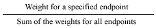

#

How endpoint weights work to manage traffic volume

Weighted routing lets you choose how much traffic is routed to a specific resource (endpoint) in an endpoint group.
This can be useful in several ways, including for load balancing and for testing new versions of your application.

A weight is a value you can set that determines the proportion of traffic that Global Accelerator directs to an endpoint in a
standard accelerator. Endpoints can be Network Load Balancers, Application Load Balancers, Amazon EC2 instances, or Elastic IP addresses.
Global Accelerator calculates the sum of the weights for the endpoints in an endpoint group,
and then directs traffic to the endpoints based on the ratio of each endpoint's weight to the total. By default,
the weight for an endpoint is set to 128, which is half of the maximum value of 255.

## How endpoint weights work

To use weights, you assign each endpoint in an endpoint group a relative weight that
corresponds with how much traffic that you want to send to it. By default, the weight
for an endpoint is 128—that is, half of the maximum value for a weight, 255.
Global Accelerator sends traffic to an endpoint based on the weight that you assign to it as a
proportion of the total weight for all endpoints in the group:

For example, if you want to send a tiny portion of your traffic to one endpoint and the
rest to another endpoint, you might specify weights of 1 and 255, respectively. The endpoint with a weight of 1
gets 1/256 of the traffic (1/1+255), and the other endpoint gets 255/256 (255/1+255). You can
gradually change the balance of traffic volume to each endpoint by changing the weights. If you want Global Accelerator to stop sending traffic
to an endpoint, you can change the weight for that resource to 0.

Be aware that even when you've set endpoint weights in your accelerator, in specific, limited scenarios,
Global Accelerator overrides those weights, to help ensure availability. That is, when
Global Accelerator is load balancing traffic across endpoints in an endpoint
group, it must, in certain circumstances, choose between preserving availability for client traffic and
abiding by endpoint weights. For example, with accelerators where the client IP address is preserved, Global Accelerator
might need to override an endpoint weight setting to help avoid connection collisions.
