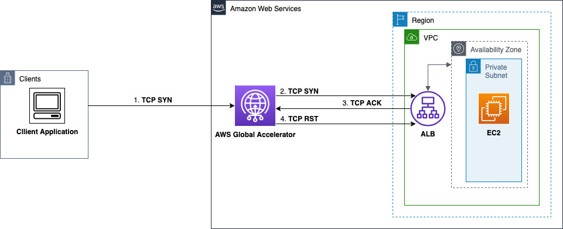
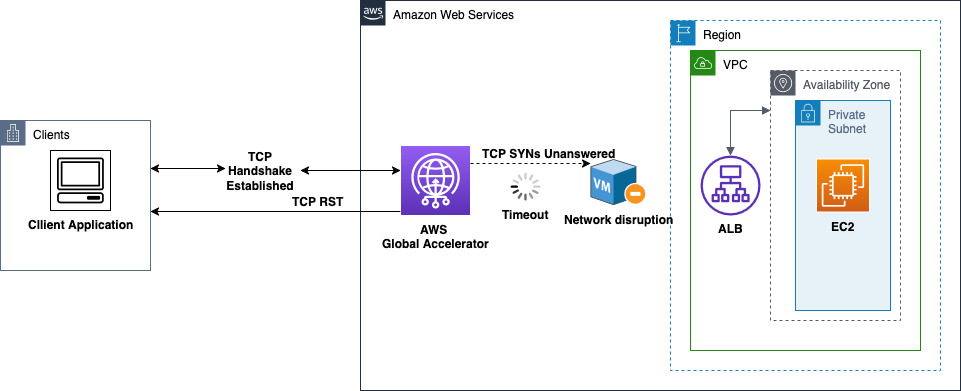
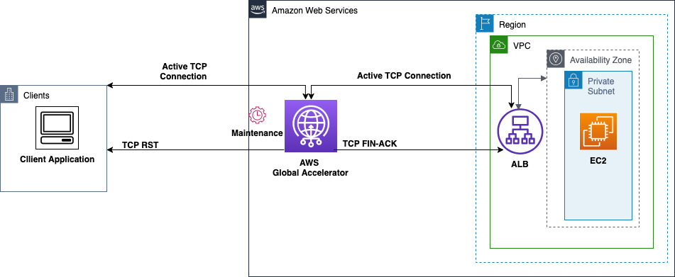
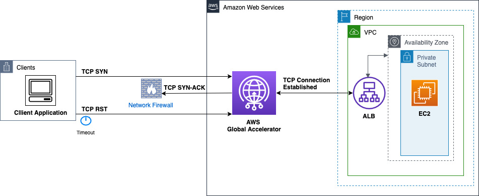
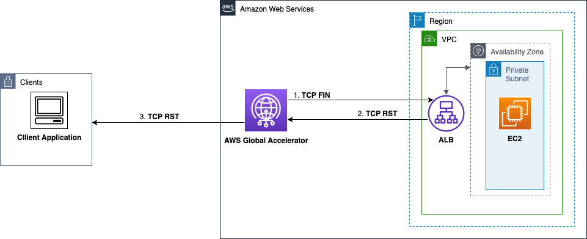
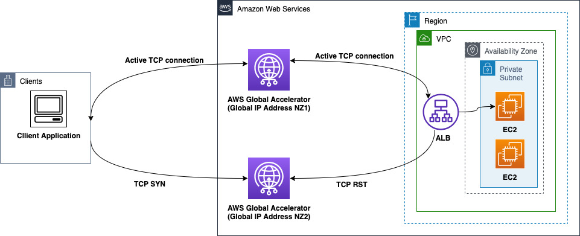

# Troubleshooting Global Accelerator TCP reset issues

A certain number of TCP resets (RSTs) are expected as customers use your application with AWS Global Accelerator. However,
there are scenarios where the number of RSTs can become concerning. There are actions you can take to help prevent
RSTs, or troubleshoot situations where you're seeing a lot of RSTs unexpectedly. This section includes detailed
information about what can cause RSTs with Global Accelerator, along with steps that you can take to prevent or troubleshoot
issues, and guidance about when specific levels of RSTs are typical and when they warrant a deeper look.

Each accelerator in AWS Global Accelerator reports the number of TCP resets (RSTs) that Global Accelerator generated or sent.
Global Accelerator provides this information in three CloudWatch metrics, which you can use to help monitor the volume of TCP resets in your
Global Accelerator traffic: `TCP_AGA_Reset_Count`, `TCP_Client_Reset_Count`, and `TCP_Endpoint_Reset_Count`.
This topic includes a summary of TCP reset scenarios in Global Accelerator as well as detailed information about
each CloudWatch metric that Global Accelerator reports for TCP resets, including what the metric tracks (that is, when each count is increased), the
conditions that can create each type of reset, and the scenarios that can increase the counts for each metric type.

###### Contents

- [Overview of TCP resets in Global Accelerator](#cloudwatch-metrics-globalaccelerator-tcp-resets-definitions.overview "#cloudwatch-metrics-globalaccelerator-tcp-resets-definitions.overview")
- [TCP_AGA_Reset_Count](#cloudwatch-metrics-globalaccelerator-tcp-resets-definitions.aga-reset-count "#cloudwatch-metrics-globalaccelerator-tcp-resets-definitions.aga-reset-count")
- [TCP_Client_Reset_Count](#cloudwatch-metrics-globalaccelerator-tcp-resets-definitions.client-reset-count "#cloudwatch-metrics-globalaccelerator-tcp-resets-definitions.client-reset-count")
- [TCP_Endpoint_Reset_Count](#cloudwatch-metrics-globalaccelerator-tcp-resets-definitions.endpoint-reset-count "#cloudwatch-metrics-globalaccelerator-tcp-resets-definitions.endpoint-reset-count")
- [When to take action for increased RST metrics](#cloudwatch-metrics-globalaccelerator-tcp-resets-definitions.when-to-take-action "#cloudwatch-metrics-globalaccelerator-tcp-resets-definitions.when-to-take-action")

## Overview of TCP resets in Global Accelerator

In networking, an RST refers to a TCP Reset. An RST is a flag in a TCP header that indicates an
immediate, ungraceful termination of a network connection. A device sends an RST packet to signal
that a connection is invalid or has been unexpectedly disrupted, such as when an application
closes its socket, a device reboots, or an invalid packet arrives. This forces the other endpoint
to close the connection immediately, disregarding any further data.

A certain number of RSTs are expected and typical in networking, including when you use
Global Accelerator. However, there are scenarios when you might want to investigate to understand what's
causing an unusual number or frequency of RSTs, and then take actions to address the cause.

The following are common reasons that Global Accelerator sends a TCP reset:

- Global Accelerator marks a TCP connection as closed when either the client or the endpoint closes the connection,
  using FIN handshake or reset. If the client or endpoint sends data packets on a closed TCP connection, then Global Accelerator
  generates a TCP reset to indicate that the connection is closed and cannot accept traffic.
- If a client or endpoint sends data after the idle timeout period elapses, it receives a TCP reset
  packet from Global Accelerator to indicate that the connection is no longer valid.
- If Global Accelerator receives an unexpected packet while building the connection with either the client
  or the endpoint during the TCP handshake, Global Accelerator generates a TCP reset.

If you see a stable number of `AGA_Reset_Count` metrics for an accelerator, this is because the
client or the endpoint sent data towards Global Accelerator to a closed or expired connection.

Not all increases in TCP reset metrics are cause for concern nor do they always indicate an issue that needs to be
addressed. Review the information provided in the following sections of this topic to understand the scenarios
that can cause a temporary increase in RSTs, such as endpoint resource scaling.

If you notice a sharp increase in `AGA_Reset_Count` metrics and the increase aligns with related
metrics changes on the endpoint side, such as a scale up, scale down, or an unhealthy endpoint, the endpoint
might have become unreachable and triggered the Global Accelerator TCP reset. If you can't locate the source of ongoing
TCP reset increases or can't address the issue yourself, you can get help investigating the issue by contacting
AWS support. To learn more about when to get additional help,
see [When to take action for increased RST metrics](#cloudwatch-metrics-globalaccelerator-tcp-resets-definitions.when-to-take-action "#cloudwatch-metrics-globalaccelerator-tcp-resets-definitions.when-to-take-action").

## TCP_AGA_Reset_Count

The `TCP_AGA_Reset_Count` metric tracks the number of TCP reset packets
generated by the Global Accelerator service itself. These TCP resets are only generated for customer traffic that
is TCP terminated by Global Accelerator. Monitoring this metric can help you identify potential issues with the
Global Accelerator infrastructure that could be impacting your application's connectivity.

When a connection between a client and a Regional endpoint is set up with TCP termination,
the connection has two segments. The first segment is between the client and the Global Accelerator POP location
where the client request was directed. The second segment is between the POP and the Regional endpoint
server, for example, a Network Load Balancer.

The following scenarios can create an increase in the `TCP_AGA_Reset_Count` metric.

###

TCP handshake failure with the endpoint target

A connection on the segment between Global Accelerator and endpoint server, such as an Application Load Balancer, is initiated with
a TCP SYN packet. An expected response from the endpoint is a SYN-ACK packet, which subsequently
leads to a successful TCP handshake. However, when this handshake can’t be established, a TCP
RST is sent.

There are two scenarios that can cause a handshake failure with an endpoint server.

In the first scenario, there are conditions where the response from the endpoint server is an
ACK challenge instead of a SYN-ACK. For example, an ACK challenge is sent when an earlier
connection is in a TIME_WAIT state. In response to the ACK challenge, Global Accelerator sends
a TCP RST towards the endpoint, which is added to the `TCP_AGA_Reset_Count` metric.
For an example of what can cause this issue, see [Out of order timestamps](#AGATimestamps "#AGATimestamps").

The following diagram illustrates a TCP handshake failure when an Application Load Balancer responds
with ACK challenge instead of SYN-ACK during **TIME_WAIT** state. This response
triggers Global Accelerator to send a TCP RST.

The second scenario that can cause a handshake failure with an endpoint server is
a TCP SYN from Global Accelerator towards an endpoint server that goes unanswered. A
number of issues can create a scenario where a server doesn’t respond, including an unhealthy or
overloaded server (endpoint), disruptions on the AWS network path, or incorrect security groups
or NACL rules. When Global Accelerator attempts to initiate a connection with an endpoint server but cannot do
so, Global Accelerator sends a TCP RST back to the initiating client. This RST is included in the
`TCP_AGA_Reset_Count` metric.

The following diagram illustrates a Global Accelerator TCP handshake failure due to unanswered SYNs
from an unresponsive Application Load Balancer endpoint. When SYNs aren’t responded to, Global Accelerator sends a TCP RST
to the client.

**Actions to consider taking for these scenarios**

The following are examples of actions that you can take that might help you
understand and address what is causing TCP RSTs in these scenarios:

- Verify your endpoint health and capacity to ensure that servers
  can handle the volume of incoming requests. You can do this by monitoring increases in network
  traffic being sent to the EC2 instances and ensuring sufficient capacity is
  available to handle the load.
- Check that your security group and NACL rules allow necessary
  traffic between Global Accelerator and your endpoints.
- Ensure that network paths between Global Accelerator and
  endpoints are functioning properly by testing connectivity. For example, you
  can run curl requests towards your Global Accelerator IP addresses over the listener ports.
  Using the curl requests, you can verify not just that the initial connection
  has been established, but also confirm that you're receiving complete responses
  from the endpoint server. This end-to-end testing helps you to validate the full
  connection path.
- Consider adjusting endpoint scaling policies if resets
  correlate with periods of high traffic volume.

###

Maintenance events

Global Accelerator does maintenance to ensure that the service is running on the latest software versions.
These maintenance events occur approximately 1-2 times a month. However, if your workload is geographically
distributed across different AWS Regions, you might experience multiple maintenance events because
Global Accelerator has a large server fleet.

During these periods of maintenance activity, Global Accelerator generates TCP RSTs towards clients over existing
established connections, which immediately terminates those connections. It also initiates a closing
sequence with each endpoint target by sending a FIN-ACK. This approach ensures a clean break of existing
connections, which allows clients to quickly establish new connections, rather than waiting for
connections to time out naturally.

RSTs sent towards clients in this scenario count towards the `TCP_AGA_Reset_Count`
metric. Maintenance-related reset spikes typically last up to 5 minutes per maintenance event.

The following diagram illustrates a Global Accelerator maintenance event triggering Global Accelerator
to send a TCP FIN-ACK sequence with the endpoint, and an RST towards the client.

**Actions to consider taking for this scenario**

You don’t need to take any responsive actions when you see maintenance-related RST spikes
in the metrics. We recommend that you design your applications to gracefully handle
connection resets, and then reconnect when needed. For example, you can do the following:

- With a web browser scenario, when a connection reset occurs, the browser
  automatically handles this by creating a new connection and retrying the request. Users
  might experience a brief delay, but the page will typically load successfully on the retry.
- For client applications, the behavior depends on your application's retry
  logic. When the application receives a reset, it should enter its configured retry flow.
  For example, it should attempt to reconnect immediately, or implement a backoff strategy
  before retrying the connection.

Maintenance is a routine but important activity for an AWS service, and these
temporary spikes in resets are brief. You should expect to see reset counts return to
baseline within 5 to 10 minutes.

## TCP_Client_Reset_Count

The `TCP_Client_Reset_Count` metric reflects the number of TCP reset packets
that Global Accelerator receives from clients. Connection resets that clients send often signal broken
connections. But, resets can also signal trouble along the network path. By tracking the
`TCP_Client_Reset_Count` metric, you can gain insights into the stability and
reliability of your client with Global Accelerator connections.

The following scenarios can create an increase in the `TCP_Client_Reset_Count` metric.

###

Fast client port reuse and NAT gateways

When a client reuses an IP address and port number quickly so that it can establish a
connection with the same combination of server IP address and port, that leads to a _fast
port reuse_ scenario.
In some cases, fast port reuse towards accelerators that have the source IP address preserved could lead
to connection timeouts, which surface as client RSTs.

Potential challenges in this scenario include the following:

**Out of order timestamps**
Connections that rapidly reuse client ports towards Application Load Balancer endpoints are susceptible
to stepping on each other and causing timeouts. This is especially an issue for client hosts that
randomize the kernel timestamp values in outgoing packets, to establish new connections.
This setting is specified by the `/proc/sys/net/ipv4/tcp_timestamps` values on the client host.
The default value is set to 1, which enables timestamps to be set in outgoing packets but uses a
random offset for every connection.

When the timestamp values are out of order, a smaller value could be used for
a newer connection. When an Application Load Balancer endpoint receives a SYN for such a connection while the TCP socket
that belongs to the previous connection is still in TIME_WAIT (< 2MSL), the endpoint
server challenges with an ACK packet instead of a SYN-ACK. This behavior is known as a
_TIME-WAIT Assassination hazard_ (TWA) and is described in RFC 1337.
Upon receiving the ACK, the client resets the connection.

Note that this behavior happens for connections that are sent directly towards the Application Load Balancer, or
when Global Accelerator serves traffic without TCP termination, for example, during maintenance events.

**NAT gateway or proxy**
Issues that result from out of order timestamps are exacerbated when a NAT gateway
uses a limited set of ports to perform address translation on connections that belong to more
than one client that is behind the gateway.

###

TCP handshake issues

When the client that initiates the connection with the TCP SYN doesn’t receive a SYN-ACK
response from Global Accelerator servers, the connection eventually times out and is reset by the client.
Common causes for this behavior are packet loss along the multiple network hops between the client
and Global Accelerator servers, Path MTU challenges on routers in the path, and network firewalls.

The following diagram illustrates a handshake failure due to network path issues. In this
example, the client's SYN reaches Global Accelerator but the return SYN-ACK is lost or blocked due to the
firewall, resulting in client timeout and connection reset.

###

Idle timeouts

An established TCP connection between a client and a Global Accelerator server remains intact unless
it goes idle: that is, there aren't any packet transfers from either side for a period of 340 seconds.
After the idle timeout,
Global Accelerator begins a graceful closure of the connections on both network segments (if they are TCP terminated) by
transmitting FIN-ACKs. The client typically sends a reset in response, when it has closed the
connection from its side and is no longer maintaining the state. This works for clients that
maintain shorter idle timeouts.

Some clients choose to handle the termination of TCP connections with only RSTs, regardless
of whether their traffic comes through a NAT gateway or firewall.

####

Actions to consider taking for client reset count increases

If there are multiple connections that are behind a NAT device or firewall with a high number of
connections being reused over the same source IP address and port combination, consider adding additional
accelerators and using the port override feature to reduce the concentration of traffic over those specific
five-tuples. For more information, see [Override listener ports for restricted ports or connection collisions](about-endpoint-groups-port-override.md "about-endpoint-groups-port-override.md").

For other scenarios, ensure that the return traffic from Global Accelerator is not being intercepted by any
intermediate firewall or security rules that could be impacting connectivity for a certain pool of clients.

## TCP_Endpoint_Reset_Count

The `TCP_Endpoint_Reset_Count` metric indicates the number of TCP reset packets
initiated by your application’s endpoints in an AWS Region that have been received by Global Accelerator.
Common reasons for these RSTs are unhealthy endpoints, overloaded servers, and connection failures over the network path between Global Accelerator
servers and the endpoints. By closely monitoring this metric, you can identify
and address possible underlying issues with your application’s infrastructure.

The following scenarios can create an increase in the `TCP_Endpoint_Reset_Count` metric.

###

Connection reset by the endpoint server

An endpoint server—such as a Network Load Balancer, Application Load Balancer, EC2 instance, or other AWS resource in your VPC—can
initiate connection termination by sending either a TCP FIN or a TCP RST.
When an endpoint sends an RST to signal intent to end the connection on a certain socket,
Global Accelerator receives it and initiates tearing down connections on both segments. Global Accelerator
forwards a TCP RST to the client, signaling connection termination, as shown in the diagram in this section.

The following diagram illustrates a Global Accelerator connection termination flow with an
endpoint-initiated TCP reset, where EC2 responds with RST to a Global Accelerator FIN packet.
This response triggers a reset to the client.

###

ALB connection collision after ALB scaling event

When an Application Load Balancer endpoint scales, new Application Load Balancer nodes are created and associated behind Global Accelerator, which
can create connection collisions. This can happen after a scaling event when Global Accelerator, in one of its
network zones, routes a client to an Application Load Balancer node while an existing connection from the same client, with an
identical IP and port, is still active on the Application Load Balancer node. This will cause a collision if the original active
connection to the client is served through the other Global Accelerator network zone.

Since both connections share the same client IP-port tuple but traverse different network paths, the
Application Load Balancer detects this as a duplicate connection state. To maintain connection integrity, the Application Load Balancer responds
with a TCP RST for the new connection attempt, which prevents potential connection state conflicts.

The following diagram illustrates how a cross-network zone connection collision can occur when
Global Accelerator routes identical client connections to the same Application Load Balancer node after a scaling event.
This situation forces a TCP RST response from the Application Load Balancer endpoint.

###

Targets are healthy but not ready

Only healthy endpoint targets are considered for routing traffic through Global Accelerator. However,
an endpoint might be healthy but not be set up to respond to traffic on the configured listeners.
In this scenario, incoming traffic could be reset or dropped by the endpoint. This is
because while the health check might succeed, the endpoint's application or service might not
yet be fully initialized to handle client traffic on the specified listener ports. Or, the
endpoint's security groups and network settings might not be properly configured to accept
traffic on those ports.

In other situations, all the configured endpoints are unhealthy. Then, Global Accelerator fails open across all the
endpoints in a random order. This can also result in connections getting reset.

###

Actions to consider taking for endpoint reset count increases

There are several possible actions that you can take for issues that cause endpoint reset count increases
that might lower the number of TCP RSTs in these scenarios.

- Implement readiness checks before adding endpoints to target groups to ensure
  they can handle traffic appropriately.
- Ensure that new endpoints are properly configured before they start receiving
  traffic, by verifying all necessary security groups and network settings.
- Monitor endpoint health metrics alongside reset metrics to quickly identify
  correlations between health status changes and reset increases.
- Consider increasing connection draining timeouts during
  planned changes to allow existing connections to complete gracefully before endpoints
  are removed from service.

##

When to take action for increased RST metrics

Global Accelerator reports TCP reset metrics to help you monitor connection health. A scenario that
causes TCP reset increases might not, by itself, indicate that your customers are
experiencing issues. But, together with other signals, being aware of TCP resets
can help you better understand specific connection behavior that your customers
might be seeing. While TCP resets are a normal part of network operations, you can
help maintain optimal performance for your application
by understanding when you can correct an issue by taking action.

###

Typical versus concerning reset levels

A certain number of resets is typical and expected for network activity, but reset issues can
become concerning, depending on the rates and patterns of the resets.

**Typical reset levels**
Typically, you should see a low, stable baseline of resets that are a
small fraction of your total connections.

**Potentially concerning reset levels**
We recommend that you investigate reset levels when you see the following
behavior in your reset metrics:

- Reset rates increase by 2x or more from your baseline over a short period of time.
- Reset patterns correlate with application performance issues.
- Reset increases persist for more than 15 minutes without returning to baseline. This
  might indicate an issue, or might just be a change in application behavior.

###

Typical versus concerning durations for elevated reset levels

The time frame during which reset levels remain elevated can help you determine whether to investigate
further.

- **Short-term spikes (under 15 minutes):** These often represent normal
  scaling events or temporary network conditions. These brief spikes typically don't require taking
  any further action.
- **Medium-term elevations (15-30 minutes):** If these elevations
  correlate with other metrics changes, it can indicate an ongoing issue. Monitor this situation
  closely.
- **Persistent elevations (30+ minutes):** Elevations that persist
  for 30+ minutes always warrant investigation, especially if the elevations align with customer
  impact.

###

Key metrics correlations

When you investigate TCP resets issues, look for correlations between the following areas:

- Endpoint health metrics (target group health, instance status)
- Application scaling events (including auto-scaling activities)
- Error rates in your application logs
- Latency increases in your application
- Customer-reported connectivity issues

###

When to contact AWS support

Contact AWS support when you observe any of the following:

- Reset rates exceeding 5% for more than 30 minutes with no clear correlation to
  changes in your application
- Reset patterns that vary significantly by AWS Region but not by endpoint type
- Reset increases that persist after you complete all the recommended
  troubleshooting steps
- Any correlation between reset increases and customer-impacting connectivity
  issues that you cannot resolve

**Contacting AWS support:**
If you contact AWS support, please provide the following information:

- Your accelerator ID
- The time period when you observed the issue
- Data that shows the pattern for reset metrics issues
- Any application metrics that correlate with RST issues
- A description of actions that you've already taken to troubleshoot the issues
