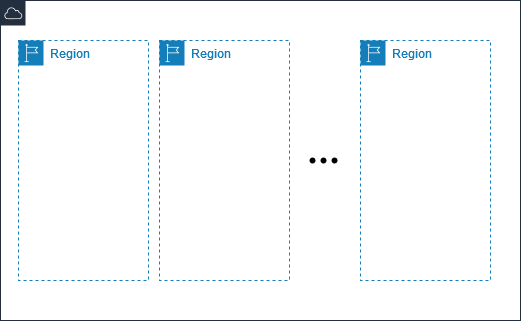
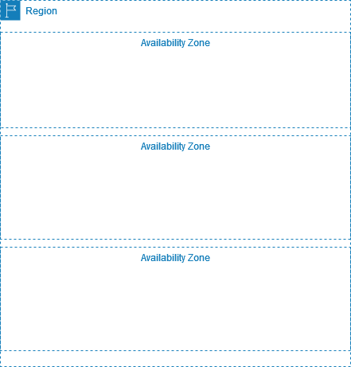

# AWS Regions and Availability Zones

AWS services are hosted in multiple locations world-wide. These locations are composed of
AWS Regions, Availability Zones, Local Zones, and Wavelength Zones.

- Each [Region](#concepts-regions "#concepts-regions") is a separate geographic area.
- [Availability Zones](#concepts-availability-zones "#concepts-availability-zones") are isolated locations
  within each Region.
- [Local Zones](../../../local-zones/latest/ug.md "../../../local-zones/latest/ug.md")
  provide you the ability to place resources, such as compute and storage,
  in multiple locations closer to your end users.
- [Wavelength Zones](../../../wavelength/latest/developerguide.md "../../../wavelength/latest/developerguide.md")
  allow developers to build applications that deliver ultra-low latencies
  to 5G devices and end users. Wavelength deploys standard AWS compute and
  storage services to the edge of telecommunication carriers' 5G networks.
  AWS operates state-of-the-art, highly available data centers. Although rare, failures
  can occur that affect the availability of resources that are in the same location. For example,
  if you host all of your EC2 instances in a single Availability Zones and that Availability Zone
  is affected by a failure, none of your EC2 instances would be available.

For more information, see [AWS Global Infrastructure](https://aws.amazon.com/about-aws/global-infrastructure/ "https://aws.amazon.com/about-aws/global-infrastructure/").

## Regions

Each Region is designed to be isolated from the other Regions. This achieves the
greatest possible fault tolerance and stability.

Most AWS services support regional resources. A regional resource is specific
to the Region in which you create it. When you view your AWS resources, you must
specify a Region, and then you see only the resources that are tied to that Region.
You can replicate some types of resources across Regions, but we don't automatically
replicate them for you.

The following diagram illustrates multiple Regions in the AWS Cloud.

For more information, see [Regions](aws-regions.md "aws-regions.md").

## Availability Zones

Each Region has multiple, independent locations known as Availability Zones.
The Availability Zones in a Region are connected through low-latency,
high-bandwidth, highly-redundant networking, over dedicated metro fiber.

Each Availability Zone consists of one or more discrete data centers, each
with redundant power, networking, and connectivity, and housed in separate
facilities. Because they are physically separate, only a single Availability
Zone would be affected in the unlikely event of a fire, tornado, or flooding.

Some AWS services support zonal resources. A zonal resource is specific
to the Availability Zone in which you create it. It is a best practice to
deploy your application in multiple Availability Zones, so that your
application remains available even if one Availability Zone fails.

The following diagram illustrates multiple Availability Zones in an AWS
Region.

For more information, see [Availability Zones](aws-availability-zones.md "aws-availability-zones.md").
