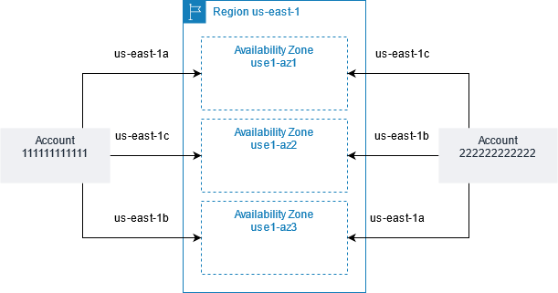

# AZ IDs

Originally, we decided to independently map Availability Zones to codes in each
AWS account. This ensures that resources are distributed across the Availability Zones
for these Regions, even if most customers chose the first Availability Zone in the Region.
For example, the `us-east-1a` for your AWS account might not be the
same physical location as the `us-east-1a` for another
AWS account. As AWS learned more about customer usage patterns, and as AWS evolved,
we determined that it was not necessary to continue to independently map Availability Zones
to codes. All Regions introduced after November 2012 use a uniform mapping of Availability
Zones to codes.

To coordinate Availability Zones across accounts in all Regions, even those that
independently map Availability Zones, use the _AZ IDs_, which are unique
and consistent identifiers for Availability Zones. For example, `use1-az1` is an
AZ ID for the `us-east-1` Region, and it has the same physical location in every
AWS account. You can view the AZ IDs for your account to determine the physical location
of your resources relative to the resources in another account. For example, if you share a
subnet in the Availability Zone with the AZ ID `use1-az2` with another account,
this subnet is available to that account in the Availability Zone whose AZ ID is also
`use1-az2`.

To view the AZ IDs for your account, check the **Service health** panel
on the [EC2 Dashboard](https://console.aws.amazon.com/ec2/ "https://console.aws.amazon.com/ec2/") or use the [describe-availability-zones](../../../cli/latest/reference/ec2/describe-availability-zones.md "../../../cli/latest/reference/ec2/describe-availability-zones.md") AWS CLI command.

The following diagram illustrates two accounts with different mappings of Availability
Zone code to AZ ID.



## Regions with independently mapped Availability Zones

In the following Regions, we independently map Availability Zones to codes
for each AWS account. All other Regions use a uniform mapping.

- US East (N. Virginia)
- US West (N. California)
- US West (Oregon)
- Asia Pacific (Singapore)
- Asia Pacific (Sydney)
- Asia Pacific (Tokyo)
- Europe (Ireland)
- South America (São Paulo)
- AWS GovCloud (US-West)

## Example commands

The following AWS CLI commands demonstrate how to get information about the AZ IDs
for your account.

###### To list Availability Zone names and IDs using the CLI

Use the following [describe-availability-zones](../../../cli/latest/reference/ec2/describe-availability-zones.md "../../../cli/latest/reference/ec2/describe-availability-zones.md") command to describe the Availability
Zones for the current Region. To describe the Availability Zones for a
different Region, add the `--region` option.

```
aws ec2 describe-availability-zones --query "AvailabilityZones[].{Name:ZoneName,ID:ZoneId}" --output table
```

The following is example output for US East (Ohio).

````
----------------------------
| DescribeAvailabilityZones| +-----------+--------------+
|    ID     |    Name      | +-----------+--------------+
|  use2-az1 |  us-east-2a  |
|  use2-az2 |  us-east-2b  |
|  use2-az3 |  us-east-2c  | +-----------+--------------+ ``` ###### To get the AZ ID using instance metadata You can use [instance metadata](../../../AWSEC2/latest/UserGuide/ec2-instance-metadata.md "../../../AWSEC2/latest/UserGuide/ec2-instance-metadata.md") to get the AZ ID of the Availability Zone in which an instance is launched. IMDSv2 ``` `[ec2-user ~]$` TOKEN=`curl -X PUT "http://169.254.169.254/latest/api/token" -H "X-aws-ec2-metadata-token-ttl-seconds: 21600"` \ && curl -H "X-aws-ec2-metadata-token: $TOKEN" http://169.254.169.254/latest/meta-data/placement/availability-zone-id ``` IMDSv1 ``` `[ec2-user ~]$` curl http://169.254.169.254/latest/meta-data/placement/availability-zone-id ```
````
