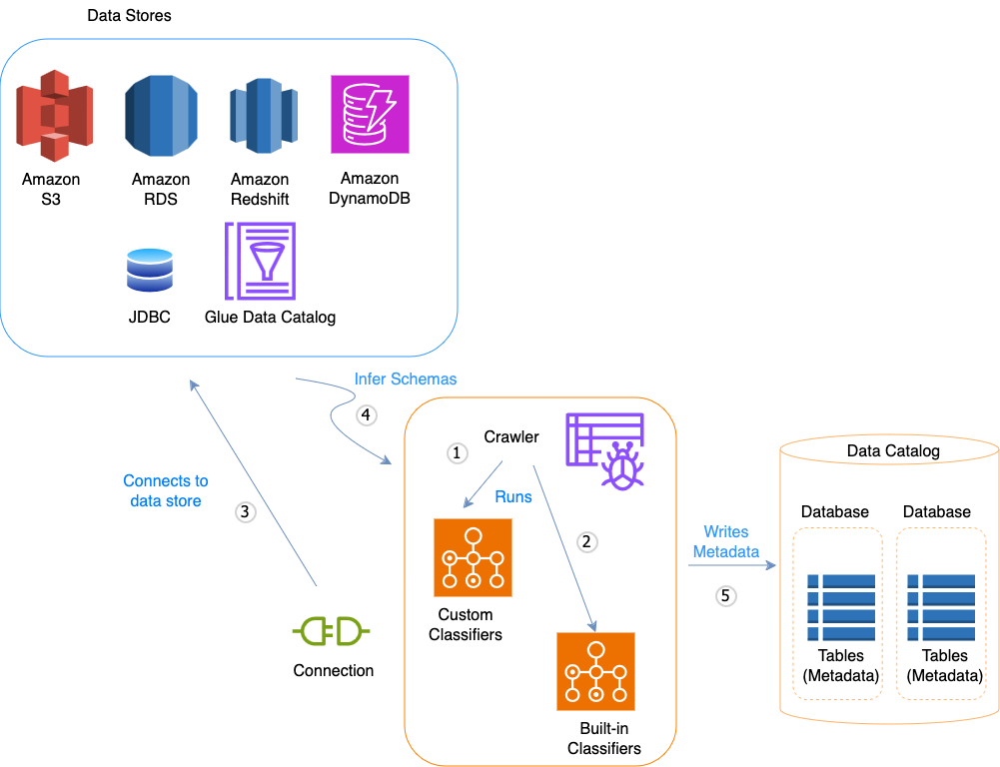

# Using crawlers to populate the Data Catalog

You can use an AWS Glue crawler to populate the AWS Glue Data Catalog with databases and tables. This is the primary method
used by most AWS Glue users. A crawler can crawl multiple data stores in a single run. Upon
completion, the crawler creates or updates one or more tables in your Data Catalog. Extract,
transform, and load (ETL) jobs that you define in AWS Glue use these Data Catalog tables as sources and
targets. The ETL job reads from and writes to the data stores that are specified in the source
and target Data Catalog tables.

## Workflow

The following workflow diagram shows how AWS Glue crawlers interact with data stores and other
elements to populate the Data Catalog.



The following is the general workflow for how a crawler populates the AWS Glue Data Catalog:

1. A crawler runs any custom _classifiers_ that you choose to infer the
   format and schema of your data. You provide the code for custom classifiers, and they run in
   the order that you specify.

The first custom classifier to successfully recognize the structure of your data is used
to create a schema. Custom classifiers lower in the list are skipped. 2. If no custom classifier matches your data's schema, built-in classifiers try to
recognize your data's schema. An example of a built-in classifier is one that recognizes
JSON. 3. The crawler connects to the data store. Some data stores require connection properties
for crawler access. 4. The inferred schema is created for your data. 5. The crawler writes metadata to the Data Catalog. A table definition contains metadata about
the data in your data store. The table is written to a database, which is a container of
tables in the Data Catalog. Attributes of a table include classification, which is a label
created by the classifier that inferred the table schema.

###### Topics

- [How crawlers work](#crawler-running "#crawler-running")
- [How does a crawler determine when to
  create partitions?](#crawler-s3-folder-table-partition "#crawler-s3-folder-table-partition")
- [Supported data sources for crawling](crawler-data-stores.md "crawler-data-stores.md")
- [Crawler prerequisites](crawler-prereqs.md "crawler-prereqs.md")
- [Defining and managing classifiers](add-classifier.md "add-classifier.md")
- [Configuring a crawler](define-crawler.md "define-crawler.md")
- [Scheduling a crawler](schedule-crawler.md "schedule-crawler.md")
- [Viewing crawler results and details](console-crawlers-details.md "console-crawlers-details.md")
- [Customizing crawler behavior](crawler-configuration.md "crawler-configuration.md")
- [Tutorial: Adding an AWS Glue crawler](tutorial-add-crawler.md "tutorial-add-crawler.md")

## How crawlers work

When a crawler runs, it takes the following actions to interrogate a data store:

- **Classifies data to determine the format, schema, and associated
  properties of the raw data** – You can configure the results of
  classification by creating a custom classifier.
- **Groups data into tables or partitions** – Data
  is grouped based on crawler heuristics.
- **Writes metadata to the Data Catalog** – You can
  configure how the crawler adds, updates, and deletes tables and partitions.

When you define a crawler, you choose one or more classifiers that evaluate the format of
your data to infer a schema. When the crawler runs, the first classifier in your list to
successfully recognize your data store is used to create a schema for your table. You can use
built-in classifiers or define your own. You define your custom classifiers in a separate
operation, before you define the crawlers. AWS Glue provides built-in classifiers to infer
schemas from common files with formats that include JSON, CSV, and Apache Avro. For the
current list of built-in classifiers in AWS Glue, see [Built-in classifiers](add-classifier.md#classifier-built-in "add-classifier.md#classifier-built-in").

The metadata tables that a crawler creates are contained in a database when you define a
crawler. If your crawler does not specify a database, your tables are placed in the default
database. In addition, each table has a classification column that is filled in by the
classifier that first successfully recognized the data store.

If the file that is crawled is compressed, the crawler must download it to process it.
When a crawler runs, it interrogates files to determine their format and compression type and
writes these properties into the Data Catalog. Some file formats (for example, Apache Parquet)
enable you to compress parts of the file as it is written. For these files, the compressed
data is an internal component of the file, and AWS Glue does not populate the
`compressionType` property when it writes tables into the Data Catalog. In contrast,
if an _entire file_ is compressed by a compression algorithm (for example,
gzip), then the `compressionType` property is populated when tables are written
into the Data Catalog.

The crawler generates the names for the tables that it creates. The names of the tables
that are stored in the AWS Glue Data Catalog follow these rules:

- Only alphanumeric characters and underscore (`_`) are allowed.
- Any custom prefix cannot be longer than 64 characters.
- The maximum length of the name cannot be longer than 128 characters. The crawler
  truncates generated names to fit within the limit.
- If duplicate table names are encountered, the crawler adds a hash string suffix to the
  name.

If your crawler runs more than once, perhaps on a schedule, it looks for new or changed
files or tables in your data store. The output of the crawler includes new tables and
partitions found since a previous run.

## How does a crawler determine when to

create partitions?

When an AWS Glue crawler scans Amazon S3 data stpre and detects multiple folders in a bucket, it determines
the root of a table in the folder structure and which folders are partitions of a table. The
name of the table is based on the Amazon S3 prefix or folder name. You provide an
**Include path** that points to the folder level to crawl. When the
majority of schemas at a folder level are similar, the crawler creates partitions of a table
instead of separate tables. To influence the crawler to create separate tables, add each
table's root folder as a separate data store when you define the crawler.

For example, consider the following Amazon S3 folder structure.


The paths to the four lowest level folders are the following:

```
S3://sales/year=2019/month=Jan/day=1
S3://sales/year=2019/month=Jan/day=2
S3://sales/year=2019/month=Feb/day=1
S3://sales/year=2019/month=Feb/day=2
```

Assume that the crawler target is set at `Sales`, and that all files in the
`day=*n*` folders have the same format (for
example, JSON, not encrypted), and have the same or very similar schemas. The crawler will
create a single table with four partitions, with partition keys `year`,
`month`, and `day`.

In the next example, consider the following Amazon S3 structure:

```

s3://bucket01/folder1/table1/partition1/file.txt
s3://bucket01/folder1/table1/partition2/file.txt
s3://bucket01/folder1/table1/partition3/file.txt
s3://bucket01/folder1/table2/partition4/file.txt
s3://bucket01/folder1/table2/partition5/file.txt

```

If the schemas for files under `table1` and `table2` are similar,
and a single data store is defined in the crawler with **Include path**
`s3://bucket01/folder1/`, the crawler creates a single table with two
partition key columns. The first partition key column contains `table1` and
`table2`, and the second partition key column contains `partition1`
through `partition3` for the `table1` partition and
`partition4` and `partition5` for the `table2` partition.
To create two separate tables, define the crawler with two data stores. In this example,
define the first **Include path** as
`s3://bucket01/folder1/table1/` and the second as
`s3://bucket01/folder1/table2`.

###### Note

In Amazon Athena, each table corresponds to an Amazon S3 prefix with all the objects in it. If
objects have different schemas, Athena does not recognize different objects within the same
prefix as separate tables. This can happen if a crawler creates multiple tables from the
same Amazon S3 prefix. This might lead to queries in Athena that return zero results. For Athena
to properly recognize and query tables, create the crawler with a separate
**Include path** for each different table schema in the Amazon S3 folder
structure. For more information, see [Best Practices When Using Athena with AWS Glue](../../../athena/latest/ug/glue-best-practices.md "../../../athena/latest/ug/glue-best-practices.md") and this [AWS
Knowledge Center article](https://aws.amazon.com/premiumsupport/knowledge-center/athena-empty-results/ "https://aws.amazon.com/premiumsupport/knowledge-center/athena-empty-results/").
