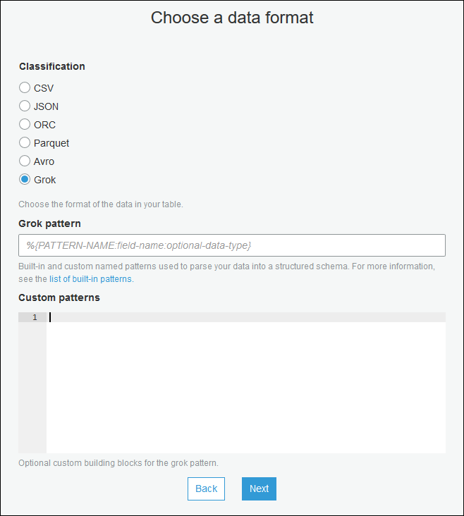

# Streaming ETL jobs in AWS Glue

You can create streaming extract, transform, and load (ETL) jobs that run continuously,
consume data from streaming sources like Amazon Kinesis Data Streams, Apache Kafka, and Amazon Managed Streaming for Apache Kafka
(Amazon MSK). The jobs cleanse and transform the data, and then load the results into Amazon S3 data
lakes or JDBC data stores.

Additionally, you can produce data for Amazon Kinesis Data Streams streams. This feature is only available
when writing AWS Glue scripts. For more information, see [Kinesis connections](aws-glue-programming-etl-connect-kinesis-home.md "aws-glue-programming-etl-connect-kinesis-home.md").

By default, AWS Glue processes and writes out data in 100-second windows. This allows data to
be processed efficiently and permits aggregations to be performed on data arriving later
than expected. You can modify this window size to increase timeliness or aggregation
accuracy. AWS Glue streaming jobs use checkpoints rather than job bookmarks to track the data
that has been read.

###### Note

AWS Glue bills hourly for streaming ETL jobs while they are running.

This video discusses streaming ETL cost challenges, and cost-saving features in AWS Glue.

Creating a streaming ETL job involves the following steps:

1. For an Apache Kafka streaming source, create an AWS Glue connection to the Kafka
   source or the Amazon MSK cluster.
2. Manually create a Data Catalog table for the streaming source.
3. Create an ETL job for the streaming data source. Define streaming-specific job
   properties, and supply your own script or optionally modify the generated
   script.
   For more information, see [Streaming ETL in AWS Glue](components-overview.md#streaming-etl-intro "components-overview.md#streaming-etl-intro").

When creating a streaming ETL job for Amazon Kinesis Data Streams, you don't have to create an AWS Glue
connection. However, if there is a connection attached to the AWS Glue streaming ETL job that
has Kinesis Data Streams as a source, then a virtual private cloud (VPC) endpoint to Kinesis is required. For
more information, see [Creating an interface endpoint](../../../vpc/latest/userguide/vpce-interface.md#create-interface-endpoint "../../../vpc/latest/userguide/vpce-interface.md#create-interface-endpoint") in the
_Amazon VPC User Guide_. When specifying a Amazon Kinesis Data Streams stream in another account, you must setup the roles and policies to allow cross-account access. For more information, see [Example: Read From a Kinesis Stream in a Different Account](../../../kinesisanalytics/latest/java/examples-cross.md "../../../kinesisanalytics/latest/java/examples-cross.md").

AWS Glue streaming ETL jobs can auto-detect compressed data, transparently decompress the streaming data, perform the usual transformations on the input source, and load to the output store.

AWS Glue supports auto-decompression for the following compression types given the input format:

| Compression type | Avro file        | Avro datum          | JSON                | CSV                 | Grok                |
| ---------------- | ---------------- | ------------------- | ------------------- | ------------------- | ------------------- | -------------------------------------------------------------------------------------------------------------------------------------------------------------------------------------------------------------------------------------------------------------------------------------------------------------------------------------------------------------------------------------------------------------------------------------------------------------------------------------------------------------------------------------------------------------------------------------------------------------------------------------------------------------------------------------------------------------------------------------------------------------------------------------------------------------------------------------------------------------------------------------------------------------------------------------------------------------------------------------------------------------------------------------------------------------------------------------------------------------------------------------------------------------------------------------------------------------------------------------------------------------------------------------------------------------------------------------------------------------------------------------------------------------------------------------------------------------------------------------------------------------------------------------------------------------------------------------------------------------------------------------------------------------------------------------------------------------------------------------------------------------------------------------------------------------------------------------------------------------------------------------------------------------------------------------------------------------------------------------------------------------------------------------------------------------------------------------------------------------------------------------------------------------------------------------------------------------------------------------------------------------------------------------------------------------------------------------------------------------------------------------------------------------------------------------------------------------------------------------------------------------------------------------------------------------------------------------------------------------------------------------------------------------------------------------------------------------------------------------------------------------------------------------------------------------------------------------------------------------------------------------------------------------------------------------------------------------------------------------------------------------------------------------------------------------------------------------------------------------------------------------------------------------------------------------------------------------------------------------------------------------------------------------------------------------------------------------------------------------------------------------------------------------------------------------------------------------------------------------------------------------------------------------------------------------------------------------------------------------------------------------------------------------------------------------------------------------------------------------------------------------------------------------------------------------------------------------------------------------------------------------------------------------------------------------------------------------------------------------------------------------------------------------------------------------------------------------------------------------------------------------------------------------------------------------------------------------------------------------------------------------------------------------------------------------------------------------------------------------------------------------------------------------------------------------------------------------------------------------------------------------------------------------------------------------------------------------------------------------------------------------------------------------------------------------------------------------------------------------------------------------------------------------------------------------------------------------------------------------------------------------------------------------------------------------------------------------------------------------------------------------------------------------------------------------------------------------------------------------------------------------------------------------------------------------------------------------------------------------------------------------------------------------------------------------------------------------------------------------------------------------------------------------------------------------------------------------------------------------------------------------------------------------------------------------------------------------------------------------------------------------------------------------------------------------------------------------------------------------------------------------------------------------------------------------------------------------------------------------------------------------------------------------------------------------------------------------------------------------------------------------------------------------------------------------------------------------------------------------------------------------------------------------------------------------------------------------------------------------------------------------------------------------------------------------------------------------------------------------------------------------------------------------------------------------------------------------------------------------------------------------------------------------------------------------------------------------------------------------------------------------------------------------------------------------------------------------------------------------------------------------------------------------------------------------------------------------------------------------------------------------------------------------------------------------------------------------------------------------------------------------------------------------------------------------------------------------------------------------------------------------------------------------------------------------------------------------------------------------------------------------------------------------------------------------------------------------------------------------------------------------------------------------------------------------------------------------------------------------------------------------------------------------------------------------------------------------------------------------------------------------------------------------------------------------------------------------------------------------------------------------------------------------------------------------------------------------------------------------------------------------------------------------------------------------------------------------------------------------------------------------------------------------------------------------------------------------------------------------------------------------------------------------------------------------------------------------------------------------------------------------------------------------------------------------------------------------------------------------------------------------------------------------------------------------------------------------------------------------------------------------------------------------------------------------------------------------------------------------------------------------------------------------------------------------------------------------------------------------------------------------------------------------------------------------------------------------------------------------------------------------------------------------------------------------------------------------------------------------------------------------------------------------------------------------------------------------------------------------------------------------------------------------------------------------------------------------------------------------------------------------------------------------------------------------------------------------------------------------------------------------------------------------------------------------------------------------------------------------------------------------------------------------------------------------------------------------------------------------------------------------------------------------------------------------------------------------------------------------------------------------------------------------------------------------------------------------------------------------------------------------------------------------------------------------------------------------------------------------------------------------------------------------------------------------------------------------------------------------------------------------------------------------------------------------------------------------------------------------------------------------------------------------------------------------------------------------------------------------------------------------------------------------------------------------------------------------------------------------------------------------------------------------------------------------------------------------------------------------------------------------------------------------------------------------------------------------------------------------------------------------------------------------------------------------------------------------------------------------------------------------------------------------------------------------------------------------------------------------------------------------------------------------------------------------------------------------------------------------------------------------------------------------------------------------------------------------------------------------------------------------------------------------------------------------------------------------------------------------------------------------------------------------------------------------------------------------------------------------------------------------------------------------------------------------------------------------------------------------------------------------------------------------------------------------------------------------------------------------------------------------------------------------------------------------------------------------------------------------------------------------------------------------------------------------------------------------------------------------------------------------------------------------------------------------------------------------------------------------------------------------------------------------------------------------------------------------------------------------------------------------------------------------------------------------------------------------------------------------------------------------------------------------------------------------------------------------------------------------------------------------------------------------------------------------------------------------------------------------------------------------------------------------------------------------------------------------------------------------------------------------------------------------------------------------------------------------------------------------------------------------------------------------------------------------------------------------------------------------------------------------------------------------------------------------------------------------------------------------------------------------------------------------------------------------------------------------------------------------------------------------------------------------------------------------------------------------------------------------------------------------------------------------------------------------------------------------------------------------------------------------------------------------------------------------------------------------------------------------------------------------------------------------------------------------------------------------------------------------------------------------------------------------------------------------------------------------------------------------------------------------------------------------------------------------------------------------------------------------------------------------------------------------------------------------------------------------------------------------------------------------------------------------------------------------------------------------------------------------------------------------------------------------------------------------------------------------------------------------------------------------------------------------------------------------------------------------------------------------------------------------------------------------------------------------------------------------------------------------------------------------------------------------------------------------------------------------------------------------------------------------------------------------------------------------------------------------------------------------------------------------------------------------------------------------------------------------------------------------------------------------------------------------------------------------------------------------------------------------------------------------------------------------------------------------------------------------------------------------------------------------------------------------------------------------------------------------------------------------------------------------------------------------------------------------------------------------------------------------------------------------------------------------------------------------------------------------------------------------------------------------------------------------------------------------------------------------------------------------------------------------------------------------------------------------------------------------------------------------------------------------------------------------------------------------------------------------------------------------------------------------------------------------------------------------------------------------------------------------------------------------------------------------------------------------------------------------------------------------------------------------------------------------------------------------------------------------------------------------------------------------------------------------------------------------------------------------------------------------------------------------------------------------------------------------------------------------------------------------------------------------------------------------------------------------------------------------------------------------------------------------------------------------------------------------------------------------------------------------------------------------------------------------------------------------------------------------------------------------------------------------------------------------------------------------------------------------------------------------------------------------------------------------------------------------------------------------------------------------------------------------------------------------------------------------------------------------------------------------------------------------------------------------------------------------------------------------------------------------------------------------------------------------------------------------------------------------------------------------------------------------------------------------------------------------------------------------------------------------------------------------------------------------------------------------------------------------------------------------------------------------------------------------------------------------------------------------------------------------------------------------------------------------------------------------------------------------------------------------------------------------------------------------------------------------------------------------------------------------------------------------------------------------------------------------------------------------------------------------------------------------------------------------------------------------------------------------------------------------------------------------------------------------------------------------------------------------------------------------------------------------------------------------------------------------------------------------------------------------------------------------------------------------------------------------------------------------------------------------------------------------------------------------------------------------------------------------------------------------------------------------------------------------------------------------------------------------------------------------------------------------------------------------------------------------------------------------------------------------------------------------------------------------------------------------------------------------------------------------------------------------------------------------------------------------------------------------------------------------------------------------------------------------------------------------------------------------------------------------------------------------------------------------------------------------------------------------------------------------------------------------------------------------------------------------------------------------------------------------------------------------------------------------------------------------------------------------------------------------------------------------------------------------------------------------------------------------------------------------------------------------------------------------------------------------------------------------------------------------------------------------------------------------------------------------------------------------------------------------------------------------------------------------------------------------------------------------------------------------------------------------------------------------------------------------------------------------------------------------------------------------------------------------------------------------------------------------------------------------------------------------------------------------------------------------------------------------------------------------------------------------------------------------------------------------------------------------------------------------------------------------------------------------------------------------------------------------------------------------------------------------------------------------------------------------------------------------------------------------------------------------------------------------------------------------------------------------------------------------------------------------------------------------------------------------------------------------------------------------------------------------------------------------------------------------------------------------------------------------------------------------------------------------------------------------------------------------------------------------------------------------------------------------------------------------------------------------------------------------------------------------------------------------------------------------------------------------------------------------------------------------------------- |
| BZIP2            | Yes              | Yes                 | Yes                 | Yes                 | Yes                 |
| GZIP             | No               | Yes                 | Yes                 | Yes                 | Yes                 |
| SNAPPY           | Yes (raw Snappy) | Yes (framed Snappy) | Yes (framed Snappy) | Yes (framed Snappy) | Yes (framed Snappy) |
| XZ               | Yes              | Yes                 | Yes                 | Yes                 | Yes                 |
| ZSTD             | Yes              | No                  | No                  | No                  | No                  |
| DEFLATE          | Yes              | Yes                 | Yes                 | Yes                 | Yes                 | ###### Topics  • [Creating an AWS Glue connection for an Apache Kafka data stream](#create-conn-streaming "#create-conn-streaming")  • [Creating a Data Catalog table for a streaming source](#create-table-streaming "#create-table-streaming")  • [Notes and restrictions for Avro streaming sources](#streaming-avro-notes "#streaming-avro-notes")  • [Applying grok patterns to streaming sources](#create-table-streaming-grok "#create-table-streaming-grok")  • [Defining job properties for a streaming ETL job](#create-job-streaming-properties "#create-job-streaming-properties")  • [Streaming ETL notes and restrictions](#create-job-streaming-restrictions "#create-job-streaming-restrictions") ## Creating an AWS Glue connection for an Apache Kafka data stream To read from an Apache Kafka stream, you must create an AWS Glue connection. ###### To create an AWS Glue connection for a Kafka source (Console) 1. Open the AWS Glue console at [https://console.aws.amazon.com/glue/](https://console.aws.amazon.com/glue/ "https://console.aws.amazon.com/glue/"). 2. In the navigation pane, under **Data catalog**, choose **Connections**. 3. Choose **Add connection**, and on the **Set up your connection’s properties** page, enter a connection name. ###### Note For more information about specifying connection properties, see [AWS Glue connection properties.](aws-glue-api-catalog-connections.md "aws-glue-api-catalog-connections.md"). 4. For **Connection type**, choose **Kafka**. 5. For **Kafka bootstrap servers URLs**, enter the host and port number for the bootstrap brokers for your Amazon MSK cluster or Apache Kafka cluster. Use only Transport Layer Security (TLS) endpoints for establishing the initial connection to the Kafka cluster. Plaintext endpoints are not supported. The following is an example list of hostname and port number pairs for an Amazon MSK cluster. `myserver1.kafka.us-east-1.amazonaws.com:9094,myserver2.kafka.us-east-1.amazonaws.com:9094, myserver3.kafka.us-east-1.amazonaws.com:9094` For more information about getting the bootstrap broker information, see [Getting the Bootstrap Brokers for an Amazon MSK Cluster](../../../msk/latest/developerguide/msk-get-bootstrap-brokers.md "../../../msk/latest/developerguide/msk-get-bootstrap-brokers.md") in the _Amazon Managed Streaming for Apache Kafka Developer Guide_. 6. If you want a secure connection to the Kafka data source, select **Require SSL connection**, and for **Kafka private CA certificate location**, enter a valid Amazon S3 path to a custom SSL certificate. For an SSL connection to self-managed Kafka, the custom certificate is mandatory. It's optional for Amazon MSK. For more information about specifying a custom certificate for Kafka, see [AWS Glue SSL connection properties](connection-properties.md#connection-properties-SSL "connection-properties.md#connection-properties-SSL"). 7. Use AWS Glue Studio or the AWS CLI to specify a Kafka client authentication method. To access AWS Glue Studio select **AWS Glue** from the **ETL** menu in the left navigation pane. For more information about Kafka client authentication methods, see [AWS Glue Kafka connection properties for client authentication](#connection-properties-kafka-client-auth "#connection-properties-kafka-client-auth") . 8. Optionally enter a description, and then choose **Next**. 9. For an Amazon MSK cluster, specify its virtual private cloud (VPC), subnet, and security group. The VPC information is optional for self-managed Kafka. 10. Choose **Next** to review all connection properties, and then choose **Finish**. For more information about AWS Glue connections, see [Connecting to data](glue-connections.md "glue-connections.md"). ### AWS Glue Kafka connection properties for client authentication **SASL/GSSAPI (Kerberos) authentication** Choosing this authentication method will allow you to specify Kerberos properties. **Kerberos Keytab** Choose the location of the keytab file. A keytab stores long-term keys for one or more principals. For more information, see [MIT Kerberos Documentation: Keytab](https://web.mit.edu/kerberos/krb5-latest/doc/basic/keytab_def.html "https://web.mit.edu/kerberos/krb5-latest/doc/basic/keytab_def.html") . **Kerberos krb5.conf file** Choose the krb5.conf file. This contains the default realm (a logical network, similar to a domain, that defines a group of systems under the same KDC) and the location of the KDC server. For more information, see [MIT Kerberos Documentation: krb5.conf](https://web.mit.edu/kerberos/krb5-1.12/doc/admin/conf_files/krb5_conf.html "https://web.mit.edu/kerberos/krb5-1.12/doc/admin/conf_files/krb5_conf.html") . **Kerberos principal and Kerberos service name** Enter the Kerberos principal and service name. For more information, see [MIT Kerberos Documentation: Kerberos principal](https://web.mit.edu/kerberos/krb5-1.5/krb5-1.5.4/doc/krb5-user/What-is-a-Kerberos-Principal_003f.html "https://web.mit.edu/kerberos/krb5-1.5/krb5-1.5.4/doc/krb5-user/What-is-a-Kerberos-Principal_003f.html") . **SASL/SCRAM-SHA-512 authentication** Choosing this authentication method will allow you to specify authentication credentials. **AWS Secrets Manager** Search for your token in the Search box by typing the name or ARN. **Provider username and password directly** Search for your token in the Search box by typing the name or ARN. **SSL client authentication** Choosing this authentication method allows you to select the location of the Kafka client keystore by browsing Amazon S3. Optionally, you can enter the Kafka client keystore password and Kafka client key password. **IAM authentication** This authentication method does not require any additional specifications and is only applicable when the Streaming source is MSK Kafka. **SASL/PLAIN authentication** Choosing this authentication method allows you to specify authentication credentials. ## Creating a Data Catalog table for a streaming source A Data Catalog table that specifies source data stream properties, including the data schema can be manually created for a streaming source. This table is used as the data source for the streaming ETL job. If you don't know the schema of the data in the source data stream, you can create the table without a schema. Then when you create the streaming ETL job, you can turn on the AWS Glue schema detection function. AWS Glue determines the schema from the streaming data. Use the [AWS Glue console](https://console.aws.amazon.com/glue/ "https://console.aws.amazon.com/glue/"), the AWS Command Line Interface (AWS CLI), or the AWS Glue API to create the table. For information about creating a table manually with the AWS Glue console, see [Creating tables](tables-described.md "tables-described.md"). ###### Note You can't use the AWS Lake Formation console to create the table; you must use the AWS Glue console. Also consider the following information for streaming sources in Avro format or for log data that you can apply Grok patterns to.  • [Notes and restrictions for Avro streaming sources](#streaming-avro-notes "#streaming-avro-notes")  • [Applying grok patterns to streaming sources](#create-table-streaming-grok "#create-table-streaming-grok") ###### Topics  • [Kinesis data source](#kinesis-source "#kinesis-source")  • [Kafka data source](#kafka-source "#kafka-source")  • [AWS Glue Schema Registry table source](#schema-registry-table "#schema-registry-table") ### Kinesis data source When creating the table, set the following streaming ETL properties (console). **Type of Source** **Kinesis** **For a Kinesis source in the same account:** **Region** The AWS Region where the Amazon Kinesis Data Streams service resides. The Region and Kinesis stream name are together translated to a Stream ARN. Example: https://kinesis.us-east-1.amazonaws.com **Kinesis stream name** Stream name as described in [Creating a Stream](../../../streams/latest/dev/kinesis-using-sdk-java-create-stream.md "../../../streams/latest/dev/kinesis-using-sdk-java-create-stream.md") in the _Amazon Kinesis Data Streams Developer Guide_. **For a Kinesis source in another account, refer to [this example](../../../kinesisanalytics/latest/java/examples-cross.md "../../../kinesisanalytics/latest/java/examples-cross.md") to set up the roles and policies to allow cross-account access. Configure these settings:** **Stream ARN** The ARN of the Kinesis data stream that the consumer is registered with. For more information, see [Amazon Resource Names (ARNs) and AWS Service Namespaces](../../../general/latest/gr/aws-arns-and-namespaces.md "../../../general/latest/gr/aws-arns-and-namespaces.md") in the _AWS General Reference_. **Assumed Role ARN** The Amazon Resource Name (ARN) of the role to assume. **Session name (optional)** An identifier for the assumed role session. Use the role session name to uniquely identify a session when the same role is assumed by different principals or for different reasons. In cross-account scenarios, the role session name is visible to, and can be logged by the account that owns the role. The role session name is also used in the ARN of the assumed role principal. This means that subsequent cross-account API requests that use the temporary security credentials will expose the role session name to the external account in their AWS CloudTrail logs. ###### To set streaming ETL properties for Amazon Kinesis Data Streams (AWS Glue API or AWS CLI)  • To set up streaming ETL properties for a Kinesis source in the same account, specify the `streamName` and `endpointUrl` parameters in the `StorageDescriptor` structure of the `CreateTable` API operation or the `create_table` CLI command. `"StorageDescriptor": { "Parameters": { "typeOfData": "kinesis", "streamName": "sample-stream", "endpointUrl": "https://kinesis.us-east-1.amazonaws.com" } ... }` Or, specify the `streamARN`. `"StorageDescriptor": { "Parameters": { "typeOfData": "kinesis", "streamARN": "arn:aws:kinesis:us-east-1:123456789:stream/sample-stream" } ... }`  • To set up streaming ETL properties for a Kinesis source in another account, specify the `streamARN`, `awsSTSRoleARN` and `awsSTSSessionName` (optional) parameters in the `StorageDescriptor` structure in the `CreateTable` API operation or the `create_table` CLI command. `"StorageDescriptor": { "Parameters": { "typeOfData": "kinesis", "streamARN": "arn:aws:kinesis:us-east-1:123456789:stream/sample-stream", "awsSTSRoleARN": "arn:aws:iam::123456789:role/sample-assume-role-arn", "awsSTSSessionName": "optional-session" } ... }` ### Kafka data source When creating the table, set the following streaming ETL properties (console). **Type of Source** **Kafka** **For a Kafka source:** **Topic name** Topic name as specified in Kafka. **Connection** An AWS Glue connection that references a Kafka source, as described in [Creating an AWS Glue connection for an Apache Kafka data stream](#create-conn-streaming "#create-conn-streaming"). ### AWS Glue Schema Registry table source To use AWS Glue Schema Registry for streaming jobs, follow the instructions at [Use case: AWS Glue Data Catalog](schema-registry-integrations.md#schema-registry-integrations-aws-glue-data-catalog "schema-registry-integrations.md#schema-registry-integrations-aws-glue-data-catalog") to create or update a Schema Registry table. Currently, AWS Glue Streaming supports only Glue Schema Registry Avro format with schema inference set to `false`. ## Notes and restrictions for Avro streaming sources The following notes and restrictions apply for streaming sources in the Avro format:  • When schema detection is turned on, the Avro schema must be included in the payload. When turned off, the payload should contain only data.  • Some Avro data types are not supported in dynamic frames. You can't specify these data types when defining the schema with the **Define a schema** page in the create table wizard in the AWS Glue console. During schema detection, unsupported types in the Avro schema are converted to supported types as follows: + `EnumType => StringType` + `FixedType => BinaryType` + `UnionType => StructType`  • If you define the table schema using the **Define a schema** page in the console, the implied root element type for the schema is `record`. If you want a root element type other than `record`, for example `array` or `map`, you can't specify the schema using the **Define a schema** page. Instead you must skip that page and specify the schema either as a table property or within the ETL script. + To specify the schema in the table properties, complete the create table wizard, edit the table details, and add a new key-value pair under **Table properties**. Use the key `avroSchema`, and enter a schema JSON object for the value, as shown in the following screenshot.  + To specify the schema in the ETL script, modify the `datasource0` assignment statement and add the `avroSchema` key to the `additional_options` argument, as shown in the following Python and Scala examples. Python ``SCHEMA_STRING = ‘{"type":"array","items":"string"}’ datasource0 = glueContext.create_data_frame.from_catalog(database = "`database`", table_name = "`table_name`", transformation_ctx = "datasource0", additional_options = {"startingPosition": "TRIM_HORIZON", "inferSchema": "false", "avroSchema": SCHEMA_STRING})`` Scala ``val SCHEMA_STRING = """{"type":"array","items":"string"}""" val datasource0 = glueContext.getCatalogSource(database = "`database`", tableName = "`table_name`", redshiftTmpDir = "", transformationContext = "datasource0", additionalOptions = JsonOptions(s"""{"startingPosition": "TRIM_HORIZON", "inferSchema": "false", "avroSchema":"$SCHEMA_STRING"}""")).getDataFrame()`` ## Applying grok patterns to streaming sources You can create a streaming ETL job for a log data source and use Grok patterns to convert the logs to structured data. The ETL job then processes the data as a structured data source. You specify the Grok patterns to apply when you create the Data Catalog table for the streaming source. For information about Grok patterns and custom pattern string values, see [Writing grok custom classifiers](custom-classifier.md#custom-classifier-grok "custom-classifier.md#custom-classifier-grok"). ###### To add grok patterns to the Data Catalog table (console)  • Use the create table wizard, and create the table with the parameters specified in [Creating a Data Catalog table for a streaming source](#create-table-streaming "#create-table-streaming"). Specify the data format as Grok, fill in the **Grok pattern** field, and optionally add custom patterns under **Custom patterns (optional)**.  Press **Enter** after each custom pattern. ###### To add grok patterns to the Data Catalog table (AWS Glue API or AWS CLI)  • Add the `GrokPattern` parameter and optionally the `CustomPatterns` parameter to the `CreateTable` API operation or the `create_table` CLI command. `"Parameters": { ... "grokPattern": "string", "grokCustomPatterns": "string", ... },` Express `grokCustomPatterns` as a string and use "\n" as the separator between patterns. The following is an example of specifying these parameters. `"parameters": { ... "grokPattern": "%{USERNAME:username} %{DIGIT:digit:int}", "grokCustomPatterns": "digit \d", ... }` ## Defining job properties for a streaming ETL job When you define a streaming ETL job in the AWS Glue console, provide the following streams-specific properties. For descriptions of additional job properties, see [Defining job properties for Spark jobs](add-job.md#create-job "add-job.md#create-job"). **IAM role** Specify the AWS Identity and Access Management (IAM) role that is used for authorization to resources that are used to run the job, access streaming sources, and access target data stores. For access to Amazon Kinesis Data Streams, attach the `AmazonKinesisFullAccess` AWS managed policy to the role, or attach a similar IAM policy that permits more fine-grained access. For sample policies, see [Controlling Access to Amazon Kinesis Data Streams Resources Using IAM](../../../streams/latest/dev/controlling-access.md "../../../streams/latest/dev/controlling-access.md"). For more information about permissions for running jobs in AWS Glue, see [Identity and access management for AWS Glue](security-iam.md "security-iam.md"). **Type** Choose **Spark streaming**. **AWS Glue version** The AWS Glue version determines the versions of Apache Spark, and Python or Scala, that are available to the job. Choose a selection that specifies the version of Python or Scala available to the job. AWS Glue Version 2.0 with Python 3 support is the default for streaming ETL jobs. **Maintenance window** Specifies a window where a streaming job can be restarted. See [Maintenance windows for AWS Glue Streaming](glue-streaming-maintenance.md "glue-streaming-maintenance.md"). **Job timeout** Optionally enter a duration in minutes. The default value is blank.  • Streaming jobs must have a timeout value less than 7 days or 10080 minutes.  • When the value is left blank, the job will be restarted after 7 days, if you have not set up a maintenance window. If you have set up a maintenance window, the job will be restarted during the maintenance window after 7 days. **Data source** Specify the table that you created in [Creating a Data Catalog table for a streaming source](#create-table-streaming "#create-table-streaming"). **Data target** Do one of the following:  • Choose **Create tables in your data target** and specify the following data target properties. **Data store** Choose Amazon S3 or JDBC. **Format** Choose any format. All are supported for streaming.  • Choose **Use tables in the data catalog and update your data target**, and choose a table for a JDBC data store. **Output schema definition** Do one of the following:  • Choose **Automatically detect schema of each record** to turn on schema detection. AWS Glue determines the schema from the streaming data.  • Choose **Specify output schema for all records** to use the Apply Mapping transform to define the output schema. **Script** Optionally supply your own script or modify the generated script to perform operations that the Apache Spark Structured Streaming engine supports. For information on the available operations, see [Operations on streaming DataFrames/Datasets](https://spark.apache.org/docs/latest/structured-streaming-programming-guide.html#operations-on-streaming-dataframesdatasets "https://spark.apache.org/docs/latest/structured-streaming-programming-guide.html#operations-on-streaming-dataframesdatasets"). ## Streaming ETL notes and restrictions Keep in mind the following notes and restrictions:  • Auto-decompression for AWS Glue streaming ETL jobs is only available for the supported compression types. Also note the following: + Framed Snappy refers to the official [framing format](https://github.com/google/snappy/blob/main/framing_format.txt "https://github.com/google/snappy/blob/main/framing_format.txt") for Snappy. + Deflate is supported in Glue version 3.0, not Glue version 2.0.  • When using schema detection, you cannot perform joins of streaming data.  • AWS Glue streaming ETL jobs do not support the Union data type for AWS Glue Schema Registry with Avro format.  • Your ETL script can use AWS Glue's built-in transforms and the transforms native to Apache Spark Structured Streaming. For more information, see [Operations on streaming DataFrames/Datasets](https://spark.apache.org/docs/latest/structured-streaming-programming-guide.html#operations-on-streaming-dataframesdatasets "https://spark.apache.org/docs/latest/structured-streaming-programming-guide.html#operations-on-streaming-dataframesdatasets") on the Apache Spark website or [AWS Glue PySpark transforms reference](aws-glue-programming-python-transforms.md "aws-glue-programming-python-transforms.md").  • AWS Glue streaming ETL jobs use checkpoints to keep track of the data that has been read. Therefore, a stopped and restarted job picks up where it left off in the stream. If you want to reprocess data, you can delete the checkpoint folder referenced in the script.  • Job bookmarks aren't supported.  • To use enhanced fan-out feature of Kinesis Data Streams in your job, consult [Using enhanced fan-out in Kinesis streaming jobs](aws-glue-programming-etl-connect-kinesis-efo.md "aws-glue-programming-etl-connect-kinesis-efo.md").  • If you use a Data Catalog table created from AWS Glue Schema Registry, when a new schema version becomes available, to reflect the new schema, you need to do the following: 1. Stop the jobs associated with the table. 2. Update the schema for the Data Catalog table. 3. Restart the jobs associated with the table. |
