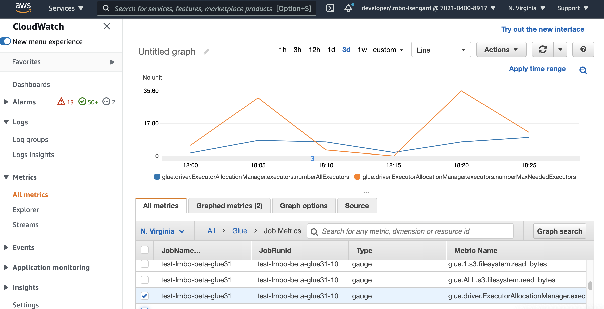
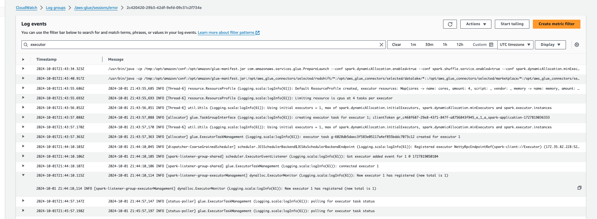
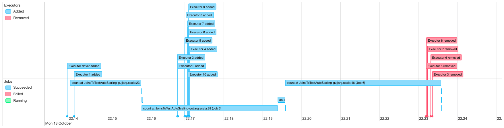

# Using auto scaling for AWS Glue

Auto Scaling is available for your AWS Glue ETL, interactive sessions, and streaming jobs with
AWS Glue version 3.0 or later.

With Auto Scaling enabled, you will get the following benefits:

- AWS Glue automatically adds and removes workers from the cluster
  depending on the parallelism at each stage or microbatch of the job run.
- It reduces the need for you to experiment and decide on the number of workers to
  assign for your AWS Glue ETL jobs.
- With the given maximum number of workers, AWS Glue will choose the
  right size resources for the workload.
- You can see how the size of the cluster changes during the job
  run
  by looking at CloudWatch metrics on the job run details page in AWS Glue
  Studio.
  Auto Scaling for AWS Glue ETL and streaming jobs enables on-demand scaling-out
  and scaling-in of the computing resources of your AWS Glue jobs. On-demand
  scale-up helps you to only allocate the required computing resources initially on job run
  startup, and also to provision the required resources as per demand during the job.

Auto Scaling also supports dynamic scale-in of the AWS Glue job resources
over the course of a job. Over a job run, when more executors are requested by your Spark
application, more workers will be added to the cluster. When the executor has been idle
without active computation tasks, the executor and the corresponding worker will be
removed.

Common scenarios where Auto Scaling helps with cost and utilization for your Spark
applications include:

- a Spark driver listing a large number of files in Amazon S3 or performing a load while executors
  are inactive
- Spark stages running with only a few executors due to over-provisioning
- data skews or uneven computation demand across Spark stages

## Requirements

Auto Scaling is only available for AWS Glue version 3.0 or later. To use
Auto Scaling, you can follow the [migration guide](migrating-version-30.md "migrating-version-30.md") to migrate your existing jobs to AWS Glue
version 3.0 or later or create new jobs with AWS Glue version 3.0 or
later.

Auto Scaling is available for AWS Glue jobs with the `G.1X`,
`G.2X`, `G.4X`, `G.8X`, `G.12X`, `G.16X`, `R.1X`, `R.2X`, `R.4X`, `R.8X`, or `G.025X` (only for Streaming jobs) worker types. Standard DPUs are not
supported for Auto Scaling.

## Enabling Auto Scaling in AWS Glue Studio

On the **Job details** tab in AWS Glue Studio, choose the
type as **Spark** or **Spark Streaming**, and
**Glue version** as `Glue 3.0` or
later. Then, a check box will appear below **Worker type**.

- Select the **Automatically scale the number of workers**
  option.
- Set the **Maximum number of workers** to define the maximum
  number of workers that can be vended to the job run.


## Enabling Auto Scaling with the AWS CLI or SDK

To enable Auto Scaling from the AWS CLI for your job run, run
`start-job-run` with the following configuration:

```
{
    "JobName": "<your job name>",
    "Arguments": {
        "--enable-auto-scaling": "true"
    },
    "WorkerType": "G.2X", // G.1X, G.2X, G.4X, G.8X, G.12X, G.16X, R.1X, R.2X, R.4X, and R.8X are supported for Auto Scaling Jobs
    "NumberOfWorkers": 20, // represents Maximum number of workers
    ...other job run configurations...
}
```

Once at ETL job run is finished, you can also call `get-job-run` to check
the actual resource usage of the job run in DPU-seconds. Note: the new field
**DPUSeconds** will only show up for your batch jobs on AWS Glue 4.0
or later enabled with Auto Scaling. This field is not supported for streaming
jobs.

```
$ aws glue get-job-run --job-name your-job-name --run-id jr_xx --endpoint https://glue.us-east-1.amazonaws.com --region us-east-1
{
    "JobRun": {
        ...
        "GlueVersion": "3.0",
        "DPUSeconds": 386.0
    }
}
```

You can also configure job runs with Auto Scaling using the [AWS Glue
SDK](../webapi/API_StartJobRun.md "../webapi/API_StartJobRun.md") with the same configuration.

## Enabling Auto Scaling with Interactive sessions

To enable Auto Scaling when building AWS Glue jobs with interactive sessions, see
[Configuring AWS Glue
interactive sessions](interactive-sessions-magics.md "interactive-sessions-magics.md").

## Tips and considerations

Tips and the considerations for fine-tuning AWS Glue Auto Scaling:

- In case you do not have any idea on the initial value of the maximum number of the workers, you can start
  from the rough calculation explained in
  [Estimate AWS Glue DPU](../../../whitepapers/latest/aws-glue-best-practices-build-performant-data-pipeline/building-a-cost-effective-data-pipeline.md "../../../whitepapers/latest/aws-glue-best-practices-build-performant-data-pipeline/building-a-cost-effective-data-pipeline.md")
  . You should not configure extremely large value in
  the maximum number of workers for very low volume data.
- AWS Glue Auto Scaling configures `spark.sql.shuffle.partitions` and `spark.default.parallelism`
  based on the maximum number of DPU (calculated with the maximum number of workers and the worker type) configured
  on the job. In case you prefer the fixed value on those configurations, you can overwrite these parameters with the
  following job parameters:
  - **Key**: `--conf`
  - **Value**: `spark.sql.shuffle.partitions=200 --conf spark.default.parallelism=200`

- For streaming jobs, by default, AWS Glue does not auto scale within micro batches and it requires several micro
  batches to initiate auto scaling. In case you want to enable auto scaling within micro batches, provide
  `--auto-scale-within-microbatch`. For more information, see
  [Job parameter reference](aws-glue-programming-etl-glue-arguments.md#job-parameter-reference "aws-glue-programming-etl-glue-arguments.md#job-parameter-reference")
  .

## Monitoring Auto Scaling with Amazon CloudWatch

metrics

The CloudWatch executor metrics are available for your AWS Glue 3.0 or later
jobs if you enable Auto Scaling. The metrics can be used to monitor the demand and
optimized usage of executors in their Spark applications enabled with Auto Scaling. For
more information, see [Monitoring AWS Glue using Amazon CloudWatch
metrics](monitoring-awsglue-with-cloudwatch-metrics.md "monitoring-awsglue-with-cloudwatch-metrics.md").

You can also utilize AWS Glue observability metrics to get insights about resource utilization. For example, by monitoring
`glue.driver.workerUtilization`, you can monitor how much resource was actually used with and without auto scaling.
For another example, by monitoring `glue.driver.skewness.job` and `glue.driver.skewness.stage`, you can
see how the data is skewed. Those insights will help you decide to enable auto scaling and fine tune the configurations.
For more information, see Monitoring with [Monitoring with AWS Glue Observability metrics](monitor-observability.md "monitor-observability.md").

- glue.driver.ExecutorAllocationManager.executors.numberAllExecutors
- glue.driver.ExecutorAllocationManager.executors.numberMaxNeededExecutors

For more details on these metrics, see [Monitoring for DPU capacity planning](monitor-debug-capacity.md "monitor-debug-capacity.md").

###### Note

CloudWatch executor metrics are not available for interactive sessions.



## Monitoring Auto Scaling with Amazon CloudWatch Logs

If you are using interactive sessions, you can monitor the number of executors by enabling continuous Amazon CloudWatch Logs and
searching “executor” in the logs, or by using the Spark UI. To do this, use the `%%configure` magic to enable
continuous logging along with `enable auto scaling`.

```
%%configure{
    "--enable-continuous-cloudwatch-log": "true",
    "--enable-auto-scaling": "true"
}
```

In the Amazon CloudWatch Logsevents, search "executor"in the logs:



## Monitoring Auto Scaling with Spark UI

With Auto Scaling enabled, you can also monitor executors being added and removed with
dynamic scale-up and scale-down based on the demand in your AWS Glue jobs
using the Glue Spark UI. For more information, see [Enabling the Apache Spark web UI for AWS Glue jobs](monitor-spark-ui-jobs.md "monitor-spark-ui-jobs.md").

When you use interactive sessions from Jupyter notebook, you can run following magic to enable auto scaling along with
Spark UI:

```
%%configure{
    "--enable-auto-scaling": "true",
    "--enable-continuous-cloudwatch-log": "true"
}
```



## Monitoring Auto Scaling job run DPU

usage

You may use the [AWS Glue Studio Job
run view](../ug/monitoring-chapter.md "../ug/monitoring-chapter.md") to check the DPU usage of your Auto Scaling jobs.

1. Choose **Monitoring** from the AWS Glue Studio navigation pane. The
   Monitoring page appears.
2. Scroll down to the Job runs chart.
3. Navigate to the job run you are interested and scroll to the DPU hours column
   to check the usage for the specific job run.

## Limitations

AWS Glue streaming Auto Scaling currently doesn't support a streaming
DataFrame join with a static DataFrame created outside of `ForEachBatch`. A
static DataFrame created inside the `ForEachBatch` will work as
expected.
