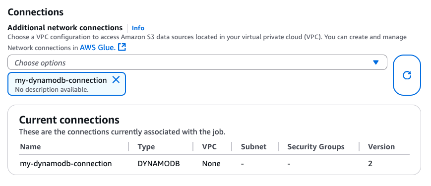

# DynamoDB connector with Spark DataFrame support

DynamoDB connector with Spark DataFrame support allows you to read from and write to tables in DynamoDB using Spark DataFrame APIs. The connector setup steps are the same as for DynamicFrame-based connector and can be found [here](aws-glue-programming-etl-connect-dynamodb-home.md#aws-glue-programming-etl-connect-dynamodb-configure "aws-glue-programming-etl-connect-dynamodb-home.md#aws-glue-programming-etl-connect-dynamodb-configure").

In order to load in the DataFrame-based connector library, make sure to attach a DynamoDB connection to the Glue job.

###### Note

Glue console UI currently does not support creating a DynamoDB connection. You can use Glue CLI
([CreateConnection](../../../cli/latest/reference/glue/create-connection.md "../../../cli/latest/reference/glue/create-connection.md")) to create a DynamoDB connection:

```

        aws glue create-connection \
            --connection-input '{ \
                "Name": "my-dynamodb-connection", \
                "ConnectionType": "DYNAMODB", \
                "ConnectionProperties": {}, \
                "ValidateCredentials": false, \
                "ValidateForComputeEnvironments": ["SPARK"] \
            }'

```

Upon creating the DynamoDB connection, you can attach it to your Glue job via CLI
([CreateJob](../../../cli/latest/reference/glue/create-job.md "../../../cli/latest/reference/glue/create-job.md"),
[UpdateJob](../../../cli/latest/reference/glue/update-job.md "../../../cli/latest/reference/glue/update-job.md")
) or directly in the "Job details" page:


Upon ensuring a connection with DYNAMODB Type is attached to your Glue job,
you can utilize the following read, write, and export operations from the DataFrame-based connector.

## Reading from and writing to DynamoDB with the DataFrame-based connector

The following code examples show how to read from and write to DynamoDB tables via the DataFrame-based connector. They demonstrate reading from one table and writing to another table.

Python

```
import sys
from pyspark.context import SparkContext
from awsglue.context import GlueContext
from awsglue.job import Job
from awsglue.utils import getResolvedOptions

args = getResolvedOptions(sys.argv, ["JOB_NAME"])
glue_context= GlueContext(SparkContext.getOrCreate())
spark = glueContext.spark_session
job = Job(glue_context)
job.init(args["JOB_NAME"], args)

# Read from DynamoDB
df = spark.read.format("dynamodb") \
    .option("dynamodb.input.tableName", "test-source") \
    .option("dynamodb.throughput.read.ratio", "0.5") \
    .option("dynamodb.consistentRead", "false") \
    .load()

print(df.rdd.getNumPartitions())

# Write to DynamoDB
df.write \
  .format("dynamodb") \
  .option("dynamodb.output.tableName", "test-sink") \
  .option("dynamodb.throughput.write.ratio", "0.5") \
  .option("dynamodb.item.size.check.enabled", "true") \
  .save()

job.commit()
```

Scala

```
import com.amazonaws.services.glue.GlueContext
import com.amazonaws.services.glue.util.GlueArgParser
import com.amazonaws.services.glue.util.Job
import org.apache.spark.SparkContext
import scala.collection.JavaConverters._

object GlueApp {
  def main(sysArgs: Array[String]): Unit = {

    val glueContext = new GlueContext(SparkContext.getOrCreate())
    val spark = glueContext.getSparkSession
    val args = GlueArgParser.getResolvedOptions(sysArgs, Seq("JOB_NAME").toArray)
    Job.init(args("JOB_NAME"), glueContext, args.asJava)

    val df = spark.read
      .format("dynamodb")
      .option("dynamodb.input.tableName", "test-source")
      .option("dynamodb.throughput.read.ratio", "0.5")
      .option("dynamodb.consistentRead", "false")
      .load()

    print(df.rdd.getNumPartitions)

    df.write
      .format("dynamodb")
      .option("dynamodb.output.tableName", "test-sink")
      .option("dynamodb.throughput.write.ratio", "0.5")
      .option("dynamodb.item.size.check.enabled", "true")
      .save()

    job.commit()
  }
}
```

## Using DynamoDB export via the DataFrame-based connector

The export operation is preffered to read operation for DynamoDB table sizes larger than 80 GB.
The following code examples show how to read from a table, export to S3, and print the number of partitions via the DataFrame-based connector.

###### Note

The DynamoDB export functionality is available through the Scala `DynamoDBExport` object.
Python users can access it via Spark's JVM interop or use the AWS SDK for Python (boto3) with the DynamoDB `ExportTableToPointInTime` API.

Scala

```
import com.amazonaws.services.glue.GlueContext
import com.amazonaws.services.glue.util.{GlueArgParser, Job}
import org.apache.spark.SparkContext
import glue.spark.dynamodb.DynamoDBExport
import scala.collection.JavaConverters._

object GlueApp {
  def main(sysArgs: Array[String]): Unit = {
    val glueContext = new GlueContext(SparkContext.getOrCreate())
    val spark = glueContext.getSparkSession
    val args = GlueArgParser.getResolvedOptions(sysArgs, Seq("JOB_NAME").toArray)
    Job.init(args("JOB_NAME"), glueContext, args.asJava)

    val options = Map(
      "dynamodb.export" -> "ddb",
      "dynamodb.tableArn" -> "arn:aws:dynamodb:us-east-1:123456789012:table/my-table",
      "dynamodb.s3.bucket" -> "my-s3-bucket",
      "dynamodb.s3.prefix" -> "my-s3-prefix",
      "dynamodb.simplifyDDBJson" -> "true"
    )
    val df = DynamoDBExport.fullExport(spark, options)

    print(df.rdd.getNumPartitions)
    df.count()

    Job.commit()
  }
}
```

## Configuration Options

### Read options

| Option                           | Description                                                                                                                                                                         | Default |
| -------------------------------- | ----------------------------------------------------------------------------------------------------------------------------------------------------------------------------------- | ------- |
| `dynamodb.input.tableName`       | DynamoDB table name (required)                                                                                                                                                      | -       |
| `dynamodb.throughput.read`       | The read capacity units (RCU) to use. If unspecified, `dynamodb.throughput.read.ratio` is used for calculation.                                                                     | -       |
| `dynamodb.throughput.read.ratio` | The ratio of read capacity units (RCU) to use                                                                                                                                       | 0.5     |
| `dynamodb.table.read.capacity`   | The read capacity of the on-demand table used for calculating the throughput. This parameter is effective only in on-demand capacity tables. Default to warm throughput read units. | -       |
| `dynamodb.splits`                | Defines how many segments used in parallel scan operations. If not provided, connector will calculate a reasonable default value.                                                   | -       |
| `dynamodb.consistentRead`        | Whether to use strongly consistent reads                                                                                                                                            | FALSE   |
| `dynamodb.input.retry`           | Defines how many retries we perform when there is a retryable exception.                                                                                                            | 10      |

### Write options

| Option                             | Description                                                                                                                                                                           | Default |
| ---------------------------------- | ------------------------------------------------------------------------------------------------------------------------------------------------------------------------------------- | ------- |
| `dynamodb.output.tableName`        | DynamoDB table name (required)                                                                                                                                                        | -       |
| `dynamodb.throughput.write`        | The write capacity units (WCU) to use. If unspecified, `dynamodb.throughput.write.ratio` is used for calculation.                                                                     | -       |
| `dynamodb.throughput.write.ratio`  | The ratio of write capacity units (WCU) to use                                                                                                                                        | 0.5     |
| `dynamodb.table.write.capacity`    | The write capacity of the on-demand table used for calculating the throughput. This parameter is effective only in on-demand capacity tables. Default to warm throughput write units. | -       |
| `dynamodb.item.size.check.enabled` | If true, the connector calculate the item size and abort if the size exceeds the maximum size, before writing to DynamoDB table.                                                      | TRUE    |
| `dynamodb.output.retry`            | Defines how many retries we perform when there is a retryable exception.                                                                                                              | 10      |

### Export options

| Option                      | Description                                                                                                                                                                                                                                                                                                                                                                                                                                                                                                     | Default |
| --------------------------- | --------------------------------------------------------------------------------------------------------------------------------------------------------------------------------------------------------------------------------------------------------------------------------------------------------------------------------------------------------------------------------------------------------------------------------------------------------------------------------------------------------------- | ------- |
| `dynamodb.export`           | If set to `ddb` enables the AWS Glue DynamoDB export connector where a new `ExportTableToPointInTimeRequet` will be invoked during the AWS Glue job. A new export will be generated with the location passed from `dynamodb.s3.bucket` and `dynamodb.s3.prefix`. If set to `s3` enables the AWS Glue DynamoDB export connector but skips the creation of a new DynamoDB export and instead uses the `dynamodb.s3.bucket` and `dynamodb.s3.prefix` as the Amazon S3 location of the past exported of that table. | `ddb`   |
| `dynamodb.tableArn`         | The DynamoDB table to read from. Required if `dynamodb.export` is set to `ddb`.                                                                                                                                                                                                                                                                                                                                                                                                                                 |         |
| `dynamodb.simplifyDDBJson`  | If set to `true`, performs a transformation to simplify the schema of the DynamoDB JSON structure that is present in exports.                                                                                                                                                                                                                                                                                                                                                                                   | FALSE   |
| `dynamodb.s3.bucket`        | The S3 bucket to store temporary data during DynamoDB export (required)                                                                                                                                                                                                                                                                                                                                                                                                                                         |         |
| `dynamodb.s3.prefix`        | The S3 prefix to store temporary data during DynamoDB export                                                                                                                                                                                                                                                                                                                                                                                                                                                    |         |
| `dynamodb.s3.bucketOwner`   | Indicate the bucket owner needed for cross-account Amazon S3 access                                                                                                                                                                                                                                                                                                                                                                                                                                             |         |
| `dynamodb.s3.sse.algorithm` | Type of encryption used on the bucket where temporary data will be stored. Valid values are `AES256` and `KMS`.                                                                                                                                                                                                                                                                                                                                                                                                 |         |
| `dynamodb.s3.sse.kmsKeyId`  | The ID of the AWS KMS managed key used to encrypt the S3 bucket where temporary data will be stored (if applicable).                                                                                                                                                                                                                                                                                                                                                                                            |         |
| `dynamodb.exportTime`       | A point-in-time at which the export should be made. Valid values: strings representing ISO-8601 instants.                                                                                                                                                                                                                                                                                                                                                                                                       |         |

### General options

| Option                         | Description                                                  | Default                     |
| ------------------------------ | ------------------------------------------------------------ | --------------------------- |
| `dynamodb.sts.roleArn`         | The IAM role ARN to be assumed for cross-account access      | -                           |
| `dynamodb.sts.roleSessionName` | STS session name                                             | `glue-dynamodb-sts-session` |
| `dynamodb.sts.region`          | Region for the STS client (for cross-region role assumption) | Same as `region` option     |
