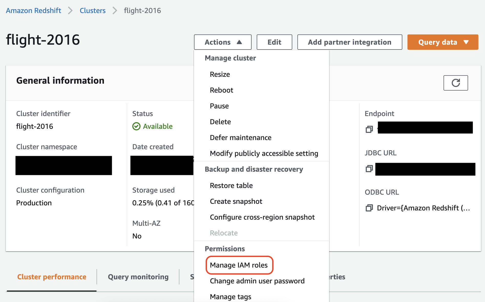
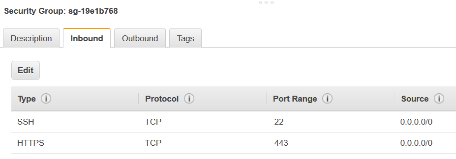

# Redshift connections

You can use AWS Glue for Spark to read from and write to tables in Amazon Redshift databases. When connecting to Amazon Redshift
databases, AWS Glue moves data through Amazon S3 to achieve maximum throughput, using the Amazon Redshift SQL `COPY` and
`UNLOAD` commands. In AWS Glue 4.0 and later, you can use the [Amazon Redshift integration for
Apache Spark](../../../redshift/latest/mgmt/spark-redshift-connector.md "../../../redshift/latest/mgmt/spark-redshift-connector.md") to read and write with optimizations and features specific to Amazon Redshift beyond those available
when connecting through previous versions.

Learn about how AWS Glue is making it easier than ever for Amazon Redshift users to migrate to AWS Glue for serverless data integration and ETL.

## Configuring Redshift connections

To use Amazon Redshift clusters in AWS Glue, you will need some prerequisites:

- An Amazon S3 directory to use for temporary storage when reading from and writing to the database.
- An Amazon VPC enabling communication between your Amazon Redshift cluster, your AWS Glue job and your Amazon S3
  directory.
- Appropriate IAM permissions on the AWS Glue job and Amazon Redshift cluster.

### Configuring IAM roles

###### Set up the role for the Amazon Redshift cluster

Your Amazon Redshift cluster needs to be able to read and write to Amazon S3 in order to integrate with AWS Glue jobs.
To allow this, you can associate IAM roles with the Amazon Redshift cluster you want to connect to.
Your role should have a policy allowing read from and write to your Amazon S3 temporary directory. Your role should have
a trust relationship allowing the `redshift.amazonaws.com` service to `AssumeRole`.

###### To associate an IAM role with Amazon Redshift

1. **Prerequisites:** An Amazon S3 bucket or directory used for the temporary storage of files.
2. Identify which Amazon S3 permissions your Amazon Redshift cluster will need. When moving data to and from an Amazon Redshift
   cluster, AWS Glue jobs issue COPY and UNLOAD statements against Amazon Redshift. If your job modifies a
   table in Amazon Redshift, AWS Glue will also issue CREATE LIBRARY statements. For information on
   specific Amazon S3 permissions required for Amazon Redshift to execute these statements, refer to the Amazon Redshift
   documentation: [Amazon Redshift: Permissions to
   access other AWS Resources](../../../redshift/latest/dg/copy-usage_notes-access-permissions.md "../../../redshift/latest/dg/copy-usage_notes-access-permissions.md").
3. In the IAM console, create an IAM policy with the necessary permissions. For more information about creating a policy
   [Creating IAM policies](../../../IAM/latest/UserGuide/access_policies_create.md "../../../IAM/latest/UserGuide/access_policies_create.md").
4. In the IAM console, create a role and trust relationship allowing Amazon Redshift to assume the role. Follow the instructions
   in the IAM documentation [To create a role for an AWS service (console)](../../../IAM/latest/UserGuide/id_roles_create_for-service.md#roles-creatingrole-service-console "../../../IAM/latest/UserGuide/id_roles_create_for-service.md#roles-creatingrole-service-console")
   - When asked to choose an AWS service use case, choose "Redshift - Customizable".
   - When asked to attach a policy, choose the policy you previously defined.

###### Note

For more information about configuring roles for Amazon Redshift, see [Authorizing Amazon Redshift to access other AWS services on your behalf](../../../redshift/latest/mgmt/authorizing-redshift-service.md "../../../redshift/latest/mgmt/authorizing-redshift-service.md") in the Amazon Redshift documentation. 5. In the Amazon Redshift console, associate the role with your Amazon Redshift cluster. Follow the instructions
in [the Amazon Redshift documentation](../../../redshift/latest/mgmt/copy-unload-iam-role.md "../../../redshift/latest/mgmt/copy-unload-iam-role.md").

Select the highlighted option in the Amazon Redshift console to configure this setting:

###### Note

By default, AWS Glue jobs pass Amazon Redshift temporary credentials that are created using the role that you specified to run
the job. We do not recommend using these credentials. For security purposes, these credentials expire after 1 hour.

###### Set up the role for the AWS Glue job

The AWS Glue job needs a role to access the Amazon S3 bucket. You do not need IAM permissions for
the Amazon Redshift cluster, your access is controlled by connectivity in Amazon VPC and your database credentials.

### Set up Amazon VPC

###### To set up access for Amazon Redshift data stores

1. Sign in to the AWS Management Console and open the Amazon Redshift console at
   [https://console.aws.amazon.com/redshiftv2/](https://console.aws.amazon.com/redshiftv2/ "https://console.aws.amazon.com/redshiftv2/").
2. In the left navigation pane, choose **Clusters**.
3. Choose the cluster name that you want to access from AWS Glue.
4. In the **Cluster Properties** section, choose a security group in
   **VPC security groups** to allow AWS Glue to use. Record the
   name of the security group that you chose for future reference. Choosing the security group
   opens the Amazon EC2 console **Security Groups** list.
5. Choose the security group to modify and navigate to the **Inbound**
   tab.
6. Add a self-referencing rule to allow AWS Glue components to communicate.
   Specifically, add or confirm that there is a rule of **Type** `All
TCP`, **Protocol** is `TCP`, **Port
   Range** includes all ports, and whose **Source** is the same
   security group name as the **Group ID**.

The inbound rule looks similar to the following:

| Type                         | Protocol | Port range | Source                                                                                                                                                                                                                                                                                                                                                                                                                                                                                                                                                      |
| ---------------------------- | -------- | ---------- | ----------------------------------------------------------------------------------------------------------------------------------------------------------------------------------------------------------------------------------------------------------------------------------------------------------------------------------------------------------------------------------------------------------------------------------------------------------------------------------------------------------------------------------------------------------- | ---------------------------------------------------------------------------------------------------------------------------------------------------------------------------------------------------------------------------------------------------------------------------------------------------------------------------------------------------------------------------------------------------------------------------------------------------------------------------------------------------------------------------------------------------------------------------------------------------------------------------------------------------------------------------------------------------------------------------------------------------------------------------------------------------------------------------------------------------------------------------------------------------------------------------------------------------------------------------------------------------------------------------------------------------------------------------------------------------------------------------------------------------------------------------------------------------------------------------------------------------------------------------------------------------------------------------------------------------------------------------------------------------------------------------------------------------------------------------------------------------------------------------------------------------------------------------------------------------------------------------------------------------------------------------------------------------------------------------------------------------------------------------------------------------------------------------------------------------------------------------------------------------------------------------------------------------------------------------------------------------------------------------------------------------------------------------------------------------------------------------------------------------------------------------------------------------------------------------------------------------------------------------------------------------------------------------------------------------------------------------------------------------------------------------------------------------------------------------------------------------------------------------------------------------------------------------------------------------------------------------------------------------------------------------------------------------------------------------------------------------------------------------------------------------------------------------------------------------------------------------------------------------------------------------------------------------------------------------------------------------------------------------------------------------------------------------------------------------------------------------------------------------------------------------------------------------------------------------------------------------------------------------------------------------------------------------------------------------------------------------------------------------------------------------------------------------------------------------------------------------------------------------------------------------------------------------------------------------------------------------------------------------------------------------------------------------------------------------------------------------------------------------------------------------------------------------------------------------------------------------------------------------------------------------------------------------------------------------------------------------------------------------------------------------------------------------------------------------------------------------------------------------------------------------------------------------------------------------------------------------------------------------------------------------------------------------------------------------------------------------------------------------------------------------------------------------------------------------------------------------------------------------------------------------------------------------------------------------------------------------------------------------------------------------------------------------------------------------------------------------------------------------------------------------------------------------------------------------------------------------------------------------------------------------------------------------------------------------------------------------------------------------------------------------------------------------------------------------------------------------------------------------------------------------------------------------------------------------------------------------------------------------------------------------------------------------------------------------------------------------------------------------------------------------------------------------------------------------------------------------------------------------------------------------------------------------------------------------------------------------------------------------------------------------------------------------------------------------------------------------------------------------------------------------------------------------------------------------------------------------------------------------------------------------------------------------------------------------------------------------------------------------------------------------------------------------------------------------------------------------------------------------------------------------------------------------------------------------------------------------------------------------------------------------------------------------------------------------------------------------------------------------------------------------------------------------------------------------------------------------------------------------------------------------------------------------------------------------------------------------------------------------------------------------------------------------------------------------------------------------------------------------------------------------------------------------------------------------------------------------------------------------------------------------------------------------------------------------------------------------------------------------------------------------------------------------------------------------------------------------------------------------------------------------------------------------------------------------------------------------------------------------------------------------------------------------------------------------------------------------------------------------------------------------------------------------------------------------------------------------------------------------------------------------------------------------------------------------------------------------------------------------------------------------------------------------------------------------------------------------------------------------------------------------------------------------------------------------------------------------------------------------------------------------------------------------------------------------------------------------------------------------------------------------------------------------------------------------------------------------------------------------------------------------------------------------------------------------------------------------------------------------------------------------------------------------------------------------------------------------------------------------------------------------------------------------------------------------------------------------------------------------------------------------------------------------------------------------------------------------------------------------------------------------------------------------------------------------------------------------------------------------------------------------------------------------------------------------------------------------------------------------------------------------------------------------------------------------------------------------------------------------------------------------------------------------------------------------------------------------------------- |
| All TCP                      | TCP      | 0–65535    | _database-security-group_                                                                                                                                                                                                                                                                                                                                                                                                                                                                                                                                   | For example:  7. Add a rule for outbound traffic also. Either open outbound traffic to all ports, for example:                                                                                                                                                                                                                                                                                                                                                                                                                                                                                                                                                                                                                                                                                                                                                                                                                                                                                                                                                                                                                                                                                                                                                                                                                                                                                                                                                                                                                                                                                                                                                                                                                                                                                                                                                                                                                                                                                                                                                                                                                                                                                                                                                                                                                                                                                                                                                                                                                                                                                                                                                                                                                                                                                                                                                                                                                                                                                                                                                                                                                                                                                                                                                                                                                                                                                                                                                                                                                                                                                                                                                                                                                                                                                                                                                                                                                                                                                                                                                                                                                                                                                                                                                                                                                                                                                                                                                                                                                                                                                                                                                                                                                                                                                                                                                                                                                                                                                                                                                                                                                                                                                                                                                                                                                                                                                                                                                                                                                                                                                                                                                                                                                                                                                                                                                                                                                                                                                                                                                                                                                                                                                                                                                                                                                                                                                                                                                                                                                                                                                                                                                                                                                                                                                                                                                                                                                                                                                                                                                                                                                                                                                                                                                                                                                                                                                                                                                                                                                                                                                                                                                                                                                                                                                                                                                                                                                                                                                                                                                                                                                                                                                                                                                                                                                                                                                                                                                                                                                                                                                                                                                                                                                                                                                                                                                                                                                                                                                                                                     |
| Type                         | Protocol | Port range | Destination                                                                                                                                                                                                                                                                                                                                                                                                                                                                                                                                                 |
| ---                          | ---      | ---        | ---                                                                                                                                                                                                                                                                                                                                                                                                                                                                                                                                                         |
| All Traffic                  | ALL      | ALL        | 0.0.0.0/0                                                                                                                                                                                                                                                                                                                                                                                                                                                                                                                                                   | Or create a self-referencing rule where **Type** `All TCP`, **Protocol** is `TCP`, **Port Range** includes all ports, and whose **Destination** is the same security group name as the **Group ID**. If using an Amazon S3 VPC endpoint, also add an HTTPS rule for Amazon S3 access. The `s3-prefix-list-id` is required in the security group rule to allow traffic from the VPC to the Amazon S3 VPC endpoint. For example:                                                                                                                                                                                                                                                                                                                                                                                                                                                                                                                                                                                                                                                                                                                                                                                                                                                                                                                                                                                                                                                                                                                                                                                                                                                                                                                                                                                                                                                                                                                                                                                                                                                                                                                                                                                                                                                                                                                                                                                                                                                                                                                                                                                                                                                                                                                                                                                                                                                                                                                                                                                                                                                                                                                                                                                                                                                                                                                                                                                                                                                                                                                                                                                                                                                                                                                                                                                                                                                                                                                                                                                                                                                                                                                                                                                                                                                                                                                                                                                                                                                                                                                                                                                                                                                                                                                                                                                                                                                                                                                                                                                                                                                                                                                                                                                                                                                                                                                                                                                                                                                                                                                                                                                                                                                                                                                                                                                                                                                                                                                                                                                                                                                                                                                                                                                                                                                                                                                                                                                                                                                                                                                                                                                                                                                                                                                                                                                                                                                                                                                                                                                                                                                                                                                                                                                                                                                                                                                                                                                                                                                                                                                                                                                                                                                                                                                                                                                                                                                                                                                                                                                                                                                                                                                                                                                                                                                                                                                                                                                                                                                                                                                                                                                                                                                                                                                                                                                                                                                                                                                                                                                                                                                                                                           |
| Type                         | Protocol | Port range | Destination                                                                                                                                                                                                                                                                                                                                                                                                                                                                                                                                                 |
| ---                          | ---      | ---        | ---                                                                                                                                                                                                                                                                                                                                                                                                                                                                                                                                                         |
| All TCP                      | TCP      | 0–65535    | `security-group`                                                                                                                                                                                                                                                                                                                                                                                                                                                                                                                                            |
| HTTPS                        | TCP      | 443        | `s3-prefix-list-id`                                                                                                                                                                                                                                                                                                                                                                                                                                                                                                                                         | ### Set up AWS Glue You will need to create an AWS Glue Data Catalog connection that provides Amazon VPC connection information. ###### To configure Amazon Redshift Amazon VPC connectivity to AWS Glue in the console 1. Create a Data Catalog connection by following the steps in: [Adding an AWS Glue connection](console-connections.md "console-connections.md"). After creating the connection, keep the connection name, `connectionName`, for the next step.  • When selecting a **Connection type**, select **Amazon Redshift**.  • When selecting a **Redshift cluster**, select your cluster by name.  • Provide default connection information for a Amazon Redshift user on your cluster.  • Your Amazon VPC settings will be automatically configured. ###### Note You will need to manually provide `PhysicalConnectionRequirements` for your Amazon VPC when creating an **Amazon Redshift** connection through the AWS SDK. 2. In your AWS Glue job configuration, provide `connectionName` as an **Additional network connection**. ## Example: Reading from Amazon Redshift tables You can read from Amazon Redshift clusters and Amazon Redshift serverless environments. **Prerequisites:** An Amazon Redshift table you would like to read from. Follow the steps in the previous section [Configuring Redshift connections](#aws-glue-programming-etl-connect-redshift-configure "#aws-glue-programming-etl-connect-redshift-configure") after which you should have the Amazon S3 URI for a temporary directory, `temp-s3-dir` and an IAM role, `rs-role-name`, (in account `role-account-id`). Using the Data Catalog **Additional Prerequisites:** A Data Catalog Database and Table for the Amazon Redshift table you would like to read from. For more information about Data Catalog, see [Data discovery and cataloging in AWS Glue](catalog-and-crawler.md "catalog-and-crawler.md"). After creating a entry for your Amazon Redshift table you will identify your connection with a `redshift-dc-database-name` and `redshift-table-name`. **Configuration:** In your function options you will identify your Data Catalog Table with the `database` and `table_name` parameters. You will identify your Amazon S3 temporary directory with `redshift_tmp_dir`. You will also provide `rs-role-name` using the `aws_iam_role` key in the `additional_options` parameter. ``glueContext.create_dynamic_frame.from_catalog( database = "`redshift-dc-database-name`", table_name = "`redshift-table-name`", redshift_tmp_dir = args["`temp-s3-dir`"], additional_options = {"aws_iam_role": "arn:aws:iam::`role-account-id`:role/`rs-role-name`"})`` Connecting directly **Additional Prerequisites:**You will need the name of your Amazon Redshift table (`redshift-table-name`. You will need the JDBC connection information for the Amazon Redshift cluster storing that table. You will supply your connection information with `host`, `port`, `redshift-database-name`, `username` and `password`. You can retrieve your connection information from the Amazon Redshift console when working with Amazon Redshift clusters. When using Amazon Redshift serverless, consult [Connecting to Amazon Redshift Serverless](../../../redshift/latest/mgmt/serverless-connecting.md "../../../redshift/latest/mgmt/serverless-connecting.md") in the Amazon Redshift documentation. **Configuration:** In your function options you will identify your connection parameters with `url`, `dbtable`, `user` and `password`. You will identify your Amazon S3 temporary directory with `redshift_tmp_dir`. You can specify your IAM role using `aws_iam_role` when you use `from_options`. The syntax is similar to connecting through the Data Catalog, but you put the parameters in the `connection_options` map. It is bad practice to hardcode passwords into AWS Glue scripts. Consider storing your passwords in AWS Secrets Manager and retrieving them in your script with SDK for Python (Boto3). ``my_conn_options = { "url": "jdbc:redshift://`host`:`port`/`redshift-database-name`", "dbtable": "`redshift-table-name`", "user": "`username`", "password": "`password`", "redshiftTmpDir": args["`temp-s3-dir`"], "aws_iam_role": "arn:aws:iam::`account id`:role/`rs-role-name`" } df = glueContext.create_dynamic_frame.from_options("redshift", my_conn_options)`` ## Example: Writing to Amazon Redshift tables You can write to Amazon Redshift clusters and Amazon Redshift serverless environments. **Prerequisites:** An Amazon Redshift cluster and follow the steps in the previous section [Configuring Redshift connections](#aws-glue-programming-etl-connect-redshift-configure "#aws-glue-programming-etl-connect-redshift-configure") after which you should have the Amazon S3 URI for a temporary directory, `temp-s3-dir` and an IAM role, `rs-role-name`, (in account `role-account-id`). You will also need a `DynamicFrame` whose contents you would like to write to the database. Using the Data Catalog **Additional Prerequisites** A Data Catalog Database for the Amazon Redshift cluster and table you would like to write to. For more information about Data Catalog, see [Data discovery and cataloging in AWS Glue](catalog-and-crawler.md "catalog-and-crawler.md"). You will identify your connection with `redshift-dc-database-name` and the target table with `redshift-table-name`. **Configuration:** In your function options you will identify your Data Catalog Database with the `database` parameter, then provide table with `table_name`. You will identify your Amazon S3 temporary directory with `redshift_tmp_dir`. You will also provide `rs-role-name` using the `aws_iam_role` key in the `additional_options` parameter. ``glueContext.write_dynamic_frame.from_catalog( frame = `input dynamic frame`, database = "`redshift-dc-database-name`", table_name = "`redshift-table-name`", redshift_tmp_dir = args["`temp-s3-dir`"], additional_options = {"aws_iam_role": "arn:aws:iam::`account-id`:role/`rs-role-name`"})`` Connecting through a AWS Glue connection You can connect to Amazon Redshift directly using the `write_dynamic_frame.from_options` method. However, rather than insert your connection details directly into your script, you can reference connection details stored in a Data Catalog connection with the `from_jdbc_conf` method. You can do this without crawling or creating Data Catalog tables for your database. For more information about Data Catalog connections, see [Connecting to data](glue-connections.md "glue-connections.md"). **Additional Prerequisites:** A Data Catalog connection for your database, a Amazon Redshift table you would like to read from **Configuration:** you will identify your Data Catalog connection with `dc-connection-name`. You will identify your Amazon Redshift database and table with `redshift-table-name` and `redshift-database-name`. You will provide your Data Catalog connection information with `catalog_connection` and your Amazon Redshift information with `dbtable` and `database`. The syntax is similar to connecting through the Data Catalog, but you put the parameters in the `connection_options` map. ``my_conn_options = { "dbtable": "`redshift-table-name`", "database": "`redshift-database-name`", "aws_iam_role": "arn:aws:iam::`role-account-id`:role/`rs-role-name`" } glueContext.write_dynamic_frame.from_jdbc_conf( frame = `input dynamic frame`, catalog_connection = "`dc-connection-name`", connection_options = my_conn_options, redshift_tmp_dir = args["`temp-s3-dir`"])`` ## Amazon Redshift connection option reference The basic connection options used for all AWS Glue JDBC connections to set up information like `url`, `user` and `password` are consistent across all JDBC types. For more information about standard JDBC parameters, see [JDBC connection option reference](aws-glue-programming-etl-connect-jdbc-home.md#aws-glue-programming-etl-connect-jdbc "aws-glue-programming-etl-connect-jdbc-home.md#aws-glue-programming-etl-connect-jdbc"). The Amazon Redshift connection type takes some additional connection options:  • `"redshiftTmpDir"`: (Required) The Amazon S3 path where temporary data can be staged when copying out of the database.  • `"aws_iam_role"`: (Optional) ARN for an IAM role. The AWS Glue job will pass this role to the Amazon Redshift cluster to grant the cluster permissions needed to complete instructions from the job. ### Additional connection options available in AWS Glue 4.0+ You can also pass options for the new Amazon Redshift connector through AWS Glue connection options. For a complete list of supported connector options, see the _Spark SQL parameters_ section in [Amazon Redshift integration for Apache Spark](../../../redshift/latest/mgmt/spark-redshift-connector.md "../../../redshift/latest/mgmt/spark-redshift-connector.md"). For you convenience, we reiterate certain new options here: |
| Name                         | Required | Default    | Description                                                                                                                                                                                                                                                                                                                                                                                                                                                                                                                                                 |
| ---                          | ---      | ---        | ---                                                                                                                                                                                                                                                                                                                                                                                                                                                                                                                                                         |
| autopushdown                 | No       | TRUE       | Applies predicate and query pushdown by capturing and analyzing the Spark logical plans for SQL operations. The operations are translated into a SQL query, and then run in Amazon Redshift to improve performance.                                                                                                                                                                                                                                                                                                                                         |
| autopushdown.s3_result_cache | No       | FALSE      | Caches the SQL query to unload data for Amazon S3 path mapping in memory so that the same query doesn't need to run again in the same Spark session. Only supported when `autopushdown` is enabled.                                                                                                                                                                                                                                                                                                                                                         |
| unload_s3_format             | No       | PARQUET    | PARQUET - Unloads the query results in Parquet format. TEXT - Unloads the query results in pipe-delimited text format.                                                                                                                                                                                                                                                                                                                                                                                                                                      |
| sse_kms_key                  | No       | N/A        | The AWS SSE-KMS key to use for encryption during `UNLOAD` operations instead of the default encryption for AWS.                                                                                                                                                                                                                                                                                                                                                                                                                                             |
| extracopyoptions             | No       | N/A        | A list of extra options to append to the Amazon Redshift `COPY`command when loading data, such as `TRUNCATECOLUMNS` or `MAXERROR n` (for other options see [COPY: Optional parameters](../../../redshift/latest/dg/r_COPY.md#r_COPY-syntax-overview-optional-parameters "../../../redshift/latest/dg/r_COPY.md#r_COPY-syntax-overview-optional-parameters")). Note that because these options are appended to the end of the `COPY` command, only options that make sense at the end of the command can be used. That should cover most possible use cases. |
| csvnullstring (experimental) | No       | NULL       | The String value to write for nulls when using the CSV `tempformat`. This should be a value that doesn't appear in your actual data.                                                                                                                                                                                                                                                                                                                                                                                                                        | These new parameters can be used in the following ways. ###### New options for performance improvement The new connector introduces some new performance improvement options:  • `autopushdown`: Enabled by default.  • `autopushdown.s3_result_cache`: Disabled by default.  • `unload_s3_format`: `PARQUET` by default. For information about using these options, see [Amazon Redshift integration for Apache Spark](../../../redshift/latest/mgmt/spark-redshift-connector.md "../../../redshift/latest/mgmt/spark-redshift-connector.md"). We recommend that you don't turn on `autopushdown.s3_result_cache` when you have mixed read and write operations because the cached results might contain stale information. The option `unload_s3_format` is set to `PARQUET` by default for the `UNLOAD` command, to improve performance and reduce storage cost. To use the `UNLOAD` command default behavior, reset the option to `TEXT`. ###### New encryption option for reading By default, the data in the temporary folder that AWS Glue uses when it reads data from the Amazon Redshift table is encrypted using `SSE-S3` encryption. To use customer managed keys from AWS Key Management Service (AWS KMS) to encrypt your data, you can set up `("sse_kms_key" → kmsKey)` where ksmKey is the [key ID from AWS KMS](../../../kms/latest/developerguide/find-cmk-id-arn.md "../../../kms/latest/developerguide/find-cmk-id-arn.md"), instead of the legacy setting option `("extraunloadoptions" → s"ENCRYPTED KMS_KEY_ID '$kmsKey'")` in AWS Glue version 3.0. ``datasource0 = glueContext.create_dynamic_frame.from_catalog( database = "`database-name`", table_name = "`table-name`", redshift_tmp_dir = args["TempDir"], additional_options = {"sse_kms_key":"<`KMS_KEY_ID`>"}, transformation_ctx = "datasource0" )`` ###### Support IAM-based JDBC URL The new connector supports an IAM-based JDBC URL so you don't need to pass in a user/password or secret. With an IAM-based JDBC URL, the connector uses the job runtime role to access to the Amazon Redshift data source. Step 1: Attach the following minimal required policy to your AWS Glue job runtime role. JSON `` `{ "Version":"2012-10-17", "Statement": [ { "Sid": "VisualEditor0", "Effect": "Allow", "Action": "redshift:GetClusterCredentials", "Resource": [ "arn:aws:redshift:`us-east-1`:`111122223333`:dbgroup:<cluster name>/*", "arn:aws:redshift:*:`111122223333`:dbuser:*/*", "arn:aws:redshift:`us-east-1`:`111122223333`:dbname:<cluster name>/<database name>" ] }, { "Sid": "VisualEditor1", "Effect": "Allow", "Action": "redshift:DescribeClusters", "Resource": "*" } ] }` `` Step 2: Use the IAM-based JDBC URL as follows. Specify a new option `DbUser` with the Amazon Redshift user name that you're connecting with. ``conn_options = { // IAM-based JDBC URL "url": "jdbc:redshift:iam://`<cluster name>`:<region>/<database name>", "dbtable": dbtable, "redshiftTmpDir": redshiftTmpDir, "aws_iam_role": aws_iam_role, "DbUser": "<Redshift User name>" // required for IAM-based JDBC URL } redshift_write = glueContext.write_dynamic_frame.from_options( frame=dyf, connection_type="redshift", connection_options=conn_options ) redshift_read = glueContext.create_dynamic_frame.from_options( connection_type="redshift", connection_options=conn_options )`` ###### Note A `DynamicFrame` currently only supports an IAM-based JDBC URL with a `DbUser` in the `GlueContext.create_dynamic_frame.from_options` workflow. ## Migrating from AWS Glue version 3.0 to version 4.0 In AWS Glue 4.0, ETL jobs have access to a new Amazon Redshift Spark connector and a new JDBC driver with different options and configuration. The new Amazon Redshift connector and driver are written with performance in mind, and keep transactional consistency of your data. These products are documented in the Amazon Redshift documentation. For more information, see:  • [Amazon Redshift integration for Apache Spark](../../../redshift/latest/mgmt/spark-redshift-connector.md "../../../redshift/latest/mgmt/spark-redshift-connector.md")  • [Amazon Redshift JDBC driver, version 2.1](../../../redshift/latest/mgmt/jdbc20-download-driver.md "../../../redshift/latest/mgmt/jdbc20-download-driver.md") ###### Table/column names and identifiers restriction The new Amazon Redshift Spark connector and driver have a more restricted requirement for the Redshift table name. For more information, see [Names and identifiers](../../../redshift/latest/dg/r_names.md "../../../redshift/latest/dg/r_names.md") to define your Amazon Redshift table name. The job bookmark workflow might not work with a table name that doesn't match the rules and with certain characters, such as a space. If you have legacy tables with names that don't conform to the [Names and identifiers](../../../redshift/latest/dg/r_names.md "../../../redshift/latest/dg/r_names.md") rules and see issues with bookmarks (jobs reprocessing old Amazon Redshift table data), we recommend that you rename your table names. For more information, see [ALTER TABLE examples](../../../redshift/latest/dg/r_ALTER_TABLE_examples_basic.md "../../../redshift/latest/dg/r_ALTER_TABLE_examples_basic.md"). ###### Default tempformat change in Dataframe The AWS Glue version 3.0 Spark connector defaults the `tempformat` to CSV while writing to Amazon Redshift. To be consistent, in AWS Glue version 3.0, the `DynamicFrame` still defaults the `tempformat` to use `CSV`. If you've previously used Spark Dataframe APIs directly with the Amazon Redshift Spark connector, you can explicitly set the `tempformat` to CSV in the `DataframeReader` /`Writer` options. Otherwise, `tempformat` defaults to `AVRO` in the new Spark connector. ###### Behavior change: map Amazon Redshift data type REAL to Spark data type FLOAT instead of DOUBLE In AWS Glue version 3.0, Amazon Redshift `REAL` is converted to a Spark `DOUBLE` type. The new Amazon Redshift Spark connector has updated the behavior so that the Amazon Redshift `REAL` type is converted to, and back from, the Spark `FLOAT` type. If you have a legacy use case where you still want the Amazon Redshift `REAL` type to be mapped to a Spark `DOUBLE` type, you can use the following workaround:  • For a `DynamicFrame`, map the `Float` type to a `Double` type with `DynamicFrame.ApplyMapping`. For a `Dataframe`, you need to use `cast`. Code example: `dyf_cast = dyf.apply_mapping([('a', 'long', 'a', 'long'), ('b', 'float', 'b', 'double')])` ###### Handling VARBYTE Data Type When working with AWS Glue 3.0 and Amazon Redshift data types, AWS Glue 3.0 converts Amazon Redshift `VARBYTE` to Spark `STRING` type. However, the latest Amazon Redshift Spark connector doesn't support the `VARBYTE` data type. To work around this limitation, you can [create a Redshift view](../../../redshift/latest/dg/r_CREATE_VIEW.md "../../../redshift/latest/dg/r_CREATE_VIEW.md") that transforms `VARBYTE` columns to a supported data type. Then, use the new connector to load data from this view instead of the original table, which ensures compatibility while maintaining access to your `VARBYTE` data. Example for Redshift query: `` CREATE VIEW `view_name` AS SELECT FROM_VARBYTE(`varbyte_column`, 'hex') FROM `table_name` ``                                                                                                                                                                                                                                                                                                                                                                                                                                                                                                                                                                                                                                                                                                                                                                                                                                                                                                                                                                                                                                                                                                                                                                                                                                                                                                                                                                                                                                                                                                                                                                                                                                                            |
