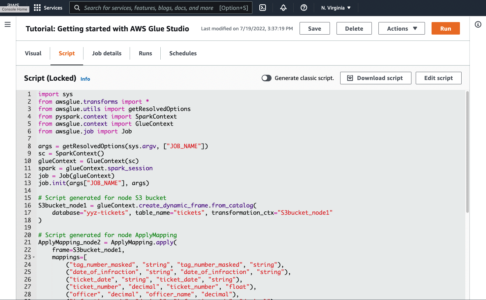

# Tutorial: Writing an AWS Glue for Spark script

This tutorial introduces you to the process of writing AWS Glue scripts. You can run scripts on a schedule with
jobs, or interactively with interactive sessions. For more information about jobs, see [Building visual ETL jobs](author-job-glue.md "author-job-glue.md"). For more information about interactive sessions, see [Overview of AWS Glue interactive sessions](interactive-sessions-chapter.md#interactive-sessions-overview "interactive-sessions-chapter.md#interactive-sessions-overview").

The AWS Glue Studio visual editor offers a graphical, no-code interface for building AWS Glue jobs. AWS Glue scripts back
visual jobs. They give you access to the expanded set of tools available to work with Apache Spark programs. You
can access native Spark APIs, as well as AWS Glue libraries that facilitate extract, transform, and load (ETL)
workflows from within an AWS Glue script.

In this tutorial, you extract, transform, and load a dataset of parking tickets. The script that does this
work is identical in form and function to the one generated in [Making ETL easier with
AWS Glue Studio](https://aws.amazon.com/blogs/big-data/making-etl-easier-with-aws-glue-studio/ "https://aws.amazon.com/blogs/big-data/making-etl-easier-with-aws-glue-studio/") on the AWS Big Data Blog, which introduces the AWS Glue Studio visual editor. By running this script in
a job, you can compare it to visual jobs and see how AWS Glue ETL scripts work. This prepares you to use additional
functionalities that aren't yet available in visual jobs.

You use the Python language and libraries in this tutorial. Similar functionality is available in Scala. After
going through this tutorial, you should be able to generate and inspect a sample Scala script to understand how
to perform the Scala AWS Glue ETL script writing process.

## Prerequisites

This tutorial has the following prerequisites:

- The same prerequisites as the AWS Glue Studio blog post, which instructs you to run a CloudFormation template.

This template uses the AWS Glue Data Catalog to manage the parking ticket dataset available in `s3://aws-bigdata-blog/artifacts/gluestudio/`.
It creates the following resources which will be referenced:

- **AWS Glue StudioRole** – IAM role to run AWS Gluejobs
- **AWS Glue StudioAmazon S3Bucket** – Name of the Amazon S3 bucket to store blog-related files
- **AWS Glue StudioTicketsYYZDB** – AWS Glue Data Catalog database
- **AWS Glue StudioTableTickets** – Data Catalog table to use as a source
- **AWS Glue StudioTableTrials** – Data Catalog table to use as a source
- **AWS Glue StudioParkingTicketCount** – Data Catalog table to use as the destination
- The script generated in the AWS Glue Studio blog post. If the blog post changes, the script is also available in the following text.

### Generate a sample script

You can use the AWS Glue Studio visual editor as a powerful code generation tool to create a scaffold for the
script you want to write. You will use this tool to create a sample script.

If you want to skip these steps, the script is provided.

```
import sys
from awsglue.transforms import *
from awsglue.utils import getResolvedOptions
from pyspark.context import SparkContext
from awsglue.context import GlueContext
from awsglue.job import Job

args = getResolvedOptions(sys.argv, ["JOB_NAME"])
sc = SparkContext()
glueContext = GlueContext(sc)
spark = glueContext.spark_session
job = Job(glueContext)
job.init(args["JOB_NAME"], args)

# Script generated for node S3 bucket
S3bucket_node1 = glueContext.create_dynamic_frame.from_catalog(
    database="yyz-tickets", table_name="tickets", transformation_ctx="S3bucket_node1"
)

# Script generated for node ApplyMapping
ApplyMapping_node2 = ApplyMapping.apply(
    frame=S3bucket_node1,
    mappings=[
        ("tag_number_masked", "string", "tag_number_masked", "string"),
        ("date_of_infraction", "string", "date_of_infraction", "string"),
        ("ticket_date", "string", "ticket_date", "string"),
        ("ticket_number", "decimal", "ticket_number", "float"),
        ("officer", "decimal", "officer_name", "decimal"),
        ("infraction_code", "decimal", "infraction_code", "decimal"),
        ("infraction_description", "string", "infraction_description", "string"),
        ("set_fine_amount", "decimal", "set_fine_amount", "float"),
        ("time_of_infraction", "decimal", "time_of_infraction", "decimal"),
    ],
    transformation_ctx="ApplyMapping_node2",
)

# Script generated for node S3 bucket
S3bucket_node3 = glueContext.write_dynamic_frame.from_options(
    frame=ApplyMapping_node2,
    connection_type="s3",
    format="glueparquet",
    connection_options={"path": "s3://`DOC-EXAMPLE-BUCKET`", "partitionKeys": []},
    format_options={"compression": "gzip"},
    transformation_ctx="S3bucket_node3",
)

job.commit()
```

###### To generate a sample script

1. Complete the AWS Glue Studio tutorial. To complete this tutorial, see [Creating a job in AWS Glue Studio from an
   example job](edit-nodes-chapter.md#create-jobs-start.html "edit-nodes-chapter.md#create-jobs-start.html").
2. Navigate to the **Script** tab on the job page, as shown in the following
   screenshot:

 3. Copy the complete contents of the **Script** tab. By setting the script
language in **Job details**, you can switch back and forth between generating
Python or Scala code.

## Step 1. Create a job and paste your

script

In this step, you create an AWS Glue job in the AWS Management Console. This sets up a configuration that allows AWS Glue to
run your script. It also creates a place for you to store and edit your script.

###### To create a job

1. In the AWS Management Console, navigate to the AWS Glue landing page.
2. In the side navigation pane, choose **Jobs**.
3. Choose **Spark script editor** in **Create job**, and then
   choose **Create**.
4. **Optional** - Paste the full text of your script into the
   **Script** pane. Alternatively, you can follow along with the tutorial.

## Step 2. Import AWS Glue

libraries

You need to set your script up to interact with code and configuration that are defined outside of the
script. This work is done behind the scenes in AWS Glue Studio.

In this step, you perform the following actions.

- Import and initialize a `GlueContext` object. This is the most important import, from
  the script writing perspective. This exposes standard methods for defining source and target
  datasets, which is the starting point for any ETL script. To learn more about the
  `GlueContext` class, see [GlueContext class](aws-glue-api-crawler-pyspark-extensions-glue-context.md "aws-glue-api-crawler-pyspark-extensions-glue-context.md").
- Initialize a `SparkContext` and `SparkSession`. These allow you to configure
  the Spark engine available inside the AWS Glue job. You won't need to use them directly within
  introductory AWS Glue scripts.
- Call `getResolvedOptions` to prepare your job arguments for use within the script. For
  more information about resolving job parameters, see [Accessing
  parameters using getResolvedOptions](aws-glue-api-crawler-pyspark-extensions-get-resolved-options.md "aws-glue-api-crawler-pyspark-extensions-get-resolved-options.md").
- Initialize a `Job`. The `Job` object sets configuration and tracks the state
  of various optional AWS Glue features. Your script can run without a `Job` object, but the
  best practice is to initialize it so that you don't encounter confusion if those features are later
  integrated.

One of these features is job bookmarks, which you can optionally configure in this tutorial. You
can learn about job bookmarks in the following section, [Optional - Enable job
bookmarks](#aws-glue-programming-intro-tutorial-create-job-bookmarks "#aws-glue-programming-intro-tutorial-create-job-bookmarks").

In this procedure, you write the following code. This code is a portion of the generated sample script.

```
from awsglue.transforms import *
from awsglue.utils import getResolvedOptions
from pyspark.context import SparkContext
from awsglue.context import GlueContext
from awsglue.job import Job

args = getResolvedOptions(sys.argv, ["JOB_NAME"])
sc = SparkContext()
glueContext = GlueContext(sc)
spark = glueContext.spark_session
job = Job(glueContext)
job.init(args["JOB_NAME"], args)
```

###### To import AWS Glue libraries

- Copy this section of code and paste it into the **Script** editor.

###### Note

You might consider copying code to be a bad engineering practice. In this tutorial, we suggest
this to encourage you to consistently name your core variables across all AWS Glue ETL
scripts.

## Step 3. Extract data from a

source

In any ETL process, you first need to define a source dataset that you want to change. In the AWS Glue Studio
visual editor, you provide this information by creating a **Source** node.

In this step, you provide the `create_dynamic_frame.from_catalog` method a
`database` and `table_name` to extract data from a source configured in the
AWS Glue Data Catalog.

In the previous step, you initialized a `GlueContext` object. You use this object to find
methods that are used to configure sources, such as `create_dynamic_frame.from_catalog`.

In this procedure, you write the following code using `create_dynamic_frame.from_catalog`. This
code is a portion of the generated sample script.

```
S3bucket_node1 = glueContext.create_dynamic_frame.from_catalog(
    database="yyz-tickets", table_name="tickets", transformation_ctx="S3bucket_node1"
    )
```

###### To extract data from a source

1. Examine the documentation to find a method on `GlueContext` to extract data from a
   source defined in the AWS Glue Data Catalog. These methods are documented in [GlueContext class](aws-glue-api-crawler-pyspark-extensions-glue-context.md "aws-glue-api-crawler-pyspark-extensions-glue-context.md"). Choose the [create_dynamic_frame.from_catalog](aws-glue-api-crawler-pyspark-extensions-glue-context.md#aws-glue-api-crawler-pyspark-extensions-glue-context-create_dynamic_frame_from_catalog "aws-glue-api-crawler-pyspark-extensions-glue-context.md#aws-glue-api-crawler-pyspark-extensions-glue-context-create_dynamic_frame_from_catalog") method. Call this method on `glueContext`.
2. Examine the documentation for `create_dynamic_frame.from_catalog`. This method requires
   `database` and `table_name` parameters. Provide the necessary parameters to
   `create_dynamic_frame.from_catalog`.

The AWS Glue Data Catalog stores information about the location and format of your source data, and was set
up in the prerequisite section. You don't have to directly provide your script with that
information. 3. **Optional** – Provide the `transformation_ctx`
parameter to the method in order to support job bookmarks. You can learn about job bookmarks in the
following section, [Optional - Enable job
bookmarks](#aws-glue-programming-intro-tutorial-create-job-bookmarks "#aws-glue-programming-intro-tutorial-create-job-bookmarks").

###### Note

**Common methods for extracting data**

[create_dynamic_frame_from_catalog](aws-glue-api-crawler-pyspark-extensions-glue-context.md#aws-glue-api-crawler-pyspark-extensions-glue-context-create_dynamic_frame_from_catalog "aws-glue-api-crawler-pyspark-extensions-glue-context.md#aws-glue-api-crawler-pyspark-extensions-glue-context-create_dynamic_frame_from_catalog") is used to connect to tables in the AWS Glue Data Catalog.

If you need to directly provide your job with configuration that describes the structure and location
of your source, see the [create_dynamic_frame_from_options](aws-glue-api-crawler-pyspark-extensions-glue-context.md#aws-glue-api-crawler-pyspark-extensions-glue-context-create_dynamic_frame_from_options "aws-glue-api-crawler-pyspark-extensions-glue-context.md#aws-glue-api-crawler-pyspark-extensions-glue-context-create_dynamic_frame_from_options")
method. You will need to provide more detailed parameters describing your data than when using
`create_dynamic_frame.from_catalog`.

Refer to the supplemental documentation about `format_options` and
`connection_parameters` to identify your required parameters. For an explanation of how to
provide your script information about your source data format, see [Data format options for inputs and outputs in
AWS Glue for Spark](aws-glue-programming-etl-format.md "aws-glue-programming-etl-format.md"). For an explanation of how to provide your script
information about your source data location, see [Connection types and options for ETL in
AWS Glue for Spark](aws-glue-programming-etl-connect.md "aws-glue-programming-etl-connect.md").

If you're reading information from a streaming source, you provide your job with source information
through the [create_data_frame_from_catalog](aws-glue-api-crawler-pyspark-extensions-glue-context.md#aws-glue-api-crawler-pyspark-extensions-glue-context-create-dataframe-from-catalog "aws-glue-api-crawler-pyspark-extensions-glue-context.md#aws-glue-api-crawler-pyspark-extensions-glue-context-create-dataframe-from-catalog") or [create_data_frame_from_options](aws-glue-api-crawler-pyspark-extensions-glue-context.md#aws-glue-api-crawler-pyspark-extensions-glue-context-create-dataframe-from-options "aws-glue-api-crawler-pyspark-extensions-glue-context.md#aws-glue-api-crawler-pyspark-extensions-glue-context-create-dataframe-from-options") methods.
Note that these methods return Apache Spark `DataFrames`.

Our generated code calls `create_dynamic_frame.from_catalog` while the reference
documentation refers to `create_dynamic_frame_from_catalog`. These methods ultimately call
the same code, and are included so you can write cleaner code. You can verify this by viewing the source
for our Python wrapper, available at [aws-glue-libs](https://github.com/awslabs/aws-glue-libs/blob/master/awsglue/context.py "https://github.com/awslabs/aws-glue-libs/blob/master/awsglue/context.py").

## Step 4. Transform data with

AWS Glue

After extracting source data in an ETL process, you need to describe how you want to change your data. You
provide this information by creating a **Transform** node in the AWS Glue Studio visual
editor.

In this step, you provide the `ApplyMapping` method with a map of current and desired field
names and types to transform your `DynamicFrame`.

You perform the following transformations.

- Drop the four `location` and `province` keys.
- Change the name of `officer` to `officer_name`.
- Change the type of `ticket_number` and `set_fine_amount` to
  `float`.

`create_dynamic_frame.from_catalog` provides you with a `DynamicFrame` object. A
`DynamicFrame` represents a dataset in AWS Glue. AWS Glue transforms are operations that change
`DynamicFrames`.

###### Note

What is a `DynamicFrame`?

A `DynamicFrame` is an abstraction that allows you to connect a dataset with a description
of the names and types of entries in the data. In Apache Spark, a similar abstraction exists called a
DataFrame. For an explanation of DataFrames, see [Spark SQL Guide](https://spark.apache.org/docs/latest/sql-programming-guide.html "https://spark.apache.org/docs/latest/sql-programming-guide.html").

With `DynamicFrames`, you can describe dataset schemas dynamically. Consider a dataset with
a price column, where some entries store price as a string, and others store price as a double. AWS Glue
computes a schema on-the-fly—it creates a self-describing record for each row.

Inconsistent fields (like price) are explicitly represented with a type (`ChoiceType`) in
the schema for the frame. You can address your inconsistent fields by dropping them with
`DropFields` or resolving them with `ResolveChoice`. These are transforms that are
available on the `DynamicFrame`. You can then write your data back to your data lake with
`writeDynamicFrame`.

You can call many of the same transforms from methods on the `DynamicFrame` class, which
can lead to more readable scripts. For more information about `DynamicFrame`, see [DynamicFrame class](aws-glue-api-crawler-pyspark-extensions-dynamic-frame.md "aws-glue-api-crawler-pyspark-extensions-dynamic-frame.md").

In this procedure, you write the following code using `ApplyMapping`. This code is a portion
of the generated sample script.

```
ApplyMapping_node2 = ApplyMapping.apply(
    frame=S3bucket_node1,
    mappings=[
        ("tag_number_masked", "string", "tag_number_masked", "string"),
        ("date_of_infraction", "string", "date_of_infraction", "string"),
        ("ticket_date", "string", "ticket_date", "string"),
        ("ticket_number", "decimal", "ticket_number", "float"),
        ("officer", "decimal", "officer_name", "decimal"),
        ("infraction_code", "decimal", "infraction_code", "decimal"),
        ("infraction_description", "string", "infraction_description", "string"),
        ("set_fine_amount", "decimal", "set_fine_amount", "float"),
        ("time_of_infraction", "decimal", "time_of_infraction", "decimal"),
    ],
    transformation_ctx="ApplyMapping_node2",
)
```

###### To transform data with AWS Glue

1. Examine the documentation to identify a transform to change and drop fields. For details, see
   [GlueTransform base class](aws-glue-api-crawler-pyspark-transforms-GlueTransform.md "aws-glue-api-crawler-pyspark-transforms-GlueTransform.md"). Choose the
   `ApplyMapping` transform. For more information about `ApplyMapping`, see [ApplyMapping class](aws-glue-api-crawler-pyspark-transforms-ApplyMapping.md "aws-glue-api-crawler-pyspark-transforms-ApplyMapping.md"). Call `apply` on the
   `ApplyMapping` transform object.

###### Note

What is `ApplyMapping`?

`ApplyMapping` takes a `DynamicFrame` and transforms it. It takes a list
of tuples that represent transformations on fields—a "mapping". The first two tuple
elements, a field name and type, are used to identify a field in the frame. The second two
parameters are also a field name and type.

ApplyMapping converts the source field to the target name and type in a new
`DynamicFrame`, which it returns. Fields that aren't provided are dropped in the
return value.

Rather than calling `apply`, you can call the same transform with the
`apply_mapping` method on the `DynamicFrame` to create more fluent,
readable code. For more information, see [apply_mapping](aws-glue-api-crawler-pyspark-extensions-dynamic-frame.md#aws-glue-api-crawler-pyspark-extensions-dynamic-frame-apply_mapping "aws-glue-api-crawler-pyspark-extensions-dynamic-frame.md#aws-glue-api-crawler-pyspark-extensions-dynamic-frame-apply_mapping"). 2. Examine the documentation for `ApplyMapping` to identify required parameters. See [ApplyMapping class](aws-glue-api-crawler-pyspark-transforms-ApplyMapping.md "aws-glue-api-crawler-pyspark-transforms-ApplyMapping.md"). You will find that this method
requires `frame` and `mappings` parameters. Provide the necessary parameters
to `ApplyMapping`. 3. **Optional** – Provide `transformation_ctx` to the
method to support job bookmarks. You can learn about job bookmarks in the following section, [Optional - Enable job
bookmarks](#aws-glue-programming-intro-tutorial-create-job-bookmarks "#aws-glue-programming-intro-tutorial-create-job-bookmarks").

###### Note

**Apache Spark functionality**

We provide transforms to streamline ETL workflows within your job. You also have access to the
libraries that are available in a Spark program in your job, built for more general purposes. In order
to use them, you convert between `DynamicFrame` and `DataFrame`.

You can create a `DataFrame` with [toDF](aws-glue-api-crawler-pyspark-extensions-dynamic-frame.md#aws-glue-api-crawler-pyspark-extensions-dynamic-frame-toDF "aws-glue-api-crawler-pyspark-extensions-dynamic-frame.md#aws-glue-api-crawler-pyspark-extensions-dynamic-frame-toDF"). Then, you can use methods
available on the DataFrame to transform your dataset. For more information on these methods, see [DataFrame](https://spark.apache.org/docs/3.1.1/api/python/reference/api/pyspark.sql.DataFrame.html "https://spark.apache.org/docs/3.1.1/api/python/reference/api/pyspark.sql.DataFrame.html"). You can then convert backwards with [fromDF](aws-glue-api-crawler-pyspark-extensions-dynamic-frame.md#aws-glue-api-crawler-pyspark-extensions-dynamic-frame-fromDF "aws-glue-api-crawler-pyspark-extensions-dynamic-frame.md#aws-glue-api-crawler-pyspark-extensions-dynamic-frame-fromDF") to use AWS Glue operations for
loading your frame to a target.

## Step 5. Load data into a

target

After you transform your data, you typically store the transformed data in a different place from the
source. You perform this operation by creating a **target** node in the AWS Glue Studio visual
editor.

In this step, you provide the `write_dynamic_frame.from_options` method a
`connection_type`, `connection_options`, `format`, and
`format_options` to load data into a target bucket in Amazon S3.

In Step 1, you initialized a `GlueContext` object. In AWS Glue, this is where you will find
methods that are used to configure targets, much like sources.

In this procedure, you write the following code using `write_dynamic_frame.from_options`. This
code is a portion of the generated sample script.

```
S3bucket_node3 = glueContext.write_dynamic_frame.from_options(
    frame=ApplyMapping_node2,
    connection_type="s3",
    format="glueparquet",
    connection_options={"path": "s3://`amzn-s3-demo-bucket`", "partitionKeys": []},
    format_options={"compression": "gzip"},
    transformation_ctx="S3bucket_node3",
    )
```

###### To load data into a target

1. Examine the documentation to find a method to load data into a target Amazon S3 bucket. These methods
   are documented in [GlueContext class](aws-glue-api-crawler-pyspark-extensions-glue-context.md "aws-glue-api-crawler-pyspark-extensions-glue-context.md"). Choose the
   [write_dynamic_frame_from_options](aws-glue-api-crawler-pyspark-extensions-glue-context.md#aws-glue-api-crawler-pyspark-extensions-glue-context-write_dynamic_frame_from_options "aws-glue-api-crawler-pyspark-extensions-glue-context.md#aws-glue-api-crawler-pyspark-extensions-glue-context-write_dynamic_frame_from_options")
   method. Call this method on `glueContext`.

###### Note

**Common methods for loading data**

`write_dynamic_frame.from_options` is the most common method used to load data. It
supports all targets that are available in AWS Glue.

If you're writing to a JDBC target defined in an AWS Glue connection, use the [write_dynamic_frame_from_jdbc_conf](aws-glue-api-crawler-pyspark-extensions-glue-context.md#aws-glue-api-crawler-pyspark-extensions-glue-context-write_dynamic_frame_from_jdbc_conf "aws-glue-api-crawler-pyspark-extensions-glue-context.md#aws-glue-api-crawler-pyspark-extensions-glue-context-write_dynamic_frame_from_jdbc_conf") method. AWS Glue connections store information about how to connect to a data source. This
removes the need to provide that information in `connection_options`. However, you
still need to use `connection_options` to provide `dbtable`.

`write_dynamic_frame.from_catalog` is not a common method for loading data. This
method updates the AWS Glue Data Catalog without updating the underlying dataset, and is used in
combination with other processes that change the underlying dataset. For more information, see
[Updating the schema, and adding new partitions in the Data Catalog using
AWS Glue ETL jobs](update-from-job.md "update-from-job.md"). 2. Examine the documentation for [write_dynamic_frame_from_options](aws-glue-api-crawler-pyspark-extensions-glue-context.md#aws-glue-api-crawler-pyspark-extensions-glue-context-write_dynamic_frame_from_options "aws-glue-api-crawler-pyspark-extensions-glue-context.md#aws-glue-api-crawler-pyspark-extensions-glue-context-write_dynamic_frame_from_options").
This method requires `frame`, `connection_type`, `format`,
`connection_options`, and `format_options`. Call this method on
`glueContext`.

    1. Refer to the supplemental documentation about `format_options` and
     `format` to identify the parameters you need. For an explanation of data formats,
     see [Data format options for inputs and outputs in
     AWS Glue for Spark](aws-glue-programming-etl-format.md "aws-glue-programming-etl-format.md").
    2. Refer to the supplemental documentation about `connection_type` and
     `connection_options` to identify the parameters you need. For an explanation of
     connections, see [Connection types and options for ETL in
     AWS Glue for Spark](aws-glue-programming-etl-connect.md "aws-glue-programming-etl-connect.md").
    3. Provide the necessary parameters to `write_dynamic_frame.from_options`. This
     method has a similar configuration to `create_dynamic_frame.from_options`.

3. **Optional** – Provide `transformation_ctx` to
   `write_dynamic_frame.from_options` to support job bookmarks. You can learn about job
   bookmarks in the following section, [Optional - Enable job
   bookmarks](#aws-glue-programming-intro-tutorial-create-job-bookmarks "#aws-glue-programming-intro-tutorial-create-job-bookmarks").

## Step 6. Commit the `Job`

object

You initialized a `Job` object in Step 1. You may need to manually conclude its lifecycle at the
end of your script if certain optional features need this to function properly, such as when using Job Bookmarks. This work is done behind the
scenes in AWS Glue Studio.

In this step, call the `commit` method on the `Job` object.

In this procedure, you write the following code. This code is a portion of the generated sample script.

```
job.commit()
```

###### To commit the `Job` object

1. If you have not yet done this, perform the optional steps outlined in previous sections to include
   `transformation_ctx`.
2. Call `commit`.

## Optional - Enable job

bookmarks

In every prior step, you have been instructed to set `transformation_ctx` parameters. This is
related to a feature called job bookmarks.

With job bookmarks, you can save time and money with jobs that run on a recurring basis, against datasets
where previous work can easily be tracked. Job bookmarks track the progress of an AWS Glue transform across a
dataset from previous runs. By tracking where previous runs ended, AWS Glue can limit its work to rows it
hasn't processed before. For more information about job bookmarks, see [Tracking processed data using job bookmarks](monitor-continuations.md "monitor-continuations.md").

To enable job bookmarks, first add the `transformation_ctx` statements into our provided
functions, as described in the previous examples. Job bookmark state is persisted across runs.
`transformation_ctx` parameters are keys used to access that state. On their own, these
statements will do nothing. You also need to activate the feature in the configuration for your job.

In this procedure, you enable job bookmarks using the AWS Management Console.

###### To enable job bookmarks

1. Navigate to the **Job details** section of your corresponding job.
2. Set **Job bookmark** to **Enable**.

## Step 7. Run your code as a job

In this step, you run your job to verify that you successfully completed this tutorial. This is done with
the click of a button, as in the AWS Glue Studio visual editor.

###### To run your code as a job

1. Choose **Untitled job** on the title bar to edit and set your job name.
2. Navigate to the **Job details** tab. Assign your job an **IAM
   Role**. You can use the one created by the CloudFormation template in the prerequisites for the
   AWS Glue Studio tutorial. If you have completed that tutorial, it should be available as `AWS Glue
StudioRole`.
3. Choose **Save** to save your script.
4. Choose **Run** to run your job.
5. Navigate to the **Runs** tab to verify that your job completes.
6. Navigate to `amzn-s3-demo-bucket`, the target for
   `write_dynamic_frame.from_options`. Confirm that the output matches your expectations.

For more information about configuring and managing jobs, see [Providing your own custom scripts](console-custom-created.md "console-custom-created.md").

## More information

Apache Spark libraries and methods are available in AWS Glue scripts. You can look at the Spark
documentation to understand what you can do with those included libraries. For more information, see the
[examples section of the
Spark source repository](https://github.com/apache/spark/tree/master/examples/src/main/python "https://github.com/apache/spark/tree/master/examples/src/main/python").

AWS Glue 2.0+ includes several common Python libraries by default. There are also mechanisms for loading
your own dependencies into an AWS Glue job in a Scala or Python environment. For information about Python
dependencies, see [Using Python libraries with AWS Glue](aws-glue-programming-python-libraries.md "aws-glue-programming-python-libraries.md").

For more examples of how to use AWS Glue features in Python, see [AWS Glue Python code samples](aws-glue-programming-python-samples.md "aws-glue-programming-python-samples.md"). Scala and Python jobs have feature parity, so our Python
examples should give you some thoughts about how to perform similar work in Scala.
