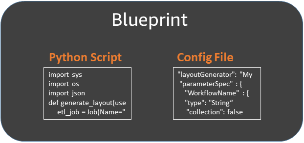
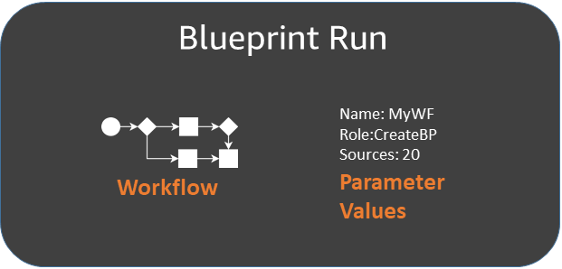

# Overview of blueprints in AWS Glue

###### Note

The blueprints feature is currently unavailable in the following Regions in the AWS Glue
console: Asia Pacific (Jakarta) and Middle East (UAE).

AWS Glue blueprints provide a way to create and share AWS Glue workflows. When there is a complex
ETL process that could be used for similar use cases, rather than creating an AWS Glue workflow for
each use case, you can create a single blueprint.

The blueprint specifies the jobs and crawlers to include in a workflow, and specifies
parameters that the workflow user supplies when they run the blueprint to create a workflow. The
use of parameters enables a single blueprint to generate workflows for the various similar use
cases. For more information about workflows, see [Overview of workflows in AWS Glue](workflows_overview.md "workflows_overview.md").

The following are example use cases for blueprints:

- You want to partition an existing dataset. The input parameters to the blueprint are
  Amazon Simple Storage Service (Amazon S3) source and target paths and a list of partition columns.
- You want to snapshot an Amazon DynamoDB table into a SQL data store like Amazon Redshift. The input
  parameters to the blueprint are the DynamoDB table name and an AWS Glue connection, which designates
  an Amazon Redshift cluster and destination database.
- You want to convert CSV data in multiple Amazon S3 paths to Parquet. You want the AWS Glue workflow
  to include a separate crawler and job for each path. The input parameters are the destination
  database in the AWS Glue Data Catalog and a comma-delimited list of Amazon S3 paths. Note that in this case,
  the number of crawlers and jobs that the workflow creates is variable.

###### Blueprint components

A blueprint is a ZIP archive that contains the following components:

- A Python layout generator script

Contains a function that specifies the workflow _layout_—the crawlers and jobs to create for the workflow, the job and crawler
properties, and the dependencies between the jobs and crawlers. The function accepts blueprint
parameters and returns a workflow structure (JSON object) that AWS Glue uses to generate the
workflow. Because you use a Python script to generate the workflow, you can add your own logic
that is suitable for your use cases.

- A configuration file

Specifies the fully qualified name of the Python function that generates the workflow
layout. Also specifies the names, data types, and other properties of all blueprint parameters
used by the script.

- (Optional) ETL scripts and supporting files

As an advanced use case, you can parameterize the location of the ETL scripts that your
jobs use. You can include job script files in the ZIP archive and specify a blueprint
parameter for an Amazon S3 location where the scripts are to be copied to. The layout generator
script can copy the ETL scripts to the designated location and specify that location as the job
script location property. You can also include any libraries or other supporting files, provided
that your script handles them.

###### Blueprint runs

When you create a workflow from a blueprint, AWS Glue runs the blueprint, which starts an
asynchronous process to create the workflow and the jobs, crawlers, and triggers that the
workflow encapsulates. AWS Glue uses the blueprint run to orchestrate the creation of the workflow
and its components. You view the status of the creation process by viewing the blueprint run
status. The blueprint run also stores the values that you supplied for the blueprint
parameters.

You can view blueprint runs using the AWS Glue console or AWS Command Line Interface (AWS CLI). When viewing
or troubleshooting a workflow, you can always return to the blueprint run to view the
blueprint parameter values that were used to create the workflow.

###### Lifecycle of a blueprint

blueprints are developed, tested, registered with AWS Glue, and run to create workflows.
There are typically three personas involved in the blueprint lifecycle.

| Persona                | Tasks                                                                                                                                                                                                                                                                                                                                                                                                                                                                                                                                                     |
| ---------------------- | --------------------------------------------------------------------------------------------------------------------------------------------------------------------------------------------------------------------------------------------------------------------------------------------------------------------------------------------------------------------------------------------------------------------------------------------------------------------------------------------------------------------------------------------------------- | ------------------------------------------------------------------------------------------------------------------------------------------------------------------------------------------------------------------------------------------------------------------------------------------------------------------------------------------------------------------------------------ |
| AWS Glue developer     |  • Writes the workflow layout script and creates the configuration file.  • Tests the blueprint locally using libraries provided by the AWS Glue service.  • Creates a ZIP archive of the script, configuration file, and supporting files and publishes the archive to a location in Amazon S3.  • Adds a bucket policy to the Amazon S3 bucket that grants read permissions on bucket objects to the AWS Glue administrator's AWS account.  • Grants IAM read permissions on the ZIP archive in Amazon S3 to the AWS Glue administrator. |
| AWS Glue administrator |  • _Registers_ the blueprint with AWS Glue. AWS Glue makes a copy of the ZIP archive into a reserved Amazon S3 location.  • Grants IAM permissions on the blueprint to data analysts.                                                                                                                                                                                                                                                                                                                                                               |
| Data analyst           |  • Runs the blueprint to create a workflow, and provides blueprint parameter values. Checks the blueprint run status to ensure that the workflow and workflow components were successfully generated.  • Runs and troubleshoots the workflow. Before running the workflow, can verify the workflow by viewing the workflow design graph on the AWS Glue console.                                                                                                                                                                                    | ###### See also  • [Developing blueprints in AWS Glue](developing-blueprints.md "developing-blueprints.md")  • [Creating a workflow from a blueprint in AWS Glue](creating_workflow_blueprint.md "creating_workflow_blueprint.md")  • [Permissions for personas and roles for AWS Glue blueprints](blueprints-personas-permissions.md "blueprints-personas-permissions.md") |
