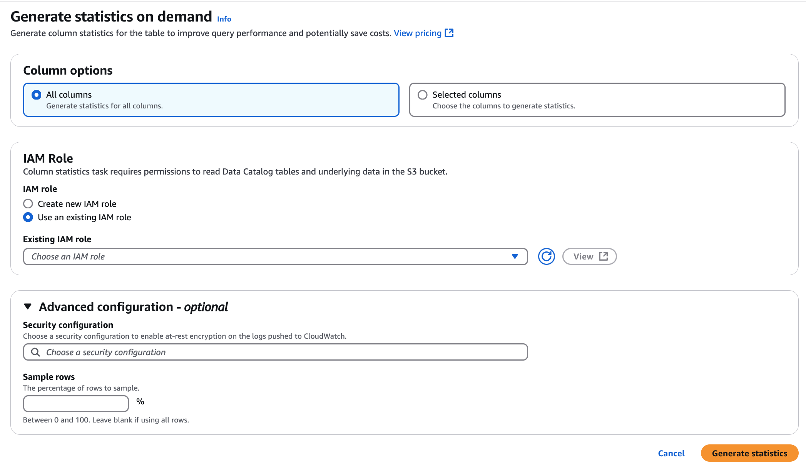

# Generating column statistics on demand

You can run the column statistics task for the AWS Glue Data Catalog tables task on-demand without a set schedule.
This option is useful for ad-hoc analysis or when statistics need to be computed immediately.

Follow these steps to generate column statistics on demand for the Data Catalog tables
using AWS Glue console or AWS CLI.

AWS Management Console

###### To generate column statistics using the console

1. Sign in to the AWS Glue console at [https://console.aws.amazon.com/glue/](https://console.aws.amazon.com/glue/ "https://console.aws.amazon.com/glue/").
2. Choose Data Catalog tables.
3. Choose a table from the list.
4. Choose **Generate statistics** under
   **Actions** menu.

You can also choose **Generate**, **Generate on demand**
option under **Column statistics** tab in the lower
section of the **Table** page. 5. Follow steps 7 - 11 in the [Generating column statistics on a
schedule](generate-column-stats.md "generate-column-stats.md") to generate column statistics for the table. 6. On the **Generate statistics** page, specify the
following options:



    * All columns – Choose
     this option to generate statistics for all columns in the
     table.
    * Selected columns –
     Choose this option to generate statistics for specific columns.
     You can select the columns from the drop-down list.
    * IAM role –Choose **Create a new IAM role** that has the
     required permission policies to run the column statistics generation
     task. Choose View permission details to review the policy statement.
     You can also select an IAM role from the list. For more
     information about the required permissions, see [Prerequisites for generating column
     statistics](column-stats-prereqs.md "column-stats-prereqs.md").


    AWS Glue assumes the permissions of the role that you specify to
     generate statistics.


    For more information about providing roles for AWS Glue, see [Identity-based policies for AWS Glue.](security_iam_service-with-iam.md#security_iam_service-with-iam-id-based-policies "security_iam_service-with-iam.md#security_iam_service-with-iam-id-based-policies").
    * (Optional) Next, choose a security configuration to enable at-rest
     encryption for logs.
    * Sample rows – Choose
     only a specific percent of rows from the table to generate
     statistics. The default is all rows. Use the up and down arrows
     to increase or decrease the percent value.


    ###### Note

    We recommend to include all rows in the table to
     compute accurate statistics. Use sample rows to generate
     column statistics only when approximate values are
     acceptable.

Choose **Generate statistics** to run the
task.

AWS CLI
This command will trigger an column statistics task run for the specified
table. You need to provide the database name, table name, an IAM role with
permissions to generate statistics, and optionally provide column names and
a sample size percentage for the statistics computation.

```
aws glue start-column-statistics-task-run \
    --database-name '`database_name` \
    --table-name '`table_name`' \
    --role 'arn:aws:iam::`123456789012`:role/`stats-role`' \
    --column-name '`col1`','`col2`'  \
    --sample-size 10.0

```

This command will start a task to generate column statistics for
the specified table.

## Updating column statistics on demand

Maintaining up-to-date column statistics is crucial for the query optimizer to generate efficient execution plans, ensuring improved query performance, reduced resource consumption, and better overall system performance.
This process is particularly important after significant data changes, such as bulk loads or extensive modifications, which can render existing statistics obsolete.

You need to explicitly run the **Generate
statistics** task from the AWS Glue console to refresh the column statistics.
Data Catalog doesn't automatically refresh the statistics.

If you are not using AWS Glue's statistics generation feature in the console, you can
manually update column statistics using the [UpdateColumnStatisticsForTable](../webapi/API_UpdateColumnStatisticsForTable.md "../webapi/API_UpdateColumnStatisticsForTable.md") API operation or AWS CLI. The following
example shows how to update column statistics using AWS CLI.

```
aws glue update-column-statistics-for-table --cli-input-json:

{
    "CatalogId": "`111122223333`",
    "DatabaseName": "`database_name`",
    "TableName": "`table_name`",
    "ColumnStatisticsList": [
        {
            "ColumnName": "`col1`",
            "ColumnType": "Boolean",
            "AnalyzedTime": "1970-01-01T00:00:00",
            "StatisticsData": {
                "Type": "BOOLEAN",
                "BooleanColumnStatisticsData": {
                    "NumberOfTrues": 5,
                    "NumberOfFalses": 5,
                    "NumberOfNulls": 0
                }
            }
        }
    ]
}
```
