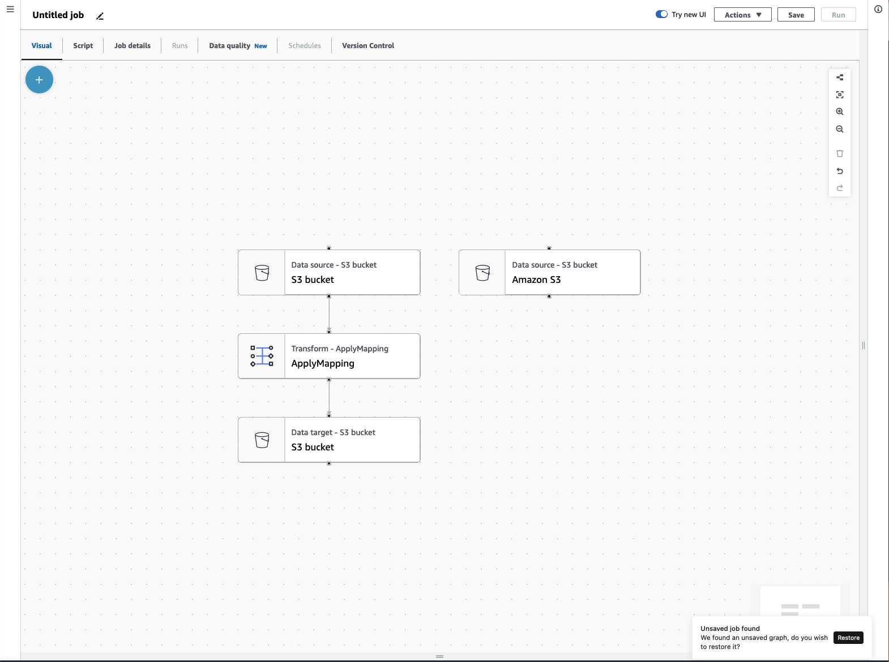
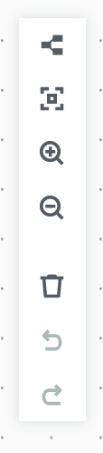
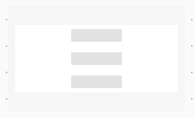
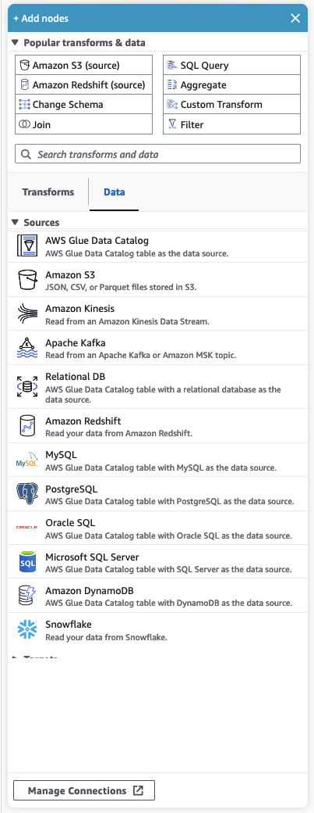

# AWS Glue components

AWS Glue provides a console and API operations to set up and manage your extract, transform,
and load (ETL) workload. You can use API operations through several language-specific SDKs
and the AWS Command Line Interface (AWS CLI). For information about using the AWS CLI, see [AWS CLI Command Reference](../../../cli/latest/reference.md "../../../cli/latest/reference.md").

AWS Glue uses the AWS Glue Data Catalog to store metadata about data sources, transforms, and targets.
The Data Catalog is a drop-in replacement for the Apache Hive Metastore. The AWS Glue Jobs system provides a
managed infrastructure for defining, scheduling, and running ETL operations on your data.
For more information about the AWS Glue API, see [AWS Glue API](aws-glue-api.md "aws-glue-api.md").

## AWS Glue console

You use the AWS Glue console to define and orchestrate your ETL workflow. The console
calls several API operations in the AWS Glue Data Catalog and AWS Glue Jobs system to perform the following
tasks:

- Define AWS Glue objects such as jobs, tables, crawlers, and connections.
- Schedule when crawlers run.
- Define events or schedules for job triggers.
- Search and filter lists of AWS Glue objects.
- Edit transformation scripts.

## AWS Glue Data Catalog

The AWS Glue Data Catalog is your persistent technical metadata store in the AWS Cloud.

Each AWS account has one AWS Glue Data Catalog per AWS Region.
Each Data Catalog is a highly scalable collection of tables organized into databases. A table
is metadata representation of a collection of structured or semi-structured data stored
in sources such as Amazon RDS, Apache Hadoop Distributed File System, Amazon OpenSearch Service,
and others. The AWS Glue Data Catalog provides a uniform repository where disparate systems can
store and find metadata to keep track of data in data silos.
You can then use the metadata to query and transform that data in a consistent manner across a wide variety
of applications.

You use the Data Catalog together with AWS Identity and Access Management policies and Lake Formation to control access to the tables and databases.
By doing this, you can allow different groups in your enterprise to safely publish
data to the wider organization while protecting sensitive information in a highly
granular fashion.

The Data Catalog, along with CloudTrail and Lake Formation, also provides you with comprehensive audit and governance capabilities, with schema
change tracking and data access controls. This helps ensure that data is not
inappropriately modified or inadvertently shared.

For information about
securing
and auditing the
AWS Glue Data Catalog, see:

- AWS Lake Formation –
  For
  more information, see [What Is
  AWS Lake Formation?](../../../lake-formation/latest/dg/what-is-lake-formation.md "../../../lake-formation/latest/dg/what-is-lake-formation.md") in the _AWS Lake Formation Developer Guide_.
- CloudTrail –
  For
  more information, see [What Is
  CloudTrail?](../../../awscloudtrail/latest/userguide/cloudtrail-user-guide.md "../../../awscloudtrail/latest/userguide/cloudtrail-user-guide.md") in the _AWS CloudTrail User
  Guide_.

The following are other AWS services and
open-source
projects that use the AWS Glue Data Catalog:

- Amazon Athena –
  For
  more information, see [Understanding Tables, Databases, and the Data Catalog](../../../athena/latest/ug/understanding-tables-databases-and-the-data-catalog.md "../../../athena/latest/ug/understanding-tables-databases-and-the-data-catalog.md") in the _Amazon Athena User Guide_.
- Amazon Redshift Spectrum –
  For
  more information, see [Using
  Amazon Redshift Spectrum to Query External Data](../../../redshift/latest/dg/c-using-spectrum.md "../../../redshift/latest/dg/c-using-spectrum.md") in the _Amazon Redshift Database Developer Guide_.
- Amazon EMR –
  For
  more information, see [Use
  Resource-Based Policies for Amazon EMR Access to AWS Glue Data Catalog](../../../emr/latest/ManagementGuide/emr-iam-roles-glue.md "../../../emr/latest/ManagementGuide/emr-iam-roles-glue.md") in the
  _Amazon EMR Management Guide_.
- AWS Glue Data Catalog client for Apache Hive metastore
  –
  For
  more information about this GitHub project, see [AWS Glue Data Catalog Client for Apache Hive Metastore](https://github.com/awslabs/aws-glue-data-catalog-client-for-apache-hive-metastore "https://github.com/awslabs/aws-glue-data-catalog-client-for-apache-hive-metastore").

## AWS Glue crawlers and classifiers

AWS Glue also lets you set up crawlers that can scan data in all kinds of repositories,
classify it, extract schema information from it, and store the metadata automatically in
the AWS Glue Data Catalog. The AWS Glue Data Catalog can then be used to guide ETL operations.

For information about how to set up crawlers and classifiers, see [Using crawlers to populate the Data Catalog](add-crawler.md "add-crawler.md") . For information about how to
program crawlers and classifiers using the AWS Glue API, see [Crawlers and classifiers API](aws-glue-api-crawler.md "aws-glue-api-crawler.md").

## AWS Glue ETL operations

Using the metadata in the Data Catalog, AWS Glue can automatically generate Scala or PySpark
(the Python API for Apache Spark) scripts with AWS Glue extensions that you can use and
modify to perform various ETL operations. For example, you can extract, clean, and
transform raw data, and then store the result in a different repository, where it can be
queried and analyzed. Such a script might convert a CSV file into a relational form and
save it in Amazon Redshift.

For more information about how to use AWS Glue ETL capabilities, see [Programming Spark scripts](aws-glue-programming.md "aws-glue-programming.md").

## Streaming ETL in AWS Glue

AWS Glue enables you to perform ETL operations on streaming data using
continuously-running jobs. AWS Glue streaming ETL is built on the Apache Spark Structured
Streaming engine, and can ingest streams from Amazon Kinesis Data Streams, Apache Kafka, and Amazon Managed Streaming for Apache Kafka
(Amazon MSK). Streaming ETL can clean and transform streaming data and load it into Amazon S3 or JDBC data
stores. Use Streaming ETL in AWS Glue to process event data like IoT streams, clickstreams,
and network logs.

If you know the schema of the streaming data source, you can specify it in a Data Catalog
table. If not, you can enable schema detection in the streaming ETL job. The job then
automatically determines the schema from the incoming data.

The streaming ETL job can use both AWS Glue built-in transforms and transforms that are
native to Apache Spark Structured Streaming. For more information, see [Operations on streaming DataFrames/Datasets](https://spark.apache.org/docs/latest/structured-streaming-programming-guide.html#operations-on-streaming-dataframesdatasets "https://spark.apache.org/docs/latest/structured-streaming-programming-guide.html#operations-on-streaming-dataframesdatasets") on the Apache Spark website.

For more information, see [Streaming ETL jobs in AWS Glue](add-job-streaming.md "add-job-streaming.md").

## The AWS Glue jobs system

The AWS Glue Jobs system provides managed infrastructure to orchestrate your ETL workflow. You
can create jobs in AWS Glue that automate the scripts you use to extract, transform, and
transfer data to different locations. Jobs can be scheduled and chained, or they can be
triggered by events such as the arrival of new data.

For more information about using the AWS Glue Jobs system, see [Monitoring AWS Glue](monitor-glue.md "monitor-glue.md"). For information about programming using the
AWS Glue Jobs system API, see [Jobs API](aws-glue-api-jobs.md "aws-glue-api-jobs.md").

## Visual ETL components

AWS Glue allows you to create ETL jobs through a visual canvas that you can manipulate.

### ETL job menu

Menu options at the top of the canvas allow you to access the various views and configuration details about your job.

- **Visual** – The Visual job editor canvas. This is where you can add nodes to create a job.
- **Script** – The script representation of your ETL job. AWS Glue generates the
  script based on the visual representation of your job. You can also edit your script or download it.

###### Note

If you choose to edit the script, the job authoring experience is permanently converted to a script-only mode.
Afterwards, you cannot use the visual editor to edit the job anymore. You should add all the job sources, transforms,
and targets, and make all the changes you require with the visual editor before choosing to edit the script.

- **Job details** – The Job details tab allows you to configure your job by setting job properties.
  There are basic properties, such as name and description of your job, IAM role, job type, AWS Glue version,
  language, worker type, number of workers, job bookmark, flex execution, number of retires, and job timeout, and there are
  advanced properties, such as connections, libraries, job parameters, and tags.
- **Runs** – After your job runs, this tab can be accessed to view your past job runs.
- **Data quality** – Data quality evaluates and monitors the quality of your data assets. You can learn
  more about how to use data quality on this tab and add a data quality transform to your job.
- **Schedules** – Jobs that you've scheduled appear in this tab. If there are no schedules attached
  to this job, then this tab is not accessible.
- **Version control** – You can use Git with your job by configuring your job to a Git repository.

### Visual ETL panels

When you work in the canvas, several panels are available to help you configure your nodes, or help you to preview your data
and view the output schema.

- **Properties** – The Properties panel appears when you choose a node on your canvas.
- **Data preview** – The Data preview panel provides a preview of the data output so that you
  can make decisions before you run your job and examine your output.
- **Output schema** – The Output schema tab allows you to view and edit the schema of your transform
  nodes.

**Resizing panels**

You can resize the Properties panel on the right-hand side of the screen and the bottom panel which contains the Data preview and Output
schema tabs by clicking on the edge of the panel and dragging it left and right or up and down.

- **Properties panel** – Resize the properties panel by clicking and dragging the edge of the canvas on the
  right side of the screen and drag it left to expand its width. By default, the panel is collapsed and when a node is selected,
  the properties panel opens up to its default size.
- **Data preview and Output schema panel** – Resize the bottom panel by clicking and dragging the bottom
  edge of the canvas at the bottom of the screen and drag it up to expand its height. By default, the panel is collapsed and when a
  node is selected, the bottom panel opens up to its default size.

### Job canvas

You can add, remove, and move/reorder nodes directly on the Visual ETL canvas. Think of it as your
workspace to create a fully functional ETL job that starts with a data source and can end with a data target.

When you work with nodes on the canvas, you have a toolbar that can help you zoom in and out, remove nodes,
make or edit connections between nodes, change the job flow orientation, and undo or redo an action.

The floating toolbar is anchored to the upper right-hand size of the canvas and contains several images that perform actions:

- **Layout icon** – The first icon in the toolbar is the layout icon. By default, the direction of visual
  jobs is top to bottom.It rearranges the direction of your visual job by arranging the nodes horizontally from left to right.
  Clicking the layout icon again changes the direction back to top to bottom.
- **Recenter icon** – The recenter icon changes the canvas view by centering it. You can
  use this with large jobs to get back to the center position.
- **Zoom in icon** – The zoom in icon enlarges the size of the nodes on the canvas.
- **Zoom out icon** – The zoom out icon decreases the size of the nodes on the canvas.
- **Trash icon** – The trash icon removes a node from the visual job. You must select a node first.
- **Undo icon** – The undo icon reverses the last action taken on the visual job.
- **Redo icon** – The redo icon repeats the last action taken on the visual job.

**Using the mini-map**

### Resource panel

The resource panel contains all of the data sources, transform actions, and connections available to you.
Open the resource panel on the canvas by clicking the "+" icon. This will open the resource panel.

To close the resource panel, click the **X** in the upper-right hand corner of the resource panel.
This will hide the panel until you're ready to open it again.

#### Popular transforms & data

At the top of the panel is a collection of **Popular transforms & data**.
These nodes are commonly used in AWS Glue. Choose one to add it to the canvas. You can also
hide the **Popular transforms & data** by clicking the triangle next to the
**Popular transforms & data** heading.

Beneath the **Popular transforms & data** section, you can search for transforms and data source
nodes. Results appear as you type. The more letters you add to your search query, the list of results will get smaller.
Search results are populated from the node name and/or description. Choose the node to add it to your canvas.

#### Transforms and Data

There are two tabs that organize the nodes into **Transforms**
and **Data**.

**Transforms** –
When you choose the **Transforms** tab, all of the available transforms can be selected. Choose a
transform to add it to the canvas. You can also choose **Add Transform** at the bottom of the Transforms list
which will open a new page to the documentation for creating
[Custom visual transforms](../ug/custom-visual-transform.md "../ug/custom-visual-transform.md").
Following the steps will allow you to create transforms of your own. Your transforms will then appear in the list of
available transforms.

**Data** – The data tab contains all of the nodes for **Sources** and
**Targets**. You can hide the Sources and Targets by clicking the triangle next to the Sources or Targets
heading. You can unhide the Sources and Targets by clicking the triangle again. Choose a source or target node to add it
to the canvas. You can also choose **Manage Connections** to add a new connection.
This will open the Connectors page in the console.
