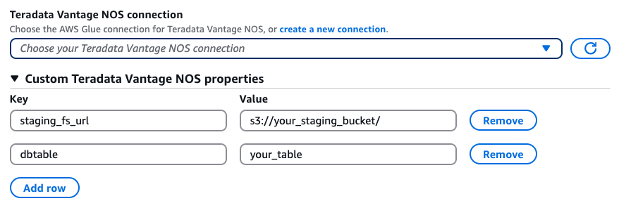

#

Teradata Vantage NOS connections

Teradata NOS (Native Object Store) connection is a new connection for Teradata Vantage which leverages Teradata WRITE_NOS query to read
from existing tables and READ_NOS query to write to tables. These queries uses Amazon S3 as a staging directory, and therefore the Teradata NOS
connector is faster than the existing Teradata connector (JDBC-based) especially in handling large amount of data.

You can use the Teradata NOS connection in AWS Glue for Spark to read from and write to existing tables in Teradata Vantage in AWS Glue 5.0 and later versions.
You can define what to read from Teradata with a SQL query. You can connect to Teradata using username and password credentials stored in
AWS Secrets Manager through a AWS Glue connection.

For more information about Teradata, consult the [Teradata documentation](https://docs.teradata.com/ "https://docs.teradata.com/").

###### Topics

- [Creating a Teradata NOS connection](#creating-teradata-nos-connection "#creating-teradata-nos-connection")
- [Reading from Teradata tables](#reading-from-teradata-nos-tables "#reading-from-teradata-nos-tables")
- [Writing to Teradata tables](#writing-to-teradata-nos-tables "#writing-to-teradata-nos-tables")
- [Teradata connection option reference](#teradata-nos-connection-option-reference "#teradata-nos-connection-option-reference")
- [Provide Options in AWS Glue Visual ETL UI](#teradata-nos-connection-option-visual-etl-ui "#teradata-nos-connection-option-visual-etl-ui")

## Creating a Teradata NOS connection

To connect to Teradata NOS from AWS Glue, you will need to create and store your Teradata credentials in an
AWS Secrets Manager secret, then associate that secret with a AWS Glue Teradata NOS connection. If your Teradata instance is in an Amazon VPC, you will also
need to provide networking options to your AWS Glue Teradata NOS connection.

**Prerequisites**:

- If you are accessing your Teradata environment through Amazon VPC, configure Amazon VPC to allow your AWS Glue job to communicate with the
  Teradata environment. We discourage accessing the Teradata environment over the public internet.
- In Amazon VPC, identify or create a VPC, Subnet and Security group that AWS Glue will use while executing the job. Additionally, you need to
  ensure Amazon VPC is configured to permit network traffic between your Teradata instance and this location. Your job will need to establish
  a TCP connection with your Teradata client port. For more information about Teradata ports, see the
  [Security Groups for Teradata Vantage](https://docs.teradata.com/r/Teradata-VantageTM-on-AWS-DIY-Installation-and-Administration-Guide/April-2020/Before-Deploying-Vantage-on-AWS-DIY/Security-Groups-and-Ports "https://docs.teradata.com/r/Teradata-VantageTM-on-AWS-DIY-Installation-and-Administration-Guide/April-2020/Before-Deploying-Vantage-on-AWS-DIY/Security-Groups-and-Ports") .
- Based on your network layout, secure VPC connectivity may require changes in Amazon VPC and other networking services. For more information
  about AWS connectivity, see [AWS Connectivity Options](https://docs.teradata.com/r/Teradata-VantageCloud-Enterprise/Get-Started/Connecting-Your-Environment/AWS-Connectivity-Options "https://docs.teradata.com/r/Teradata-VantageCloud-Enterprise/Get-Started/Connecting-Your-Environment/AWS-Connectivity-Options") in the Teradata documentation.

### To configure a AWS Glue Teradata NOS connection:

1. In your Teradata configuration, identify or create a `teradataUsername` and `teradataPassword`
   AWS Glue will connect with. For more information,
   see [Vantage Security Overview](https://docs.teradata.com/r/Configuring-Teradata-VantageTM-After-Installation/January-2021/Security-Overview/Vantage-Security-Overview "https://docs.teradata.com/r/Configuring-Teradata-VantageTM-After-Installation/January-2021/Security-Overview/Vantage-Security-Overview") in the Teradata documentation.
2. In AWS Secrets Manager, create a secret using your Teradata credentials. To create a secret in AWS Secrets Manager,
   follow the tutorial available in [Create an AWS Secrets Manager secret in the AWS Secrets Manager](../../../secretsmanager/latest/userguide/create_secret.md "../../../secretsmanager/latest/userguide/create_secret.md") documentation. After creating the secret, keep the Secret name, `secretName` for the next step.
   - When selecting Key/value pairs, create a pair for the key USERNAME with the value `teradataUsername`.
   - When selecting Key/value pairs, create a pair for the key PASSWORD with the value `teradataPassword`.

3. In the AWS Glue console, create a connection by following the steps in
   [Adding an AWS Glue connection](console-connections.md "console-connections.md") . After creating the connection, keep the connection name, `connectionName`, for the next step.
   - When selecting a **Connection type**, select Teradata Vantage NOS.
   - When providing JDBC URL, provide the URL for your instance. You can also hardcode certain comma separated connection
     parameters in your JDBC URL. The URL must conform to the following format: `jdbc:teradata://teradataHostname/ParameterName=ParameterValue,ParameterName=ParameterValue` .
   - Supported URL parameters include:
     - `DATABASE`– name of database on host to access by default.
     - `DBS_PORT`– the database port, used when running on a nonstandard port.

   - When selecting a **Credential type**, select AWS Secrets Manager, then set **AWS Secret** to `secretName`.

4. In the following situations, you may require additional configuration:
   - For Teradata instances hosted on AWS in an Amazon VPC, you will need to provide Amazon VPC connection information to the
     AWS Glue connection that defines your Teradata security credentials. When creating or updating your connection, set
     **VPC**, **Subnet**, and **Security groups** in
     **Network options**.

After creating a AWS Glue Teradata Vantage NOS connection, you will need to perform the following steps before calling your connection method.

1. Grant the IAM role associated with your AWS Glue job permission to read `secretName`.
2. In your AWS Glue job configuration, provide `connectionName` as an **Additional network connection**
   Under **Connections**.

##

Reading from Teradata tables

### Prerequisites:

- A Teradata table you would like to read from. You will need the table name, `tableName`.
- The Teradata environment has write access to the Amazon S3 path specified by `staging_fs_url` option,
  `stagingFsUrl`.
- The IAM role associated with AWS Glue job has write access to the Amazon S3 location specified by `staging_fs_url` option.
- An AWS Glue Teradata NOS connection configured to provide auth information. Complete the steps
  [To configure a AWS Glue Teradata NOS connection:](#creating-teradata-nos-connection-procedure "#creating-teradata-nos-connection-procedure")
  to configure your auth information. You will need the name of the AWS Glue connection, `connectionName`.

Example:

```
teradata_read_table = glueContext.create_dynamic_frame.from_options(
    connection_type= `"teradatanos"`,
    connection_options={
        "connectionName": `"connectionName"`,
        "dbtable": `"tableName"`,
        "staging_fs_url": `"stagingFsUrl"`
    }
)
```

You can also provide a SELECT SQL query, to filter the results returned to your DynamicFrame. You will need to configure query.
If you configure both dbTable and query, the connector fails to read the data. For example:

```
teradata_read_query = glueContext.create_dynamic_frame.from_options(
    connection_type=`"teradatanos"`,
    connection_options={
        "connectionName": `"connectionName"`,
        "query": `"query"`,
        "staging_fs_url": `"stagingFsUrl"`
    }
)
```

Additionally, you can use Spark DataFrame API to read from Teradata tables. For example:

```
options = {
    "url": `"JDBC_URL"`,
    "dbtable": `"tableName"`,
    "user": `"teradataUsername"`, # or use "username" as key here
    "password": `"teradataPassword"`,
    "staging_fs_url": `"stagingFsUrl`"
}
teradata_read_table = spark.read.format("teradatanos").option(**options).load()
```

## Writing to Teradata tables

### Prerequisites

- A Teradata table you would like to write to: `tableName`.
- The Teradata environment has read access to the Amazon S3 location specified by `staging_fs_url` option, `stagingFsUrl` .
- The IAM role associated with AWS Glue job has write access to the Amazon S3 location specified by `staging_fs_url` option.
- An AWS Glue Teradata connection configured to provide auth information. Complete the steps in
  [To configure a AWS Glue Teradata NOS connection:](#creating-teradata-nos-connection-procedure "#creating-teradata-nos-connection-procedure")
  to configure your auth information. You will need the name of the AWS Glue connection, `connectionName`.

For example:

```
teradata_write = glueContext.write_dynamic_frame.from_options(
    frame=dynamicFrame,
    connection_type= `"teradatanos"`,
    connection_options={
        "connectionName": `"connectionName"`,
        "dbtable": `"tableName"`,
        "staging_fs_url": `"stagingFsUrl"`
    }
)
```

## Teradata connection option reference

**Connection and Operation Options:**

- `connectionName` — Required. Used for Read/Write. The name of an AWS Glue Teradata connection configured to provide auth and
  networking information to your connection method.
- `staging_fs_url` — Required. Used for Read/Write. A writable location in Amazon S3, to be used for unloaded data when reading from
  Teradata, and for Parquet data to be loaded into Redshift when writing to Teradata. The S3 bucket must be in the same region as the
  region of your AWS Glue jobs.
- `dbtable` — Required for writing, required for reading unless `query` is provided. Used for Read/Write. The name of a table your
  connection method will interact with.
- `query` — Used for Read. A SELECT SQL query defining what should be retrieved when reading from Teradata. You can not pass
  if `dbtable` option is provided.
- `clean_staging_s3_dir` — Optional. Used for Read/Write. If true, clean up the staging Amazon S3 objects after a read or a write.
  The default value is true.
- `pre_actions` — Optional. Used for Write. Semicolon-separated list of SQL commands that are executed before data is
  transferred between Spark and Teradata Vantage.
- `post_actions` — Optional. Used for Write. Semicolon-separated list of SQL commands that are executed after data is
  transferred between Spark and Teradata Vantage.
- `truncate` — Optional. Used for Write. If true, the connector truncates the table when writing in overwrite mode. If false,
  the connector drops the table when writing in overwrite mode. The default value is false.
- `create_table_script` — Optional. Used for Write. An SQL statement to create table when writing to Teradata Vantage.
  Useful when you want to create a table with custom metadata (e.g. CREATE MULTISET or SET table or change primary index). Note
  that the table name used in create table script should match with the table name specified in `dbtable` option.
- `partition_size_in_mb` — Optional. Used for Read. Maximum size of a Spark partition in megabytes while reading staging Amazon S3
  objects. The default value is 128.

You can provide advanced options when creating a Teradata node. These options are the same as those
available when programming AWS Glue for Spark scripts.

See [Teradata Vantage connections](aws-glue-programming-etl-connect-teradata-home.md "aws-glue-programming-etl-connect-teradata-home.md").

**Authorization Options:**

Below are options used to provide AWS account credentials that the connector uses to access the staging Amazon S3 bucket. You can choose to (1)
not provide any authorization options at all, and use temporary credentials generated from your AWS Glue execution role; or (2) provide an
authorization object, `auth_object` you created; or (3) provide `aws_access_key_id and aws_secret_access_key` if using long term
credentials, or provide `aws_access_key`, `aws_secret_access_key`, and `aws_session_token` if using temporary
credentials.

- `auth_object` – Optional. Used for accessing the staging Amazon S3 bucket. An authorization object string created in
  Teradata instance. If provided, the connector will use this authorization object to access the staging Amazon S3 bucket. If not provided,
  and `aws_access_key_id` and `aws_secret_access_key` are also not provided, a temporary credential will be retrieved
  from AWS Glue execution role and used by the connector. The AWS account associated with this authorization object must be in the same
  region as your AWS Glue jobs and your staging Amazon S3 bucket or configured with cross account trust.
- `aws_access_key_id` – Optional. Used for accessing the staging Amazon S3 bucket. Part of an AWS account security credential.
  If `auth_object` is not provided, and `aws_access_key_id` is provided with `aws_secret_access_key`, the
  connector will use them to access staging Amazon S3 bucket. The AWS account associated with this access key must be in the same region as
  your AWS Glue jobs and your staging Amazon S3 bucket or configured with cross account trust.
- `aws_secret_access_key` – Optional. Used for accessing the staging Amazon S3 bucket. Part of an AWS account security
  credential. If `auth_object` is not provided, and `aws_secret_access_key` is provided with `aws_access_key_id`
  , the connector will use them to access staging Amazon S3 bucket. The AWS account associated with this secret key must be in the same region as
  your AWS Glue jobs and your staging Amazon S3 bucket or configured with cross account trust.
- `aws_session_token` – Optional. Used for accessing the staging Amazon S3 bucket. Part of a temporary AWS account security
  credential. Should be provided with `aws_access_key_id` and `aws_secret_access_key`.

## Provide Options in AWS Glue Visual ETL UI

You can provide all above options in your visual ETL job UI. For connectionName option, you should choose it from the Teradata Vantage NOS
connection drop down list. For all other options, you should provide them through the Custom Teradata Vantage NOS properties as key value pairs.


