# Crawling an Amazon S3 data store using a VPC

endpoint

For security, auditing, or control purposes you may want your Amazon S3 data store or Amazon S3
backed Data Catalog tables to only be accessed through an Amazon Virtual Private Cloud
environment (Amazon VPC). This topic describes how to create and test a connection to
the Amazon S3 data store or Amazon S3 backed Data Catalog tables in a VPC endpoint using the
`Network` connection type.

Perform the following tasks to run a crawler on the data store:

- [Prerequisites](#connection-S3-VPC-prerequisites "#connection-S3-VPC-prerequisites")
- [Creating the connection to
  Amazon S3](#connection-S3-VPC-create-connection "#connection-S3-VPC-create-connection")
- [Testing the connection to
  Amazon S3](#connection-S3-VPC-test-connection "#connection-S3-VPC-test-connection")
- [Creating a crawler for an Amazon S3
  data store](#connection-S3-VPC-create-crawler "#connection-S3-VPC-create-crawler")
- [Running a crawler](#connection-S3-VPC-run-crawler "#connection-S3-VPC-run-crawler")

## Prerequisites

Check that you have met these prerequisites for setting up your Amazon S3 data store or
Amazon S3 backed Data Catalog tables to be accessed through an Amazon Virtual Private
Cloud environment (Amazon VPC).

- A configured VPC. For example: vpc-01685961063b0d84b. For more
  information, see [Getting started with
  Amazon VPC](../../../vpc/latest/userguide/vpc-getting-started.md "../../../vpc/latest/userguide/vpc-getting-started.md") in the _Amazon VPC User Guide_.
- An Amazon S3 endpoint attached to the VPC. For example: vpc-01685961063b0d84b.
  For more information, see [Endpoints for Amazon
  S3](../../../vpc/latest/userguide/vpc-endpoints-s3.md "../../../vpc/latest/userguide/vpc-endpoints-s3.md") in the _Amazon VPC User Guide_.

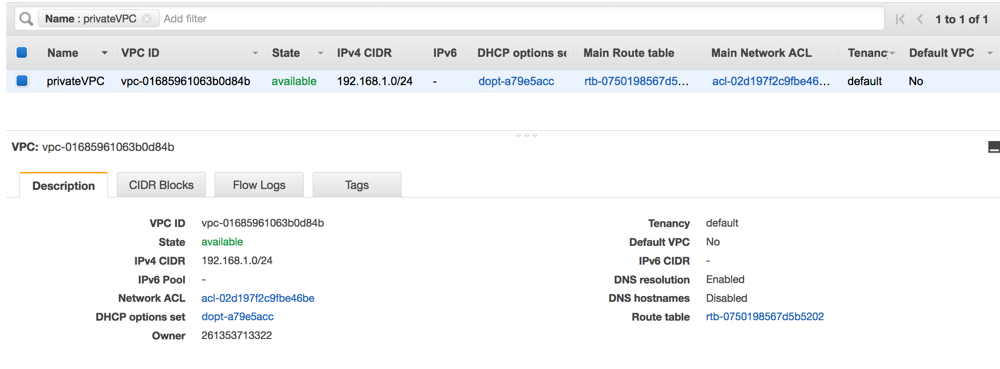

- A route entry pointing to the VPC endpoint. For example
  vpce-0ec5da4d265227786 in the route table used by the VPC
  endpoint(vpce-0ec5da4d265227786).

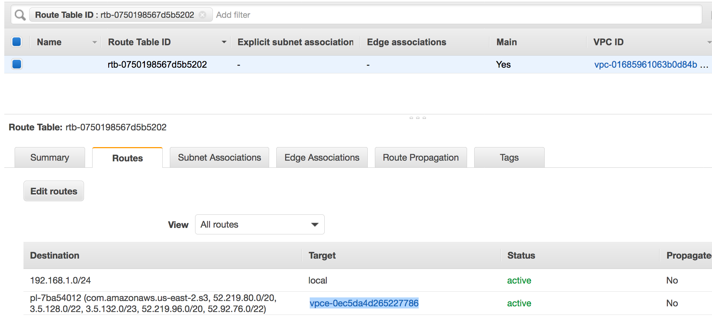

- A network ACL attached to the VPC allows the traffic.
- A security group attached to the VPC allows the traffic.

## Creating the connection to

Amazon S3

Typically, you create resources inside Amazon Virtual Private Cloud (Amazon VPC) so that they cannot be
accessed over the public internet. By default, AWS Glue can't access
resources inside a VPC. To enable AWS Glue to access resources inside
your VPC, you must provide additional VPC-specific configuration information that
includes VPC subnet IDs and security group IDs. To create a `Network`
connection you need to specify the following information:

- A VPC ID
- A subnet within the VPC
- A security group

To set up a `Network` connection:

1. Choose **Add connection** in the navigation pane of the
   AWS Glue console.
2. Enter the connection name, choose **Network** as the
   connection type. Choose **Next**.

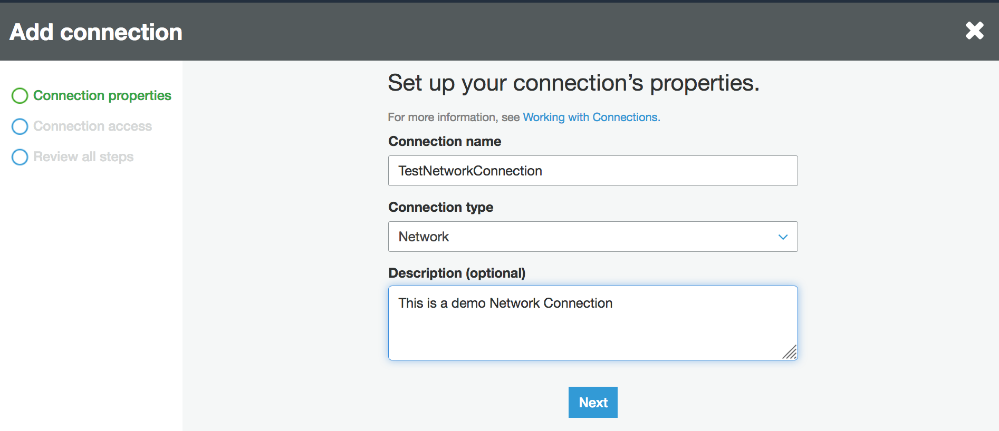 3. Configure the VPC, Subnet and Security groups information.

    * VPC: choose the VPC name that contains your data store.
    * Subnet: choose the subnet within your VPC.
    * Security groups: choose one or more security groups that allow
     access to the data store in your VPC.

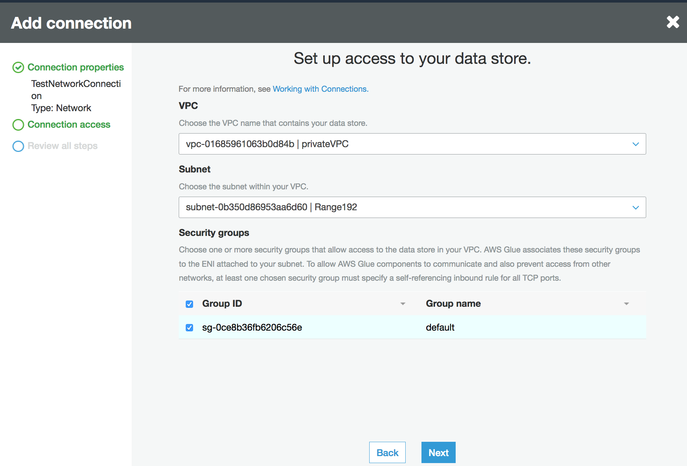 4. Choose **Next**. 5. Verify the connection information and choose
**Finish**.

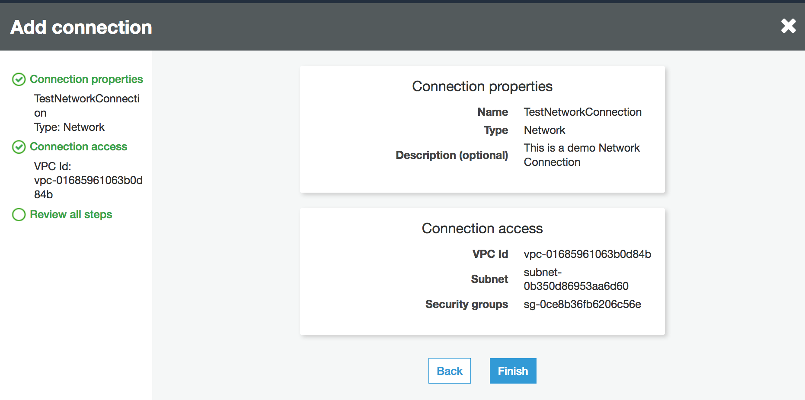

## Testing the connection to

Amazon S3

Once you have created your `Network` connection, you can test the
connectivity to your Amazon S3 data store in a VPC endpoint.

The following errors may occur when testing a connection:

- INTERNET CONNECTION ERROR: indicates an Internet connection issue
- INVALID BUCKET ERROR: indicates a problem with the Amazon S3 bucket
- S3 CONNECTION ERROR: indicates a failure to connect to Amazon S3
- INVALID CONNECTION TYPE: indicates the Connection type does not have the
  expected value, `NETWORK`
- INVALID CONNECTION TEST TYPE: indicates a problem with the type of network
  connection test
- INVALID TARGET: indicates that the Amazon S3 bucket has not been specified
  properly

To test a `Network` connection:

1. Select the **Network** connection in the
   AWS Glue console.
2. Choose **Test connection**.
3. Choose the IAM role that you created in the previous step and specify an
   Amazon S3 Bucket.
4. Choose **Test connection** to start the test. It might
   take few moments to show the result.

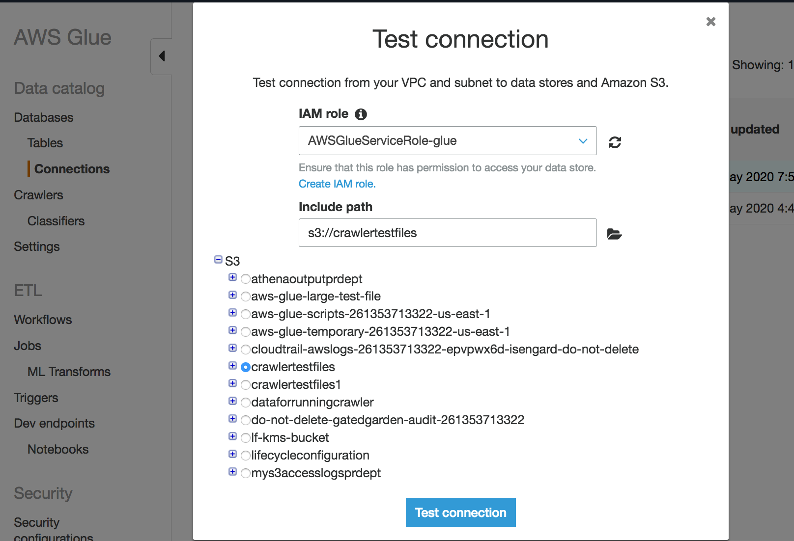

If you receive an error, check the following:

- The correct privileges are provided to the role selected.
- The correct Amazon S3 bucket is provided.
- The security groups and Network ACL allow the required incoming and
  outgoing traffic.
- The VPC you specified is connected to an Amazon S3 VPC endpoint.

Once you have successfully tested the connection, you can create a crawler.

## Creating a crawler for an Amazon S3

data store

You can now create a crawler that specifies the `Network` connection
you've created. For more details on creating a crawler, see [Configuring a crawler](define-crawler.md "define-crawler.md").

1. Start by choosing **Crawlers** in the navigation pane on
   the AWS Glue console.
2. Choose **Add crawler**.
3. Specify the crawler name and choose **Next**.
4. When asked for the data source, choose **S3**, and
   specify the Amazon S3 bucket prefix and the connection you created
   earlier.

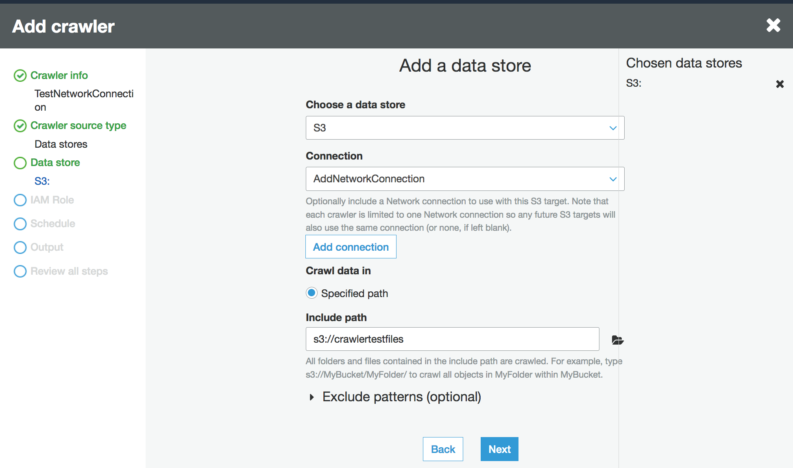 5. If you need to, add another data store on the same network
connection. 6. Choose IAM role. The IAM role must allow access to the
AWS Glue service and the Amazon S3 bucket. For more information,
see [Configuring a crawler](define-crawler.md "define-crawler.md").

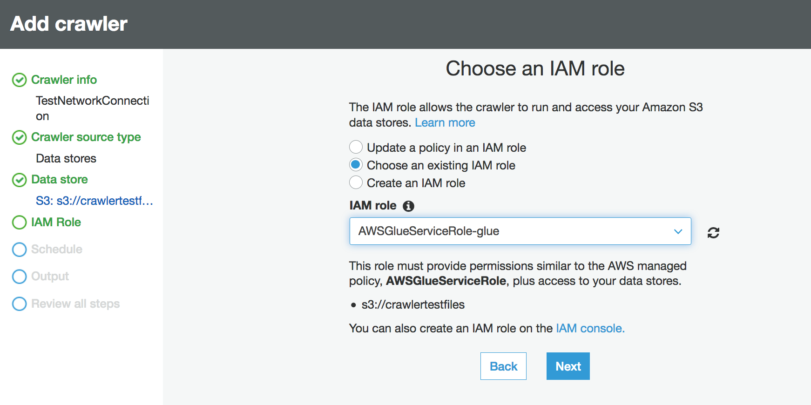 7. Define the schedule for the crawler. 8. Choose an existing database in the Data Catalog, or create a new database
entry.

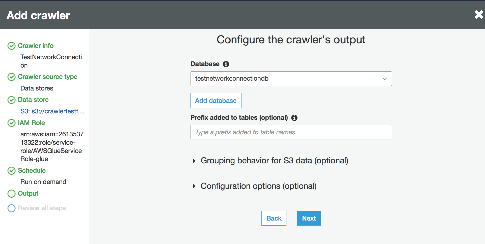 9. Finish the remaining setup.

## Creating a crawler

for Amazon S3 backed Data Catalog tables

You can now create a crawler that specifies the `Network` connection
you've created and a Catalog source type. For more details on creating a crawler,
see [Configuring a crawler](define-crawler.md "define-crawler.md").

1. Start by choosing **Crawlers** in the navigation pane on
   the AWS Glue console.
2. Choose **Add crawler**.
3. Specify the crawler name and choose **Next**.
4. When asked for the crawler source type, choose **Existing catalog
   tables**, and specify the existing catalog tables to crawl from
   the list of available tables.

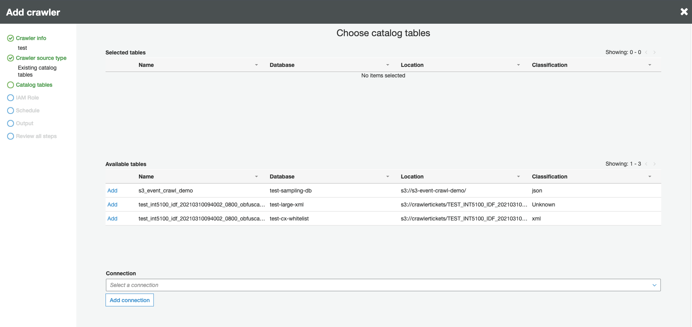 5. Choose IAM role. The IAM role must allow access to the
AWS Glue service and the Amazon S3 bucket. For more information,
see [Configuring a crawler](define-crawler.md "define-crawler.md"). 6. Define the schedule for the crawler. 7. Choose an existing database in the Data Catalog, or create a new database
entry. 8. Finish the remaining setup and review your steps.

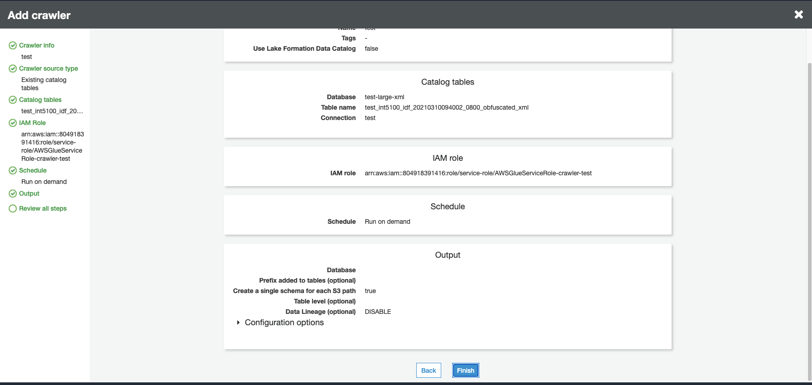

## Running a crawler

Run your crawler.

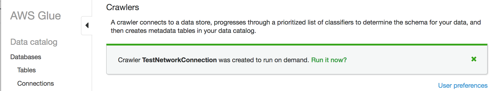

## Troubleshooting

For troubleshooting related to Amazon S3 buckets using a VPC gateway, see [Why can’t I connect to an S3 bucket using a gateway VPC
endpoint?](https://aws.amazon.com/premiumsupport/knowledge-center/connect-s3-vpc-endpoint/ "https://aws.amazon.com/premiumsupport/knowledge-center/connect-s3-vpc-endpoint/")
