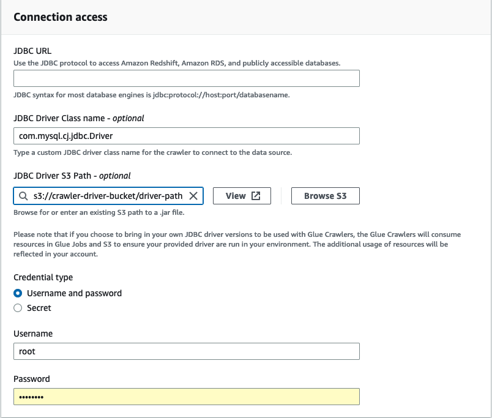
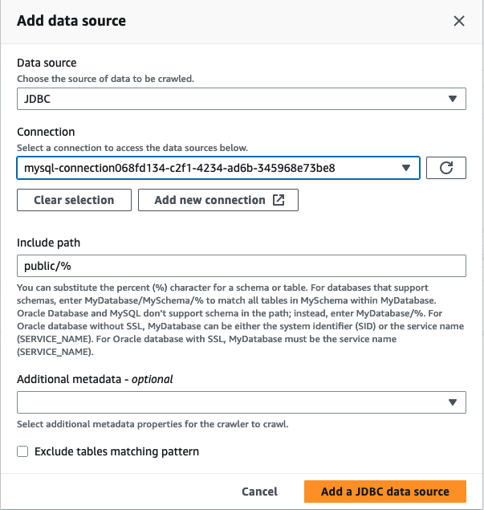

# Adding a JDBC connection using your own JDBC drivers

You can use your own JDBC driver when using a JDBC connection. When the default driver utilized by the AWS Glue crawler
is unable to connect to a database, you can use your own JDBC Driver. For example, if you want to use SHA-256 with your Postgres database,
and older postgres drivers do not support this, you can use your own JDBC driver.

## Supported datasources

| Supported datasources | Unsupported datasources |
| --------------------- | ----------------------- | --------------------------------------------------------------------------------------------------------------------------------------------------------------------------------------------------------------------------------------------------------------------------------------------------------------------------------------------------------------------------------------------------------------------------------------------------------------------------------------------------------------------------------------------------------------------------------------------------------------------------------------------------------------------------------------------------------------------------------------------------------------------------------------------------------------------------------------------------------------------------------------------------------------------------------------------------------------------------------------------------------------------------------------------------------------------------------------------------------------------------------------------------------------------------------------------------------------------------------------------------------------------------------------------------------------------------------------------------------------------------------------------------------------------------------------------------------------------------------------------------------------------------------------------------------------------------------------------------------------------------------------------------------------------------------------------------------------------------------------------------------------------------------------------------------------------------------------------------------------------------------------------------------------------------------------------------------------------------------------------------------------------------------------------------------------------------------------------------------------------------------------------------------------------------------------------------------------------------------------------------------------------------------------------------------------------------------------------------------------------------------------------------------------------------------------------------------------------------------------------------------------------------------------------------------------------------------------------------------------------------------------------------------------------------------------------------------------------------------------------------------------------------------------------------------------------------------------------------------------------------------------------------------------------------------------------------------------------------------------------------------------------------------------------------------------------------------------------------------------------------------------------------------------------------------------------------------------------------------------------------------------------------------------------------------------------------------------------------------------------------------------------------------------------------------------------------------------------------------------------------------------------------------------------------------------------------------------------------------------------------------------------------------------------------------------------------------------------------------------------------------------------------------------------------------------------------------------------------------------------------------------------------------------------------------------------------------------------------------------------------------------------------------------------------------------------------------------------------------------------------------------------------------------------------------------------------------------------------------------------------------------------------------------------------------------------------------------------------------------------------------------------------------------------------------------------------------------------------------------------------- |
| MySQL                 | Snowflake               |
| Postgres              |                         |
| Oracle                |                         |
| Redshift              |                         |
| SQL Server            |                         |
| Aurora\*              |                         | \*Supported if the native JDBC driver is being used. Not all driver features can be leveraged. ## Adding a JDBC driver to a JDBC connection ###### Note If you choose to bring in your own JDBC driver versions, AWS Glue crawlers will consume resources in AWS Glue jobs and Amazon S3 buckets to ensure your provided driver are run in your environment. The additional usage of resources will be reflected in your account. The cost for AWS Glue crawlers and jobs is under the AWS Glue category in billing. Additionally, providing your own JDBC driver does not mean that the crawler is able to leverage all of the driver's features. ###### To add your own JDBC driver to a JDBC connection: 1. Add the JDBC driver file to an Amazon S3 location. You can create a bucket and/or folder or use an existing bucket and/or folder. 2. In the AWS Glue console, choose **Connections** in the left-hand menu under **Data Catalog**, then create a new connection. 3. Complete the fields for **Connection properties** and choose JDBC for **Connection type**. 4. In **Connection access**, enter the **JDBC URL** and **JDBC Driver Class name** – _optional_. The driver class name must be for a datasource supported by AWS Glue crawlers.  5. Choose the Amazon S3 path where the JDBC driver is located in the **JDBC Driver Amazon S3 Path** – _optional_ field. 6. Complete the fields for Credential type if entering a username and password or secret. When complete, choose **Create connection**. ###### Note Testing connection is not supported currently. When crawling the data source with a JDBC driver you provided, the crawler skips this step. 7. Add the newly created connection to a crawler. In the AWS Glue console, choose **Crawlers** in the left-hand menu under **Data Catalog**, then create a new crawler. 8. In the **Add crawler** wizard, in Step 2 choose **Add a data source**.  9. Choose **JDBC** as the data source and choose the the connection that was created in the previous steps. Complete 10. In order to use your own JDBC driver with a AWS Glue crawler, add the following permissions to the role used by the crawler:  • Grant permissions for the following job actions: `CreateJob`, `DeleteJob`, `GetJob`, `GetJobRun`, `StartJobRun`.  • Grant permissions for IAM actions: `iam:PassRole`  • Grant permissions for Amazon S3 actions: `s3:DeleteObjects`, `s3:GetObject`, `s3:ListBucket`, `s3:PutObject`.  • Grant service principal access to bucket/folder in the IAM policy. Example IAM policy: JSON `` `{ "Version":"2012-10-17", "Statement": [ { "Sid": "VisualEditor0", "Effect": "Allow", "Action": [ "s3:PutObject", "s3:GetObject", "s3:ListBucket", "s3:DeleteObject" ], "Resource": [ "arn:aws:s3:::`amzn-s3-demo-bucket`/driver-parent-folder/driver.jar", "arn:aws:s3:::`amzn-s3-demo-bucket`" ] } ] }` `` The AWS Glue crawler creates two folders: \_glue_job_crawler and \_crawler. If the driver jar is located in the `s3://amzn-s3-demo-bucket/driver.jar"` folder, add the following resources: `"Resource": [ "arn:aws:s3:::amzn-s3-demo-bucket/_glue_job_crawler/*", "arn:aws:s3:::amzn-s3-demo-bucket/_crawler/*" ]` If the driver jar is located in the `s3://amzn-s3-demo-bucket/tmp/driver/subfolder/driver.jar"`folder, add the following resources: `"Resource": [ "arn:aws:s3:::amzn-s3-demo-bucket/tmp/_glue_job_crawler/*", "arn:aws:s3:::amzn-s3-demo-bucket/tmp/_crawler/*" ]` 11. If you are using a VPC, you must allow access to the AWS Glue endpoint by creating the interface endpoint and add it to your route table. For more information, see [Creating an interface VPC endpoint for AWS Glue](vpc-interface-endpoints.md#vpc-endpoint-create "vpc-interface-endpoints.md#vpc-endpoint-create") 12. If you are using encryption in your Data Catalog, create the AWS KMS interface endpoint and add it to your route table. For more information, see [Creating a VPC endpoint for AWS KMS](../../../kms/latest/developerguide/kms-vpc-endpoint.md#vpce-create-endpoint "../../../kms/latest/developerguide/kms-vpc-endpoint.md#vpce-create-endpoint"). |
