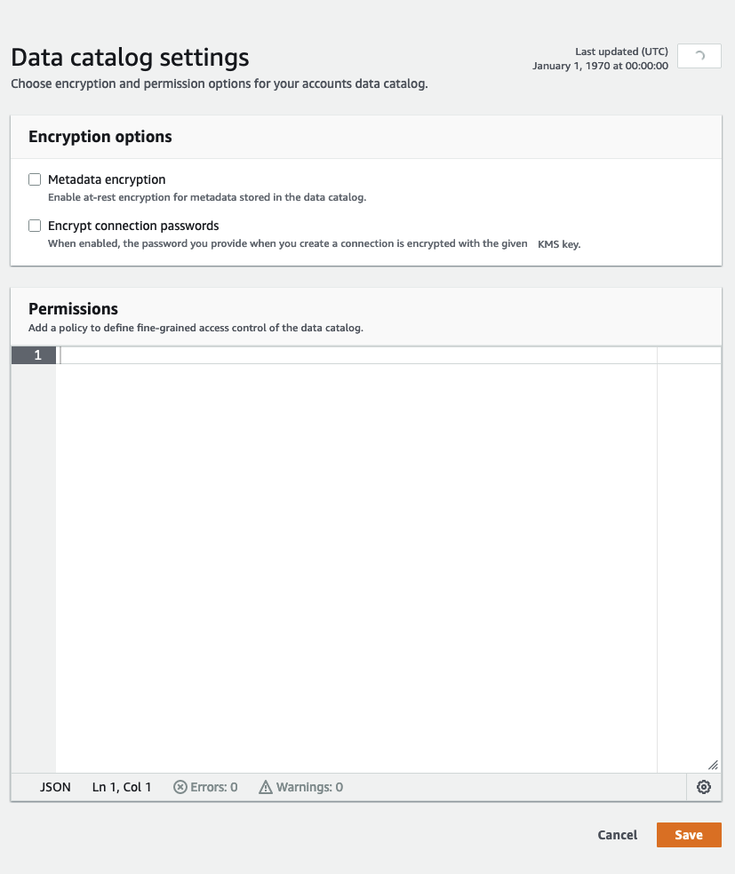

# Data Catalog settings

The Data Catalog settings contains options to set encryption and permissions options for the Data Catalog in your account.

###### To change the fine-grained access control of the Data Catalog

1. Sign in to the AWS Management Console and open the AWS Glue console at
   [https://console.aws.amazon.com/glue/](https://console.aws.amazon.com/glue/ "https://console.aws.amazon.com/glue/").
2. Choose an encryption option.
   - **Metadata encryption** – Select this check box to encrypt the metadata in your Data Catalog.
     Metadata is encrypted at rest using the AWS Key Management Service (AWS KMS) key that you specify. For more information, see
     [Encrypting your Data Catalog](encrypt-glue-data-catalog.md "encrypt-glue-data-catalog.md").
   - **Encrypt connection passwords** – Select this check box to encrypt passwords in the
     AWS Glue connection object when the connection
     is created or updated. Passwords are encrypted using the AWS KMS key that you
     specify. When passwords are returned, they are encrypted. This option is a
     global setting for all AWS Glue connections in the Data Catalog. If you clear this check
     box, previously encrypted passwords remain encrypted using the key that was used
     when they were created or updated. For more information about AWS Glue connections,
     see [Connecting to data](glue-connections.md "glue-connections.md").

   When you enable this option, choose an AWS KMS key, or choose **Enter a key
   ARN** and provide the Amazon Resource Name (ARN) for the key. Enter the ARN in the form
   `arn:aws:kms:`region`:`account-id`:key/`key-id``.
 You can also provide the ARN as a key alias, such as
 `arn:aws:kms:`region`:`account-id`:alias/`alias-name``.

   ###### Important

   If this option is selected, any user or role that creates or updates a connection must have `kms:Encrypt`
   permission on the specified KMS key.

   For more information, see [Encrypting connection
   passwords](encrypt-connection-passwords.md "encrypt-connection-passwords.md").

3. Choose **Settings**, and then in the **Permissions**
   editor, add the policy statement to change fine-grained access control of the
   Data Catalog for your account. Only one policy at a time can be attached to a
   Data Catalog. You can paste a
   JSON resource policy into this control. For more information, see [Resource-based
   policies within AWS Glue](security_iam_service-with-iam.md#security_iam_service-with-iam-resource-based-policies "security_iam_service-with-iam.md#security_iam_service-with-iam-resource-based-policies").
4. Choose **Save** to update your Data Catalog with any changes you made.

You can also use AWS Glue API operations to put, get, and delete resource policies. For
more information, see [Security APIs in AWS Glue](aws-glue-api-jobs-security.md "aws-glue-api-jobs-security.md").
