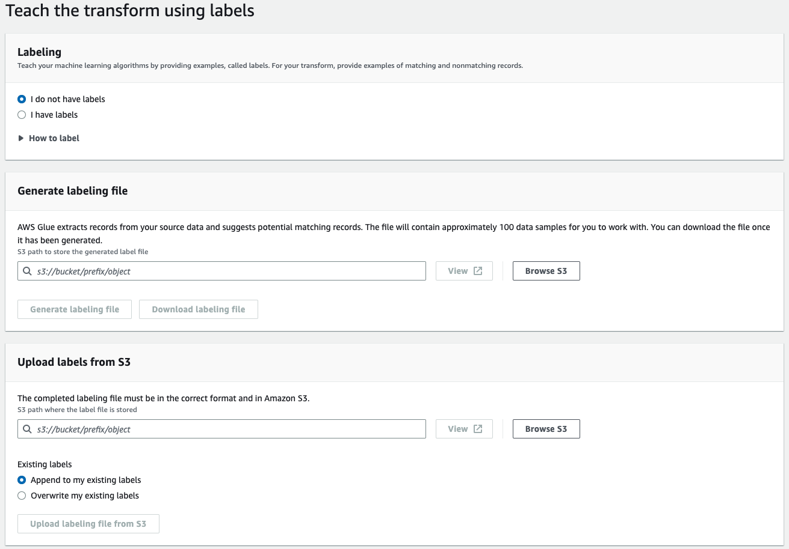

# Working with machine learning transforms

You can use AWS Glue to create custom machine learning transforms that can be used to
cleanse your data. You can use these transforms when you create a job on the AWS Glue
console.

For information about how to create a machine learning transform, see [Record matching with AWS Lake Formation FindMatches](machine-learning.md "machine-learning.md").

###### Topics

- [Transform properties](#console-machine-learning-properties "#console-machine-learning-properties")
- [Adding and editing machine learning
  transforms](#console-machine-learning-transforms-actions "#console-machine-learning-transforms-actions")
- [Viewing transform details](#console-machine-learning-transforms-details "#console-machine-learning-transforms-details")
- [Teach transforms using labels](#console-machine-learning-transforms-teaching-transforms "#console-machine-learning-transforms-teaching-transforms")

## Transform properties

To view an existing machine learning transform, sign in to the AWS Management Console, and open the
AWS Glue console at [https://console.aws.amazon.com/glue/](https://console.aws.amazon.com/glue/ "https://console.aws.amazon.com/glue/"). In the navigation pane under **Data Integration and ETL**,
choose **Data classification tools > Record Matching**.

The properties for each transform:

**Transform name**

The unique name you gave the transform when you created it.

**ID**

A unique identifier of the transform.

**Label count**

The number of labels in the labeling file that was provided to help teach the
transform.

**Status**

Indicates whether the transform is **Ready** or
**Needs training**. To run a machine learning transform
successfully in a job, it must be **Ready**.

**Created**

The date the transform was created.

**Modified**

The date the transform was last updated.

**Description**

The description supplied for the transform, if one was provided.

**AWS Glue version**

The version of AWS Glue used.

**Run ID**

The unique name you gave the transform when you created it.

**Task type**

The type of machine learning transform; for example, **Find
matching records**.

**Status**

Indicates the status of the task run. Possible statuses include:

- Starting
- Running
- Stopping
- Stopped
- Succeeded
- Failed
- Timeout

**Error**

If the status is Failed, an error message is displayed describing the reason for the failure.

## Adding and editing machine learning

transforms

You can view, delete, set up and teach, or tune a transform on the AWS Glue console.
Select the check box next to the transform in the list, choose
**Action**, and then choose the action that you want to
take.

### Creating a new ML transform

To add a new machine learning transform, choose **Create transform**. Follow the instructions in the **Add
job** wizard. For more information, see [Record matching with AWS Lake Formation FindMatches](machine-learning.md "machine-learning.md").

####

Step 1. Set transform properties.

1. Enter the name and description (optional).
2. Optionally, set security configuration. See [Using data encryption with machine learning
   transforms](#ml_transform_sec_config "#ml_transform_sec_config").
3. Optionally, set Task execution settings. Task execution settings allow you to customize how the
   task is run. Select the Worker type,
   number of workers, task timeout (in minutes), the number of retries, and the AWS Glue version.
4. Optionally, set Tags. Tags are labels that you can assign to an AWS resource.
   Each tag consists of a key and an optional value. Tags can be used to search and filter
   your resource or track your AWS costs.

####

Step 2. Choose table and primary key.

1. Choose the AWS Glue Catalog database and table.
2. Choose a primary key from the selected table. The primary key column typically contains a unique
   identifier for every record in the data source.

####

Step 3. Select tuning options.

1. For **Recall vs. precision**, choose the tuning value to tune the transform to favor recall or
   precision. By default, **Balanced** is selected, but you can choose
   to favor recall or favor precision, or choose **Custom** and enter a value between 0.0 and 1.0 (inclusive).
2. For **Lower cost vs. accuracy**, choose the tuning value to favor lower cost or accuracy, or choose
   **Custom** and enter a value between 0.0 and 1.0 (inclusive).
3. For **Match enforcement**, choose **Force output to match labels**
   if you want to teach the ML transform by forcing the output to match the labels used.

####

Step 4. Review and create.

1. Review the options for steps 1 – 3.
2. Choose **Edit** for any step that needs to be modified. Choose **Create transform**
   to complete the create transform wizard.

### Using data encryption with machine learning

transforms

When adding a machine learning transform to AWS Glue, you can optionally specify a
security configuration that is associated with the data source or data target. If
the Amazon S3 bucket used to store the data is encrypted with a security
configuration, specify the same security configuration when creating the
transform.

You can also choose to use server-side encryption with AWS KMS (SSE-KMS) to encrypt
the model and labels to prevent unauthorized persons from inspecting it. If you
choose this option, you're prompted to choose the AWS KMS key by name, or
you can choose **Enter a key ARN**. If you choose to enter the ARN
for the KMS key, a second field appears where you can enter the KMS key ARN.

###### Note

Currently, ML transforms that use a custom encryption
key aren't supported in the following Regions:

- Asia Pacific (Osaka) - `ap-northeast-3`

## Viewing transform details

### Viewing transform properties

The **Transform properties** page includes attributes of your transform. It
shows you the details about the transform definition, including the
following:

- **Transform name** shows the name of the transform.
- **Type** lists the type of the transform.
- **Status** displays whether the transform is ready to be used in a script or job.
- **Force output to match labels** displays whether the transform forces the output to match the labels provided by the user.
- **Spark version** is related to the AWS Glue version you
  chose in the **Task run properties** when adding the
  transform. AWS Glue 1.0 and Spark 2.4 is recommended for most customers.
  For
  more information, see [AWS Glue
  Versions](release-notes.md#release-notes-versions "release-notes.md#release-notes-versions").

### History, Estimate quality and Tags tabs

Transform details include the information that you defined when you created the
transform. To view the details of a transform, select the transform in the
**Machine learning transforms** list, and review the information on
the following tabs:

- History
- Estimate quality
- Tags

#### History

The **History** tab shows your transform task run history. Several types of tasks are run to teach a transform. For each task, the run metrics include the
following:

- **Run ID** is an identifier created by AWS Glue for each run
  of this task.
- **Task type** shows the type of task run.
- **Status** shows the success of each task listed with
  the most recent run at the top.
- **Error** shows the details of an error message if the
  run was not successful.
- **Start time** shows the date and time (local time) that
  the task started.
- **End time** shows the date and time (local time) that
  the task ended.
- **Logs** links to the logs written to `stdout`
  for this job run.

The **Logs** link takes you to Amazon CloudWatch Logs. There you can
view the details about the tables that were created in the AWS Glue Data Catalog and
any errors that were encountered. You can manage your log retention period
on the CloudWatch console. The default log retention is `Never Expire`.
For more information about how to change the retention period, see [Change Log Data Retention
in CloudWatch Logs](../../../AmazonCloudWatch/latest/logs/Working-with-log-groups-and-streams.md#SettingLogRetention "../../../AmazonCloudWatch/latest/logs/Working-with-log-groups-and-streams.md#SettingLogRetention")
in the _Amazon CloudWatch Logs User Guide_.

- **Label file** shows a link to Amazon S3 for a generated labeling file.

#### Estimate quality

The **Estimate quality** tab shows the metrics that you use to measure the
quality of the transform. Estimates are calculated by comparing the transform match predictions using a subset of your
labeled data against the labels you have provided. These estimates are approximate. You can invoke an
**Estimate quality** task run from this tab.

The **Estimate quality** tab shows the metrics from the last **Estimate quality** run
including the following properties:

- **Area under the Precision-Recall curve** is a single
  number estimating the upper bound of the overall quality of the transform. It is independent of
  the choice made for the precision-recall parameter. Higher values indicate
  that you have a more attractive precision-recall tradeoff.
- **Precision** estimates how often the transform is
  correct when it predicts a match.
- **Recall upper limit** estimates that for an actual match, how
  often the transform predicts the match.
- **F1** estimates the transform's accuracy between 0 and 1, where 1 is the best accuracy.
  For more information, see [F1 score](https://en.wikipedia.org/wiki/F1_score "https://en.wikipedia.org/wiki/F1_score") in
  Wikipedia.
- The **Column importance** table show the column names and importance score for each column.
  Column importance helps you understand how columns contribute to your model, by identifying which columns in your
  records are being used the most to do the matching. This data may prompt you to add to or change your labelset to raise
  or lower the importance of columns.

The Importance column provides a numerical score for each column, as a decimal not greater than 1.0.

For information about understanding quality estimates versus true quality, see [Quality estimates versus end-to-end (true) quality](#console-machine-learning-quality-estimates-true-quality "#console-machine-learning-quality-estimates-true-quality").

For more information about tuning your transform, see [Tuning machine learning transforms in AWS Glue](add-job-machine-learning-transform-tuning.md "add-job-machine-learning-transform-tuning.md").

#### Quality estimates versus end-to-end (true) quality

AWS Glue estimates the quality of
your transform by presenting the internal machine-learned model with a number of
pairs of records that you provided matching labels for but that the model has not
seen before. These quality estimates are a function of the quality of the
machine-learned model (which is influenced by the number of records that you label
to “teach” the transform). The end-to-end, or _true_ recall (which is not automatically calculated by the
`ML transform`) is also influenced by the `ML transform` filtering mechanism that proposes a
wide variety of possible matches to the machine-learned model.

You can tune this filtering method primarily by specifying the **Lower
Cost-Accuracy** tuning value. As the tuning value gets closer to favor
**Accuracy**, the system does a more thorough and expensive
search for pairs of records that might be matches. More pairs of records are fed to
your machine-learned model, and your `ML transform`'s end-to-end
or true recall gets closer to the estimated recall metric. As a result, changes in
the end-to-end quality of your matches as a result of changes in the cost/accuracy
tradeoff for your matches will typically not be reflected in the quality
estimate.

#### Tags

Tags are labels that you can assign to an AWS resource.
Each tag consists of a key and an optional value. Tags can be used to search and filter
your resource or track your AWS costs.

## Teach transforms using labels

You can teach your ML transform using labels (examples) by choosing **Teach transform** from the ML transform details page.
When you teach your machine learning algorithm by providing examples (called labels), you can choose existing labels to use, or
create a labeling file.

- **Labeling** – If you have labels, choose **I have labels**. If you do not have labels,
  you can still continue with the next step
  in generating a labeling file.
- **Generate labeling file** – AWS Glue extracts records from your source data
  and suggest potential matching records. You choose the Amazon S3 bucket to store the generated label file. Choose
  **Generate labeling file** to start the process. When done, choose **Download
  labeling file**. The downloaded file will have a column for labels where you can fill in the labels.
- **Upload labels from Amazon S3** – Choose the completed labeling file from the Amazon S3 bucket where the
  label file is stored. Then, choose to either append the labels to your existing labels or to overwrite your existing labels.
  Choose **Upload labeling file from Amazon S3**.
