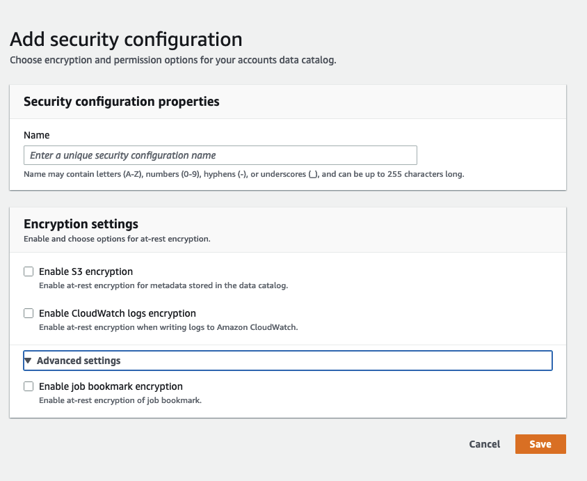

# Managing security configurations on

the AWS Glue console

###### Warning

AWS Glue security configurations are not currently supported in Ray jobs.

A _security configuration_ in AWS Glue contains the properties that are
needed when you write encrypted data. You create security configurations on the AWS Glue
console to provide the encryption properties that are used by crawlers, jobs, and
development endpoints.

To see a list of all the security configurations that you have created, open the AWS Glue
console at [https://console.aws.amazon.com/glue/](https://console.aws.amazon.com/glue/ "https://console.aws.amazon.com/glue/") and choose **Security configurations** in the
navigation pane.

The **Security configurations** list displays the following properties
about each configuration:

**Name**
The unique name you provided when you created the configuration. The name may contain
letters (A-Z), numbers (0-9), hypens (-), or underscores (\_), and be up to 255 characters long.

**Enable Amazon S3 encryption**
If turned on, the Amazon Simple Storage Service (Amazon S3) encryption mode such as `SSE-KMS` or
`SSE-S3` is enabled for metadata store in the data catalog.

**Enable Amazon CloudWatch logs encryption**
If turned on, the Amazon S3 encryption mode such as `SSE-KMS` is enabled when
writing logs to Amazon CloudWatch.

**Advanced settings: Enable job bookmark encryption**
If turned on, the Amazon S3 encryption mode such as `CSE-KMS` is enabled
when jobs are bookmarked.

You can add or delete configurations in the **Security configurations**
section on the console. To see more details for a configuration, choose the configuration
name in the list. Details include the information that you defined when you created the
configuration.

## Adding a security configuration

To add a security configuration using the AWS Glue console, on the **Security
configurations** page, choose **Add security
configuration**.



**Security configuration properties**

Enter a unique security configuration name. The name may contain letters (A-Z), numbers (0-9), hyphens (-),
or underscores (\_), and can be up to 255 characters long.

**Encryption settings**

You can enable at-rest encryption for metadata stored in the Data Catalog in Amazon S3 and logs in Amazon CloudWatch.
To set up encryption of data and metadata with AWS Key Management Service (AWS KMS) keys on the AWS Glue
console, add a policy to the console user. This policy must specify the allowed
resources as key Amazon Resource Names (ARNs) that are used to encrypt Amazon S3 data stores,
as in the following example.

JSON

```
`{
 "Version":"2012-10-17",
 "Statement": {
 "Effect": "Allow",
 "Action": [
 "kms:GenerateDataKey",
 "kms:Decrypt",
 "kms:Encrypt"
 ],
 "Resource": "arn:aws:kms:`us-east-1`:`111122223333`:key/`key-id`"
 }
}`

```

###### Important

When a security configuration is attached to a crawler or job, the IAM
role that is passed must have AWS KMS permissions. For more information, see [Encrypting data written by
AWS Glue](encryption-security-configuration.md "encryption-security-configuration.md").

When you define a configuration, you can provide values for the following properties:

**Enable S3 encryption**
When you are writing Amazon S3 data, you use either server-side encryption with Amazon S3 managed keys
(SSE-S3) or server-side encryption with AWS KMS managed keys (SSE-KMS). This
field is optional. To allow access to Amazon S3, choose an AWS KMS key, or choose
**Enter a key ARN** and provide the ARN for the key.
Enter the ARN in the form
`arn:aws:kms:`region`:`account-id`:key/`key-id``.
 You can also provide the ARN as a key alias, such as
 `arn:aws:kms:`region`:`account-id`:alias/`alias-name``.

If you enable Spark UI for your job, the Spark UI log file uploaded to Amazon S3 will be applied with the same encryption.

###### Important

AWS Glue supports only symmetric customer master keys (CMKs). The **AWS KMS
key** list displays only symmetric keys. However, if you
select **Choose a AWS KMS key ARN**, the console lets you
enter an ARN for any key type. Ensure that you enter only ARNs for
symmetric keys.

**Enable CloudWatch Logs encryption**
Server-side (SSE-KMS) encryption is used to encrypt CloudWatch Logs. This field is optional. To turn
it on, choose an AWS KMS key, or choose **Enter a key ARN** and
provide the ARN for the key. Enter the ARN in the form
`arn:aws:kms:`region`:`account-id`:key/`key-id``.
 You can also provide the ARN as a key alias, such as
 `arn:aws:kms:`region`:`account-id`:alias/`alias-name``.

**Advanced settings: Job bookmark encryption**
Client-side (CSE-KMS) encryption is used to encrypt job bookmarks. This field is optional. The
bookmark data is encrypted before it is sent to Amazon S3 for storage. To turn
it on, choose an AWS KMS key, or choose **Enter a key ARN** and
provide the ARN for the key. Enter the ARN in the form
`arn:aws:kms:`region`:`account-id`:key/`key-id``.
 You can also provide the ARN as a key alias, such as
 `arn:aws:kms:`region`:`account-id`:alias/`alias-name``.

For more information, see the following topics in the
_Amazon Simple Storage Service User Guide_:

- For information about `SSE-S3`, see [Protecting Data Using
  Server-Side Encryption with Amazon S3-Managed Encryption Keys
  (SSE-S3)](../../../AmazonS3/latest/userguide/UsingServerSideEncryption.md "../../../AmazonS3/latest/userguide/UsingServerSideEncryption.md").
- For information about `SSE-KMS`, see [Protecting Data Using Server-Side
  Encryption with AWS KMS keys](../../../AmazonS3/latest/userguide/UsingKMSEncryption.md "../../../AmazonS3/latest/userguide/UsingKMSEncryption.md").
- For information about `CSE-KMS`, see [Using a KMS key stored in AWS KMS](../../../AmazonS3/latest/userguide/UsingClientSideEncryption.md#client-side-encryption-kms-managed-master-key-intro "../../../AmazonS3/latest/userguide/UsingClientSideEncryption.md#client-side-encryption-kms-managed-master-key-intro").
