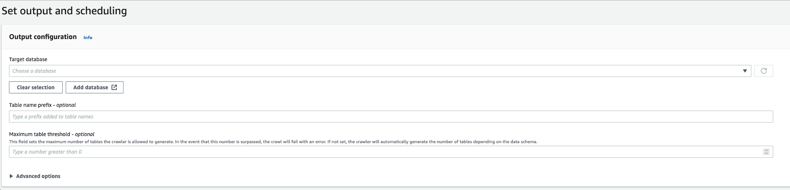

# Specifying the maximum number of tables the crawler is allowed to create

You can optionally specify the maximum number of tables the crawler is allowed to create by specifying a `TableThreshold` via the AWS Glue console or AWS CLI.
If the tables detected by the crawler during its crawl is greater that this input value, the crawl fails and no data is written to the Data Catalog.

This parameter is useful when the tables that would be detected and created by the crawler are much greater more than what you expect. There can be multiple reasons for this, such as:

- When using an AWS Glue job to populate your Amazon S3 locations you can end up with empty files at the same level as a folder. In such cases when you run a crawler on this Amazon S3 location, the crawler creates multiple tables due to files and folders present at the same level.
- If you do not configure `"TableGroupingPolicy": "CombineCompatibleSchemas"` you may end up with more tables than expected.
  You specify the `TableThreshold` as an integer value greater than 0. This value is configured on a per crawler basis. That is, for every crawl this value is considered. For example: a crawler has the `TableThreshold` value set as 5. In each crawl AWS Glue compares the number of tables detected with this table threshold value (5) and if the number of tables detected is less than 5, AWS Glue writes the tables to the Data Catalog and if not, the crawl fails without writing to the Data Catalog.

AWS Management Console

###### To set `TableThreshold` using the AWS Management Console:

1. Sign in to the AWS Management Console and open the AWS Glue console at
   [https://console.aws.amazon.com/glue/](https://console.aws.amazon.com/glue/ "https://console.aws.amazon.com/glue/").
2. When configuring a crawler, in **Output and scheduling**, set the
   **Maximum table threshold** to the number of tables the crawler is allowed
   generate.



AWS CLI
To set `TableThreshold` using the AWS CLI:

```
aws glue update-crawler \
    --name myCrawler \
    --configuration '{"Version": 1.0, "CrawlerOutput": {"Tables": { "TableThreshold": 5 }}}'
```

API
To set `TableThreshold` using the API:

```
"{"Version":1.0,
"CrawlerOutput":
{"Tables":{"AddOrUpdateBehavior":"MergeNewColumns",
"TableThreshold":5}}}";
```

Error messages are logged to help you identify table paths and clean-up your data. Example log in your account if the crawler fails because the table count was greater than table threshold value provided:

```
Table Threshold value = 28, Tables detected - 29
```

In CloudWatch, we log all table locations detected as an INFO message. An error is logged as the reason for the failure.

```
ERROR com.amazonaws.services.glue.customerLogs.CustomerLogService - CustomerLogService received CustomerFacingException with message
The number of tables detected by crawler: 29 is greater than the table threshold value provided: 28. Failing crawler without writing to Data Catalog.
com.amazonaws.services.glue.exceptions.CustomerFacingInternalException: The number of tables detected by crawler: 29 is greater than the table threshold value provided: 28.
Failing crawler without writing to Data Catalog.
```
