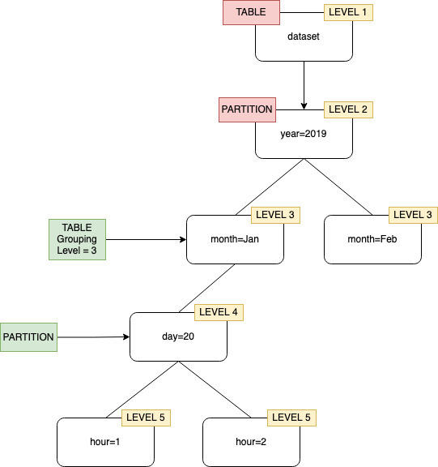
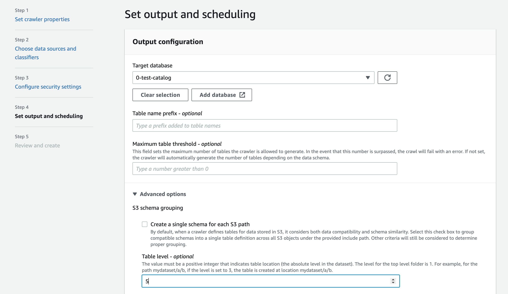

# Specifying the table location and partitioning

level

By default, when a crawler defines tables for data stored in Amazon S3 the crawler attempts to
merge schemas together, and create top-level tables (`year=2019`). In some cases,
you may expect the crawler to create a table for the folder `month=Jan` but instead
the crawler creates a partition since a sibling folder (`month=Mar`) was merged
into the same table.

The table level crawler option provides you the flexibility to tell the crawler where the
tables are located, and how you want partitions created. When you specify a **Table
level**, the table is created at that absolute level from the Amazon S3 bucket.



When configuring the crawler on the console, you can specify a value for the **Table level** crawler option.
The value must be a positive integer that indicates the table location (the absolute level in the dataset).
The level for the top level folder is 1. For example, for the path `mydataset/year/month/day/hour`, if the level is set to 3,
the table is created at location `mydataset/year/month`.

AWS Management Console

1. Sign in to the AWS Management Console and open the AWS Glue console at
   [https://console.aws.amazon.com/glue/](https://console.aws.amazon.com/glue/ "https://console.aws.amazon.com/glue/").
2. Choose **Crawlers** under the
   **Data Catalog**.
3. When you configure a crawler, under **Output and scheduling**, choose **Table
   level** under **Advance options**.



AWS CLI
When you configure the crawler using the AWS CLI, set the `configuration`
parameter as shown in the example code:

```
aws glue update-crawler \
  --name myCrawler \
  --configuration '{"Version": 1.0, "Grouping": { "TableLevelConfiguration": 2 }}'

```

API
When you configure the crawler using the API, set the `Configuration`
field with a string representation of the following JSON object; for example:

```
configuration = jsonencode(
{
   "Version": 1.0,
   "Grouping": {
            TableLevelConfiguration = 2
        }
})

```

CloudFormationIn this example, you set the **Table level** option available in the console
within your CloudFormation template:

```
"Configuration": "{
    \"Version\":1.0,
    \"Grouping\":{\"TableLevelConfiguration\":2}
}"
```
