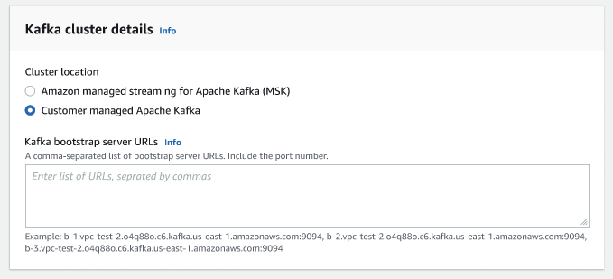
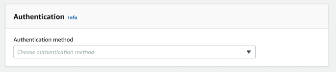
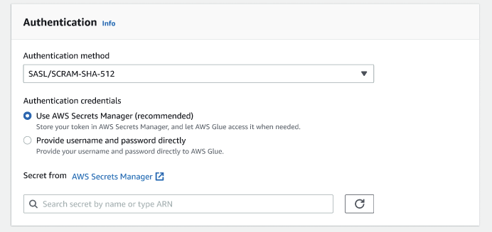
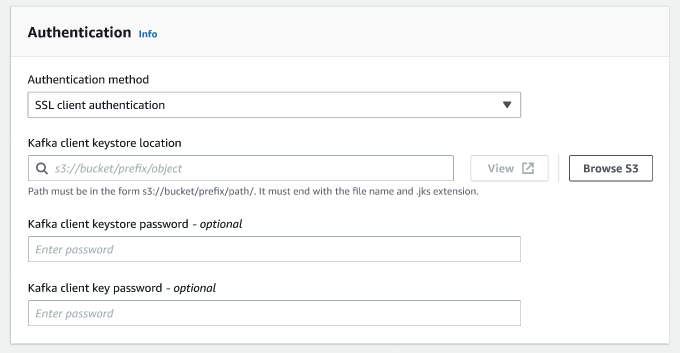
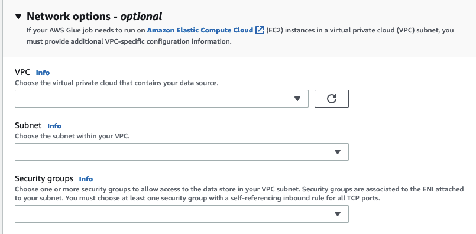

#

Creating a Kafka connection

When creating a Kafka connection, selecting **Kafka** from the drop-down menu will
display additional settings to configure:

- Kafka cluster details
- Authentication
- Encryption
- Network options

**Configure Kafka cluster details**

1. Choose the cluster location. You can choose from an **Amazon managed streaming for Apache Kafka (MSK)**
   cluster
   or a
   **Customer managed Apache Kafka** cluster. For more information on Amazon Managed streaming for
   Apache Kafka, see
   [Amazon managed streaming for Apache Kafka
   (MSK)](../../../msk/latest/developerguide/what-is-msk.md "../../../msk/latest/developerguide/what-is-msk.md").

###### Note

Amazon Managed Streaming for Apache Kafka only supports TLS and SASL/SCRAM-SHA-512 authentication methods.

 2. Enter the URLs for your Kafka bootstrap servers. You may enter more than one by separating each server by a comma.
Include the port number at the end of the URL by appending `:<port number>`.

For example:
`b-1.vpc-test-2.034a88o.kafka-us-east-1.amazonaws.com:9094`

**Select authentication method**

AWS Glue supports the Simple Authentication and Security Layer (SASL)
framework for authentication. The SASL framework supports various mechanisms of
authentication, and AWS Glue offers the SCRAM (username and password), GSSAPI (Kerberos protocol), and PLAIN (username and password) protocols.

When choosing an authentication method from the drop-down menu, the following client
authentication methods can be selected:

- None - No authentication. This is useful if you create a connection for testing
  purposes.
- SASL/SCRAM-SHA-512 - Choose this authentication method to specify authentication
  credentials. There are two options available:
  - Use AWS Secrets Manager (recommended) - if you select this option, you can
    store your credentials in AWS Secrets Manager and let AWS Glue access
    the information when needed. Specify the secret that stores the SSL or SASL
    authentication credentials.

  
  - Provide username and password directly.

- SASL/GSSAPI (Kerberos) - if you select this option, you can select the location of the keytab file, krb5.conf file and
  enter the Kerberos principal name and Kerberos service name. The locations for the keytab file and krb5.conf file
  must be in an Amazon S3 location. Since MSK does not yet support SASL/GSSAPI, this option is only available for
  customer managed Apache Kafka clusters.
  For more information, see
  [MIT Kerberos Documentation: Keytab](https://web.mit.edu/kerberos/krb5-latest/doc/basic/keytab_def.html "https://web.mit.edu/kerberos/krb5-latest/doc/basic/keytab_def.html") .
- SASL/PLAIN - Choose this authentication method to specify authentication credentials. There are two options available:
  - Use AWS Secrets Manager (recommended) - if you select this option, you can store your credentials in AWS Secrets Manager and let AWS Glue access the information when needed. Specify the secret that stores the SSL or SASL authentication credentials.
  - Provide username and password directly.

- SSL Client Authentication - if you select this option, you can you can select the location of the Kafka client
  keystore by browsing Amazon S3. Optionally, you can
  enter the Kafka client keystore password and Kafka client key password.

**Configure encryption settings**

1. If the Kafka connection requires SSL connection, select the checkbox for **Require SSL connection**.
   Note that the connection will fail if it's unable to connect over SSL. SSL for encryption can be used with any of the authentication methods
   (SASL/SCRAM-SHA-512, SASL/GSSAPI, SASL/PLAIN, or SSL Client Authentication) and is optional.

If the authentication method is set to **SSL client authentication**, this option will be
selected automatically and will be disabled to prevent any changes. 2. (Optional). Choose the location of private certificate from certificate authority (CA). Note that the location of the
certification must be in an S3 location. Choose **Browse** to choose the file from a connected
S3 bucket. The path must be in the form
`s3://bucket/prefix/filename.pem`. It must end with the file name and .pem extension. 3. You can choose to skip validation of certificate from a certificate authority (CA). Choose the checkbox
**Skip validation of certificate from certificate authority (CA)**. If this box is not checked,
AWS Glue validates certificates for three algorithms:

    * SHA256withRSA
    * SHA384withRSA
    * SHA512withRSA

**(Optional) Network options**

The following are optional steps to configure VPC, Subnet and Security groups.
If your AWS Glue job needs to run on Amazon EC2 instances in a virtual private cloud (VPC) subnet,
you must provide additional VPC-specific configuration information.

1. Choose the VPC (virtual private cloud) that contains your data source.
2. Choose the subnet with your VPC.
3. Choose one or more security groups to allow access to the data store in your VPC subnet.
   Security groups are associated to the ENI attached to your subnet.
   You must choose at least one security group with a self-referencing inbound rule for all TCP ports.

