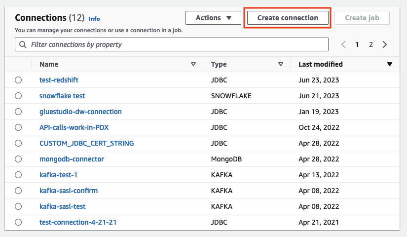
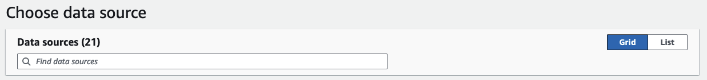
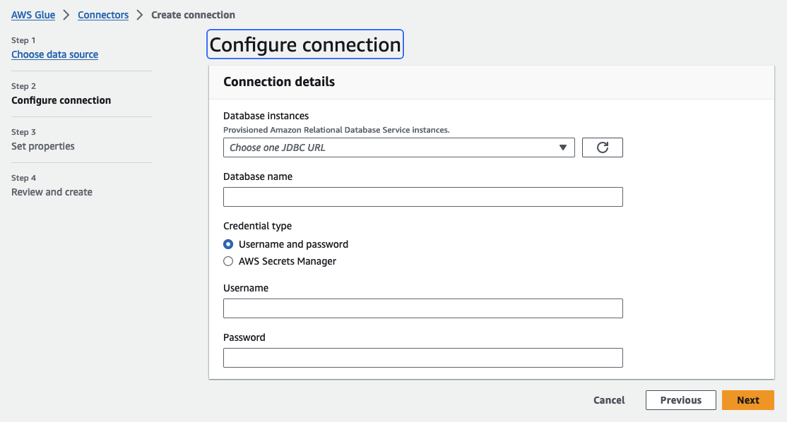

# Creating connections for connectors

An AWS Glue connection is a Data Catalog object that stores connection information for a
particular data store. Connections store login credentials, URI strings, virtual private cloud
(VPC) information, and more. Creating connections in the Data Catalog saves the effort of having to
specify all connection details every time you create a job.

###### To create a connection for a connector

1. In the AWS Glue Studio console, choose **Connectors** in the console
   navigation pane. In the **Connections** section, choose **Create connection**.
2. Choose the data source you want to create a connection for in step 1 of the **Create data connection**
   wizard. There are several ways to view the available data sources, including:
   - Filter the available data sources by choosing a tab. By default, **All connectors** is selected.
   - Toggle **List** to view the data sources as a list or toggle back to **Grid**
     to view the available connectors in the grid layout.
   - Use the search bar to narrow the list of data sources. As you type, search matches are displayed and non-matching
     sources are removed from view.

Once you've chosen the data source, choose **Next**. 3. Configure the connection in Step 2 in the wizard.

Enter the connection details. Depending on the type of connector you selected, you're
prompted to enter additional information:

 4. Choose the data source you want to create a connection for in step 1 of the **Create data
connection** wizard. There are several ways to view the available data sources.
By default, you will see all available data sources in a grid layout. You can also:

    * Toggle **List** to view the data sources as a list or toggle back to
     **Grid** to view the available connectors in the grid layout.
    * Use the search bar to narrow the list of data sources. As you type, search matches are displayed and
     non-matching sources are removed from view.

    

Once you've chosen the data source, choose **Next**. 5. Configure the connection in Step 2 in the wizard.

Enter the connection details. Depending on the type of connector you selected, you may be required
to enter additional connection information. This can include:

    * **Connection details** – these fields will change depending on the data source
     you are connecting to. For example, if you are connecting to Amazon DocumentDB databases, you will enter
     the Amazon DocumentDB URL. If you are connecting to Amazon Aurora, you will choose the database instance
     and enter the database name. The following is the Connection details required for Amazon Aurora:

    
    * Credential type – choose between **Username and password** or **AWS Secrets Manager**. Enter the requested authentication information.
    * For connectors that use JDBC, enter the information required to create the JDBC
     URL for the data store.
    * If you use a virtual private cloud (VPC), then enter the network information for
     your VPC.

6. Set the connection properties in step 3 of the wizard. You can add a description and tags as an optional part of this step.
   Name is required and is prepopulated with a default value.
   Choose **Next**.
7. Review the connection source, details, and properties. If you need to make any changes, choose
   **Edit** for the step in the wizard. When ready, choose, **Create connection** .

Choose **Create connection**.

You are returned to the **Connectors** page, and the informational
banner indicates the connection that was created. You can now use the connection in your
AWS Glue Studio
jobs.
