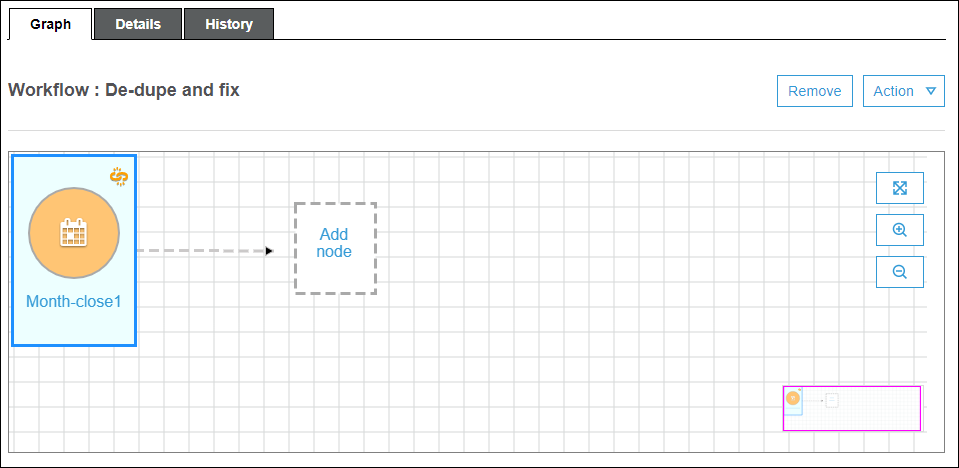
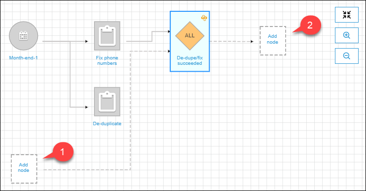

# Creating and building out a workflow manually

in AWS Glue

You can use the AWS Glue console to manually create and build out a workflow one node at a
time.

A workflow contains jobs, crawlers, and triggers. Before manually creating a workflow,
create the jobs and crawlers that the workflow is to include. It's best to specify
run-on-demand crawlers for workflows. You can create new triggers while you are building out
your workflow, or you can _clone_ existing triggers into
the workflow. When you clone a trigger, all the catalog objects associated with the
trigger—the jobs or crawlers that fire it and the jobs or crawlers that it
starts—are added to the workflow.

###### Important

Limit the total number of jobs, crawlers, and triggers within a workflow to 100 or
less. If you include more than 100, you might get errors when trying to resume or stop
workflow runs.

You build out your workflow by adding triggers to the workflow graph, and defining the
watched events and actions for each trigger. You begin with a _start
trigger_, which can be either an on-demand or schedule trigger, and complete
the graph by adding event (conditional) triggers.

## Step 1: Create the workflow

1. Sign in to the AWS Management Console and open the AWS Glue console at
   [https://console.aws.amazon.com/glue/](https://console.aws.amazon.com/glue/ "https://console.aws.amazon.com/glue/").
2. In the navigation pane, under **ETL**, choose
   **Workflows**.
3. Choose **Add workflow** and complete the **Add a new
   ETL workflow** form.

Any optional default run properties that you add are made available as
arguments to all jobs in the workflow. For more information, see [Getting and setting workflow run properties in
AWS Glue](workflow-run-properties-code.md "workflow-run-properties-code.md"). 4. Choose **Add workflow**.

The new workflow appears in the list on the **Workflows**
page.

## Step 2: Add a start trigger

1.  On the **Workflows** page, select your new workflow. Then, at
    the bottom of the page, ensure that the **Graph** tab is
    selected.
2.  Choose **Add trigger**, and in the **Add
    trigger** dialog box, do one of the following:
    - Choose **Clone existing**, and choose a trigger to
      clone. Then choose **Add**.

    The trigger appears on the graph, along with the jobs and crawlers
    that it watches and the jobs and crawlers that it starts.

    If you mistakenly selected the wrong trigger, select the trigger on
    the graph, and then choose **Remove**.
    - Choose **Add new**, and complete the **Add
      trigger** form.

          1. For **Trigger type**, select
           **Schedule**, **On
           demand**, or **EventBridge
           event**.

          For trigger type **Schedule**, choose one of
           the **Frequency** options. Choose
           **Custom** to enter a `cron`
           expression.

          For trigger type **EventBridge event**, enter
           **Number of events** (batch size), and
           optionally enter **Time delay** (batch window).
           If you omit **Time delay**, the batch window
           defaults to 15 minutes. For more information, see [Overview of workflows in AWS Glue](workflows_overview.md "workflows_overview.md").
          2. Choose **Add**.

      The trigger appears on the graph, along with a placeholder node
      (labeled **Add node**). In the example below, the start
      trigger is a schedule trigger named `Month-close1`.

    At this point, the trigger isn't saved yet.

    

3.  If you added a new trigger, complete these steps:
    1. Do one of the following:
       - Choose the placeholder node (**Add
         node**).
       - Ensure that the start trigger is selected, and on the
         **Action** menu above the graph, choose
         **Add jobs/crawlers to trigger**.

    2. In the **Add jobs(s) and crawler(s) to trigger**
       dialog box, select one or more jobs or crawlers, and then choose
       **Add**.

    The trigger is saved, and the selected jobs or crawlers appear on the
    graph with connectors from the trigger.

    If you mistakenly added the wrong jobs or crawlers, you can select
    either the trigger or a connector and choose
    **Remove**.

## Step 3: Add more triggers

Continue to build out your workflow by adding more triggers of type
**Event**. To zoom in or out or to enlarge the graph canvas, use
the icons to the right of the graph. For each trigger to add, complete the following
steps:

###### Note

There is no action to save the workflow. After you add your last trigger and
assign actions to the trigger, the workflow is complete and saved. You can always
come back later and add more nodes.

1. Do one of the following:
   - To clone an existing trigger, ensure that no node on the graph is
     selected, and on the **Action** menu, choose
     **Add trigger**.
   - To add a new trigger that watches a particular job or crawler on the
     graph, select the job or crawler node, and then choose the **Add
     trigger** placeholder node.

   You can add more jobs or crawlers to watch for this trigger in a later
   step.

2. In the **Add trigger** dialog box, do one of the
   following:
   - Choose **Add new**, and complete the **Add
     trigger** form. Then choose
     **Add**.

   The trigger appears on the graph. You will complete the trigger in a
   later step.
   - Choose **Clone existing**, and choose a trigger to
     clone. Then choose **Add**.

   The trigger appears on the graph, along with the jobs and crawlers
   that it watches and the jobs and crawlers that it starts.

   If you mistakenly chose the wrong trigger, select the trigger on the
   graph, and then choose **Remove**.

3. If you added a new trigger, complete these steps:
   1. Select the new trigger.

   As the following graph shows, the trigger `De-dupe/fix
 succeeded` is selected, and placeholder nodes appear for (1)
   events to watch and (2) actions.

    2. (Optional if the trigger already watches an event and you want to add
   more jobs or crawlers to watch.) Choose the events-to-watch placeholder
   node, and in the **Add job(s) and crawler(s) to watch**
   dialog box, select one or more jobs or crawlers. Choose an event to
   watch (SUCCEEDED, FAILED, etc.), and choose
   **Add**. 3. Ensure that the trigger is selected, and choose the actions
   placeholder node. 4. In the **Add job(s) and crawler(s) to watch dialog**
   box, select one or more jobs or crawlers, and choose
   **Add**.

   The selected jobs and crawlers appear on the graph, with connectors
   from the trigger.

For more information on workflows and blueprints, see the following topics.

- [Overview of workflows in AWS Glue](workflows_overview.md "workflows_overview.md")
- [Running and monitoring a workflow in
  AWS Glue](running_monitoring_workflow.md "running_monitoring_workflow.md")
- [Creating a workflow from a blueprint in
  AWS Glue](creating_workflow_blueprint.md "creating_workflow_blueprint.md")
