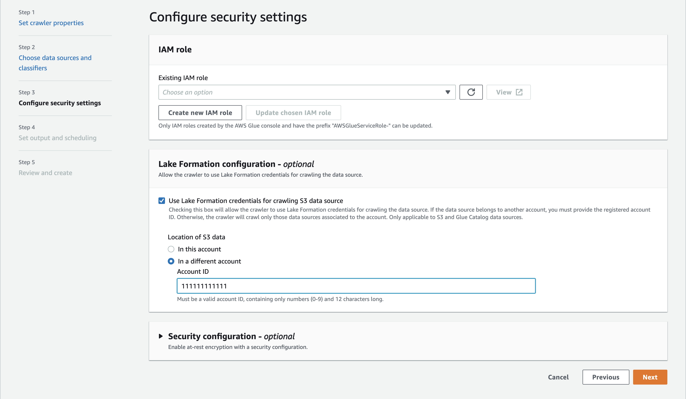

# Setup required when the crawler and registered Amazon S3

location reside in different accounts (cross-account crawling)

To allow the crawler to access a data store in a different account using
Lake Formation credentials, you must first register the Amazon S3 data location with Lake Formation. Then, you grant
data location permissions to the crawler's account by taking the following steps.

You can complete the following steps using the AWS Management Console or AWS CLI.

AWS Management Console

1. In the account where the Amazon S3 location is registered (account B):
   1. Register an Amazon S3 path with Lake Formation. For more information, see [Registering Amazon S3
      location](../../../lake-formation/latest/dg/register-location.md "../../../lake-formation/latest/dg/register-location.md").
   2. Grant **Data location** permissions to the account (account A) where the crawler will be run. For more information, see
      [Grant data location permissions](../../../lake-formation/latest/dg/granting-location-permissions-local.md "../../../lake-formation/latest/dg/granting-location-permissions-local.md").
   3. Create an empty database in Lake Formation with the underlying location as the target
      Amazon S3 location. For more information, see [Creating a database](../../../lake-formation/latest/dg/creating-database.md "../../../lake-formation/latest/dg/creating-database.md").
   4. Grant account A (the account where the crawler will be run) access to the
      database that you created in the previous step. For more information, see [Granting
      database permissions](../../../lake-formation/latest/dg/granting-database-permissions.md "../../../lake-formation/latest/dg/granting-database-permissions.md").

2. In the account where the crawler is created and will be run (account A):
   1. Using the AWS RAM console, accept the database that was shared from the external account (account B). For more information, see [Accepting a resource share invitation from AWS Resource Access Manager](../../../lake-formation/latest/dg/accepting-ram-invite.md "../../../lake-formation/latest/dg/accepting-ram-invite.md").
   2. Create an IAM role for the crawler. Add `lakeformation:GetDataAccess` policy to the role.
   3. In the Lake Formation console ([https://console.aws.amazon.com/lakeformation/](https://console.aws.amazon.com/lakeformation/ "https://console.aws.amazon.com/lakeformation/")), grant **Data location** permissions on the target Amazon S3 location to the IAM role used for the crawler run so that the crawler can read the data from the destination in Lake Formation.
      For more information, see [Granting data location permissions](../../../lake-formation/latest/dg/granting-location-permissions-local.md "../../../lake-formation/latest/dg/granting-location-permissions-local.md").
   4. Create a resource link on the shared database. For more information, see [Create a resource link](../../../lake-formation/latest/dg/create-resource-link-database.md "../../../lake-formation/latest/dg/create-resource-link-database.md").
   5. Grant the crawler role access permissions (`Create`) on the shared database and (`Describe`) the resource link. The resource link is specified in the output for the crawler.
   6. In the AWS Glue console ([https://console.aws.amazon.com/glue/](https://console.aws.amazon.com/glue/ "https://console.aws.amazon.com/glue/")), while configuring the crawler,
      select the option **Use Lake Formation credentials for crawling Amazon S3 data
      source**.

   For cross-account crawling, specify the AWS account ID where the
   target Amazon S3 location is registered with Lake Formation. For in-account crawling, the
   accountId field is optional.

   

AWS CLI

```
aws glue --profile demo create-crawler --debug --cli-input-json '{
    "Name": "prod-test-crawler",
    "Role": "arn:aws:iam::111122223333:role/service-role/AWSGlueServiceRole-prod-test-run-role",
    "DatabaseName": "prod-run-db",
    "Description": "",
    "Targets": {
    "S3Targets":[
                {
                 "Path": "s3://amzn-s3-demo-bucket"
                }
                ]
                },
   "SchemaChangePolicy": {
      "UpdateBehavior": "LOG",
      "DeleteBehavior": "LOG"
  },
  "RecrawlPolicy": {
    "RecrawlBehavior": "CRAWL_EVERYTHING"
  },
  "LineageConfiguration": {
    "CrawlerLineageSettings": "DISABLE"
  },
  **"LakeFormationConfiguration": {
 "UseLakeFormationCredentials": true,
 "AccountId": "111111111111"**
  },
  "Configuration": {
           "Version": 1.0,
           "CrawlerOutput": {
             "Partitions": { "AddOrUpdateBehavior": "InheritFromTable" },
             "Tables": {"AddOrUpdateBehavior": "MergeNewColumns" }
           },
           "Grouping": { "TableGroupingPolicy": "CombineCompatibleSchemas" }
         },
  "CrawlerSecurityConfiguration": "",
  "Tags": {
    "KeyName": ""
  }
}'
```

###### Note

- A crawler using Lake Formation credentials is only supported for Amazon S3 and Data Catalog targets.
- For targets using Lake Formation credential vending, the underlying Amazon S3 locations must belong to the same bucket. For example, customers can use multiple targets (s3://amzn-s3-demo-bucket1/folder1, s3://amzn-s3-demo-bucket1/folder2) as long as all target locations are under the same bucket (amzn-s3-demo-bucket1). Specifying different buckets (s3://amzn-s3-demo-bucket1/folder1, s3://amzn-s3-demo-bucket2/folder2) is not allowed.
- Currently for Data Catalog target crawlers, only a single catalog target with a single catalog table is allowed.
