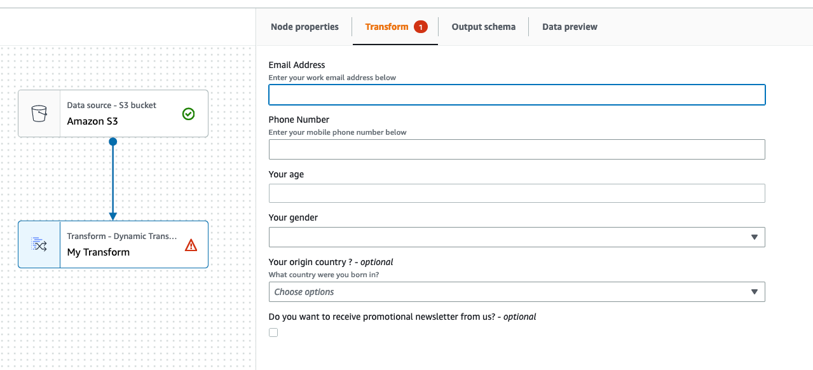

#

Step 5. Use custom visual transforms in AWS Glue Studio

To use a custom visual transform in AWS Glue Studio, you upload the config and source files, then select the transform
from the **Action** menu. Any parameters that need values or input are available to you in the
**Transform** tab.

1. Upload the two files (Python source file and JSON config file) to the Amazon S3 assets folder where the job scripts are stored.
   By default, AWS Glue
   pulls all JSON files from the **/transforms** folder within the same Amazon S3 bucket.
2. From the **Action** menu, choose the custom visual transform. It is named with the transform
   `displayName` or name
   that you specified in the .json config file.
3. Enter values for any parameters that were configured in the config file.

