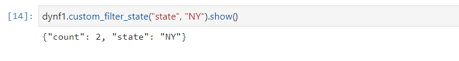

#

Step 2. Implement the transform logic

###### Note

Custom visual transforms only support Python scripts. Scala is not supported.

To add the code that implements the function defined by the .json config file, it is recommended to place the Python file
in the same location as the .json file, with the same name but with the “.py” extension. AWS Glue Studio automatically
pairs the .json and .py files so that you don’t need to specify the path of the Python file in the config file.

In the Python file, add the declared function, with the named parameters configured and register it to be used in
`DynamicFrame`. The following is an example of a Python file:

```
from awsglue import DynamicFrame

# self refers to the DynamicFrame to transform,
# the parameter names must match the ones defined in the config
# if it's optional, need to provide a default value
def myTransform(self, email, phone, age=None, gender="",
                      country="", promotion=False):
   resulting_dynf = # do some transformation on self
   return resulting_dynf

DynamicFrame.myTransform = myTransform

```

It is recommended to use an AWS Glue notebook for the quickest way to develop and test the python code.
See [Getting started with notebooks in AWS Glue Studio](../ug/notebook-getting-started.md "../ug/notebook-getting-started.md").

To illustrate how to implement the transform logic, the custom visual transform in the example below is a transform to filter
incoming data to keep only the data related to a specific US state.
The .json file contains the parameter for `functionName` as `custom_filter_state` and
two arguments ("state" and "colName" with type "str").

The example config .json file is:

```
{
"name": "custom_filter_state",
"displayName": "Filter State",
"description": "A simple example to filter the data to keep only the state indicated.",
"functionName": "custom_filter_state",
"parameters": [
   {
    "name": "colName",
    "displayName": "Column name",
    "type": "str",
    "description": "Name of the column in the data that holds the state postal code"
   },
   {
    "name": "state",
    "displayName": "State postal code",
    "type": "str",
    "description": "The postal code of the state whole rows to keep"
   }
  ]
}

```

###### To implement the companion script in Python

1. Start a AWS Glue notebook and run the initial cell
   provided for the session to be started. Running the initial cell creates the basic components required.
2. Create a function that performs the filtering as describe in the example and register it on
   `DynamicFrame`.
   Copy the code below and paste into a cell in the AWS Glue notebook.

```
from awsglue import DynamicFrame

def custom_filter_state(self, colName, state):
    return self.filter(lambda row: row[colName] == state)

DynamicFrame.custom_filter_state = custom_filter_state

```

3. Create or load sample data to test the code in the same cell or a new cell. If you add the sample
   data in a new cell, don't forget to run the cell. For example:

```
# A few of rows of sample data to test
data_sample = [
    {"state": "CA", "count": 4},
    {"state": "NY", "count": 2},
    {"state": "WA", "count": 3}
]
df1 = glueContext.sparkSession.sparkContext.parallelize(data_sample).toDF()
dynf1 = DynamicFrame.fromDF(df1, glueContext, None)

```

4. Test to validate the “custom_filter_state” with different arguments:

 5. After running several tests, save the code
with the .py extension and name the .py file with a name that mirrors the .json file name.
The .py and .json files should be in the same transform folder.

Copy the following code and paste it to a file and rename it with a .py file extension.

```
from awsglue import DynamicFrame

def custom_filter_state(self, colName, state):
    return self.filter(lambda row: row[colName] == state)

DynamicFrame.custom_filter_state = custom_filter_state

```

6. In AWS Glue Studio, open a visual job and add the transform to the job by selecting it from the list of
   available **Transforms**.

To reuse this transform in a Python script code, add the Amazon S3 path to the .py file in the job under “Referenced files path”
and in the script, import the name of the python file (without the extension) by adding it to the top of the file. For example:
`import` <name of the file (without the extension)>
