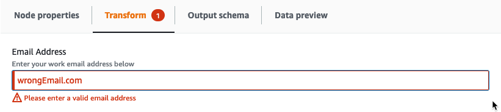
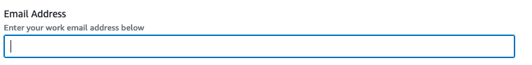
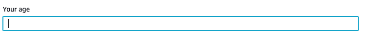
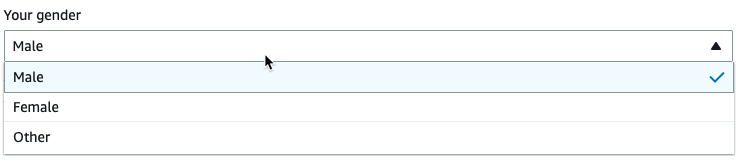
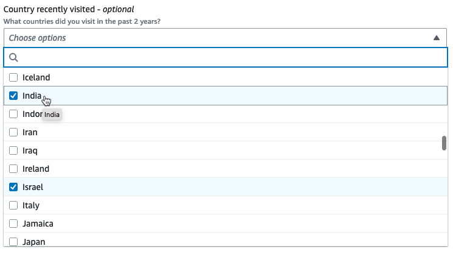
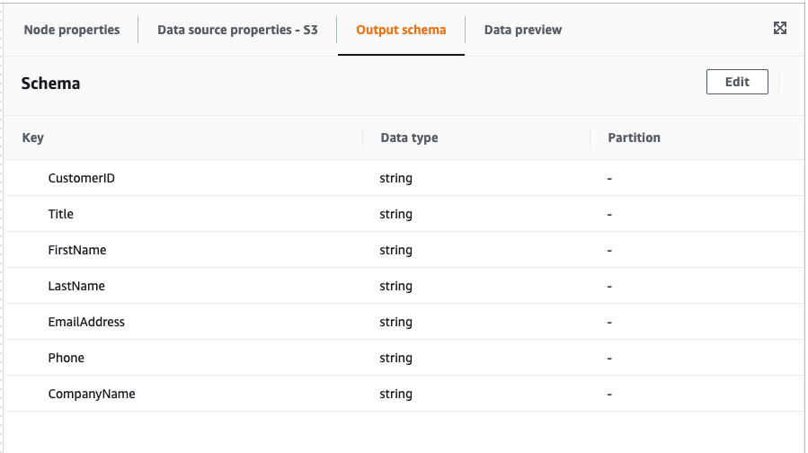
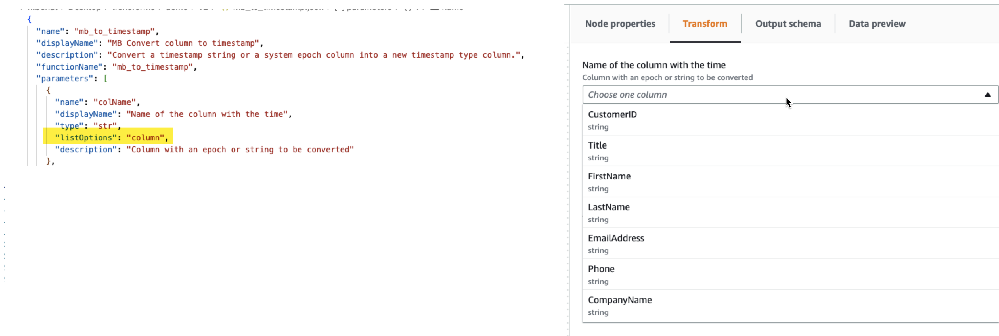
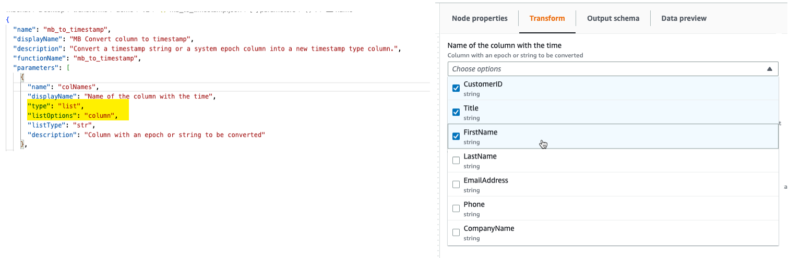

#

Step 1. Create a JSON config file

A JSON config file is required to define and describe your custom visual transform.
The schema for the config file is as follows.

##

JSON file structure

**Fields**

- `name: string` – (required) the transform system name used to identify transforms.
  Follow the same naming rules set for python variable names (identifiers). Specifically, they must start with either a
  letter or an underscore and then be composed entirely of letters, digits, and/or underscores.
- `displayName: string` – (optional) the name of the transform displayed in the AWS Glue Studio
  visual job editor. If no `displayName` is specified, the `name` is used as the name of the transform in
  AWS Glue Studio.
- `description: string` – (optional) the transform description is displayed in AWS Glue Studio
  and is searchable.
- `functionName: string` – (required) the Python function name is used to identify the function to call in
  the Python script.
- `path: string` – (optional) the full Amazon S3 path to the Python source file. If not specified,
  AWS Glue uses file name matching to pair the .json and .py files together. For example,
  the name of the JSON file, `myTransform.json`, will be paired to the Python file, `myTransform.py`,
  on the same Amazon S3 location.
- `parameters: Array of TransformParameter object` – (optional) the list of parameters to be displayed when
  you configure them in the AWS Glue Studio visual editor.

**TransformParameter fields**

- `name: string` – (required) the parameter name that will be passed to the python function as a named
  argument in the job script.
  Follow the same naming rules set for python variable names (identifiers). Specifically, they must start with either a
  letter or an underscore and then be composed entirely of letters, digits, and/or underscores.
- `displayName: string` – (optional) the name of the transform displayed in the AWS Glue Studio
  visual job editor. If no `displayName` is specified, the `name` is used as the name of the transform in
  AWS Glue Studio.
- `type: string` – (required) the parameter type accepting common Python data types.
  Valid values: 'str' | 'int' | 'float' | 'list' | 'bool'.
- `isOptional: boolean` – (optional) determines whether the parameter is optional.
  By default all parameters are required.
- `description: string` — (optional) description is displayed in AWS Glue Studio to help
  the user configure the transform parameter.
- `validationType: string` – (optional) defines the way this parameter is validated. Currently,
  it only supports regular expressions.
  By default, the validation type is set to `RegularExpression`.
- `validationRule: string` – (optional) regular expression used to validate form input before submit
  when `validationType` is set to `RegularExpression`. Regular expression syntax must be compatible with
  [RegExp Ecmascript specifications](https://tc39.es/ecma262/multipage/text-processing.html#sec-regexp-regular-expression-objects "https://tc39.es/ecma262/multipage/text-processing.html#sec-regexp-regular-expression-objects").
- `validationMessage: string` – (optional) the message to display when validation fails.
- `listOptions: An array of TransformParameterListOption object` OR a `string`
  or the string value ‘column’ – (optional) options to display in Select or Multiselect UI control.
  Accepting a list of comma separated value or a strongly type JSON object of type `TransformParameterListOption`.
  It can also dynamically populate the list of columns from the parent node schema by specifying the string value “column”.
- `listType: string` – (optional) Define options types for type = 'list'.
  Valid values: 'str' | 'int' | 'float' | 'list' | 'bool'.
  Parameter type accepting common python data types.

**TransformParameterListOption fields**

- `value: string | int | float | bool` – (required) option value.
- `label: string` – (optional) option label displayed in the select dropdown.

##

Transform parameters in AWS Glue Studio

By default, parameters are required unless mark as `isOptional` in the .json file.
In AWS Glue Studio, parameters are displayed in the **Transform** tab. The example shows
user-defined parameters such as Email Address, Phone Number, Your age, Your gender and
Your origin country.


You can enforce some validations in AWS Glue Studio using regular expressions in the json file
by specifying the
`validationRule` parameter and specifying a validation message in `validationMessage`.

```
      "validationRule": "^\\(?(\\d{3})\\)?[- ]?(\\d{3})[- ]?(\\d{4})$",
      "validationMessage": "Please enter a valid US number"

```

###### Note

Since validation occurs in the browser, your regular expression syntax must be compatible with
[RegExp Ecmascript specifications](https://tc39.es/ecma262/multipage/text-processing.html#sec-regexp-regular-expression-objects "https://tc39.es/ecma262/multipage/text-processing.html#sec-regexp-regular-expression-objects"). Python syntax is not supported for these regular expressions.

Adding validation will prevent the user from saving the job with incorrect user input. AWS Glue Studio displays the
validation message as displayed in the example:



Parameters are displayed in AWS Glue Studio based on the parameter configuration.

- When `type` is any of the following: `str`, `int` or `float`, a text input field is
  displayed. For example, the screenshot shows input fields for 'Email Address' and 'Your age' parameters.





- When `type` is `bool`, a checkbox is displayed.


- When `type` is `str` and `listOptions` is provided, a single select list is displayed.



- When `type` is `list` and `listOptions` and `listType` are provided,
  a multi-select list is displayed.



### Displaying a column selector as parameter

If the configuration requires the user to choose a column from the schema, you can display a column selector so the user isn't
required to type the column name. By setting the `listOptions` field to '“column”, AWS Glue Studio dynamically
displays a column selector based on the parent node output schema. AWS Glue Studio can display either a single or multiple
column selector.

The following example uses the schema:



###### To define your Custom Visual Transform parameter to display a single column:

1. In your JSON file, for the `parameters` object, set the `listOptions` value to "column".
   This allows a user to choose a column from a pick list in AWS Glue Studio.

 2. You can also allow multiple columns selection by defining the parameter as:

    * `listOptions: "column"`
    * `type: "list"`


