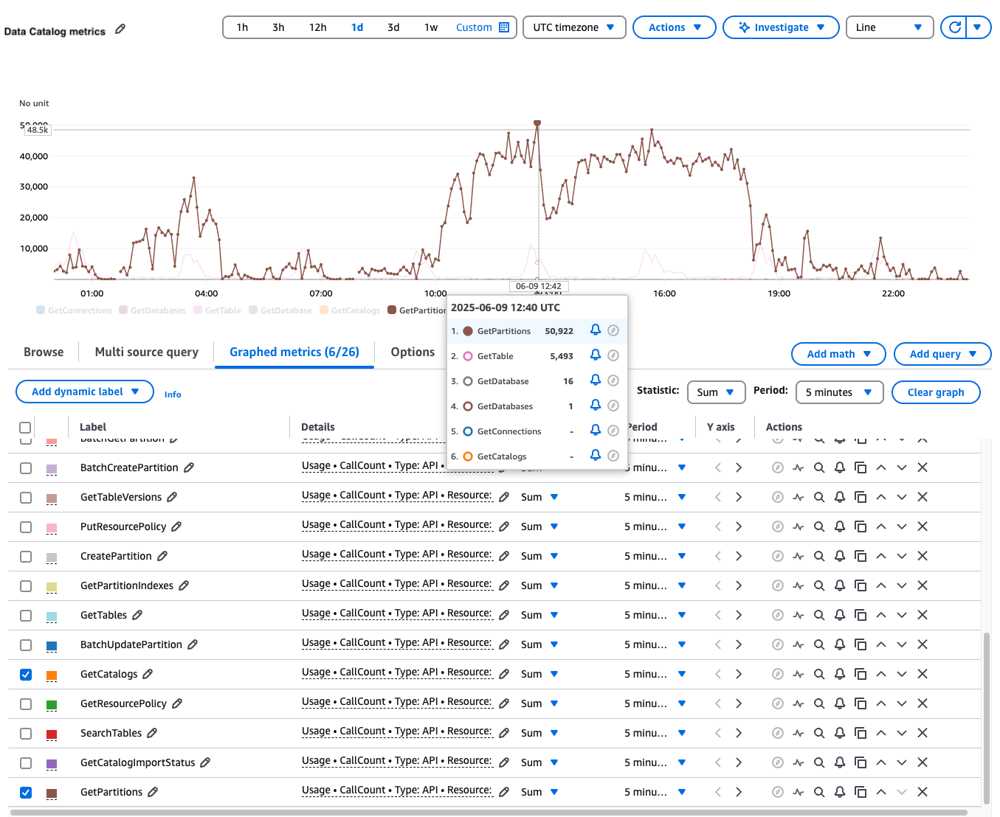

# Monitoring Data Catalog usage metrics in Amazon CloudWatch

AWS Glue Data Catalog usage metrics are now available with Amazon CloudWatch, simplifying the monitoring and understanding of resource utilization in your Data Catalog. You now have immediate visibility into your Glue Catalog API usage of catalogs, databases, tables, partitions, and connections, making it easier to maintain oversight of your Data Catalog.

## Overview of Data Catalog metrics

AWS Glue Data Catalog automatically publishes usage metrics to Amazon CloudWatch. With CloudWatch metrics integration, you can track critical performance indicators every minute, including:

- Table requests
- Partition indexes created
- Connections updated
- Statistics updated

These metrics help you identify bottlenecks, detect anomalies, and make data-driven decisions to improve overall data catalog reliability.
You can also set up CloudWatch alarms to receive notifications when metrics exceed specified thresholds, allowing for proactive management of your deployment.

## Adding metrics to your CloudWatch dashboard

You can create custom dashboards to monitor your AWS Glue Data Catalog resources and set up alarms to be notified of any unusual activity.

You can add Data Catalog metrics to your CloudWatch dashboard by following these steps:

1. Open the CloudWatch console at
   [https://console.aws.amazon.com/cloudwatch/](https://console.aws.amazon.com/cloudwatch/ "https://console.aws.amazon.com/cloudwatch/").
2. In the navigation pane, choose **Metrics**.
3. Choose **All metrics**.
4. Choose **Usage>By AWS resource**.
5. Filter by **Glue** to see available metrics.
6. Select the metrics you want to add to your dashboard.
7. Add metrics for catalogs, databases, tables, partitions, and connections to your CloudWatch graph.

You can configure custom alarms that trigger automatically when API usage exceeds your defined thresholds to identify abnormalities in your data catalog usage.

For detailed instructions on setting up alarms, see [Creating a Metrics Insights CloudWatch alarm](../../../AmazonCloudWatch/latest/monitoring/cloudwatch-metrics-insights-alarm-create.md "../../../AmazonCloudWatch/latest/monitoring/cloudwatch-metrics-insights-alarm-create.md").
