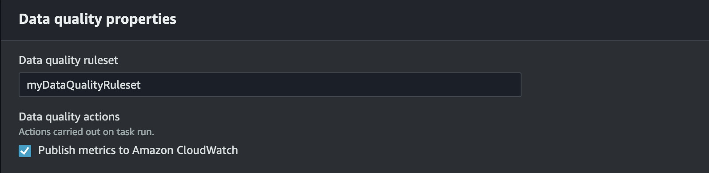
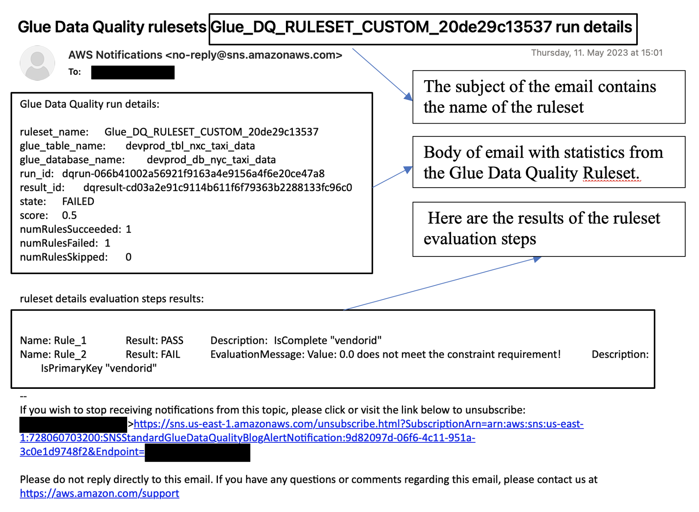

# Setting up alerts, deployments, and scheduling

This topic describes how to set up alerts, deployments, and scheduling for AWS Glue Data Quality.

###### Contents

- [Setting up alerts and notifications in Amazon EventBridge integration](data-quality-alerts.md#data-quality-alerts-eventbridge "data-quality-alerts.md#data-quality-alerts-eventbridge")
  - [Additional configuration options for the event pattern](data-quality-alerts.md#data-quality-alerts-eventbridge-config-options "data-quality-alerts.md#data-quality-alerts-eventbridge-config-options")
  - [Formatting notifications as emails](data-quality-alerts.md#data-quality-alerts-eventbridge-format-notifications "data-quality-alerts.md#data-quality-alerts-eventbridge-format-notifications")

- [Set up alerts and notifications in CloudWatch integration](data-quality-alerts.md#data-quality-alerts-cloudwatch "data-quality-alerts.md#data-quality-alerts-cloudwatch")
- [Querying data quality results to build dashboards](data-quality-alerts.md#data-quality-alerts-querying-results "data-quality-alerts.md#data-quality-alerts-querying-results")
- [Deploying data quality rules using AWS CloudFormation](data-quality-alerts.md#data-quality-deploy-cfn "data-quality-alerts.md#data-quality-deploy-cfn")
- [Scheduling data quality rules](data-quality-alerts.md#data-quality-scheduling-rules "data-quality-alerts.md#data-quality-scheduling-rules")

## Setting up alerts and notifications in Amazon EventBridge integration

AWS Glue Data Quality supports the publishing of EventBridge events, which are emitted upon completion of a Data Quality ruleset evaluation run. With this, you can easily setup alerts when data quality rules fail.

Here is a sample event when you evaluate data quality rulesets in the Data Catalog. With this information, you can review the data that is made available with Amazon EventBridge. You can issue additional API calls to get more details. For example, call the `get_data_quality_result` API with the result ID to get the details of a particular execution.

```
{
    "version":"0",
    "id":"abcdef00-1234-5678-9abc-def012345678",
    "detail-type":"Data Quality Evaluation Results Available",
    "source":"aws.glue-dataquality",
    "account":"123456789012",
    "time":"2017-09-07T18:57:21Z",
    "region":"us-west-2",
    "resources":[],
    "detail":{
        "context": {
                    "contextType": "GLUE_DATA_CATALOG",
                    "runId":"dqrun-12334567890",
                    "databaseName": "db-123",
                    "tableName": "table-123",
                    "catalogId": "123456789012"
                    },
        "resultID": "dqresult-12334567890",
        "rulesetNames": ["rulset1"],
        "state":"SUCCEEDED",
        "score": 1.00,
        "rulesSucceeded": 100,
        "rulesFailed": 0,
        "rulesSkipped": 0
    }
}
```

Here is a sample event that gets published when you evaluate data quality rulesets in AWS Glue ETL or AWS Glue Studio notebooks.

```
{
    "version":"0",
    "id":"abcdef00-1234-5678-9abc-def012345678",
    "detail-type":"Data Quality Evaluation Results Available",
    "source":"aws.glue-dataquality",
    "account":"123456789012",
    "time":"2017-09-07T18:57:21Z",
    "region":"us-west-2",
    "resources":[],
    "detail":{
        "context": {
                    "contextType": "GLUE_JOB",
                    "jobId": "jr-12334567890",
                    "jobName": "dq-eval-job-1234",
                    "evaluationContext": "",
                    }
        "resultID": "dqresult-12334567890",
        "rulesetNames": ["rulset1"],
        "state":"SUCCEEDED",
        "score": 1.00
        "rulesSucceeded": 100,
        "rulesFailed": 0,
        "rulesSkipped": 0
    }
}
```

For Data Quality evaluation runs both in the Data Catalog and in ETL jobs, the **Publish metrics to Amazon CloudWatch** option, which is selected by default, must remain selected for EventBridge publishing to work.

**Setting up EventBridge notifications**



To receive the emitted events and define targets, you must configure Amazon EventBridge rules. To create rules:

1. Open the Amazon EventBridge console.
2. Choose **Rules** under the **Buses** section of the navigation bar.
3. Choose **Create Rule**.
4. On **Define Rule Detail**:
   1. For Name, enter `myDQRule`.
   2. Enter the description (optional).
   3. For event bus, select your event bus. If you don’t have one, leave it as default.
   4. For Rule type select **Rule with an event pattern** then choose **Next**.

5. On **Build Event Pattern**:
   1. For event source select **AWS events or EventBridge partner events**.
   2. Skip the sample event section.
   3. For creation method select **Use pattern form**.
   4. For event pattern:
      1. Select **AWS services** for Event source.
      2. Select **Glue Data Quality** for AWS service.
      3. Select **Data Quality Evaluation Results Available** for Event type.
      4. Select **FAILED** for Specific state(s). Then you see an event pattern similar to the following:

      ```
      {
        "source": ["aws.glue-dataquality"],
        "detail-type": ["Data Quality Evaluation Results Available"],
        "detail": {
          "state": ["FAILED"]
        }
      }
      ```

      5. For more configuration options see [Additional configuration options for the event pattern](#data-quality-alerts-eventbridge-config-options "#data-quality-alerts-eventbridge-config-options").

6. On **Select Target(s)**:
   1. For **Target Types** select **AWS service**.
   2. Use the **Select a target** dropdown to choose your desired AWS service to connect to (SNS, Lambda, SQS, etc.), then choose **Next**.

7. On **Configure tag(s)** click **Add new tags** to add optional tags then choose **Next**.
8. You see a summary page of all the selections. Choose **Create rule** at the bottom.

### Additional configuration options for the event pattern

In addition to filtering your event on success or failure, you may want to further filter events on different parameters.

To do this, go to the Event Pattern section, and select **Edit pattern** to specify additional parameters. Note that fields in the event pattern are case sensitive. The following are examples of configuring the event pattern.

To capture events from a particular table evaluating specific rulesets use this type of pattern:

```
{
  "source": ["aws.glue-dataquality"],
  "detail-type": ["Data Quality Evaluation Results Available"],
  "detail": {
    "context": {
      "contextType": ["GLUE_DATA_CATALOG"],
      "databaseName": "db-123",
       "tableName": "table-123",
    },
    "rulesetNames": ["ruleset1", "ruleset2"]
    "state": ["FAILED"]
  }
}
```

To capture events from specific jobs in the ETL experience use this type of pattern:

```
{
  "source": ["aws.glue-dataquality"],
  "detail-type": ["Data Quality Evaluation Results Available"],
  "detail": {
    "context": {
      "contextType": ["GLUE_JOB"],
      "jobName": ["dq_evaluation_job1", "dq_evaluation_job2"]
    },
    "state": ["FAILED"]
  }
}
```

To capture events with a score under a specific threshold (e.g. 70%):

```
{
  "source": ["aws.glue-dataquality"],
  "detail-type": ["Data Quality Evaluation Results Available"],
  "detail": {
    "score": [{
      "numeric": ["<=", 0.7]
    }]
  }
}
```

### Formatting notifications as emails

Sometimes you need to send a well-formatted email notification to your business teams. You can use Amazon EventBridge and AWS Lambda to achieve this.



The following sample code can be used to format your data quality notifications to generate emails.

```
import boto3
import json
from datetime import datetime

sns_client = boto3.client('sns')
glue_client = boto3.client('glue')

sns_topic_arn = 'arn:aws:sns:<region-code>:<account-id>:<sns-topic-name>'


def lambda_handler(event, context):
    log_metadata = {}
    message_text = ""
    subject_text = ""

    if event['detail']['context']['contextType'] == 'GLUE_DATA_CATALOG':
        log_metadata['ruleset_name'] = str(event['detail']['rulesetNames'][0])
        log_metadata['tableName'] = str(event['detail']['context']['tableName'])
        log_metadata['databaseName'] = str(event['detail']['context']['databaseName'])
        log_metadata['runId'] = str(event['detail']['context']['runId'])
        log_metadata['resultId'] = str(event['detail']['resultId'])
        log_metadata['state'] = str(event['detail']['state'])
        log_metadata['score'] = str(event['detail']['score'])
        log_metadata['numRulesSucceeded'] = str(event['detail']['numRulesSucceeded'])
        log_metadata['numRulesFailed'] = str(event['detail']['numRulesFailed'])
        log_metadata['numRulesSkipped'] = str(event['detail']['numRulesSkipped'])

        message_text += "Glue Data Quality run details:\n"
        message_text += "ruleset_name: {}\n".format(log_metadata['ruleset_name'])
        message_text += "glue_table_name: {}\n".format(log_metadata['tableName'])
        message_text += "glue_database_name: {}\n".format(log_metadata['databaseName'])
        message_text += "run_id: {}\n".format(log_metadata['runId'])
        message_text += "result_id: {}\n".format(log_metadata['resultId'])
        message_text += "state: {}\n".format(log_metadata['state'])
        message_text += "score: {}\n".format(log_metadata['score'])
        message_text += "numRulesSucceeded: {}\n".format(log_metadata['numRulesSucceeded'])
        message_text += "numRulesFailed: {}\n".format(log_metadata['numRulesFailed'])
        message_text += "numRulesSkipped: {}\n".format(log_metadata['numRulesSkipped'])

        subject_text = "Glue Data Quality ruleset {} run details".format(log_metadata['ruleset_name'])

    else:
        log_metadata['ruleset_name'] = str(event['detail']['rulesetNames'][0])
        log_metadata['jobName'] = str(event['detail']['context']['jobName'])
        log_metadata['jobId'] = str(event['detail']['context']['jobId'])
        log_metadata['resultId'] = str(event['detail']['resultId'])
        log_metadata['state'] = str(event['detail']['state'])
        log_metadata['score'] = str(event['detail']['score'])

        log_metadata['numRulesSucceeded'] = str(event['detail']['numRulesSucceeded'])
        log_metadata['numRulesFailed'] = str(event['detail']['numRulesFailed'])
        log_metadata['numRulesSkipped'] = str(event['detail']['numRulesSkipped'])

        message_text += "Glue Data Quality run details:\n"
        message_text += "ruleset_name: {}\n".format(log_metadata['ruleset_name'])
        message_text += "glue_job_name: {}\n".format(log_metadata['jobName'])
        message_text += "job_id: {}\n".format(log_metadata['jobId'])
        message_text += "result_id: {}\n".format(log_metadata['resultId'])
        message_text += "state: {}\n".format(log_metadata['state'])
        message_text += "score: {}\n".format(log_metadata['score'])
        message_text += "numRulesSucceeded: {}\n".format(log_metadata['numRulesSucceeded'])
        message_text += "numRulesFailed: {}\n".format(log_metadata['numRulesFailed'])
        message_text += "numRulesSkipped: {}\n".format(log_metadata['numRulesSkipped'])

        subject_text = "Glue Data Quality ruleset {} run details".format(log_metadata['ruleset_name'])

    resultID = str(event['detail']['resultId'])
    response = glue_client.get_data_quality_result(ResultId=resultID)
    RuleResults = response['RuleResults']
    message_text += "\n\nruleset details evaluation steps results:\n\n"
    subresult_info = []

    for dic in RuleResults:
        subresult = "Name: {}\t\tResult: {}\t\tDescription: \t{}".format(dic['Name'], dic['Result'], dic['Description'])
        if 'EvaluationMessage' in dic:
            subresult += "\t\tEvaluationMessage: {}".format(dic['EvaluationMessage'])
        subresult_info.append({
            'Name': dic['Name'],
            'Result': dic['Result'],
            'Description': dic['Description'],
            'EvaluationMessage': dic.get('EvaluationMessage', '')
        })
        message_text += "\n" + subresult

    log_metadata['resultrun'] = subresult_info


    sns_client.publish(
        TopicArn=sns_topic_arn,
        Message=message_text,
        Subject=subject_text
    )

    return {
        'statusCode': 200,
        'body': json.dumps('Message published to SNS topic')
    }

```

## Set up alerts and notifications in CloudWatch integration

Our recommended approach is to set up data quality alerts using Amazon EventBridge, because Amazon EventBridge requires a one-time setup to alert customers. However, some customers prefer Amazon CloudWatch due to familiarity. For such customers, we offer integration with Amazon CloudWatch.

Each AWS Glue Data Quality evaluation emits a pair of metrics named `glue.data.quality.rules.passed` (indicating a number of rules that passed) and `glue.data.quality.rules.failed` (indicating the number of failed rules) per data quality run. You can use this emitted metric to create alarms to alert users if a given data quality run falls below a threshold. To get started with setting up an alarm that would send an email via an Amazon SNS notification, follow the steps below:

To get started with setting up an alarm that would send an email via an Amazon SNS notification, follow the steps below:

1. Open the Amazon CloudWatch console.
2. Choose **All metrics** under **Metrics**. You will see an additional namespace under Custom namespaces titled Glue Data Quality.

###### Note

When starting an AWS Glue Data Quality run, make sure the **Publish metrics to Amazon CloudWatch** checkbox is enabled. Otherwise, metrics for that particular run will not be published to Amazon CloudWatch.

Under the `Glue Data Quality` namespace, you can see metrics being emitted per table, per ruleset. For the purpose of this topic, we will use the `glue.data.quality.rules.failed` rule and alarm if this value goes over 1 (indicating that, if we see a number of failed rule evaluations greater than 1, we want to be notified). 3. To create the alarm, choose **All alarms** under **Alarms**. 4. Choose **Create alarm**. 5. Choose **Select metric**. 6. Select the `glue.data.quality.rules.failed` metric corresponding to the table you've created, then choose **Select metric**. 7. Under the **Specify metric and conditions** tab, under the **Metrics** section:

    1. For **Statistic**, choose **Sum**.
    2. For **Period**, choose **1 minute**.

8.  Under the **Conditions** section:

        1. For **Threshold type**, choose **Static**.
        2. For **Whenever glue.data.quality.rules.failed is...**, select **Greater/Equal**.
        3. For **than...**, enter **1** as the threshold value.

    These selections imply that if the `glue.data.quality.rules.failed` metric emits a value greater than or equal to 1, we will trigger an alarm. However, if there is no data, we will treat it as acceptable.

9.  Choose **Next**.
10. On **Configure actions**:
    1. For the **Alarm state trigger** section, choose **In alarm**.
    2. For **Send a notification to the following SNS topic** section, choose **Create a new topic to send a notification via a new SNS topic**.
    3. For **Email endpoints that will receive the notification** enter your email address. Then click **Create Topic**.
    4. Choose **Next**.

11. For **Alarm name**, enter `myFirstDQAlarm`, then choose **Next**.
12. You see a summary page of all the selections. Choose **Create alarm** at the bottom.

You can now see the alarm being created from the Amazon CloudWatch alarms dashboard.

## Querying data quality results to build dashboards

You may want to build a dashboard to display your data quality results. There are two ways to do this:

**Set up Amazon EventBridge with the following code to write the data to Amazon S3:**

```
import boto3
import json
from datetime import datetime


s3_client = boto3.client('s3')
glue_client = boto3.client('glue')


s3_bucket = 's3-bucket-name'

def write_logs(log_metadata):
    try:
        filename = datetime.now().strftime("%m%d%Y%H%M%S") + ".json"
        key_opts = {
            'year': datetime.now().year,
            'month': "{:02d}".format(datetime.now().month),
            'day': "{:02d}".format(datetime.now().day),
            'filename': filename
        }
        s3key = "gluedataqualitylogs/year={year}/month={month}/day={day}/{filename}".format(**key_opts)
        s3_client.put_object(Bucket=s3_bucket, Key=s3key, Body=json.dumps(log_metadata))
    except Exception as e:
        print(f'Error writing logs to S3: {e}')


def lambda_handler(event, context):
    log_metadata = {}
    message_text = ""
    subject_text = ""

    if event['detail']['context']['contextType'] == 'GLUE_DATA_CATALOG':
        log_metadata['ruleset_name'] = str(event['detail']['rulesetNames'][0])
        log_metadata['tableName'] = str(event['detail']['context']['tableName'])
        log_metadata['databaseName'] = str(event['detail']['context']['databaseName'])
        log_metadata['runId'] = str(event['detail']['context']['runId'])
        log_metadata['resultId'] = str(event['detail']['resultId'])
        log_metadata['state'] = str(event['detail']['state'])
        log_metadata['score'] = str(event['detail']['score'])
        log_metadata['numRulesSucceeded'] = str(event['detail']['numRulesSucceeded'])
        log_metadata['numRulesFailed'] = str(event['detail']['numRulesFailed'])
        log_metadata['numRulesSkipped'] = str(event['detail']['numRulesSkipped'])

        message_text += "Glue Data Quality run details:\n"
        message_text += "ruleset_name: {}\n".format(log_metadata['ruleset_name'])
        message_text += "glue_table_name: {}\n".format(log_metadata['tableName'])
        message_text += "glue_database_name: {}\n".format(log_metadata['databaseName'])
        message_text += "run_id: {}\n".format(log_metadata['runId'])
        message_text += "result_id: {}\n".format(log_metadata['resultId'])
        message_text += "state: {}\n".format(log_metadata['state'])
        message_text += "score: {}\n".format(log_metadata['score'])
        message_text += "numRulesSucceeded: {}\n".format(log_metadata['numRulesSucceeded'])
        message_text += "numRulesFailed: {}\n".format(log_metadata['numRulesFailed'])
        message_text += "numRulesSkipped: {}\n".format(log_metadata['numRulesSkipped'])

        subject_text = "Glue Data Quality ruleset {} run details".format(log_metadata['ruleset_name'])

    else:
        log_metadata['ruleset_name'] = str(event['detail']['rulesetNames'][0])
        log_metadata['jobName'] = str(event['detail']['context']['jobName'])
        log_metadata['jobId'] = str(event['detail']['context']['jobId'])
        log_metadata['resultId'] = str(event['detail']['resultId'])
        log_metadata['state'] = str(event['detail']['state'])
        log_metadata['score'] = str(event['detail']['score'])

        log_metadata['numRulesSucceeded'] = str(event['detail']['numRulesSucceeded'])
        log_metadata['numRulesFailed'] = str(event['detail']['numRulesFailed'])
        log_metadata['numRulesSkipped'] = str(event['detail']['numRulesSkipped'])

        message_text += "Glue Data Quality run details:\n"
        message_text += "ruleset_name: {}\n".format(log_metadata['ruleset_name'])
        message_text += "glue_job_name: {}\n".format(log_metadata['jobName'])
        message_text += "job_id: {}\n".format(log_metadata['jobId'])
        message_text += "result_id: {}\n".format(log_metadata['resultId'])
        message_text += "state: {}\n".format(log_metadata['state'])
        message_text += "score: {}\n".format(log_metadata['score'])
        message_text += "numRulesSucceeded: {}\n".format(log_metadata['numRulesSucceeded'])
        message_text += "numRulesFailed: {}\n".format(log_metadata['numRulesFailed'])
        message_text += "numRulesSkipped: {}\n".format(log_metadata['numRulesSkipped'])

        subject_text = "Glue Data Quality ruleset {} run details".format(log_metadata['ruleset_name'])

    resultID = str(event['detail']['resultId'])
    response = glue_client.get_data_quality_result(ResultId=resultID)
    RuleResults = response['RuleResults']
    message_text += "\n\nruleset details evaluation steps results:\n\n"
    subresult_info = []

    for dic in RuleResults:
        subresult = "Name: {}\t\tResult: {}\t\tDescription: \t{}".format(dic['Name'], dic['Result'], dic['Description'])
        if 'EvaluationMessage' in dic:
            subresult += "\t\tEvaluationMessage: {}".format(dic['EvaluationMessage'])
        subresult_info.append({
            'Name': dic['Name'],
            'Result': dic['Result'],
            'Description': dic['Description'],
            'EvaluationMessage': dic.get('EvaluationMessage', '')
        })
        message_text += "\n" + subresult

    log_metadata['resultrun'] = subresult_info

    write_logs(log_metadata)


    return {
        'statusCode': 200,
        'body': json.dumps('Message published to SNS topic')
    }

```

After writing to Amazon S3, you can use AWS Glue crawlers to register to Athena and query the tables.

**Configure an Amazon S3 location during a data quality evaluation::**

When running data quality tasks in the AWS Glue Data Catalog or AWS Glue ETL, you can provide an Amazon S3 location to write the data quality results to Amazon S3. You can use the syntax below to create a table by referencing the target to read the data quality results.

Note that you must run the `CREATE EXTERNAL TABLE` and `MSCK REPAIR TABLE` queries separately.

```
CREATE EXTERNAL TABLE <my_table_name>(
    catalogid string,
    databasename string,
    tablename string,
    dqrunid string,
    evaluationstartedon timestamp,
    evaluationcompletedon timestamp,
    rule string,
    outcome string,
    failurereason string,
    evaluatedmetrics string)
PARTITIONED BY (
    `year` string,
    `month` string,
    `day` string)
ROW FORMAT SERDE 'org.openx.data.jsonserde.JsonSerDe'
WITH SERDEPROPERTIES (
    'paths'='catalogId,databaseName,dqRunId,evaluatedMetrics,evaluationCompletedOn,evaluationStartedOn,failureReason,outcome,rule,tableName')
STORED AS INPUTFORMAT 'org.apache.hadoop.mapred.TextInputFormat'
OUTPUTFORMAT 'org.apache.hadoop.hive.ql.io.HiveIgnoreKeyTextOutputFormat'
LOCATION 's3://glue-s3-dq-bucket-us-east-2-results/'
TBLPROPERTIES (
    'classification'='json',
    'compressionType'='none',
    'typeOfData'='file');
```

```
MSCK REPAIR TABLE <my_table_name>;
```

Once you create the above table, you can run analytical queries using Amazon Athena.

## Deploying data quality rules using AWS CloudFormation

You can use AWS CloudFormation to create data quality rules. For more information, see
[AWS CloudFormation for AWS Glue](populate-with-cloudformation-templates.md "populate-with-cloudformation-templates.md").

## Scheduling data quality rules

You can schedule data quality rules using the following methods:

- Schedule data quality rules from the Data Catalog: no code users can use this option to easily schedule their data quality scans.
  AWS Glue Data Quality will create the schedule in Amazon EventBridge. To schedule data quality rules:
  - Navigate to the ruleset and click **Run**.
  - In the **Run frequency**, select the desired schedule and provide a **Task Name**.
    This Task Name is the name of your schedule in EventBridge.

- Use Amazon EventBridge and AWS Step Functions to orchestrate evaluations and recommendations for data quality rules.
