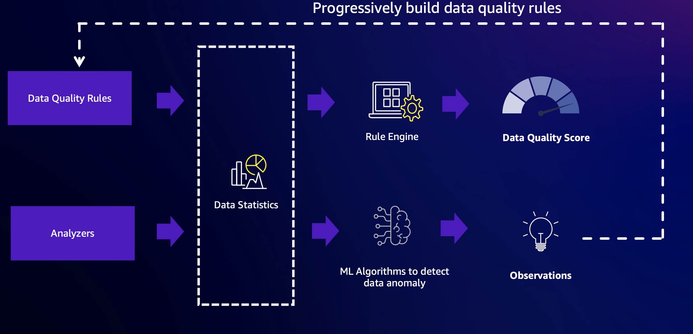
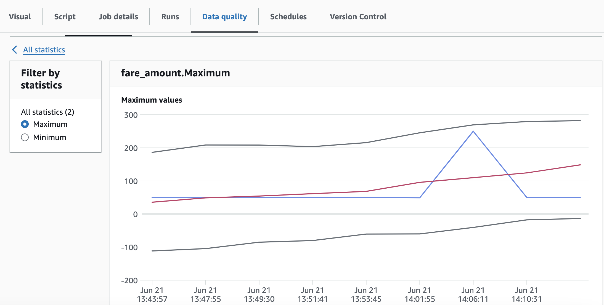
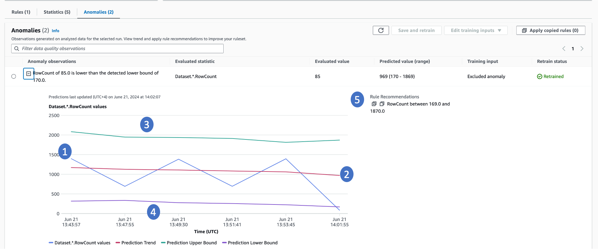
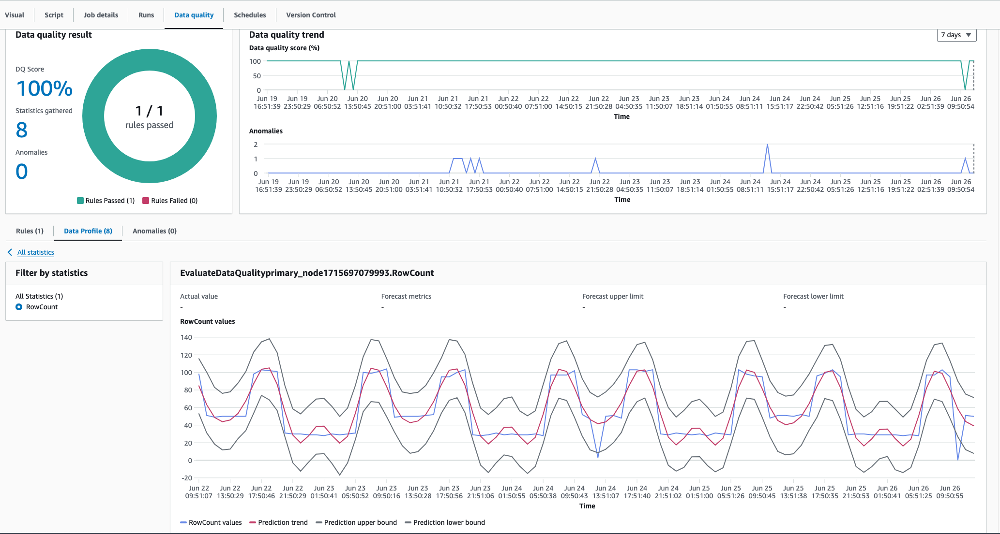

# Anomaly detection in AWS Glue Data Quality

Engineers manage hundreds of data pipelines simultaneously. Each pipeline can extract data from various sources and load it
into the data lake or other data repositories. To ensure high-quality data is delivered for decision-making, they establish
data quality rules. These rules assess the data based on fixed criteria reflecting the current business state. However, when
the business environment changes, data properties shift, rendering these fixed criteria outdated and causing poor data quality.

For example, a data engineer at a retail company established a rule that validates daily sales must exceed a one-million-dollar
threshold. After a few months, daily sales surpassed two million dollars, rendering the threshold obsolete. The data engineer
could not update the rules to reflect the latest thresholds due to a lack of notification and the effort required to manually
analyze and update the rule. Later in the month, business users noticed a 25% drop in their sales. After hours of investigation,
the data engineers discovered that an ETL pipeline responsible for extracting data from some stores had failed without generating
errors. The rule with outdated thresholds continued to operate successfully without detecting this issue.

Alternatively, proactive alerts that can detect these anomalies could have enabled users to detect this issue. Moreover,
tracking seasonality in business can highlight significant data quality problems. For instance, retail sales may be highest on
weekends and during the holiday season while relatively low on weekdays. Divergence from this pattern may indicate data quality
issues or shifts in business circumstances. Data quality rules cannot detect seasonal patterns as this requires advanced algorithms
that can learn from past patterns capturing seasonality to detect deviations.

Finally, users find it challenging to create and maintain rules due to the technical nature of the rule creation process and the
time involved to author them. As a result, they prefer exploring data insights first before defining rules. Customers need the
ability to spot anomalies with ease, enabling them to proactively detect data quality issues and make confident business decisions.

## How it works

###### Note

Anomaly detection is only supported in AWS Glue ETL. This is not supported in Data Catalog-based data quality.



AWS Glue Data Quality combines the power of rule-based data quality and anomaly detection capabilities to deliver high-quality data.
To get started, you must first configure rules and analyzers, and then enable anomaly detection.

### Rules

**Rules** – Rules express the expectations for your data in an open language called the
Data Quality Definition Language (DQDL). An example of a rule is shown below. This rule will be successful when there are no
empty or NULL values in the `passenger\_count` column:

```
Rules = [
    IsComplete "passenger_count"
]
```

### Analyzers

In situations where you know the critical columns but may not know enough about the data to write
specific rules, you can monitor those columns using Analyzers. Analyzers are a way to gather data statistics without defining
explicit rules. An example of configuring Analyzers is shown below:

```
Analyzers = [
AllStatistics "fare_amount",
DistinctValuesCount "pulocationid",
RowCount
]
```

In this example, three Analyzers are configured:

1. The first Analyzer, `AllStatistics "fare\_amount"`, will capture all available statistics for the `fare\_amount` field.
2. The second Analyzer, `DistinctValuesCount "pulocationid"`, will capture the count of distinct values in the `pulocationid` column.
3. The third Analyzer, `RowCount`, will capture the total number of records in the dataset.

Analyzers serve as a simple way to gather relevant data statistics without specifying complex rules. By monitoring these
statistics, you can gain insights into the data quality and identify potential issues or anomalies that may require further
investigation or the creation of specific rules.

### Data statistics

Both Analyzers and Rules in AWS Glue Data Quality gather data statistics, also known
as data profiles. These statistics provide insights into the characteristics and quality of your data. The collected
statistics are stored over time within the AWS Glue service, allowing you to track and analyze changes in your data profiles.

You can easily retrieve these statistics and write them to Amazon S3 for further analysis or long-term storage by invoking the
appropriate APIs. This functionality enables you to integrate data profiling into your data processing workflows and
leverage the collected statistics for various purposes, such as data quality monitoring, anomaly detection.

By storing the data profiles in Amazon S3, you can take advantage of the scalability, durability, and cost-effectiveness of
Amazon's object storage service. Additionally, you can leverage other AWS services or third-party tools to analyze and
visualize the data profiles, enabling you to gain deeper insights into your data quality and make informed decisions about
data management and governance.

Here is an example of data statistics stored over time.



###### Note

AWS Glue Data Quality will gather statistics only once, even if you have both **Rule** and **Analyzer** for
the same columns, making the statistics generation process efficient.

### Anomaly Detection

AWS Glue Data Quality requires a minimum of three data points to detect anomalies.
It utilizes a machine learning algorithm to learn from past trends and then predict future values. When the actual value does
not fall within the predicted range, AWS Glue Data Quality creates an Anomaly Observation. It provides a visual representation of the actual value
and the trends. Four values are displayed on the graph below.



1. The actual statistic and its trend over time.
2. A derived trend by learning from the actual trend. This is useful for understanding the trend direction.
3. The possible upper bound for the statistic.
4. The possible lower bound for the statistic.
5. Recommended data quality rules that can detect these issues in the future.

There are a few important things to note regarding Anomalies:

- When anomalies are generated, data quality scores are not impacted.
- When an anomaly is detected, it is considered normal for subsequent runs. The machine learning algorithm will consider this
  anomalous value as input unless it is explicitly excluded.

### Retraining

Retraining the anomaly detection model is critical to detect the right anomalies. When anomalies are detected, AWS Glue Data Quality includes
the anomaly in the model as a normal value. To ensure the anomaly detection works accurately, it is important to provide
feedback by acknowledging or rejecting the anomaly. AWS Glue Data Quality provides mechanisms both in AWS Glue Studio and APIs to provide feedback to
the model. To know more, refer to the documentation on setting up
[Anomaly Detection in AWS Glue ETL pipelines](data-quality-configuring-anomaly-detection-etl-jobs.md "data-quality-configuring-anomaly-detection-etl-jobs.md").

## Details of the Anomaly Detection algorithm

- The Anomaly Detection algorithm examines data statistics over time. The algorithm considers all available data points
  and ignores any statistics that are explicitly excluded.
- These data statistics are stored in the AWS Glue service, and you can provide AWS KMS keys to encrypt them. Refer to the
  Security Guide on how to provide AWS KMS keys to encrypt the AWS Glue Data Quality statistics.
- The time component is crucial for the Anomaly Detection algorithm. Based on past values, AWS Glue Data Quality determines the upper and
  lower bounds. During this determination, it considers the time component. The limits will differ for the same values over a
  one-minute interval, an hourly interval, or a daily interval.

### Capturing seasonality

AWS Glue Data Quality's anomaly detection algorithm can capture seasonal patterns. For example, it can understand that weekday patterns
differ from weekend patterns. This can be seen in the example below, where AWS Glue Data Quality detects a seasonal trend in the data values.
You don't need to do anything specific to enable this capability. Over time, AWS Glue Data Quality learns seasonal trends and detects anomalies
when these patterns break.



### Cost

You will be charged based on the time it takes to detect anomalies. Every statistic is charged 1 DPU for the time it takes to
detect anomalies. Refer to
[AWS Glue Pricing](https://aws.amazon.com/glue/pricing/ "https://aws.amazon.com/glue/pricing/")
for detailed examples.

### Key considerations

There is no cost to store the statistics. However, there is a limit of 100,000 statistics per account. These
statistics will be stored for maximum of two years.
