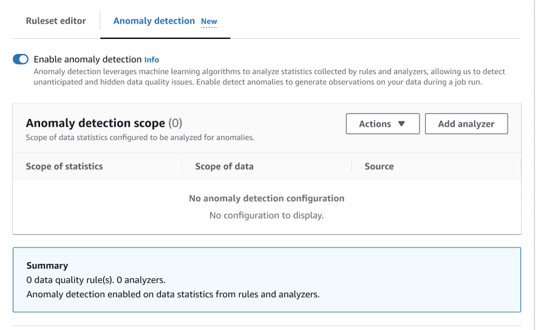
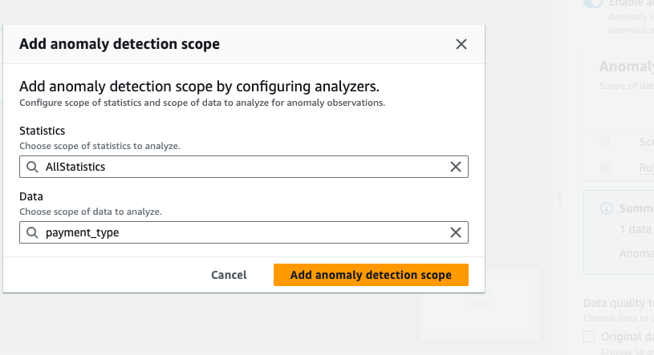

# Configuring anomaly detection in AWS Glue ETL jobs

To begin with anomaly detection in AWS Glue Studio, open a AWS Glue Studio job and click on the **Evaluate Data Quality Transform**.

By enabling this feature, AWS Glue Data Quality will analyze your data over time to detect anomalies. It provides valuable data
statistics and observations about your data, allowing you to take action on any identified anomalies.

Review the [Anomaly Detection](data-quality-anomaly-detection.md "data-quality-anomaly-detection.md") documentation to understand the
inner workings of this feature.

##

Enabling anomaly detection

###### To enable anomaly detection in AWS Glue Studio:

1. Choose the **Data Quality** node in your job, then choose the **Anomaly detection** tab. Toggle
   to turn on **Enable Anomaly Detection**.

 2. Define the data to monitor for anomalies by choosing **Add analyzer**. There are two fields
that you can populate: Statistics and Data.

    * **Statistics** are information about your data’s shape and other properties. You can choose one or more statistics
     at a time, or choose **All statistics**. Statistics include: Completeness, Uniqueness, Mean, Sum,
     StandardDeviation, Entropy, DistinctValuesCount, UniqueValueRatio and more.
     Refer to the [Analyzers](dqdl.md#dqdl-analyzers "dqdl.md#dqdl-analyzers") documentation for more details.
    * **Data** is the columns in your dataset. You can choose all columns or individual columns.

 3. Choose **Add anomaly detection scope** to save your changes. After you’ve added
analyzers, you can see them in the **Anomaly detection scope** section.

You can also use the **Actions** menu to edit your
analyzers, or choose the **Ruleset editor** tab and edit the
analyzer directly in the ruleset editor notepad. You will see the analyzers that you saved under
any rules that you’ve created.

```
Rules = [

]

Analyzers = [
    Completeness “id”
]

```

Once the updated ruleset and analyzers are configured, AWS Glue Data Quality continuously monitors incoming data streams.
It can signal potential anomalies through alerts or job stops, depending on your settings. This proactive monitoring
helps ensure data quality and integrity throughout your data pipelines.

In the next section, you will learn how to effectively monitor anomalies identified by the system.
You'll also learn how to view and analyze the data statistics gathered by AWS Glue Data Quality. Additionally, you'll understand
how to provide feedback to the machine learning model that powers the Anomaly Detection feature. This feedback loop
is crucial for improving the model's accuracy and ensuring it can effectively detect anomalies that align with your
specific business requirements and data patterns.
