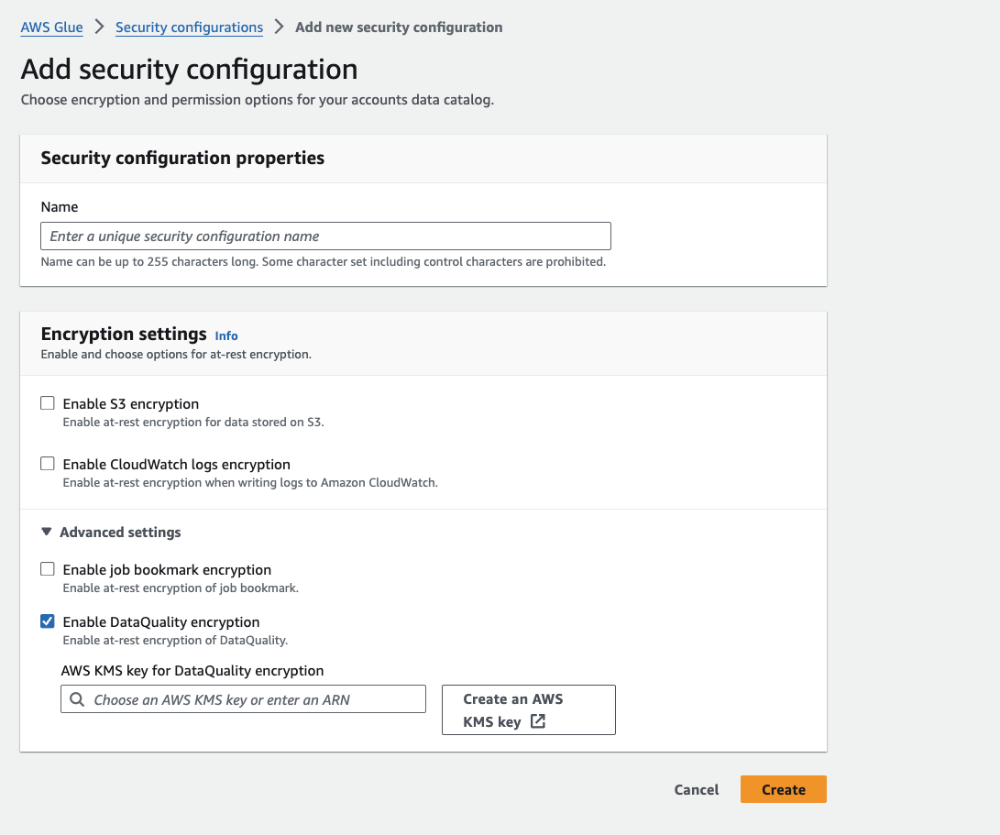

# Data encryption at rest for AWS Glue Data Quality

AWS Glue Data Quality provides encryption by default to protect sensitive customer data at rest using AWS owned encryption keys.

## AWS owned keys

AWS Glue Data Quality uses these keys to automatically encrypt customers' Data Quality assets. You cannot view,
manage, or use AWS owned keys, or audit their use. However, you don't need to take any action or change any programs to
protect the keys that encrypt your data. For more information, see
[AWS owned keys](../../../kms/latest/developerguide/concepts.md#aws-owned-cmk "../../../kms/latest/developerguide/concepts.md#aws-owned-cmk")
in the AWS KMS Developer Guide.

Encryption of data at rest by default helps reduce the operational overhead and complexity involved in protecting sensitive data.
At the same time, it enables you to build secure applications that meet strict encryption compliance and regulatory requirements.

While you can't disable this layer of encryption or select an alternate encryption type, you can add a second layer of
encryption over the existing AWS owned encryption keys by choosing a customer-managed key when you create your Data Quality
resources.

## Customer managed keys

**Customer managed keys**: AWS Glue Data Quality supports the use of a symmetric customer-managed key that you
create, own, and manage. This adds a second layer of encryption over the existing AWS owned encryption. Because you have full
control of this layer of encryption, you can perform tasks such as:

- Establishing and maintaining key policies
- Establishing and maintaining IAM policies
- Enabling and disabling key policies
- Rotating key cryptographic material
- Adding tags
- Creating key aliases
- Scheduling keys for deletion

For more information, see
[Customer managed keys](../../../kms/latest/developerguide/concepts.md#customer-cmk "../../../kms/latest/developerguide/concepts.md#customer-cmk")
in the AWS KMS Developer Guide.

The following table summarizes how AWS Glue Data Quality encrypts different Data Quality assets.

| Data type                                                                                                                                                                                                                                                               | AWS owned key encryption | Customer managed key encryption |
| ----------------------------------------------------------------------------------------------------------------------------------------------------------------------------------------------------------------------------------------------------------------------- | ------------------------ | ------------------------------- |
| **Data Quality Ruleset**<br>DQDL ruleset string that is referenced by the persisted DQ ruleset. These persisted rulesets are only used in the<br>AWS Glue Data Catalog experience for now.                                                                              | Enabled                  | Enabled                         |
| **Data Quality Rule/Analyzer Results**<br>Result artifacts that contains the pass/fail status of each rule in a ruleset as well as metrics collected<br>by both rules and analyzers.                                                                                    | Enabled                  | Enabled                         |
| **Observations**<br>Observations are generated when an anomaly is detected in the data. It contains information on the expected<br>upper and lower bound and a suggested rule based on these bounds. If generated, they are displayed with the<br>Data Quality Results. | Enabled                  | Enabled                         |
| **Statistics**<br>Contains information on metrics collected after evaluating the data given a ruleset, such as the value of the<br>metric (e.g. RowCount, Completeness), column names, and other metadata.                                                              | Enabled                  | Enabled                         |
| **Anomaly Detection Statistic Models**<br>The statistic models contain the time series of upper and lower bounds for a given metric generated based off<br>of previous evaluations of the customer data.                                                                | Enabled                  | Enabled                         |

###### Note

AWS Data Quality automatically enables encryption at rest using AWS owned keys to protect personally identifiable
data at no charge. However, AWS KMS charges apply for using a customer managed key. For more information about pricing,
see [AWS KMS Pricing](https://aws.amazon.com/kms/pricing/ "https://aws.amazon.com/kms/pricing/").

For more information on AWS KMS, see [AWS KMS](../../../kms/latest/developerguide/overview.md "../../../kms/latest/developerguide/overview.md").

## Create a Customer Managed Key

You can create a symmetric customer managed key by using the AWS Management Console, or the AWS KMS APIs.

###### To create a symmetric customer managed key:

- Follow the steps for
  [Creating symmetric encryption AWS KMS keys](../../../kms/latest/developerguide/create-keys.md#create-symmetric-cmk "../../../kms/latest/developerguide/create-keys.md#create-symmetric-cmk") in the AWS Key Management Service Developer Guide.

### Key policy

Key policies control access to your customer managed key. Every customer managed key must have exactly one key policy,
which contains statements that determine who can use the key and how they can use it. When you create your customer
managed key, you can specify a key policy. For more information, see
[Key policies in AWS KMS keys](../../../kms/latest/developerguide/key-policies.md "../../../kms/latest/developerguide/key-policies.md") in the AWS Key Management Service Developer Guide.

To use your customer managed key with your Data Quality resources, the following API operations must be permitted in
the key policy:

- [`kms:Decrypt`](../../../kms/latest/APIReference/API_Decrypt.md "../../../kms/latest/APIReference/API_Decrypt.md") – Decrypts ciphertext that was encrypted by an AWS KMS key using
  `GenerateDataKeyWithoutPlaintext`
- [`kms:DescribeKey`](../../../kms/latest/APIReference/API_DescribeKey.md "../../../kms/latest/APIReference/API_DescribeKey.md")
  – Provides the customer managed key details to allow Amazon Location to validate the key.
- [`kms:GenerateDataKeyWithoutPlaintext`](../../../kms/latest/APIReference/API_GenerateDataKeyWithoutPlaintext.md "../../../kms/latest/APIReference/API_GenerateDataKeyWithoutPlaintext.md")
  – Returns a unique symmetric data key for use outside of AWS KMS. This operation returns a data key that
  is encrypted under a symmetric encryption KMS key that you specify. The bytes in the key are random; they are not
  related to the caller or to the KMS key. Used to reduce KMS calls the customer has to make.
- [`kms:ReEncrypt*`](../../../kms/latest/APIReference/API_ReEncrypt.md "../../../kms/latest/APIReference/API_ReEncrypt.md")
  – Decrypts ciphertext and then reencrypts it entirely within AWS KMS. You can use this operation to change
  the KMS key under which data is encrypted, such as when you
  [manually rotate](../../../kms/latest/developerguide/rotate-keys.md#rotate-keys-manually "../../../kms/latest/developerguide/rotate-keys.md#rotate-keys-manually")
  a KMS key or change the KMS key that
  protects a ciphertext. You can also use it to reencrypt ciphertext under the same KMS key, such as to change the
  [encryption context](../../../kms/latest/developerguide/concepts.md#encrypt_context "../../../kms/latest/developerguide/concepts.md#encrypt_context") of a ciphertext.

The following are policy statement examples you can add for Amazon Location:

```
"Statement" : [
    {
        "Sid" : "Allow access to principals authorized to use AWS Glue Data Quality",
        "Effect" : "Allow",
        "Principal" : {
            "AWS": "arn:aws:iam::<account_id>:role/ExampleRole"
        },
        "Action" : [
            "kms:Decrypt",
            "kms:DescribeKey",
            "kms:GenerateDataKeyWithoutPlaintext",
            "kms:ReEncrypt*"
        ],
        "Resource" : "*",
        "Condition" : {
            "StringEquals" : {
                "kms:ViaService" : "glue.amazonaws.com",
                "kms:CallerAccount" : "111122223333"
            }
        },
    {
        "Sid": "Allow access for key administrators",
        "Effect": "Allow",
        "Principal": {
            "AWS": "arn:aws:iam::111122223333:root"
          },
        "Action" : [
            "kms:*"
         ],
        "Resource": "arn:aws:kms:region:111122223333:key/key_ID"
    },
    {
        "Sid" : "Allow read-only access to key metadata to the account",
        "Effect" : "Allow",
        "Principal" : {
            "AWS" : "arn:aws:iam::111122223333:root"
        },
        "Action" : [
            "kms:Describe*",
            "kms:Get*",
            "kms:List*",
        ],
        "Resource" : "*"
    }
]
```

### Notes about using KMS Keys in AWS Glue Data Quality

AWS Glue Data Quality does not support key transitions. This means that if you encrypt your Data Quality assets with Key A and decide
to switch to Key B, we will not re-encrypt the data that was encrypted with Key A to use Key B. You can still switch to
Key B, but will need to maintain access to Key A to access data previously encrypted with Key A.

For more information about specifying permissions in a policy, see
[Permissions for AWS services in key policies](../../../kms/latest/developerguide/key-policy-services.md "../../../kms/latest/developerguide/key-policy-services.md") in the AWS Key Management Service Developer Guide.

For more information about troubleshooting key access, see
[Troubleshooting key access](../../../kms/latest/developerguide/policy-evaluation.md "../../../kms/latest/developerguide/policy-evaluation.md") in the AWS Key Management Service Developer Guide.

## Create a security configuration

In AWS Glue the [Security Configurations resource](encryption-security-configuration.md "encryption-security-configuration.md")
contains properties that are needed when you write encrypted data.

###### To encrypt your data quality assets:

1. In **Encryption settings**, under **Advanced settings**, choose
   **Enable Data Quality Encryption**
2. Select your KMS key or choose **Create an AWS KMS key**



## AWS Glue Data Quality encryption context

An [encryption context](../../../kms/latest/developerguide/concepts.md#encrypt_context "../../../kms/latest/developerguide/concepts.md#encrypt_context") is an optional set of key-value pairs that contain additional contextual information about the data.

AWS KMS uses the encryption context as
[additional authenticated data](../../../crypto/latest/userguide/cryptography-concepts.md#term-aad "../../../crypto/latest/userguide/cryptography-concepts.md#term-aad")
to support [authenticated encryption](../../../crypto/latest/userguide/cryptography-concepts.md#term-aad "../../../crypto/latest/userguide/cryptography-concepts.md#term-aad") .
When you include an encryption context in a request to encrypt data, AWS KMS binds the encryption context to the encrypted data.
To decrypt data, you include the same encryption context in the request.

### AWS Glue Data Quality encryption context example

```
"encryptionContext": {
    "kms-arn": "arn:aws:kms:us-east-1:111122223333:key/1234abcd-12ab-34cd-56ef-123456SAMPLE",
    "branch-key-id": "111122223333+arn:aws:kms:us-east-1:111122223333:key/1234abcd-12ab-34cd-56ef-123456SAMPLE",
    "hierarchy-version": "1",
    "aws-crypto-ec:aws:glue:securityConfiguration": "111122223333:customer-security-configuration-name",
    "create-time": "2024-06-07T13:47:23:000861Z",
    "tablename": "AwsGlueMlEncryptionKeyStore",
    "type": "beacon:ACTIVE"
}
```

### Using encryption context for monitoring

When you use a symmetric customer managed key to encrypt your tracker or geofence collection, you can also use the
encryption context in audit records and logs to identify how the customer managed key is being used. The encryption
context also appears in logs generated by AWS CloudTrail or Amazon CloudWatch Logs.

## Monitoring your encryption keys for AWS Glue Data Quality

When you use an AWS KMS customer managed key with your AWS Glue Data Quality resources, you can use AWS CloudTrail or
Amazon CloudWatch Logs to track requests that AWS Glue Data Quality sends to AWS KMS.

The following examples are AWS CloudTrail events for `GenerateDataKeyWithoutPlainText` and
`Decrypt` to monitor KMS operations called by AWS Glue Data Quality to access data encrypted by your customer managed key.

**Decrypt**

```
{
    "eventVersion": "1.09",
    "userIdentity": {
        "type": "AssumedRole",
        "arn": "arn:aws:sts::111122223333:role/CustomerRole",
        "accountId": "111122223333",
        "invokedBy": "glue.amazonaws.com"
    },
    "eventTime": "2024-07-02T20:03:10Z",
    "eventSource": "kms.amazonaws.com",
    "eventName": "Decrypt",
    "awsRegion": "us-east-1",
    "sourceIPAddress": "glue.amazonaws.com",
    "userAgent": "glue.amazonaws.com",
    "requestParameters": {
        "keyId": "arn:aws:kms:us-east-1:111122223333:key/1234abcd-12ab-34cd-56ef-123456SAMPLE",
        "encryptionAlgorithm": "SYMMETRIC_DEFAULT",
        "encryptionContext": {
            "kms-arn": "arn:aws:kms:us-east-1:111122223333:key/1234abcd-12ab-34cd-56ef-123456SAMPLE",
            "branch-key-id": "111122223333+arn:aws:kms:us-east-1:111122223333:key/1234abcd-12ab-34cd-56ef-123456SAMPLE",
            "hierarchy-version": "1",
            "aws-crypto-ec:aws:glue:securityConfiguration": "111122223333:customer-security-configuration-name",
            "create-time": "2024-06-07T13:47:23:000861Z",
            "tablename": "AwsGlueMlEncryptionKeyStore",
            "type": "branch:ACTIVE",
            "version": "branch:version:ff000af-00eb-00ce-0e00-ea000fb0fba0SAMPLE"
        }
    },
    "responseElements": null,
    "requestID": "ff000af-00eb-00ce-0e00-ea000fb0fba0SAMPLE",
    "eventID": "ff000af-00eb-00ce-0e00-ea000fb0fba0SAMPLE",
    "readOnly": true,
    "resources": [
        {
            "accountId": "111122223333",
            "type": "AWS::KMS::Key",
            "ARN": "arn:aws:kms:us-east-1:111122223333:key/1234abcd-12ab-34cd-56ef-123456SAMPLE"
        }
    ],
    "eventType": "AwsApiCall",
    "managementEvent": true,
    "recipientAccountId": "111122223333",
    "eventCategory": "Management"
}
```

**GenerateDataKeyWithoutPlaintext**

```
{
    "eventVersion": "1.09",
    "userIdentity": {
        "type": "AssumedRole",
        "arn": "arn:aws:sts::111122223333:role/CustomerRole",
        "accountId": "111122223333",
        "invokedBy": "glue.amazonaws.com"
    },
    "eventTime": "2024-07-02T20:03:10Z",
    "eventSource": "kms.amazonaws.com",
    "eventName": "GenerateDataKeyWithoutPlaintext",
    "awsRegion": "us-east-1",
    "sourceIPAddress": "glue.amazonaws.com",
    "userAgent": "glue.amazonaws.com",
    "requestParameters": {
        "keyId": "arn:aws:kms:us-east-1:111122223333:key/1234abcd-12ab-34cd-56ef-123456SAMPLE",
        "encryptionAlgorithm": "SYMMETRIC_DEFAULT",
        "encryptionContext": {
            "kms-arn": "arn:aws:kms:us-east-1:111122223333:key/1234abcd-12ab-34cd-56ef-123456SAMPLE",
            "branch-key-id": "111122223333+arn:aws:kms:us-east-1:111122223333:key/1234abcd-12ab-34cd-56ef-123456SAMPLE",
            "hierarchy-version": "1",
            "aws-crypto-ec:aws:glue:securityConfiguration": "111122223333:customer-security-configuration-name",
            "create-time": "2024-06-07T13:47:23:000861Z",
            "tablename": "AwsGlueMlEncryptionKeyStore",
            "type": "branch:version:ff000af-00eb-00ce-0e00-ea000fb0fba0SAMPLE"
        }
    },
    "responseElements": null,
    "requestID": "ff000af-00eb-00ce-0e00-ea000fb0fba0SAMPLE",
    "eventID": "ff000af-00eb-00ce-0e00-ea000fb0fba0SAMPLE",
    "readOnly": true,
    "resources": [
        {
            "accountId": "111122223333",
            "type": "AWS::KMS::Key",
            "ARN": "arn:aws:kms:us-east-1:111122223333:key/1234abcd-12ab-34cd-56ef-123456SAMPLE"
        }
    ],
    "eventType": "AwsApiCall",
    "managementEvent": true,
    "recipientAccountId": "111122223333",
    "eventCategory": "Management"
}
```

**ReEncyrpt**

```
{
    "eventVersion": "1.09",
    "userIdentity": {
        "type": "AssumedRole",
        "arn": "arn:aws:sts::111122223333:role/CustomerRole",
        "accountId": "111122223333",
        "invokedBy": "glue.amazonaws.com"
    },
    "eventTime": "2024-07-17T21:34:41Z",
    "eventSource": "kms.amazonaws.com",
    "eventName": "ReEncrypt",
    "awsRegion": "us-east-1",
    "sourceIPAddress": "glue.amazonaws.com",
    "userAgent": "glue.amazonaws.com",
    "requestParameters": {
        "destinationEncryptionContext": {
             "kms-arn": "arn:aws:kms:us-east-1:111122223333:key/1234abcd-12ab-34cd-56ef-123456SAMPLE",
            "branch-key-id": "111122223333+arn:aws:kms:us-east-1:111122223333:key/1234abcd-12ab-34cd-56ef-123456SAMPLE",
            "hierarchy-version": "1",
            "aws-crypto-ec:aws:glue:securityConfiguration": "111122223333:customer-security-configuration-name",
            "create-time": "2024-06-07T13:47:23:000861Z",
            "tablename": "AwsGlueMlEncryptionKeyStore",
            "type": "branch:ACTIVE"
            "version": "branch:version:12345678-SAMPLE"
        },
        "destinationKeyId": "arn:aws:kms:us-east-1:111122223333:key/1234abcd-12ab-34cd-56ef-123456SAMPLE",
        "sourceAAD": "1234567890-SAMPLE+Z+lqoYOHj7VtWxJLrvh+biUFbliYDAQkobM=",
        "sourceKeyId": "arn:aws:kms:ap-southeast-2:585824196334:key/17ca05ca-a8c1-40d7-b7fd-30abb569a53a",
        "destinationEncryptionAlgorithm": "SYMMETRIC_DEFAULT",
        "sourceEncryptionContext": {
            "kms-arn": "arn:aws:kms:us-east-1:111122223333:key/1234abcd-12ab-34cd-56ef-123456SAMPLE",
            "branch-key-id": "111122223333+arn:aws:kms:us-east-1:111122223333:key/1234abcd-12ab-34cd-56ef-123456SAMPLE",
            "hierarchy-version": "1",
            "aws-crypto-ec:aws:glue:securityConfiguration": "111122223333:customer-security-configuration-name",
            "create-time": "2024-06-07T13:47:23:000861Z",
            "tablename": "AwsGlueMlEncryptionKeyStore",
            "type": "branch:version:ff000af-00eb-00ce-0e00-ea000fb0fba0SAMPLE"
        },
        "destinationAAD": "1234567890-SAMPLE",
        "sourceEncryptionAlgorithm": "SYMMETRIC_DEFAULT"
    },
    "responseElements": null,
    "requestID": "ff000af-00eb-00ce-0e00-ea000fb0fba0SAMPLE",
    "eventID": "ff000af-00eb-00ce-0e00-ea000fb0fba0SAMPLE",
    "readOnly": true,
    "resources": [
        {
            "accountId": "111122223333",
            "type": "AWS::KMS::Key",
            "ARN": "arn:aws:kms:us-east-1:111122223333:key/1234abcd-12ab-34cd-56ef-123456SAMPLE"
        },
        {
            "accountId": "111122223333",
            "type": "AWS::KMS::Key",
            "ARN": "arn:aws:kms:us-east-1:111122223333:key/1234abcd-12ab-34cd-56ef-123456SAMPLE"
        }
    ],
    "eventType": "AwsApiCall",
    "managementEvent": true,
    "recipientAccountId": "111122223333",
    "eventCategory": "Management"
}
```

## Learn more

The following resources provide more information about data encryption at rest.

- For more information about
  [AWS Key Management Service basic concepts](../../../kms/latest/developerguide/concepts.md "../../../kms/latest/developerguide/concepts.md")  
  see the AWS Key Management Service Developer Guide.
- For more information about
  [Security best practices for AWS Key Management Service](../../../kms/latest/developerguide/best-practices.md "../../../kms/latest/developerguide/best-practices.md")
  see the AWS Key Management Service Developer Guide.
