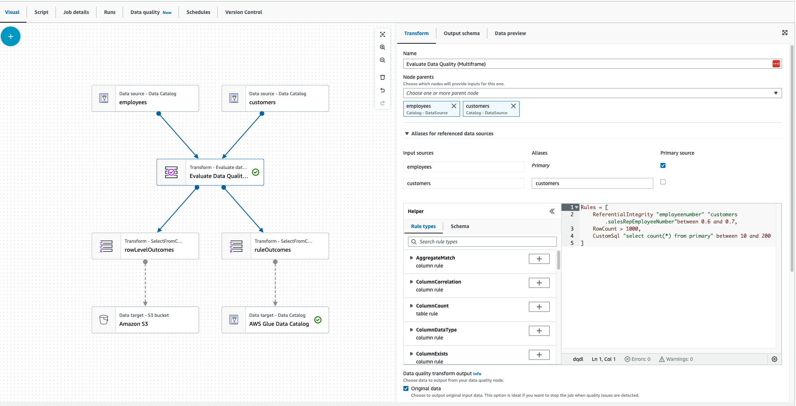
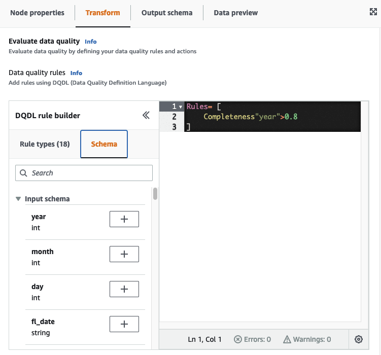
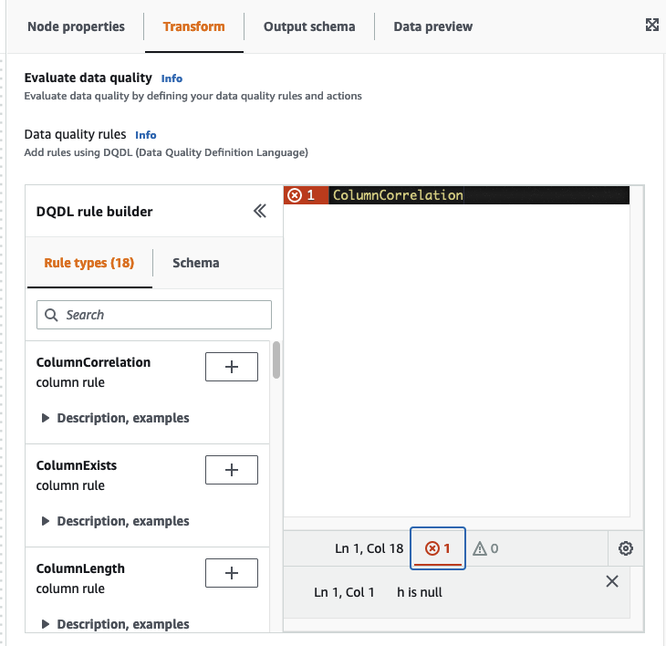

# Data Quality rule builder

With
the
Data Quality
Definition Language
(DQDL)
rule builder,
you
can
create data quality rules
to
evaluate your data. Start
by
selecting a rule
type,
and then
specify the
parameters in the rule editor. The rule editor
also
shows
you any errors and warnings as you create rules.

The [DQDL guide](dqdl.md "dqdl.md") provides comprehensive
documentation on how to construct rules using the DQDL syntax, built-in rule
types,
and examples.

## Evaluate Data Quality node

When you're
working with the **Evaluate Data Quality** transform
node and the DQDL rule builder, you can expand the working space.

- To expand the **Transform** tab to fill the entire screen,
  choose
  the expand icon in the upper-right hand corner of the node details panel.
- To expand the DQDL rule editor,
  choose
  the
  **<<** icon to expand the rule editor and collapse the
  **Rule types** and **Schema** tabs.

## Components

There are 26 rule types that are built
into
AWS Glue Studio. Each rule type has a description and examples of how they can
be used.

### Data quality rule types

AWS Glue Studio provides built-in rule types for ease
in
creating a rule. For more information on rule types, see [DQDL rule type reference](dqdl.md#dqdl-rule-types "dqdl.md#dqdl-rule-types").

### Schema

The **Schema** tab displays the column names and data type from the parent node.
Schemas from multiple nodes are displayed. You can view the input schema, search by column name,
and insert the column into the rule editor.

### Rule editor

The rule editor is a text editor where you can write and edit rules. If you
select a rule type from the DQDL rule builder, the rule type is added to the rule
editor. You can then specify parameters, add
rules,
and edit rules as needed by modifying the text. AWS Glue Studio validates the
rules in the rule editor and displays errors and warnings if
there are
any.

**Errors and warnings**

If a rule
doesn't
follow the DQDL rule syntax, the rule editor
shows
several visual indicators that there is an error:

- The rule editor displays an error icon and red color on the line with the error.
- The rule editor displays the number of errors next to the red error icon.
- When you
  choose
  the line with the error,
  descriptions
  of the error and location (line and column) are displayed at the bottom of
  the rule editor.

##

**Data quality actions**

By default, this action is not selected and the job will complete its run even if
the
data quality rules fail.

Choose between the following actions.
You can use
actions
to
publish results to CloudWatch or stop jobs based on specific criteria. Actions are only
available after you create a rule.

- **Publish results to CloudWatch** –
  When
  you run a job, add the results to CloudWatch.
- **Fail job when data quality fails** –
  If
  data quality rules fail, the job will also fail as a result.

**Data quality transform output**

- **Original data**
  –
  Choose to output original input data. This option is ideal if you want to stop
  the job when quality issues are detected.
- **Data quality metrics**
  –
  Choose to output configured rules and their pass or fail status. This option is
  useful if you want to take a custom action.

**Data quality output settings**

Set
the data quality result location by specifying the Amazon S3 location as
the data quality output target.
