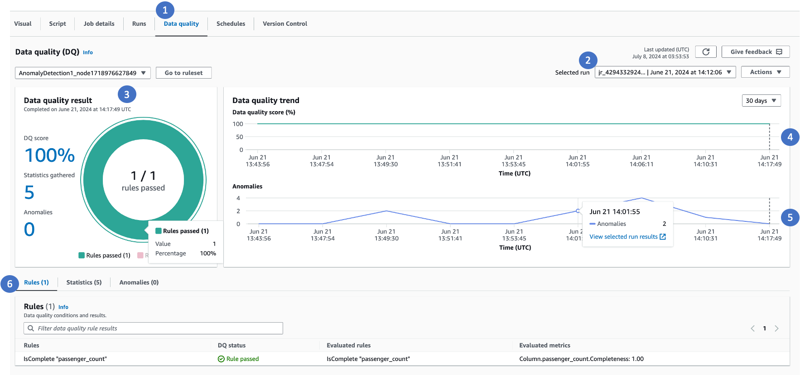
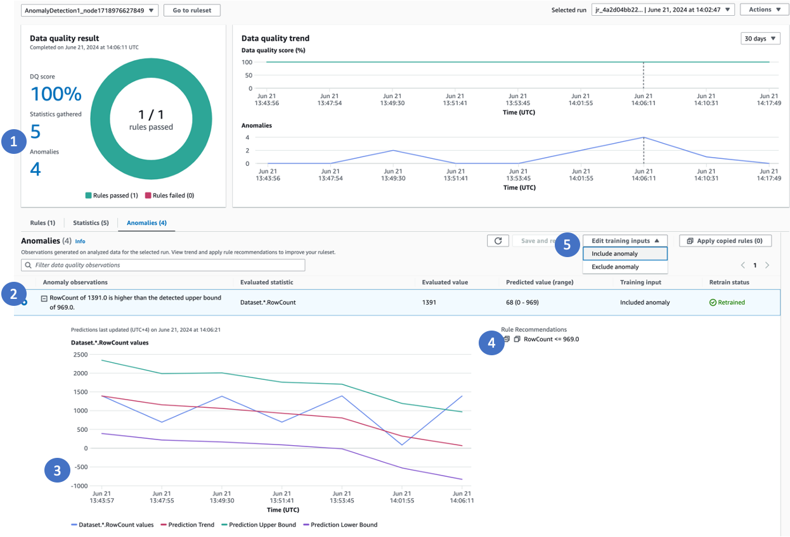
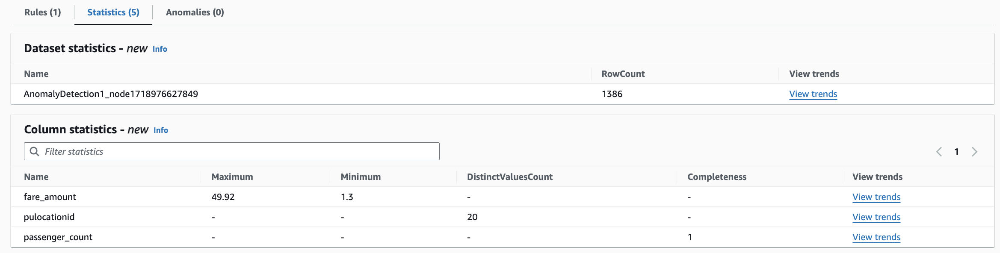
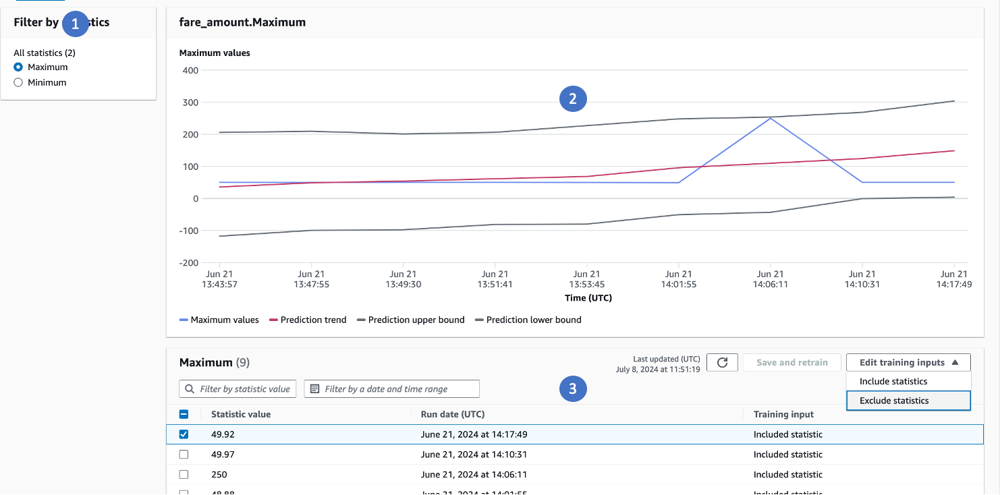

# Viewing data quality scores and anomalies

In this section, we will explore the data quality dashboard and different functionalities that it provides.

##

Visualize and understand high level data quality metrics and trends

Once your job is successful, choose the **Data Quality** tab to view data quality scores and anomalies.

The following components in the Data quality tab provide useful information.

1. Choose the **Data Quality** tab to view data quality metrics.
2. Select a specific job run ID to view the Data Quality score.
3. This pane shows three important information. You can choose each to navigate to specific tables to view
   anomalies, data statistics or rules.
   - Data Quality score when rules are configured.
   - Number of statistics gathered by Rules and Analyzers.
   - Total number of anomalies detected.

4. This trend chart shows how data quality is trending over time. You can hover over the trend and go to a
   specific time when data quality scores have deteriorated.
5. Anomaly trends over time will show you the number of anomalies detected over time.
6. Tabs:
   - Rules Tab is the default tab that shows list of all the rules and status. Evaluated Rules is useful in case of
     dynamic rules to view the actual value the rule was evaluated to.
   - Statistics Tab lists all the statistics, allowing you to view the metrics and the trends over time.
   - Anomalies tab shows the list of anomalies that were detected.

##

Viewing anomalies and training anomaly detection algorithm

Call outs for the image above:

1. When anomalies are detected, click the anomaly or select the Anomalies tab
2. AWS Glue Data Quality provides a detailed explanation of the anomaly, the actual value, predicted range
3. AWS Glue Data Quality shows a trend line. It has the actual value, a derived trend based on the actual values (red line),
   the upper bound and the lower bound
4. AWS Glue Data Quality recommends data quality rules that can be used to capture the patterns for future. You can copy all the
   rules that are recommended to you and apply them to your data quality node to capture these patterns effectively.
5. You can provide inputs to the machine learning (ML) model to exclude anomalous values, ensuring that future runs
   detect anomalies accurately. If you don't explicitly exclude anomalies, AWS Glue Data Quality will automatically consider them as
   part of the model for future predictions. It's important to note that only the latest run will reflect the model
   inputs you provide. For example, if you went back and excluded anomalous points from a few previous runs,
   the model will not reflect those changes unless you view and update the model inputs in the latest run.
   The model will continue to use the previously provided inputs until you make necessary adjustments in the most
   recent run. By actively managing the exclusion of anomalous values, you can refine the ML model's understanding of what
   constitutes an anomaly for your specific data patterns and requirements, leading to more accurate anomaly detection
   over time.

##

Viewing Data Statistics over time and providing training inputs

Sometimes, you may want to view data statistics or data profiles and view how they are progressing over time. To do this,
choose **Statistics** or open the **Statistics** tab. You can then view the latest
data statistics gathered by AWS Glue Data Quality.

Clicking **View Trends** shows you how each of the statistics are progressing over time.

1. You can select the statistic for a specified column
2. You can view how the trends are progressing
3. You can select anomalous values and choose to exclude or include them. By providing this feedback,
   the algorithm will either exclude or include the identified anomalous data points and retrain the model.
   This retraining process ensures accurate anomaly detection moving forward, as the model learns from the feedback
   you've provided about which values should be considered anomalous or not.

Through this feedback loop, you have the ability to refine the algorithm's understanding of what constitutes an
anomaly for your specific data patterns and business requirements. By excluding values that should not be flagged
as anomalies, or including values that were missed, the retrained model will become better at differentiating between
expected and truly anomalous data points.
