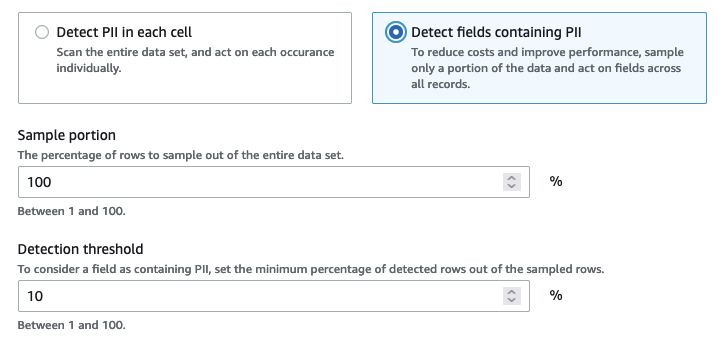
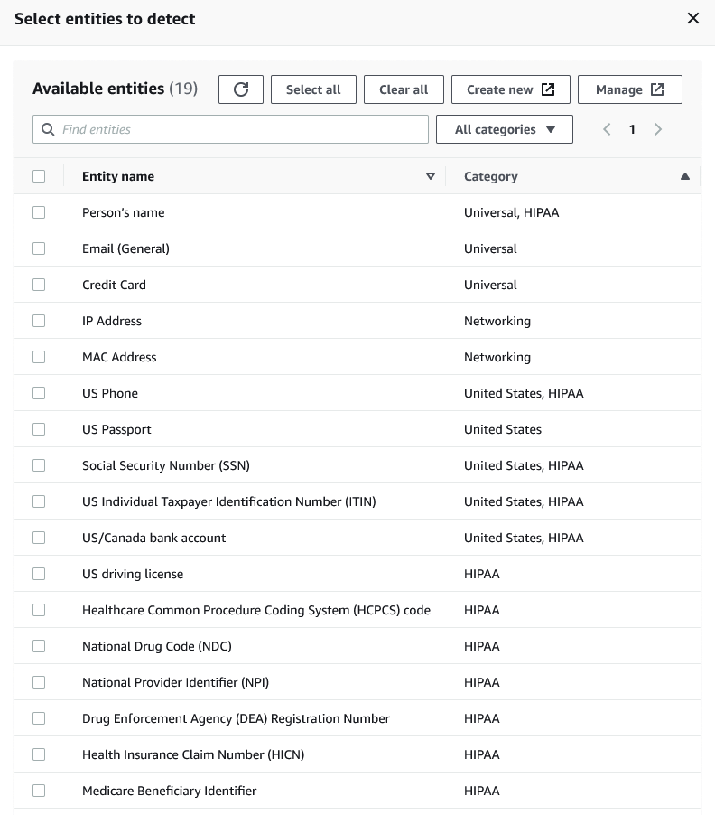
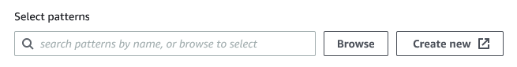
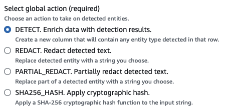
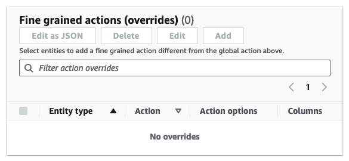

#

Detect and process sensitive data

The Detect PII transform identifies Personal Identifiable Information (PII) in your data source. You choose the PII entity to identify,
how you want the data to be scanned, and what to do with the PII entity that have been identified by the Detect PII transform.

The Detect PII transform provides the ability to detect, mask, or remove entities that you define, or are pre-defined by AWS.
This enables you to increase compliance and reduce liability. For example, you may want to ensure that no personally identifiable
information exists in your data that can be read and want to mask social security numbers with a fixed string (such as xxx-xx-xxxx),
phone numbers, or addresses.

To work with sensitive data outside of AWS Glue Studio, see
[Using Sensitive Data Detection outside AWS Glue Studio](aws-glue-api-sensitive-data-example.md "aws-glue-api-sensitive-data-example.md")

######

Topics

- [Choosing how you want the data to be scanned](#choose-datascan-pii "#choose-datascan-pii")
- [Choosing the PII entities to detect](#choose-pii-entities "#choose-pii-entities")
- [Specifying the level of detection sensitivity](#sensitive-data-sensitivity "#sensitive-data-sensitivity")
- [Choosing what to do with identified PII data](#choose-action-pii "#choose-action-pii")
- [Adding fine-grained action overrides](#sensitive-data-fine-grained-actions-override "#sensitive-data-fine-grained-actions-override")

##

Choosing how you want the data to be scanned

When you scan your dataset for sensitive data like personally identifiable information (PII), you can choose to
detect PII in each row or detect the columns that contain PII data.

When you choose **Detect PII in each cell**, you’re choosing to scan all rows in the data source.
This is a comprehensive scan to ensure that PII entities are identified.

When you choose **Detect fields containing PII**, you’re choosing to scan a sample of rows for PII entities.
This is a way to keep costs and resources low while also identifying the fields where PII entities are found.

When you choose to detect fields that contain PII, you can reduce costs and improve performance by sampling a portion of rows.
Choosing this option will allow you to specify additional options:

- **Sample portion:** This allows you to specify the percentage of rows to sample.
  For example, if you enter ‘50’, you’re specifying that you want 50 percent of scanned rows for the PII entity.
- **Detection threshold:** This allows you to specify the percentage of rows that contain the PII entity
  in order for the entire column to be identified as having the PII entity. For example, if you enter ‘10’, you’re specifying that
  the number of the PII entity, US Phone, in the rows that are scanned must be 10 percent or greater in order for the field to be
  identified as having the PII entity, US Phone. If the percentage of rows that contain the PII entity is less than 10 percent, that
  field will
  not be labeled as having the PII entity, US Phone, in it.

##

Choosing the PII entities to detect

If you chose **Detect PII in each cell**, you can choose from one of three options:

- All available PII patterns - this includes AWS entities.
- Select categories - when you select categories, PII patterns will automatically include patterns
  in the categories that you select.
- Select specific patterns - Only the patterns that you select will be detected.

For a full list of managed sensitive data types, see
[Managed data types](sensitive-data-managed-data-types.md "sensitive-data-managed-data-types.md").

### Choose from all available PII patterns

If you choose **All available PII patterns**, select entities pre-defined by AWS. You can select one,
more than one, or all entities.

###

Select categories

If you chose **Select categories** as the PII patterns to detect, you can select from the options
in the drop-down menu.
Note that some entities can belong to more than one category. For example, _Person's name_
is an entity that belongs to the _Universal_ and _HIPAA_ categories.

- Universal (examples: Email, Credit Card)
- HIPAA (examples: US Driving License, Healthcare Common Procedure Coding System (HCPCS) code)
- Networking (examples: IP Address, MAC Address)
- Argentina
- Australia
- Austria
- Belgium
- Bosnia
- Bulgaria
- Canada
- Chile
- Colombia
- Croatia
- Cyprus
- Czechia
- Denmark
- Estonia
- Finland
- France
- Germany
- Greece
- Hungary
- Ireland
- Korea
- Japan
- Mexico
- Netherlands
- New Zealand
- Norway
- Portugal
- Romania
- Singapore
- Slovakia
- Slovenia
- Spain
- Sweden
- Switzerland
- Turkey
- Ukraine
- United States
- United Kingdom
- Venezuela

###

Select specific patterns

If you choose **Select specific patterns** as the PII patterns to detect, you can search or
browse from a list of patterns you've
already created, or create a new detection entity pattern.

The steps below describe how to create a new custom pattern for detecting
sensitive data. You will create the custom pattern by entering a name for the custom
pattern, add a regular expression, and optionally, define context words.

1. To create a new pattern, click the **Create new** button.

 2. In the Create detection entity page, enter the entity name and a regular expression.
The regular expression (Regex) is what AWS Glue
will use to match entities. 3. Click **Validate**. If the validation is successful, you will see a confirmation message
stating that the string is a valid regular expression. If the validation is not successful, you will see a
message stating that the string does not conform to proper formatting and accepted character literals, operators
or constructs. 4. You can choose to add Context words in addition to the regular expression. Context words may increase the likelihood
of a match. These can be useful in cases where field names are not descriptive of the entity. For example, social
security numbers may be named 'SSN' or 'SS'. Adding these context words can help match the entity. 5. Click **Create** to create the detection entity. Any created entities are visible in the
AWS Glue Studio console. Click on **Detection entities** in the left-hand navigation menu.

You can edit, delete, or create detection entities from the **Detection entities** page. You can also
search for a pattern using the search field.

##

Specifying the level of detection sensitivity

You can set the level of sensitivity when using detecting sensitive data.

- **High** – (Default) Detects more entities for use cases that require a higher level
  of sensitivity. All AWS Glue jobs created after November 2023 are automatically opted-in to
  this setting.
- **Low** – Detects fewer entities and reduces false positives.

##

Choosing what to do with identified PII data

If you chose to detect PII in the entire data source, you can select a global action to apply:

- **Enrich data with detection results:** If you chose Detect PII in each cell, you can store the
  detected entities into a new column.
- **Redact detected text:** You can replace the detected PII value with a string that you specify
  in the optional Replacing text input field. If no string is specified, the detected PII entity is replaced with '\*\*\*\*\*\*\*'.
- **Partially redact detected text:** You can replace part of the detected PII value with a
  string you choose. There are two possible options: to either leave the ends unmasked or to mask by providing
  an explicit regex pattern. This feature is not available in AWS Glue 2.0.
- **Apply cryptographic hash:** You can pass the detected PII value to a SHA-256 cryptographic hash
  function and replace the value with the function’s output.

###

Differences between AWS Glue versions 2.0 and 3.0+

AWS Glue 2.0 jobs will return a new DataFrame with the detected PII information for each column in
a supplementary column. Any redaction or hash work is visible within the AWS Glue script in the
visual tab.

AWS Glue 3.0 and 4.0 jobs will return a new DataFrame with this same supplementary column. A new key
for “actionUsed” is present and can be one of `DETECT`, `REDACT`, `PARTIAL_REDACT`,
or `SHA256_HASH`.
If a masking action is selected, the DataFrame will return data with sensitive data masked.

##

Adding fine-grained action overrides

Additional detection and action settings can be added to the fine-grained actions overrides table. This allows you
to:

- **Include or exclude certain columns from detection** – An inferred schema on the
  data source will populate the table with available columns.
- **Specify specific settings that are more fine-grained than using global actions** –
  For example, you can specify different redaction text settings for different entity types.
- **Specify a different action than the global action** – If a different action wants
  to be applied on a different sensitive data type, that can be done here. Note that two different
  edit-in-place actions (redaction and hashing) cannot be used on the same column, but detect can always be
  used.

