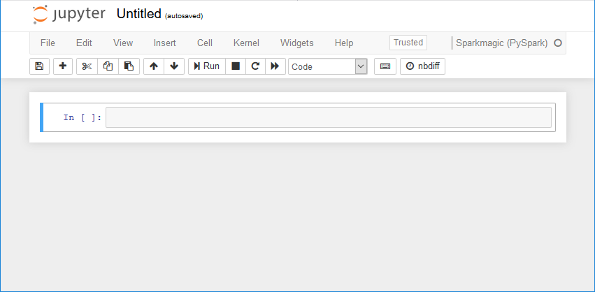
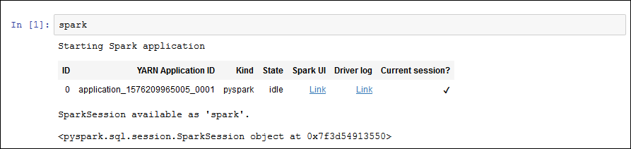

# Tutorial: Use a SageMaker AI notebook with your

development endpoint

In AWS Glue, you can create a development endpoint and then create a SageMaker AI notebook to help
develop your ETL and machine learning scripts. A SageMaker AI notebook is a fully managed machine
learning compute instance running the Jupyter Notebook application.

1. In the AWS Glue console, choose **Dev endpoints** to navigate to the
   development endpoints list.
2. Select the check box next to the name of a development endpoint that you want to use,
   and on the **Action** menu, choose **Create SageMaker
   notebook**.
3. Fill out the **Create and configure a notebook** page as
   follows:
   1. Enter a notebook name.
   2. Under **Attach to development endpoint**, verify the development
      endpoint.
   3. Create or choose an AWS Identity and Access Management (IAM) role.

   Creating a role is recommended. If you use an existing role, ensure that it has the
   required permissions. For more information, see [Step 6: Create an IAM policy for SageMaker AI
   notebooks](create-sagemaker-notebook-policy.md "create-sagemaker-notebook-policy.md"). 4. (Optional) Choose a VPC, a subnet, and one or more security groups. 5. (Optional) Choose an AWS Key Management Service encryption key. 6. (Optional) Add tags for the notebook instance.

4. Choose **Create notebook**. On the **Notebooks** page,
   choose the refresh icon at the upper right, and continue until the
   **Status** shows `Ready`.
5. Select the check box next to the new notebook name, and then choose **Open
   notebook**.
6. Create a new notebook: On the **jupyter** page, choose
   **New**, and then choose **Sparkmagic
   (PySpark)**.

Your screen should now look like the following:

 7. (Optional) At the top of the page, choose **Untitled**, and give the
notebook a name. 8. To start a Spark application, enter the following command into the notebook, and then in
the toolbar, choose **Run**.

```
spark
```

After a short delay, you should see the following response:

 9. Create a dynamic frame and run a query against it: Copy, paste, and run the following
code, which outputs the count and schema of the `persons_json` table.

```
import sys
from pyspark.context import SparkContext
from awsglue.context import GlueContext
from awsglue.transforms import *
glueContext = GlueContext(SparkContext.getOrCreate())
persons_DyF = glueContext.create_dynamic_frame.from_catalog(database="legislators", table_name="persons_json")
print ("Count:  ", persons_DyF.count())
persons_DyF.printSchema()
```
