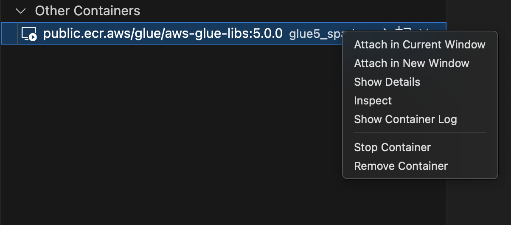
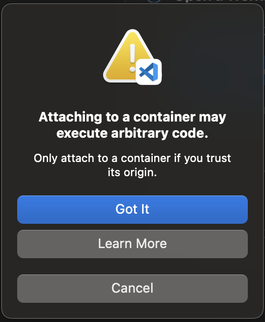
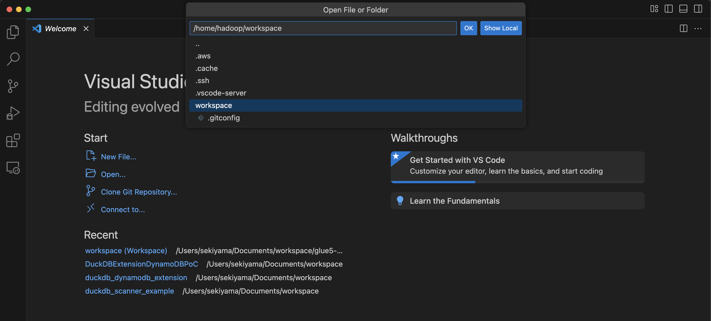
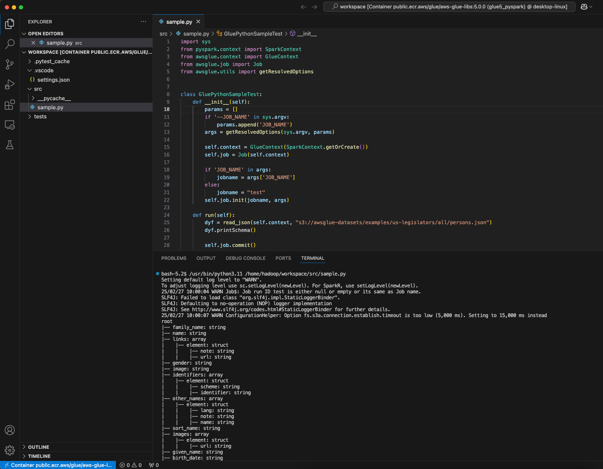

# Develop and test AWS Glue jobs locally using a Docker image

For a production-ready data platform, the development process and CI/CD pipeline for AWS Glue jobs is a key topic. You can flexibly develop and test
AWS Glue jobs in a Docker container. AWS Glue hosts Docker images on Docker Hub to set up your development environment with additional utilities.
You can use your preferred IDE, notebook, or REPL using AWS Glue ETL library. This topic describes how to develop and test AWS Glue version 5.0 jobs in a
Docker container using a Docker image.

## Available Docker images

The following Docker images are available for AWS Glue on [Amazon ECR:](https://gallery.ecr.aws/glue/aws-glue-libs "https://gallery.ecr.aws/glue/aws-glue-libs").

- For AWS Glue version 5.0: `public.ecr.aws/glue/aws-glue-libs:5`
- For AWS Glue version 4.0: `public.ecr.aws/glue/aws-glue-libs:glue_libs_4.0.0_image_01`
- For AWS Glue version 3.0: `public.ecr.aws/glue/aws-glue-libs:glue_libs_3.0.0_image_01`
- For AWS Glue version 2.0: `public.ecr.aws/glue/aws-glue-libs:glue_libs_2.0.0_image_01`

###### Note

AWS Glue Docker images are compatible with both x86_64 and arm64.

In this example, we use `public.ecr.aws/glue/aws-glue-libs:5` and run the container on a local machine (Mac, Windows, or Linux).
This container image has been tested for AWS Glue version 5.0 Spark jobs. The image contains the following:

- Amazon Linux 2023
- AWS Glue ETL Library
- Apache Spark 3.5.4
- Open table format libraries; Apache Iceberg 1.7.1, Apache Hudi 0.15.0, and Delta Lake 3.3.0
- AWS Glue Data Catalog Client
- Amazon Redshift connector for Apache Spark
- Amazon DynamoDB connector for Apache Hadoop

To set up your container, pull the image from ECR Public Gallery and then run the container. This topic demonstrates how to run your container with
the following methods, depending on your requirements:

- `spark-submit`
- REPL shell `(pyspark)`
- `pytest`
- Visual Studio Code

## Prerequisites

Before you start, make sure that Docker is installed and the Docker daemon is running. For
installation instructions, see the Docker documentation for [Mac](https://docs.docker.com/docker-for-mac/install/ "https://docs.docker.com/docker-for-mac/install/") or [Linux](https://docs.docker.com/engine/install/ "https://docs.docker.com/engine/install/"). The machine running the
Docker hosts the AWS Glue container. Also make sure that you have at least 7 GB
of disk space for the image on the host running the Docker.

For more information about restrictions when developing AWS Glue code locally, see
[Local development restrictions](aws-glue-programming-etl-libraries.md#local-dev-restrictions "aws-glue-programming-etl-libraries.md#local-dev-restrictions") .

### Configuring AWS

To enable AWS API calls from the container, set up AWS credentials by following
steps. In the following sections, we will use this AWS named profile.

1. [Create an AWS named profile](../../../cli/latest/userguide/cli-configure-files.md "../../../cli/latest/userguide/cli-configure-files.md") .
2. Open `cmd` on Windows or a terminal on Mac/Linux and run the following command in a terminal:

```
PROFILE_NAME="`<your_profile_name>`"
```

In the following sections, we use this AWS named profile.

###

If you’re running Docker on Windows, choose the Docker icon (right-click) and choose **Switch to Linux containers** before pulling
the image.

Run the following command to pull the image from ECR Public:

```
docker pull public.ecr.aws/glue/aws-glue-libs:5
```

## Run the container

You can now run a container using this image. You can choose any of following based on your requirements.

### spark-submit

You can run an AWS Glue job script by running the `spark-submit` command on the container.

1. Write your script and save it as `sample.py` in the example below and save it under the `/local_path_to_workspace/src/`
   directory using the following commands:

```
$ WORKSPACE_LOCATION=/local_path_to_workspace
$ SCRIPT_FILE_NAME=sample.py
$ mkdir -p ${WORKSPACE_LOCATION}/src
$ vim ${WORKSPACE_LOCATION}/src/${SCRIPT_FILE_NAME}
```

2. These variables are used in the docker run command below. The sample code (sample.py) used in the spark-submit command below is included
   in the appendix at the end of this topic.

Run the following command to execute the `spark-submit` command on the container to submit a new Spark application:

```
$ docker run -it --rm \
    -v ~/.aws:/home
    /hadoop/.aws \
    -v $WORKSPACE_LOCATION:/home/hadoop/workspace/ \
    -e AWS_PROFILE=$PROFILE_NAME \
    --name glue5_spark_submit \
    public.ecr.aws/glue/aws-glue-libs:5 \
    spark-submit /home/hadoop/workspace/src/$SCRIPT_FILE_NAME
```

3. (Optionally) Configure `spark-submit` to match your environment. For example, you can
   pass your dependencies with the `--jars` configuration. For more information, consult [Dynamically Loading Spark Properties](https://spark.apache.org/docs/latest/configuration.html "https://spark.apache.org/docs/latest/configuration.html") in the Spark documentation.

### REPL shell (Pyspark)

You can run REPL (`read-eval-print loops`) shell for interactive development.
Run the following command to execute the PySpark command on the container to start the REPL shell:

```
$ docker run -it --rm \
    -v ~/.aws:/home/hadoop/.aws \
    -e AWS_PROFILE=$PROFILE_NAME \
    --name glue5_pyspark \
    public.ecr.aws/glue/aws-glue-libs:5 \
    pyspark
```

You will see the following output:

```
Python 3.11.6 (main, Jan  9 2025, 00:00:00) [GCC 11.4.1 20230605 (Red Hat 11.4.1-2)] on linux
Type "help", "copyright", "credits" or "license" for more information.
Setting default log level to "WARN".
To adjust logging level use sc.setLogLevel(newLevel). For SparkR, use setLogLevel(newLevel).
Welcome to
      ____              __
     / __/__  ___ _____/ /__
    _\ \/ _ \/ _ `/ __/  '_/
   /__ / .__/\_,_/_/ /_/\_\   version 3.5.4-amzn-0
      /_/

Using Python version 3.11.6 (main, Jan  9 2025 00:00:00)
Spark context Web UI available at None
Spark context available as 'sc' (master = local[*], app id = local-1740643079929).
SparkSession available as 'spark'.
>>>
```

With this REPL shell, you can code and test interactively.

### Pytest

For unit testing, you can use `pytest` for AWS Glue Spark job scripts. Run the following commands for preparation.

```
$ WORKSPACE_LOCATION=/local_path_to_workspace
$ SCRIPT_FILE_NAME=sample.py
$ UNIT_TEST_FILE_NAME=test_sample.py
$ mkdir -p ${WORKSPACE_LOCATION}/tests
$ vim ${WORKSPACE_LOCATION}/tests/${UNIT_TEST_FILE_NAME}
```

Run the following command to run `pytest` using `docker run`:

```
$ docker run -i --rm \
    -v ~/.aws:/home/hadoop/.aws \
    -v $WORKSPACE_LOCATION:/home/hadoop/workspace/ \
    --workdir /home/hadoop/workspace \
    -e AWS_PROFILE=$PROFILE_NAME \
    --name glue5_pytest \
    public.ecr.aws/glue/aws-glue-libs:5 \
    -c "python3 -m pytest --disable-warnings"
```

Once `pytest` finishes executing unit tests, your output will look something like this:

```
============================= test session starts ==============================
platform linux -- Python 3.11.6, pytest-8.3.4, pluggy-1.5.0
rootdir: /home/hadoop/workspace
plugins: integration-mark-0.2.0
collected 1 item

tests/test_sample.py .                                                   [100%]

======================== 1 passed, 1 warning in 34.28s =========================
```

### Setting up the container to use Visual Studio Code

To set up the container with Visual Studio Code, complete the following steps:

1. Install Visual Studio Code.
2. Install [Python](https://marketplace.visualstudio.com/items?itemName=ms-python.python "https://marketplace.visualstudio.com/items?itemName=ms-python.python").
3. Install [Visual Studio Code Remote - Containers](https://code.visualstudio.com/docs/remote/containers "https://code.visualstudio.com/docs/remote/containers")
4. Open the workspace folder in Visual Studio Code.
5. Press `Ctrl+Shift+P` (Windows/Linux) or `Cmd+Shift+P` (Mac).
6. Type `Preferences: Open Workspace Settings (JSON)`.
7. Press Enter.
8. Paste the following JSON and save it.

```
{
    "python.defaultInterpreterPath": "/usr/bin/python3.11",
    "python.analysis.extraPaths": [
        "/usr/lib/spark/python/lib/py4j-0.10.9.7-src.zip:/usr/lib/spark/python/:/usr/lib/spark/python/lib/",
    ]
}
```

To set up the container:

1. Run the Docker container.

```
$ docker run -it --rm \
    -v ~/.aws:/home/hadoop/.aws \
    -v $WORKSPACE_LOCATION:/home/hadoop/workspace/ \
    -e AWS_PROFILE=$PROFILE_NAME \
    --name glue5_pyspark \
    public.ecr.aws/glue/aws-glue-libs:5 \
    pyspark
```

2. Start Visual Studio Code.
3. Choose **Remote Explorer** on the left menu, and choose `amazon/aws-glue-libs:glue_libs_4.0.0_image_01`.
4. Right-click and choose **Attach in Current Window**.

 5. If the following dialog appears, choose **Got it**.

 6. Open `/home/handoop/workspace/`.

 7. Create a AWS Glue PySpark script and choose **Run**.

You will see the successful run of the script.



## Changes between AWS Glue 4.0 and AWS Glue 5.0 Docker image

The major changes between the AWS Glue 4.0 and AWS Glue 5.0 Docker image:

- In AWS Glue 5.0, there is a single container image for both batch and streaming jobs. This differs from Glue 4.0, where there was one image for
  batch and another for streaming.
- In AWS Glue 5.0, the default user name of the container is `hadoop`. In AWS Glue 4.0, the default user name was `glue_user`.
- In AWS Glue 5.0, several additional libraries including JupyterLab and Livy have been removed from the image. You can manually install them.
- In AWS Glue 5.0, all of Iceberg, Hudi and Delta libraries are pre-loaded by default, and the environment variable `DATALAKE_FORMATS` is no
  longer needed. Prior to AWS Glue 4.0, the environment variable `DATALAKE_FORMATS` environment variable was used to specify which specific
  table formats should be loaded.

The above list is specific to the Docker image. To learn more about AWS Glue 5.0 updates, see
[Introducing AWS Glue 5.0 for Apache Spark](https://aws.amazon.com/blogs/big-data/introducing-aws-glue-5-0-for-apache-spark/ "https://aws.amazon.com/blogs/big-data/introducing-aws-glue-5-0-for-apache-spark/")  
 and [Migrating AWS Glue for Spark jobs to AWS Glue version 5.0](migrating-version-50.md "migrating-version-50.md").

## Considerations

Keep in mind that the following features are not supported when using the AWS Glue container image to develop job scripts locally.

- [Job bookmarks](monitor-continuations.md "monitor-continuations.md")
- AWS Glue Parquet writer ([Using the Parquet format in AWS Glue](aws-glue-programming-etl-format-parquet-home.md "aws-glue-programming-etl-format-parquet-home.md"))
- [FillMissingValues transform](aws-glue-api-crawler-pyspark-transforms-fillmissingvalues.md "aws-glue-api-crawler-pyspark-transforms-fillmissingvalues.md")
- [FindMatches transform](machine-learning.md#find-matches-transform "machine-learning.md#find-matches-transform")
- [Vectorized SIMD CSV reader](aws-glue-programming-etl-format-csv-home.md#aws-glue-programming-etl-format-simd-csv-reader "aws-glue-programming-etl-format-csv-home.md#aws-glue-programming-etl-format-simd-csv-reader")
- The property [customJdbcDriverS3Path](aws-glue-programming-etl-connect.md#aws-glue-programming-etl-connect-jdbc "aws-glue-programming-etl-connect.md#aws-glue-programming-etl-connect-jdbc") for loading JDBC driver from Amazon S3 path
- [AWS Glue Data Quality](glue-data-quality.md "glue-data-quality.md")
- [Sensitive Data Detection](detect-PII.md "detect-PII.md")
- AWS Lake Formation permission-based credential vending

## Appendix: Adding JDBC drivers and Java libraries

To add JDBC driver not currently available in the container, you can create a new directory under your workspace with JAR files you need and mount
the directory to `/opt/spark/jars/` in docker run command. JAR files found under `/opt/spark/jars/` within the container are
automatically added to Spark Classpath and will be available for use during job run.

For example, use the following docker run command to add JDBC driver jars to PySpark REPL shell.

```
docker run -it --rm \
    -v ~/.aws:/home/hadoop/.aws \
    -v $WORKSPACE_LOCATION:/home/hadoop/workspace/ \
    -v $WORKSPACE_LOCATION/jars/:/opt/spark/jars/ \
    --workdir /home/hadoop/workspace \
    -e AWS_PROFILE=$PROFILE_NAME \
    --name glue5_jdbc \
    public.ecr.aws/glue/aws-glue-libs:5 \
    pyspark
```

As highlighted in **Considerations**, `customJdbcDriverS3Path` connection option cannot be used to import a custom
JDBC driver from Amazon S3 in AWS Glue container images.
