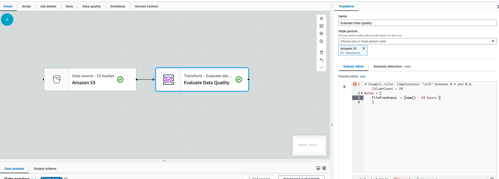

# FileFreshness

FileFreshness ensures your data files are fresh based on the condition you provide. It uses your files' last modified time to
ensure that data files or the entire folder is up-to-date.

This rule gathers two metrics:

- FileFreshness compliance based on the rule you set up
- The number of files that were scanned by the rule

```
{"Dataset.*.FileFreshness.Compliance":1,"Dataset.*.FileCount":1}
```

Anomaly detection does not consider these metrics.

**Checking file freshness**

The following rule ensures that tickets.parquet was created in the past 24 hours.

```
FileFreshness "s3://amzn-s3-demo-bucket/artifacts/file/tickets/tickets.parquet" > (now() - 24 hours)
```

**Checking folder freshness**

The following rule passes if all files in the folder were created or modified in past 24 hours.

```
FileFreshness "s3://bucket/" >= (now() -1 days)
FileFreshness "s3://amzn-s3-demo-bucket/artifacts/file/tickets/" >= (now() - 24 hours)
```

**Checking folder or file freshness with threshold**

The following rule passes if 10% of the files in the folder “tickets“ were created or modified in the past 10 days.

```
FileFreshness "s3://amzn-s3-demo-bucket/artifacts/file/tickets/" < (now() - 10 days) with threshold > 0.1
```

**Checking files or folders with specific dates**

You can check for file freshness for specific days.

```
FileFreshness "s3://amzn-s3-demo-bucket/artifacts/file/tickets/" > "2020-01-01"
FileFreshness "s3://amzn-s3-demo-bucket/artifacts/file/tickets/" between "2023-01-01" and "2024-01-01"
```

**Checking files or folders with time**

You can use FileFreshness to ensure that files have arrived based on certain times.

```
FileFreshness "s3://amzn-s3-demo-bucket/artifacts/file/tickets/" between now() and (now() - 45 minutes)
FileFreshness "s3://amzn-s3-demo-bucket/artifacts/file/tickets/" between "9:30 AM" and "9:30 PM"
FileFreshness "s3://amzn-s3-demo-bucket/artifacts/file/tickets/" > (now() - 10 minutes)
FileFreshness "s3://amzn-s3-demo-bucket/artifacts/file/tickets/" > now()
FileFreshness "s3://amzn-s3-demo-bucket/artifacts/file/tickets/" between (now() - 2 hours) and (now() + 15 minutes)
FileFreshness "s3://amzn-s3-demo-bucket/artifacts/file/tickets/" between (now() - 3 days) and (now() + 15 minutes)
FileFreshness "s3://amzn-s3-demo-bucket/artifacts/file/tickets/" between "2001-02-07" and (now() + 15 minutes)
FileFreshness "s3://amzn-s3-demo-bucket/artifacts/file/tickets/" > "21:45""
FileFreshness "s3://amzn-s3-demo-bucket/artifacts/file/tickets/" > "2024-01-01"
FileFreshness "s3://amzn-s3-demo-bucket/artifacts/file/tickets/" between "02:30" and "04:30"
FileFreshness "s3://amzn-s3-demo-bucket/artifacts/file/tickets/" between "9:30 AM" and "22:15"
```

Key considerations:

- FileFreshness can evaluate files using days, hours, and minute units
- For times, it supports AM / PM and 24-hour
- Times are calculated in UTC unless an override is specified
- Dates are calculated in UTC at time 00:00

FileFreshness that are time-based works as follows:

```
FileFreshness "s3://amzn-s3-demo-bucket/artifacts/file/tickets/" > "21:45"
```

- First, the time “21:45” is combined with today’s date in UTC format to create a date-time field
- Next, the date-time is converted to a timezone that you have specified
- Finally, the rule is evaluated

**Optional File-based Rule Tags:**

Tags allow you to control the rule behavior.

**recentFiles**

This tag limits the number of files processed by keeping the most recent file first.

```
FileFreshness "s3://amzn-s3-demo-bucket/" between (now() - 100 minutes) and (now() + 10 minutes) with recentFiles = 1
```

**timeZone**

Accepted time zone overrides, see [Allowed Time Zones](https://docs.oracle.com/javase/8/docs/api/java/time/ZoneId.html "https://docs.oracle.com/javase/8/docs/api/java/time/ZoneId.html") for
supported time zones.

```
FileFreshness "s3://path/" > "21:45" with timeZone = "America/New_York"
```

```
FileFreshness "s3://path/" > "21:45" with timeZone = "America/Chicago"
```

```
FileFreshness "s3://path/" > "21:45" with timeZone = "Europe/Paris"
```

```
FileFreshness "s3://path/" > "21:45" with timeZone = "Asia/Shanghai"
```

```
FileFreshness "s3://path/" > "21:45" with timeZone = "Australia/Darwin"
```

**Inferring file names directly from data frames**

You don't always have to provide a file path. For instance, when you are authoring the rule in the AWS Glue Data Catalog, it may be hard
to find which folders the catalog tables are using. AWS Glue Data Quality can find the specific folders or files used to populate your
dataframe and can detect if they are fresh.

###### Note

This feature will only work when files are successfully read into the DynamicFrame or DataFrame.

```
FileFreshness > (now() - 24 hours)
```

This rule will find the folder path or files that are used to populate the dynamic frame or data frame. This works for Amazon S3 paths
or Amazon S3-based AWS Glue Data Catalog tables. There are a few considerations:

1. In AWS Glue ETL, you must have the **EvaluateDataQuality** Transform immediately after an Amazon S3 or AWS Glue Data Catalog transform.

 2. This rule will not work in AWS Glue Interactive Sessions.

If you attempt this in both of the cases, or when AWS Glue can’t find the files, AWS Glue will throw the following error:
`“Unable to parse file path from DataFrame”`
