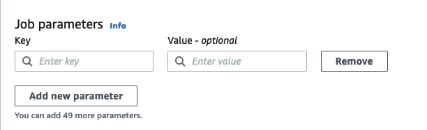
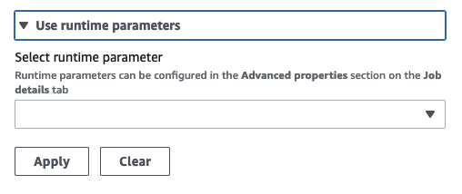

#

Adding source and target parameters to the AWS Glue Data Catalog node

AWS Glue Studio allows you to parameterize visual jobs. Since catalog table names in production and development environment may be different,
you can define and select runtime parameters for databases and tables that will run when
your job runs.

Job parameterization allows you to parameterize sources and targets,
and save those parameters to the job when using the AWS Glue Data Catalog node.
When you specify sources and targets as paramters, you are enabling the
reusability of jobs, particularly when using the same job in multiple environments. This is useful when
promoting code across deployment environments by saving time and effort in managing your sources and targets.
In addition, the custom parameters you specify will override
any default arguments for specific runs of AWS Glue jobs.

**To add source and target parameters**

Whether you are using the AWS Glue Data Catalog node as a source or a target, you can define runtime parameters
in the **Advanced properties** section on the **Job details** tab.

1. Choose the AWS Glue Data Catalog node as either the source node or the target node.
2. Choose the **Job details** tab.
3. Choose **Advanced properties**.
4. In the Job parameters section, enter a key value. For example, `--db.source` would be the parameter for a database source. You can
   enter any name for the key, as long as the key name is followed by the 'dash dash'.

 5. Enter the value. For example, `databasename` would be the value for database being parameterized. 6. Choose **Add new parameter** if you want to add more parameters. Max 50 parameters is allowed.
Once the key value pair has been defined, you can use the parameter in the AWS Glue Data Catalog node.

**To select a runtime parameter**

###### Note

The process to select runtime parameters for databases and tables is the same whether the the AWS Glue Data Catalog node
is the source or the target.

1. Choose the AWS Glue Data Catalog node as either the source node or the target node.
2. In the **Data source properties - Data Catalog** tab, under **Database**, choose
   **Use runtime parameters**.

 3. Choose a parameter from the drop-down menu. For example, when you select a parameter you defined for a source database, the
database will automatically populate in the database drop-down menu when you choose **Apply**. 4. In the Table section, choose a parameter you already defined as a source table. When you choose **Apply**, the
table is automatically populated as the table to use. 5. When you save and run the job, AWS Glue Studio will reference the selected parameters during the job run.
