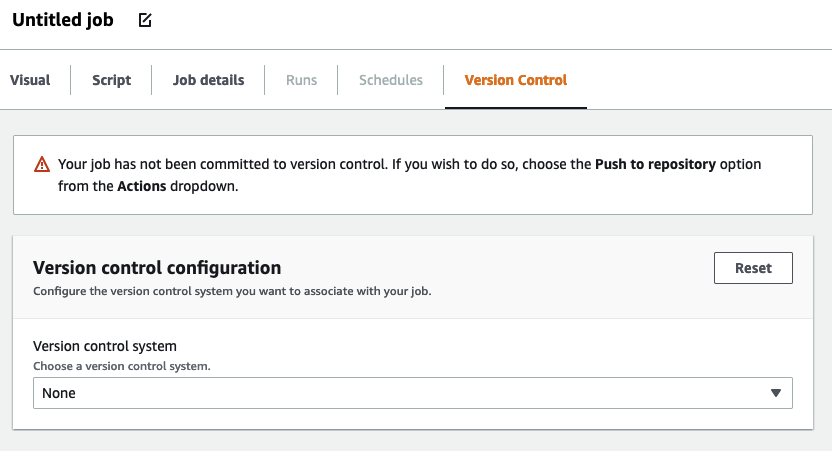
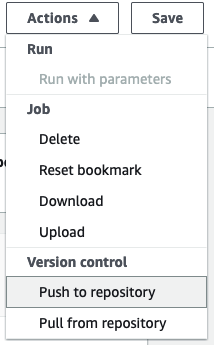

#

Using Git version control systems in AWS Glue

###### Note

Notebooks are not currently supported for version control in AWS Glue Studio. However, version control
for AWS Glue job scripts and visual ETL jobs are supported.

If you have remote repositories and want to manage your AWS Glue jobs using your repositories,
you can use AWS Glue Studio or the AWS CLI to sync changes to your repositories and your jobs in
AWS Glue. When you sync changes this way, you're pushing the job from AWS Glue Studio to your repository, or
pulling from the repository to AWS Glue Studio.

With Git integration in AWS Glue Studio, you can:

- Integrate with Git version control systems, such as AWS CodeCommit, GitHub, GitLab, and Bitbucket
- Edit AWS Glue jobs in AWS Glue Studio whether you use visual jobs or script jobs and sync them to a repository
- Parameterize sources and targets in jobs
- Pull jobs from a repository and edit them in AWS Glue Studio
- Test jobs by pulling from branches and/or pushing to branches utilizing multi-branch workflows in AWS Glue Studio
- Download files from a repository and upload jobs into AWS Glue Studio for cross-account job creation
- Use your automation tool of choice (for example, Jenkins, AWS CodeDeploy, etc.)
  This video demonstrates how you can integrate AWS Glue with Git and build a continuous and collaborative code pipeline.

## IAM permissions

Ensure the job has one of the following IAM permissions. For more information on how to
set up IAM permissions, see
[Set up IAM permissions for AWS Glue Studio](../ug/setting-up.md#getting-started-iam-permissions "../ug/setting-up.md#getting-started-iam-permissions").

- `AWSGlueServiceRole`
- `AWSGlueConsoleFullAccess`

At minimum, the following actions are needed for Git integration:

- `glue:UpdateJobFromSourceControl` — to be able to update AWS Glue with a job present in a version control system
- `glue:UpdateSourceControlFromJob` — to be able to update the version control system with a job stored in AWS Glue
- `s3:GetObject` — to be able to retrieve the script for the job while pushing to version control system
- `s3:PutObject` — to be able to update the script when pulling a job from a source control system

##

Prerequisites

In order to push jobs to a source control repository, you will need:

- a repository that has already been created by your administrator
- a branch in the repository
- a personal access token (for Bitbucket, this is the Repository Access Token)
- the username of the repository owner
- set permissions in the repository to allow AWS Glue Studio to read and write to the repository
  - **GitLab** – set token scopes to api, read_repository, and write_repository
  - **Bitbucket** – set permissions to:
    - **Workspace membership** – read, write
    - **Projects** – write, admin read
    - **Repositories** – read, write, admin, delete

###### Note

When using AWS CodeCommit, personal access token and repository owner are not needed.
See [Getting started with Git and AWS CodeCommit](../../../codecommit/latest/userguide/getting-started.md "../../../codecommit/latest/userguide/getting-started.md").

**Using jobs from your source control repository in AWS Glue Studio**

In order to pull a job from your source control repository that is not in AWS Glue Studio, and to use that job in AWS Glue Studio,
the prerequisites will depend on the type of job.

**For visual jobs:**

- you need a folder and a JSON file of the job definition that matches the job name

For example, see the job definition below.
The branch in your repository should contain a path
`my-visual-job/my-visual-job.json` where both the folder and the JSON file match the job name

```
{
  "name" : "my-visual-job",
  "description" : "",
  "role" : "arn:aws:iam::aws_account_id:role/Rolename",
  "command" : {
    "name" : "glueetl",
    "scriptLocation" : "s3://foldername/scripts/my-visual-job.py",
    "pythonVersion" : "3"
  },
  "codeGenConfigurationNodes" : "{\"node-nodeID\":{\"S3CsvSource\":{\"AdditionalOptions\":{\"EnableSamplePath\":false,\"SamplePath\":\"s3://notebook-test-input/netflix_titles.csv\"},\"Escaper\":\"\",\"Exclusions\":[],\"Name\":\"Amazon S3\",\"OptimizePerformance\":false,\"OutputSchemas\":[{\"Columns\":[{\"Name\":\"show_id\",\"Type\":\"string\"},{\"Name\":\"type\",\"Type\":\"string\"},{\"Name\":\"title\",\"Type\":\"choice\"},{\"Name\":\"director\",\"Type\":\"string\"},{\"Name\":\"cast\",\"Type\":\"string\"},{\"Name\":\"country\",\"Type\":\"string\"},{\"Name\":\"date_added\",\"Type\":\"string\"},{\"Name\":\"release_year\",\"Type\":\"bigint\"},{\"Name\":\"rating\",\"Type\":\"string\"},{\"Name\":\"duration\",\"Type\":\"string\"},{\"Name\":\"listed_in\",\"Type\":\"string\"},{\"Name\":\"description\",\"Type\":\"string\"}]}],\"Paths\":[\"s3://dalamgir-notebook-test-input/netflix_titles.csv\"],\"QuoteChar\":\"quote\",\"Recurse\":true,\"Separator\":\"comma\",\"WithHeader\":true}}}"
}

```

**For script jobs:**

- you need a folder, a JSON file of the job definition, and the script
- the folder and JSON file should match the job name.
  The script name needs to match the `scriptLocation` in the job definition along with the file
  extension

For example, in the job definition below, the branch in your repository should contain a path `my-script-job/my-script-job.json`
and `my-script-job/my-script-job.py`.
The script name should match the name in the `scriptLocation` including the extension of the script

```
{
  "name" : "my-script-job",
  "description" : "",
  "role" : "arn:aws:iam::aws_account_id:role/Rolename",
  "command" : {
    "name" : "glueetl",
    "scriptLocation" : "s3://foldername/scripts/my-script-job.py",
    "pythonVersion" : "3"
  }
}

```

##

Limitations

- AWS Glue currently does not support pushing/pulling from
  [GitLab-Groups](https://docs.gitlab.com/ee/user/group "https://docs.gitlab.com/ee/user/group").

##

Connecting version control repositories with AWS Glue

You can enter your version control repository details and manage them in the **Version Control** tab in the AWS Glue Studio
job editor.
To integrate with your Git repository, you must connect to your repository every time you log in to AWS Glue Studio.

To connect a Git version control system:

1. In AWS Glue Studio, start a new job and choose the **Version Control** tab.

 2. In **Version control system**, choose the Git Service from the available options by clicking on the
drop-down menu.

    * AWS CodeCommit
    * GitHub
    * GitLab
    * Bitbucket

3. Depending on the Git version control system you choose, you will have different fields to complete.

**For AWS CodeCommit**:

Complete the repository configuration by selecting the repository and branch for your job:

    * **Repository** — if you have set up repositories in AWS CodeCommit,
     select the repository from the drop-down menu. Your repositories will automatically populate in the list
    * **Branch** — select the branch from the drop-down menu
    * **Folder** — *optional* - enter the name of the folder in which to save your job. If left empty,
     a folder is automatically created. The folder name defaults to the job name

**For GitHub**:

Complete the GitHub configuration by completing the fields:

    * **Personal access token** — this is the token provided by the GitHub repository. For more information on
     personal access tokens, see
     [GitHub Docs](https://docs.github.com/en/authentication/keeping-your-account-and-data-secure/creating-a-personal-access-token "https://docs.github.com/en/authentication/keeping-your-account-and-data-secure/creating-a-personal-access-token")
    * **Repository owner** — this is the owner of the GitHub repository.

Complete the repository configuration by selecting the repository and branch from GitHub.

    * **Repository** — if you have set up repositories in GitHub,
     select the repository from the drop-down menu. Your repositories will automatically populate in the list
    * **Branch** — select the branch from the drop-down menu
    * **Folder** — *optional* - enter the name of the folder in which to save your job. If left empty,
     a folder is automatically created. The folder name defaults to the job name

**For GitLab**:

###### Note

AWS Glue currently does not support pushing/pulling from
[GitLab-Groups](https://docs.gitlab.com/ee/user/group "https://docs.gitlab.com/ee/user/group").

    * **Personal access token** — this is the token provided by the GitLab repository. For more information on
     personal access tokens, see
     [GitLab Personal access tokens](https://docs.gitlab.com/ee/user/profile/personal_access_tokens.html "https://docs.gitlab.com/ee/user/profile/personal_access_tokens.html")
    * **Repository owner** — this is the owner of the GitLab repository.

Complete the repository configuration by selecting the repository and branch from GitLab.

    * **Repository** — if you have set up repositories in GitLab,
     select the repository from the drop-down menu. Your repositories will automatically populate in the list
    * **Branch** — select the branch from the drop-down menu
    * **Folder** — *optional* - enter the name of the folder in which to save your job. If left empty,
     a folder is automatically created. The folder name defaults to the job name

**For Bitbucket**:

    * **App password** — Bitbucket uses App passwords and not
     Repository Access Tokens.
     For more information on App passwords, see
     [App passwords](https://support.atlassian.com/bitbucket-cloud/docs/app-passwords/ "https://support.atlassian.com/bitbucket-cloud/docs/app-passwords/") .
    * **Repository owner** — this is the owner of the Bitbucket repository. In Bitbucket, the owner
     is the creator of the repository.

Complete the repository configuration by selecting the workspace, repository, branch, and folder from Bitbucket.

    * **Workspace** – if you have workspaces set up in Bitbucket, select the workspace
     from the drop-down menu. Your workspaces are automatically populated
    * **Repository** — if you have set up repositories in Bitbucket,
     select the repository from the drop-down menu. Your repositories are automatically populated
    * **Branch** — select the branch from the drop-down menu. Your branches are automatically
     populated
    * **Folder** — *optional* - enter the name of the folder in which to save your job.
     If left empty, a folder is automatically created with the job name.

4. Choose **Save** at the top of the AWS Glue Studio job

##

Pushing AWS Glue jobs to the source repository

Once you've entered the details of your version control system, you can edit jobs in AWS Glue Studio and push the jobs to
your source repository. If you're unfamiliar with Git concepts such as pushing and pulling, see this tutorial on
[Getting started with Git and AWS CodeCommit](../../../codecommit/latest/userguide/getting-started.md "../../../codecommit/latest/userguide/getting-started.md").

In order to push your job to a repository, you need to enter the details of your version control system and save your job.

1. In the AWS Glue Studiojob, choose **Actions**. This will open additional menu options.

 2. Choose **Push to repository**.

This action will save the job. When you push to repository, AWS Glue Studio pushes the last saved change.
If the job in the repository was modified by you or another user and is out of sync with the job in AWS Glue Studio,
the job in the repository is overwritten with the job saved in AWS Glue Studio when you push the job
from AWS Glue Studio. 3. Choose **Confirm** to complete the action.
This creates a new commit in the repository.
If you are using AWS CodeCommit, a confirmation message will display a link to the latest commit on AWS CodeCommit.

##

Pulling AWS Glue jobs from the source repository

Once you've entered details of your Git repository into the **Version control** tab,
you can also pull jobs from your repository and edit them in AWS Glue Studio.

1. In the AWS Glue Studio job, choose **Actions**. This will open additional menu options.

 2. Choose **Pull from repository**. 3. Choose **Confirm**.
This takes the latest commit from the repository and updates your job in AWS Glue Studio. 4. Edit your job in AWS Glue Studio. If you make changes, you can sync your job to your repository by choosing
**Push to repository** from the **Actions** drop-down menu.
