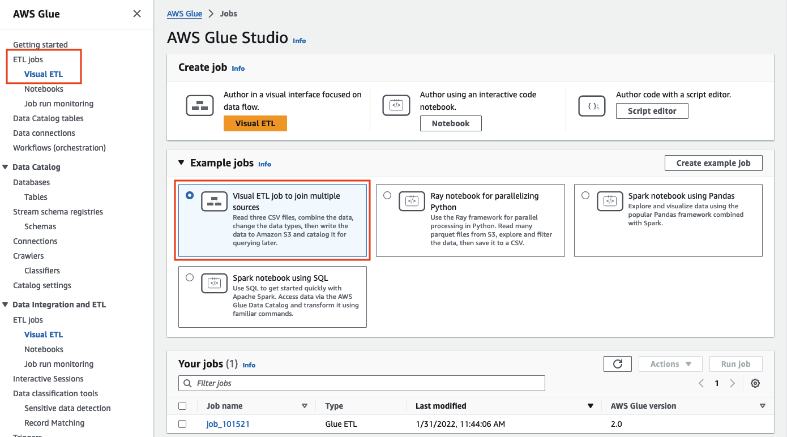
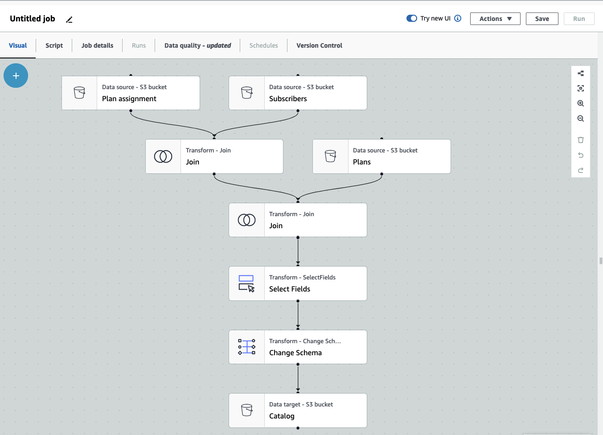
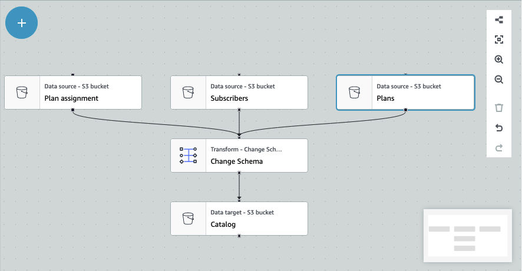
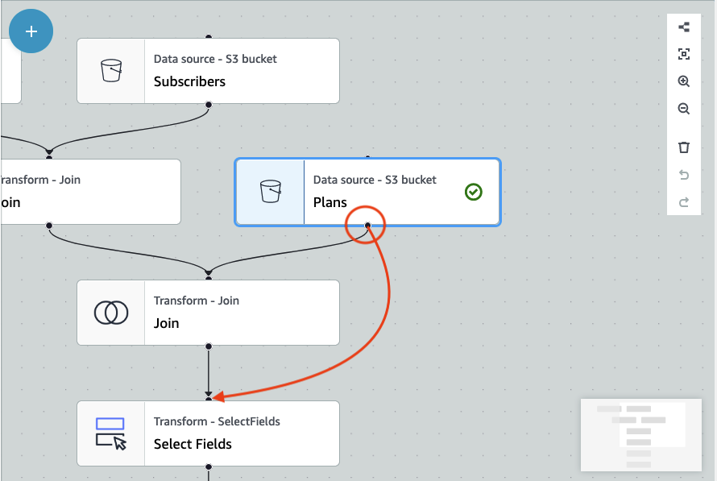

# Deleting nodes from the job diagram

When working with Visual ETL jobs, you can remove nodes from the canvas without having to re-add or restructure
any nodes that are connected to the removed node.

In the example below, you can follow along by choosing **ETL jobs > Visual ETL**, then in
**Example jobs**, choosing **Visual ETL job to join multiple sources**. Choose
**Create example job** to create a job and follow along with the steps below.

###### To remove a node from the canvas

1. From the AWS Glue console, choose **Visual ETL** from the navigation menu and choose an existing job.
   The job canvas displays the example job as depicted below.

 2. Choose the node you want to remove. The canvas will zoom in to the node. In the toolbar on the right side of the canvas,
choose the **Trash** icon. This will remove the node and any node connected to the node will move
to take its place in the workflow. In this example, the first **Join** node was deleted from the canvas.

If you delete a node in the workflow, AWS Glue will re-arrange the nodes so that they are organized in a way
that does not result in an invalid workflow. You may still need to correct a node's configuration.

In the example, the **Join** node beneath the **Subscribers** node was removed.
As a result, the **Plans** source node has been moved to the top level and is still connected
to the child **Join** node. The **Join** node now requires additional
configuration since **Join** requires two parent source nodes with selected tables.
The **Transform** tab to the right of the canvas displays the missing requirement under
**Join conditions** .

 3. Delete the second **Join** node and **Select Fields** node.
When the nodes have been deleted, the workflow will look like the example below.

 4. To modify the node connections, click on the node's handle and drag the connection to a new node. This will allow you to
delete nodes and rearrange the nodes in a logical flow. In the example, a new connection is being made by clicking the
handle on the Plans node and dragging the connection to the Join node as depicted by the red arrow.

 5. If you need to undo any action, choose the **Undo** icon directly beneath the **Trash**
icon in the toolbar on the right side of the canvas.
