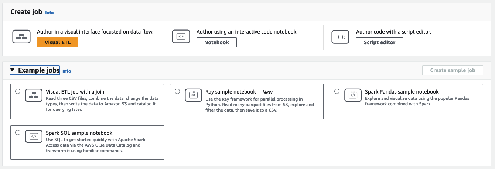

# Starting visual ETL jobs in AWS Glue Studio

You can use the simple visual interface in AWS Glue Studio to create your ETL jobs. You use the
**Jobs** page to create new jobs. You can also use a script editor
or notebook to work directly with code in the AWS Glue Studio ETL job script.

On the **Jobs** page, you can see all the jobs that you have
created either with AWS Glue Studio or AWS Glue. You can view, manage, and run your jobs on this page.

Also see the
[blog tutorial](https://aws.amazon.com/blogs/big-data/making-etl-easier-with-aws-glue-studio/ "https://aws.amazon.com/blogs/big-data/making-etl-easier-with-aws-glue-studio/")
on another example of how to create ETL jobs with AWS Glue Studio.

## Starting jobs in AWS Glue Studio

AWS Glue allows you to create a job through a visual interface, an interactive code notebook, or with a script editor.
You can start a job by clicking on any of the options or create a new job based on a sample job.

Sample jobs create a job with the tool of your choice. For example, sample jobs allow you to create a visual ETL job that joins
CSV files into a catatlog table, create a job in an interactive code notebook with AWS Glue for Ray or AWS Glue for Spark
when working with pandas, or create a job in an interactive code notebook with SparkSQL.

### Creating a job in AWS Glue Studio from scratch

1. Sign in to the AWS Management Console and open the AWS Glue Studio console at
   [https://console.aws.amazon.com/gluestudio/](https://console.aws.amazon.com/gluestudio/ "https://console.aws.amazon.com/gluestudio/").
2. Choose **ETL jobs** from the navigation pane.
3. In the **Create job** section, select a configuration option for your job.

Options to create a job from scratch:

    * **Visual ETL** – author in a visual interface focused on data flow
    * **Author using an Interactive code notebook**  – interactively author jobs in a notebook interface based on
     Jupyter Notebooks

     When you select this option, you must provide additional information before creating a notebook authoring session.
     For more information about how to specify this information, see [Getting started with notebooks in AWS Glue Studio](notebook-getting-started.md "notebook-getting-started.md").
    * **Author code with a script editor** – For those familiar with
     programming and writing ETL scripts, choose this option to create a new Spark ETL job.
     Choose the engine (Python shell, Ray, Spark (Python), or Spark (Scala). Then, choose
     **Start fresh** or **Upload script**.
     uploading an existing script from a local file. If you choose to use the script
     editor, you can't use the visual job editor to design or edit your job.

    A Spark job is run in an Apache Spark environment managed by AWS Glue.
     By default, new scripts are coded in Python. To write a new Scala script, see [Creating and editing Scala scripts in AWS Glue Studio](edit-nodes-script.md#edit-job-scala-script "edit-nodes-script.md#edit-job-scala-script").

### Creating a job in AWS Glue Studio from an example job

You can choose to create a job from an example job. In the **Example jobs** section, choose a sample job, then
choose **Create sample job**. Creating a sample job from one of the options provides a quick template you
can work from.

1. Sign in to the AWS Management Console and open the AWS Glue Studio console at
   [https://console.aws.amazon.com/gluestudio/](https://console.aws.amazon.com/gluestudio/ "https://console.aws.amazon.com/gluestudio/").
2. Choose **ETL jobs** from the navigation pane.
3. Select an option create a job from a sample job:
   - **Visual ETL job to join multiple sources** – Read three CSV files, combine the data, change the
     data types, then write the data to Amazon S3 and catalog it for querying later.
   - **Spark notebook using Pandas** – Explore and visualize data using the popular Pandas framework
     combined with Spark.
   - **Spark notebook using SQL** – Use SQL to get started quickly with Apache Spark. Access data through the
     AWS Glue Data Catalog and transform it using familiar commands.

4. Choose **Create sample job**.
