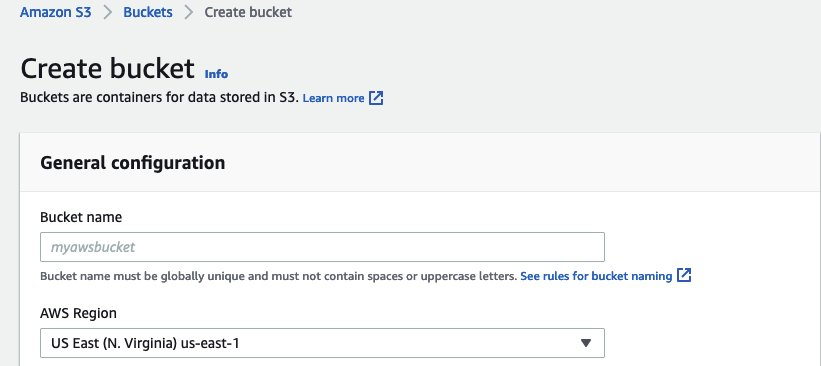
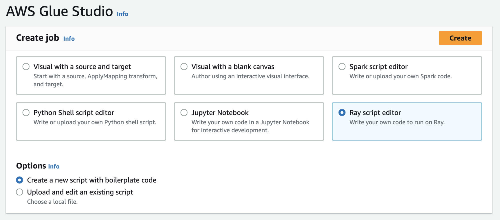

# Tutorial: Writing an ETL script in AWS Glue for Ray

Ray gives you the ability to write and scale distributed tasks natively in Python. AWS Glue for Ray offers
serverless Ray environments that you can access from both jobs and interactive sessions (Ray interactive
sessions are in preview). The AWS Glue job system provides a consistent way to manage and run your tasks—on
a schedule, from a trigger, or from the AWS Glue console.

Combining these AWS Glue tools creates a powerful toolchain that you can use for extract, transform, and load
(ETL) workloads, a popular use case for AWS Glue. In this tutorial, you will learn the basics of putting together
this solution.

We also support using AWS Glue for Spark for your ETL workloads. For a tutorial on writing a AWS Glue for Spark
script, see [Tutorial: Writing an AWS Glue for Spark script](aws-glue-programming-intro-tutorial.md "aws-glue-programming-intro-tutorial.md"). For more information about available engines,
see [AWS Glue for Spark and AWS Glue for Ray](how-it-works-engines.md "how-it-works-engines.md"). Ray is capable of addressing many different kinds of tasks in
analytics, machine learning (ML), and application development.

In this tutorial, you will extract, transform, and load a CSV dataset that is hosted in Amazon Simple Storage Service (Amazon S3).
You will begin with the New York City Taxi and Limousine Commission (TLC) Trip Record Data Dataset, which is stored in a public Amazon S3 bucket. For more
information about this dataset, see the [Registry of Open Data on AWS](https://registry.opendata.aws/nyc-tlc-trip-records-pds/ "https://registry.opendata.aws/nyc-tlc-trip-records-pds/").

You will transform your data with predefined transforms that are available in the Ray Data library. Ray Data
is a dataset preparation library designed by Ray and included by default in AWS Glue for Ray environments. For more
information about libraries included by default, see [Modules provided with Ray jobs](edit-script-ray-env-dependencies.md#edit-script-ray-modules-provided "edit-script-ray-env-dependencies.md#edit-script-ray-modules-provided"). You will
then write your transformed data to an Amazon S3 bucket that you control.

**Prerequisites** – For this tutorial, you need an AWS account with
access to AWS Glue and Amazon S3.

## Step 1: Create a bucket in Amazon S3 to hold your output

data

You will need an Amazon S3 bucket that you control to serve as a sink for data created in this tutorial. You
can create this bucket with the following procedure.

###### Note

If you want to write your data to an existing bucket that you control, you can skip this step. Take
note of `yourBucketName`, the existing bucket's name, to use in later
steps.

###### To create a bucket for your Ray job output

- Create a bucket by following the steps in [Creating a bucket](../../../AmazonS3/latest/userguide/create-bucket-overview.md "../../../AmazonS3/latest/userguide/create-bucket-overview.md") in the
  _Amazon S3 User Guide_.

      + When choosing a bucket name, take note of `yourBucketName`, which
       you will refer to in later steps.
      + For other configuration, the suggested settings provided in the Amazon S3 console should work
       fine in this tutorial.

  As an example, the bucket creation dialog box might look like this in the Amazon S3 console.



## Step 2: Create an IAM role and policy for your Ray

job

Your job will need an AWS Identity and Access Management (IAM) role with the following:

- Permissions granted by the `AWSGlueServiceRole` managed policy. These are the basic
  permissions that are necessary to run an AWS Glue job.
- `Read` access level permissions for the `nyc-tlc/*` Amazon S3
  resource.
- `Write` access level permissions for the
  ``yourBucketName`/\*` Amazon S3 resource.
- A trust relationship that allows the `glue.amazonaws.com` principal to assume the
  role.

You can create this role with the following procedure.

###### To create an IAM role for your AWS Glue for Ray job

###### Note

You can create an IAM role by following many different procedures. For more information or
options about how to provision IAM resources, see the [AWS Identity and Access Management documentation](../../../iam/index.md "../../../iam/index.md").

1. Create a policy that defines the previously outlined Amazon S3 permissions by following the steps in
   [Creating IAM policies (console) with the visual editor](../../../IAM/latest/UserGuide/access_policies_create-console.md#access_policies_create-visual-editor "../../../IAM/latest/UserGuide/access_policies_create-console.md#access_policies_create-visual-editor") in the
   _IAM User Guide_.
   - When selecting a service, choose Amazon S3.
   - When selecting permissions for your policy, attach the following sets of actions for the
     following resources (mentioned previously):
     - Read access level permissions for the `nyc-tlc/*` Amazon S3
       resource.
     - Write access level permissions for the
       ``yourBucketName`/\*` Amazon S3 resource.

   - When selecting the policy name, take note of `YourPolicyName`,
     which you will refer to in a later step.

2. Create a role for your AWS Glue for Ray job by following the steps in [Creating a role for an AWS service (console)](../../../IAM/latest/UserGuide/id_roles_create_for-service.md#roles-creatingrole-service-console "../../../IAM/latest/UserGuide/id_roles_create_for-service.md#roles-creatingrole-service-console") in the
   _IAM User Guide_.
   - When selecting a trusted AWS service entity, choose `Glue`. This will
     automatically populate the necessary trust relationship for your job.
   - When selecting policies for the permissions policy, attach the following policies:
     - `AWSGlueServiceRole`
     - `YourPolicyName`

   - When selecting the role name, take note of `YourRoleName`, which
     you will refer to in later steps.

## Step 3: Create and run an AWS Glue for Ray

job

In this step, you create an AWS Glue job using the AWS Management Console, provide it with a sample script, and run the
job. When you create a job, it creates a place in the console for you to store, configure, and edit your Ray
script. For more information about creating jobs, see [Managing AWS Glue Jobs in the AWS Console](author-job-glue.md#console-jobs "author-job-glue.md#console-jobs").

In this tutorial, we address the following ETL scenario: you would like to read the
January 2022 records from the New York City TLC Trip Record dataset, add a new column
(`tip_rate`) to the dataset by combining data in existing columns, then remove a
number of columns that aren't relevant to your current analysis, and then you would like to write the
results to `yourBucketName`. The following Ray script performs these steps:

```
import ray
import pandas
from ray import data

ray.init('auto')

ds = ray.data.read_csv("s3://nyc-tlc/opendata_repo/opendata_webconvert/yellow/yellow_tripdata_2022-01.csv")

# Add the given new column to the dataset and show the sample record after adding a new column
ds = ds.add_column( "tip_rate", lambda df: df["tip_amount"] / df["total_amount"])

# Dropping few columns from the underlying Dataset
ds = ds.drop_columns(["payment_type", "fare_amount", "extra", "tolls_amount", "improvement_surcharge"])

ds.write_parquet("s3://`yourBucketName`/ray/tutorial/output/")
```

###### To create and run an AWS Glue for Ray job

1. In the AWS Management Console, navigate to the AWS Glue landing page.
2. In the side navigation pane, choose **ETL Jobs**.
3. In **Create job**, choose **Ray script editor**, and then choose
   **Create**, as in the following illustration.

 4. Paste the full text of the script into the **Script** pane, and replace any
existing text. 5. Navigate to **Job details** and set the **IAM Role** property to
`YourRoleName`. 6. Choose **Save**, and then choose **Run**.

## Step 4: Inspect your output

After running your AWS Glue job, you should validate that the output matches the expectations of this
scenario. You can do so with the following procedure.

###### To validate whether your Ray job ran successfully

1. On the job details page, navigate to **Runs**.
2. After a few minutes, you should see a run with a **Run status** of
   **Succeeded**.
3. Navigate to the Amazon S3 console at [https://console.aws.amazon.com/s3/](https://console.aws.amazon.com/s3/ "https://console.aws.amazon.com/s3/") and inspect
   `yourBucketName`. You should see files written to your output
   bucket.
4. Read the Parquet files and verify their contents. You can do this with your existing tools. If you
   don't have a process for validating Parquet files, you can do this in the AWS Glue console with an
   AWS Glue interactive session, using either Spark or Ray (in preview).

In an interactive session, you have access to Ray Data, Spark, or pandas libraries, which are
provided by default (based on your choice of engine). To verify your file contents, you can use
common inspection methods that are available in those libraries—methods like
`count`, `schema`, and `show`. For more information about
interactive sessions in the console, see [Using notebooks with AWS Glue Studio and AWS Glue](../ug/notebooks-chapter.md "../ug/notebooks-chapter.md").

Because you have confirmed that files have been written to the bucket, you can say with relative
certainty that if your output has problems, they are not related to IAM configuration. Configure
your session with `yourRoleName` to have access to the relevant
files.

If you don't see the expected outcomes, examine the troubleshooting content in this guide to identify and
remediate the source of the error. You can find the troubleshooting content in the [Troubleshooting AWS Glue](troubleshooting-glue.md "troubleshooting-glue.md") chapter. For
specific errors that are related to Ray jobs, see [Troubleshooting AWS Glue for Ray errors from logs](troubleshooting-ray.md "troubleshooting-ray.md") in the
troubleshooting chapter.

## Next steps

You have now seen and performed an ETL process using AWS Glue for Ray from end to end. You can use the
following resources to understand what tools AWS Glue for Ray provides to transform and interpret your data at
scale.

- For more information about Ray's task model, see [Using Ray Core and Ray Data in AWS Glue for Ray](edit-script-ray-scripting.md "edit-script-ray-scripting.md"). For
  more experience in using Ray tasks, follow the examples in the Ray Core documentation. See [Ray Core: Ray Tutorials
  and Examples (2.4.0)](https://docs.ray.io/en/releases-2.4.0/ray-core/examples/overview.html "https://docs.ray.io/en/releases-2.4.0/ray-core/examples/overview.html") in the Ray documentation.
- For guidance about available data management libraries in AWS Glue for Ray, see [Connecting to data in Ray jobs](edit-script-ray-connections-formats.md "edit-script-ray-connections-formats.md"). For more experience using Ray Data to transform and
  write datasets, follow the examples in the Ray Data documentation. See [Ray Data: Examples
  (2.4.0)](https://docs.ray.io/en/releases-2.4.0/data/examples/index.html "https://docs.ray.io/en/releases-2.4.0/data/examples/index.html").
- For more information about configuring AWS Glue for Ray jobs, see [Working with Ray jobs in AWS Glue](ray-jobs-section.md "ray-jobs-section.md").
- For more information about writing AWS Glue for Ray scripts, continue reading the documentation in
  this section.
